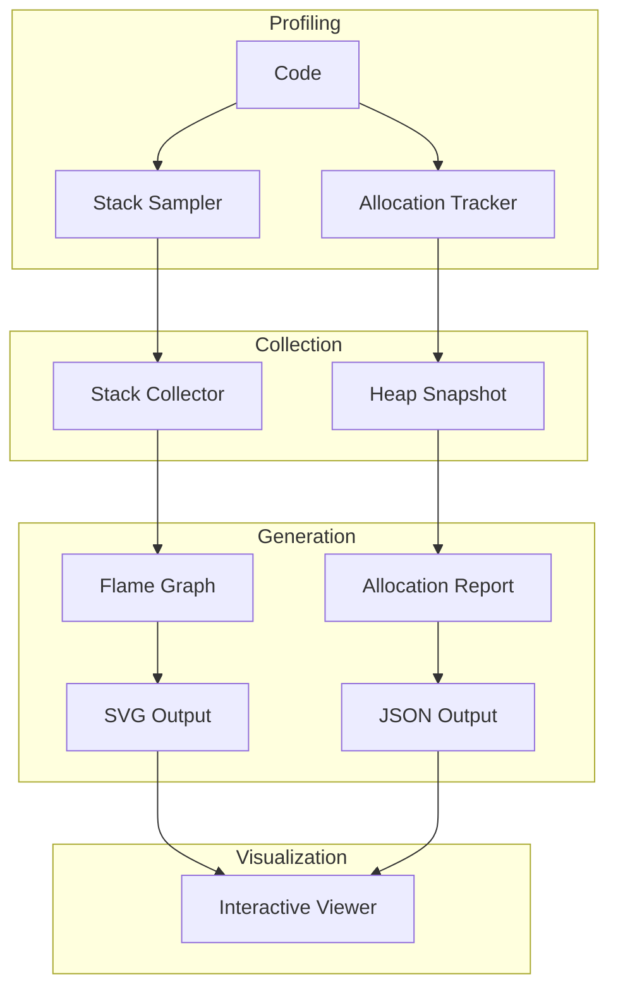

# Design Document

## Overview

This design integrates stack sampling and allocation profiling with flame graph visualization. Profiling is opt-in via feature flags, with minimal overhead when disabled.

## Architecture



## Components and Interfaces

### Component 1: Profiler

```rust
pub struct Profiler {
    config: ProfilerConfig,
    sampler: Option<StackSampler>,
    allocator: Option<AllocationTracker>,
}

pub struct ProfilerConfig {
    pub stack_sampling: bool,
    pub sample_rate: Duration,
    pub allocation_tracking: bool,
    pub allocation_threshold: usize,
}

impl Profiler {
    pub fn new(config: ProfilerConfig) -> Self;
    pub fn start(&mut self);
    pub fn stop(&mut self) -> ProfileResult;
}
```

### Component 2: FlameGraphGenerator

```rust
pub struct FlameGraphGenerator {
    config: FlameGraphConfig,
}

pub struct FlameGraphConfig {
    pub width: u32,
    pub height: u32,
    pub color_scheme: ColorScheme,
    pub title: String,
}

impl FlameGraphGenerator {
    pub fn generate(&self, stacks: &[StackSample]) -> String; // SVG
    pub fn generate_diff(&self, baseline: &[StackSample], current: &[StackSample]) -> String;
}
```

### Component 3: AllocationReport

```rust
pub struct AllocationReport {
    pub total_allocated: usize,
    pub total_freed: usize,
    pub peak_usage: usize,
    pub hot_spots: Vec<AllocationSite>,
}

pub struct AllocationSite {
    pub location: String,
    pub count: u64,
    pub total_bytes: usize,
    pub stack_trace: Vec<String>,
}
```

## Testing Strategy

- Unit tests for flame graph generation
- Integration tests for profiling accuracy
- Benchmark tests for overhead measurement
