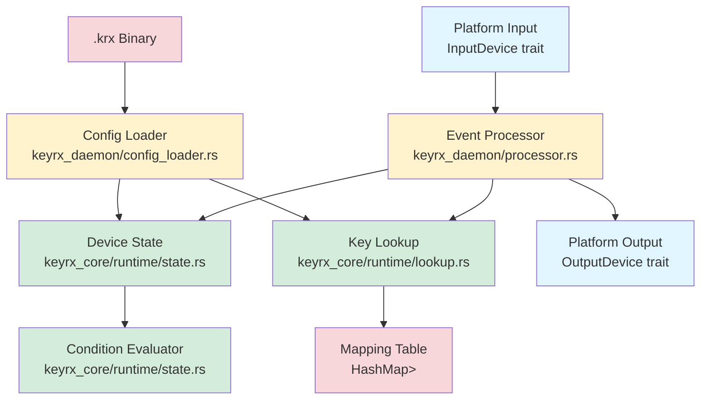

# Design Document

## Overview

The Basic Key Remapping spec implements the core runtime engine for keyrx, providing real-time keyboard event processing with firmware-class performance (<1ms latency). This design establishes the foundation for all future keyrx functionality by implementing state management, key lookup, event processing, and a platform-agnostic testing layer.

The architecture is organized into three layers:
1. **Core Runtime Layer** (keyrx_core/runtime): OS-agnostic state management, lookup, and event processing
2. **Platform Abstraction Layer** (keyrx_daemon/platform): Trait-based contracts for input/output devices
3. **Orchestration Layer** (keyrx_daemon): Configuration loading and event loop coordination

This modular design enables comprehensive testing without OS dependencies, supports future WASM compilation for browser-based simulation, and maintains clean separation between business logic and platform-specific code.

## Steering Document Alignment

### Technical Standards (tech.md)

This implementation follows Rust best practices and keyrx architectural patterns:

- **Zero-Cost Abstractions**: Trait-based platform layer compiles to zero overhead
- **No `std` in Hot Path**: Core runtime logic in keyrx_core is designed for `no_std` compatibility (future WASM support)
- **Explicit Error Handling**: All fallible operations return `Result<T, E>`, no panics in production code
- **Deterministic Execution**: No randomness, no wall-clock time dependencies (enables property-based testing)
- **Structured Logging**: JSON format with strict schema (timestamp, level, service, event_type, context)

### Project Structure (structure.md)

File organization follows keyrx workspace conventions:

```
keyrx_core/
├── src/
│   ├── config/           # Existing: KeyMapping, ConfigRoot, Condition
│   └── runtime/          # NEW: DeviceState, KeyLookup, EventProcessor
keyrx_daemon/
├── src/
│   ├── platform/         # NEW: InputDevice/OutputDevice traits, mock implementation
│   ├── processor.rs      # NEW: Main event loop orchestrator
│   └── config_loader.rs  # NEW: Load .krx files (reuses keyrx_compiler deserialize)
```

## Code Reuse Analysis

### Existing Components to Leverage

- **keyrx_compiler::serialize::{deserialize, DeserializeError}**: Reused for loading .krx files
  - Verifies magic bytes, version, SHA256 hash
  - Deserializes rkyv-encoded ConfigRoot
  - Returns comprehensive error types (InvalidMagic, HashMismatch, etc.)

- **keyrx_core::config::{ConfigRoot, DeviceConfig, BaseKeyMapping, KeyMapping, Condition, ConditionItem, KeyCode}**: Core data structures
  - ConfigRoot: Top-level configuration container
  - DeviceConfig: Per-device mapping collection
  - BaseKeyMapping: Non-recursive mapping representation
  - KeyMapping: Ergonomic API (simple(), modifier(), lock(), tap_hold(), etc.)
  - Condition: Runtime condition evaluation (ModifierActive, LockActive, AllActive, NotActive)
  - KeyCode: Enum of all keyboard keys (A-Z, F1-F24, etc.)

- **keyrx_core::config::mappings helper functions**: Used for creating mappings in tests
  - `KeyMapping::simple(from, to)` → `BaseKeyMapping::Simple`
  - `KeyMapping::modifier(key, id)` → `BaseKeyMapping::Modifier`
  - `KeyMapping::lock(key, id)` → `BaseKeyMapping::Lock`
  - `KeyMapping::tap_hold(...)` → `BaseKeyMapping::TapHold`
  - `KeyMapping::modified_output(...)` → `BaseKeyMapping::ModifiedOutput`
  - `KeyMapping::conditional(...)` → `BaseKeyMapping::Conditional`

### Integration Points

- **keyrx_compiler (build-time dependency)**: Used in tests and config_loader
  - Load .krx files produced by compiler
  - Reuse deserialization logic for integrity checking
  - Parse test configuration files in integration tests

- **keyrx_daemon (runtime orchestration)**: Consumes keyrx_core runtime components
  - Loads ConfigRoot via config_loader
  - Creates DeviceState for each device
  - Implements platform layer (mock for MVP, evdev in Phase 3)
  - Runs event loop: input → process → output

## Architecture

The runtime system follows a layered architecture with clear separation of concerns:



### Modular Design Principles

- **Single File Responsibility**:
  - `state.rs`: Manages 255-bit vectors, evaluates conditions (no I/O, no lookup)
  - `lookup.rs`: Builds HashMap, performs key→mapping resolution (no state, no I/O)
  - `event.rs`: Defines KeyEvent enum, processes events (orchestrates state + lookup)
  - `processor.rs`: Event loop coordination (delegates to event.rs, platform traits)
  - `config_loader.rs`: File I/O only (reuses keyrx_compiler deserialize)

- **Component Isolation**:
  - Core runtime (keyrx_core/runtime) has zero dependencies on keyrx_daemon
  - Platform traits defined in keyrx_daemon/platform, implemented separately
  - Mock implementation has zero OS dependencies (pure Rust, no libc calls)

- **Service Layer Separation**:
  - Data layer: ConfigRoot, DeviceConfig (keyrx_core/config)
  - Business logic: DeviceState, KeyLookup, EventProcessor (keyrx_core/runtime)
  - Platform layer: InputDevice, OutputDevice, mock (keyrx_daemon/platform)
  - Orchestration: config_loader, processor (keyrx_daemon)

- **Utility Modularity**:
  - State management utilities in state.rs (set_modifier, clear_modifier, toggle_lock)
  - Lookup utilities in lookup.rs (build_lookup_table, find_matching_mapping)
  - Event processing utilities in event.rs (apply_mapping, generate_output_events)

## Components and Interfaces

### Component 1: DeviceState (keyrx_core/src/runtime/state.rs)

**Purpose:** Maintains runtime state for a single device (255 modifiers + 255 locks), evaluates conditions

**Interfaces:**
```rust
pub struct DeviceState {
    modifiers: BitVec,  // 255 bits, index = modifier ID (0-254)
    locks: BitVec,      // 255 bits, index = lock ID (0-254)
}

impl DeviceState {
    pub fn new() -> Self;
    pub fn set_modifier(&mut self, id: u8);
    pub fn clear_modifier(&mut self, id: u8);
    pub fn toggle_lock(&mut self, id: u8);
    pub fn is_modifier_active(&self, id: u8) -> bool;
    pub fn is_lock_active(&self, id: u8) -> bool;
    pub fn evaluate_condition(&self, condition: &Condition) -> bool;
}
```

**Dependencies:**
- `bitvec` crate for efficient 255-bit vectors (uses `BitVec<u8, Lsb0>`)
- `keyrx_core::config::{Condition, ConditionItem}` for condition evaluation

**Reuses:**
- Condition enum from keyrx_core/config (existing)

**Design Decisions:**
- **BitVec vs [u8; 32]**: BitVec provides clearer semantics (set/clear/test bit) and safer indexing
- **Separate modifiers/locks**: Clear separation mirrors DSL design (MD_XX vs LK_XX)
- **No lookup logic**: DeviceState only manages state, doesn't know about mappings

### Component 2: KeyLookup (keyrx_core/src/runtime/lookup.rs)

**Purpose:** Builds lookup table from DeviceConfig, performs O(1) key→mapping resolution

**Interfaces:**
```rust
pub struct KeyLookup {
    table: HashMap<KeyCode, Vec<BaseKeyMapping>>,
}

impl KeyLookup {
    pub fn from_device_config(config: &DeviceConfig) -> Self;
    pub fn find_mapping(&self, key: KeyCode, state: &DeviceState) -> Option<&BaseKeyMapping>;
}
```

**Dependencies:**
- `std::collections::HashMap` for O(1) average lookup
- `keyrx_core::config::{DeviceConfig, BaseKeyMapping, KeyCode}` for data structures

**Reuses:**
- DeviceConfig, BaseKeyMapping from keyrx_core/config (existing)
- DeviceState from keyrx_core/runtime/state (new, same spec)

**Design Decisions:**
- **HashMap<KeyCode, Vec<>>**: Simple, efficient for MVP (MPHF optimization deferred to Phase 4)
- **Vec ordering**: Conditional mappings first (in registration order), unconditional last
- **find_mapping returns &BaseKeyMapping**: Avoids cloning, caller processes reference
- **State parameter**: Lookup doesn't own state, accepts reference for condition evaluation

### Component 3: KeyEvent and Event Processing (keyrx_core/src/runtime/event.rs)

**Purpose:** Defines keyboard event type, processes input events to produce output events

**Interfaces:**
```rust
#[derive(Debug, Clone, Copy, PartialEq, Eq)]
pub enum KeyEvent {
    Press(KeyCode),
    Release(KeyCode),
}

pub fn process_event(
    event: KeyEvent,
    lookup: &KeyLookup,
    state: &mut DeviceState,
) -> Vec<KeyEvent> {
    // 1. Lookup mapping for event.key
    // 2. Apply mapping (update state if Modifier/Lock, generate output events)
    // 3. Return output events (empty vec if no output, e.g., modifier press)
}
```

**Dependencies:**
- `keyrx_core::config::KeyCode` for key representation
- `KeyLookup` for mapping resolution
- `DeviceState` for state management

**Reuses:**
- BaseKeyMapping::Simple/Modifier/Lock/ModifiedOutput/Conditional (existing)

**Design Decisions:**
- **Vec<KeyEvent> return type**: Handles ModifiedOutput (Shift+1 = [Press(LShift), Press(Num1)])
- **Mutable state reference**: Event processing updates modifier/lock state
- **process_event is free function**: Not tied to a struct, easier to test in isolation
- **TapHold stub**: Returns `Vec::new()` with TODO comment (deferred to advanced-input-logic spec)

### Component 4: Platform Traits (keyrx_daemon/src/platform/mod.rs)

**Purpose:** Define contracts for input and output devices, enable platform abstraction

**Interfaces:**
```rust
pub trait InputDevice {
    fn next_event(&mut self) -> Result<KeyEvent, DeviceError>;
    fn grab(&mut self) -> Result<(), DeviceError>;
    fn release(&mut self) -> Result<(), DeviceError>;
}

pub trait OutputDevice {
    fn inject_event(&mut self, event: KeyEvent) -> Result<(), DeviceError>;
}

#[derive(Debug, thiserror::Error)]
pub enum DeviceError {
    #[error("Device not found: {0}")]
    NotFound(String),
    #[error("Permission denied: {0}")]
    PermissionDenied(String),
    #[error("End of event stream")]
    EndOfStream,
    #[error("Event injection failed: {0}")]
    InjectionFailed(String),
    #[error("IO error: {0}")]
    Io(#[from] std::io::Error),
}
```

**Dependencies:**
- `keyrx_core::runtime::event::KeyEvent` for event type
- `thiserror` for ergonomic error definitions

**Reuses:**
- None (new abstraction)

**Design Decisions:**
- **Trait-based abstraction**: Enables mock implementations for testing, evdev for Linux, hooks for Windows
- **grab/release pattern**: Mirrors evdev EVIOCGRAB semantics (exclusive device access)
- **DeviceError enum**: Covers platform-specific errors (permission, not found, I/O)

### Component 5: Mock Platform (keyrx_daemon/src/platform/mock.rs)

**Purpose:** Provide zero-dependency platform implementation for testing

**Interfaces:**
```rust
pub struct MockInput {
    events: VecDeque<KeyEvent>,
    grabbed: bool,
}

impl MockInput {
    pub fn new(events: Vec<KeyEvent>) -> Self;
    pub fn is_grabbed(&self) -> bool;
}

impl InputDevice for MockInput {
    fn next_event(&mut self) -> Result<KeyEvent, DeviceError>;
    fn grab(&mut self) -> Result<(), DeviceError>;
    fn release(&mut self) -> Result<(), DeviceError>;
}

pub struct MockOutput {
    events: Vec<KeyEvent>,
}

impl MockOutput {
    pub fn new() -> Self;
    pub fn events(&self) -> &[KeyEvent];
}

impl OutputDevice for MockOutput {
    fn inject_event(&mut self, event: KeyEvent) -> Result<(), DeviceError>;
}
```

**Dependencies:**
- `std::collections::VecDeque` for event queue
- `keyrx_daemon::platform::{InputDevice, OutputDevice, DeviceError}` for traits

**Reuses:**
- Platform traits (same file, platform/mod.rs)

**Design Decisions:**
- **VecDeque for input**: FIFO queue, efficient pop_front for next_event
- **Vec for output**: Append-only, supports verification in tests
- **Zero OS dependencies**: Pure Rust, no libc, no evdev, no Windows API
- **is_grabbed() helper**: Tests can verify grab() was called

### Component 6: EventProcessor (keyrx_daemon/src/processor.rs)

**Purpose:** Main orchestrator, coordinates event loop (input → process → output)

**Interfaces:**
```rust
pub struct EventProcessor<I: InputDevice, O: OutputDevice> {
    input: I,
    output: O,
    lookup: KeyLookup,
    state: DeviceState,
}

impl<I: InputDevice, O: OutputDevice> EventProcessor<I, O> {
    pub fn new(config: &DeviceConfig, input: I, output: O) -> Self;
    pub fn run(&mut self) -> Result<(), ProcessorError>;
    pub fn process_one(&mut self) -> Result<(), ProcessorError>;
}

#[derive(Debug, thiserror::Error)]
pub enum ProcessorError {
    #[error("Input device error: {0}")]
    Input(#[from] DeviceError),
    #[error("Output device error: {0}")]
    Output(DeviceError),
}
```

**Dependencies:**
- `keyrx_core::runtime::{KeyLookup, DeviceState, event::process_event}`
- `keyrx_daemon::platform::{InputDevice, OutputDevice, DeviceError}`
- `keyrx_core::config::DeviceConfig`

**Reuses:**
- KeyLookup, DeviceState, process_event (new, same spec)
- InputDevice, OutputDevice traits (new, same spec)
- DeviceConfig (existing)

**Design Decisions:**
- **Generic over I, O**: Works with any InputDevice/OutputDevice implementation (mock, evdev, hooks)
- **run() method**: Infinite loop for daemon mode, calls process_one() until EndOfStream
- **process_one() method**: Single event, useful for testing and stepping through events
- **Error propagation**: Input errors propagate as ProcessorError::Input, output as ProcessorError::Output

### Component 7: ConfigLoader (keyrx_daemon/src/config_loader.rs)

**Purpose:** Load and deserialize .krx binary files, reuse keyrx_compiler logic

**Interfaces:**
```rust
pub fn load_config<P: AsRef<Path>>(path: P) -> Result<ConfigRoot, ConfigError>;

#[derive(Debug, thiserror::Error)]
pub enum ConfigError {
    #[error("Failed to read config file: {0}")]
    Io(#[from] std::io::Error),
    #[error("Deserialization failed: {0}")]
    Deserialize(#[from] keyrx_compiler::serialize::DeserializeError),
}
```

**Dependencies:**
- `keyrx_compiler::serialize::deserialize` for .krx parsing
- `keyrx_core::config::ConfigRoot` for return type
- `std::fs` for file I/O

**Reuses:**
- `keyrx_compiler::serialize::deserialize` (existing)
- `ConfigRoot` (existing)

**Design Decisions:**
- **Thin wrapper**: Just reads file bytes and calls deserialize(), no extra logic
- **Error wrapping**: Converts DeserializeError to ConfigError for consistency
- **Path generic**: Accepts &str, String, PathBuf for ergonomics

## Data Models

### KeyEvent
```rust
#[derive(Debug, Clone, Copy, PartialEq, Eq, Hash)]
pub enum KeyEvent {
    Press(KeyCode),   // Key pressed down
    Release(KeyCode), // Key released
}
```
- **Purpose**: Represent keyboard events (press/release)
- **Properties**:
  - Copy: Efficient passing by value
  - Hash: Can be used as HashMap key if needed
  - Eq: Required for test assertions

### DeviceState
```rust
pub struct DeviceState {
    modifiers: BitVec<u8, Lsb0>,  // 255 bits (indexes 0-254)
    locks: BitVec<u8, Lsb0>,      // 255 bits (indexes 0-254)
}
```
- **Purpose**: Track runtime state for a single device
- **Properties**:
  - modifiers: Each bit represents MD_00 through MD_FE (0-254)
  - locks: Each bit represents LK_00 through LK_FE (0-254)
  - Bit 255 (index 255) is never used (valid range 0-254 per requirements.md)

### KeyLookup
```rust
pub struct KeyLookup {
    table: HashMap<KeyCode, Vec<BaseKeyMapping>>,
}
```
- **Purpose**: Fast key→mapping resolution
- **Properties**:
  - Key: Input KeyCode (e.g., KeyCode::A)
  - Value: Vec of mappings for that key
    - Conditional mappings first (in registration order from .rhai)
    - Unconditional mapping last (if exists)

### MockInput
```rust
pub struct MockInput {
    events: VecDeque<KeyEvent>,  // Preloaded event sequence
    grabbed: bool,               // Track grab state
}
```
- **Purpose**: Simulate input device for testing
- **Properties**:
  - events: FIFO queue, next_event() pops front
  - grabbed: true after grab(), false after release()

### MockOutput
```rust
pub struct MockOutput {
    events: Vec<KeyEvent>,  // Collected output events
}
```
- **Purpose**: Capture output events for verification
- **Properties**:
  - events: Append-only, tests read via events() method

## Error Handling

### Error Scenarios

#### 1. Config Loading Errors
**Scenario:** .krx file not found, corrupted, or has invalid hash

**Handling:**
```rust
match load_config("config.krx") {
    Ok(config) => { /* proceed */ },
    Err(ConfigError::Io(e)) => {
        eprintln!("Failed to read config: {}", e);
        std::process::exit(1);
    },
    Err(ConfigError::Deserialize(DeserializeError::InvalidMagic)) => {
        eprintln!("Invalid .krx file (bad magic bytes)");
        std::process::exit(1);
    },
    Err(ConfigError::Deserialize(DeserializeError::HashMismatch { expected, actual })) => {
        eprintln!("Config hash mismatch!\nExpected: {}\nActual: {}", expected, actual);
        std::process::exit(1);
    },
    // ... other variants
}
```

**User Impact:** Clear error message, exit code 1 for scripting

**Structured Logging:**
```json
{"timestamp":"2025-12-22T12:00:00Z","level":"ERROR","service":"keyrx_daemon","event_type":"config_load_failed","context":{"path":"config.krx","error":"HashMismatch","expected":"3a7f...","actual":"1b2c..."}}
```

#### 2. Platform Errors (Mock EndOfStream)
**Scenario:** Mock input device exhausts preloaded events

**Handling:**
```rust
match processor.process_one() {
    Ok(()) => { /* event processed */ },
    Err(ProcessorError::Input(DeviceError::EndOfStream)) => {
        // Expected in tests, stop processing
        return Ok(());
    },
    Err(e) => {
        eprintln!("Processor error: {}", e);
        return Err(e);
    },
}
```

**User Impact:** Clean shutdown in tests, logged at INFO level

**Structured Logging:**
```json
{"timestamp":"...","level":"INFO","service":"keyrx_daemon","event_type":"input_stream_ended","context":{"device":"mock0","events_processed":42}}
```

#### 3. Mapping Not Found (Passthrough)
**Scenario:** Input key has no configured mapping

**Handling:**
```rust
// In process_event():
let mapping = lookup.find_mapping(event.keycode(), state);
if mapping.is_none() {
    // Passthrough: return original event unchanged
    return vec![event];
}
```

**User Impact:** Transparent passthrough (user sees no difference)

**Structured Logging:**
```json
{"timestamp":"...","level":"DEBUG","service":"keyrx_daemon","event_type":"key_passthrough","context":{"key":"KeyF12","reason":"no_mapping"}}
```

#### 4. Condition Evaluation (No Match)
**Scenario:** Conditional mappings exist but no conditions match

**Handling:**
```rust
// In find_mapping():
for mapping in &mappings {
    if let BaseKeyMapping::Conditional { condition, mappings: _ } = mapping {
        if state.evaluate_condition(condition) {
            return Some(mapping);
        }
    }
}
// No conditions matched, return None (passthrough)
None
```

**User Impact:** Transparent passthrough when conditions not met

**Structured Logging:**
```json
{"timestamp":"...","level":"DEBUG","service":"keyrx_daemon","event_type":"conditional_no_match","context":{"key":"KeyH","conditions_checked":3,"modifiers":"0x00","locks":"0x00"}}
```

#### 5. State Update Errors (Invalid ID)
**Scenario:** Attempt to set modifier ID > 254 (programming error, should never happen)

**Handling:**
```rust
// DeviceState uses BitVec with safe indexing:
pub fn set_modifier(&mut self, id: u8) {
    if id > 254 {
        // Log error but don't panic (fail gracefully)
        eprintln!("Invalid modifier ID: {} (max 254)", id);
        return;
    }
    self.modifiers.set(id as usize, true);
}
```

**User Impact:** Logged error, state unchanged, event processing continues

**Structured Logging:**
```json
{"timestamp":"...","level":"ERROR","service":"keyrx_daemon","event_type":"invalid_state_update","context":{"type":"modifier","id":255,"max_valid":254}}
```

## Testing Strategy

### Unit Testing

**Approach:** Test each component in isolation with zero dependencies

**Key Components to Test:**

1. **DeviceState (state.rs)**
   - Test set_modifier/clear_modifier for all IDs (0-254)
   - Test toggle_lock behavior (first press = ON, second = OFF)
   - Test evaluate_condition for all Condition variants
   - Property test: modifier state always valid (bits 0-254 only)

2. **KeyLookup (lookup.rs)**
   - Test build from DeviceConfig with various mapping types
   - Test find_mapping with simple, conditional, mixed mappings
   - Test ordering: conditionals checked before unconditional
   - Test empty lookup (no mappings for key)

3. **Event Processing (event.rs)**
   - Test process_event with each BaseKeyMapping variant
   - Test Simple: A→B mapping
   - Test Modifier: set/clear modifier state, no output
   - Test Lock: toggle lock state, no output
   - Test ModifiedOutput: Shift+1 produces [Press(LShift), Press(Num1)]
   - Test Conditional: condition true → apply mapping, false → passthrough

### Integration Testing

**Approach:** Test end-to-end workflows with mock platform

**Key Flows to Test:**

1. **Load Config → Process Events → Verify Output**
   ```rust
   #[test]
   fn test_end_to_end_simple_remap() {
       // Load .krx with A→B mapping
       let config = load_config("tests/fixtures/simple_remap.krx").unwrap();
       let device_config = &config.devices[0];

       // Create mock input: Press(A), Release(A)
       let input = MockInput::new(vec![
           KeyEvent::Press(KeyCode::A),
           KeyEvent::Release(KeyCode::A),
       ]);
       let output = MockOutput::new();

       // Process events
       let mut processor = EventProcessor::new(device_config, input, output);
       processor.run().unwrap();

       // Verify output: Press(B), Release(B)
       assert_eq!(processor.output.events(), &[
           KeyEvent::Press(KeyCode::B),
           KeyEvent::Release(KeyCode::B),
       ]);
   }
   ```

2. **Modifier Activation → Conditional Mapping**
   ```rust
   #[test]
   fn test_conditional_with_modifier() {
       // Config: CapsLock→MD_00, when(MD_00) { H→Left }
       // Input: Press(CapsLock), Press(H), Release(H), Release(CapsLock)
       // Expected output: Press(Left), Release(Left)
   }
   ```

3. **Lock Toggle → State Persistence**
   ```rust
   #[test]
   fn test_lock_toggle_behavior() {
       // Config: ScrollLock→LK_01
       // Input: Press(ScrollLock), Release(ScrollLock), Press(ScrollLock), Release(ScrollLock)
       // Expected state: LK_01 ON, then OFF
   }
   ```

4. **No Mapping → Passthrough**
   ```rust
   #[test]
   fn test_passthrough_unmapped_key() {
       // Config: A→B only
       // Input: Press(Z), Release(Z)
       // Expected output: Press(Z), Release(Z) (unchanged)
   }
   ```

### Property-Based Testing

**Approach:** Use proptest to verify invariants hold for random inputs

**Properties to Test:**

1. **No Event Loss**
   ```rust
   proptest! {
       #[test]
       fn prop_no_event_loss(events: Vec<KeyEvent>) {
           // Given: Any sequence of events
           // When: Process through system
           // Then: Output count == input count (even if passthrough)
       }
   }
   ```

2. **Deterministic Execution**
   ```rust
   proptest! {
       #[test]
       fn prop_deterministic(events: Vec<KeyEvent>) {
           // Given: Same event sequence processed twice
           // When: Run processor with same config
           // Then: Output is identical both times
       }
   }
   ```

3. **Modifier State Validity**
   ```rust
   proptest! {
       #[test]
       fn prop_modifier_state_valid(modifier_ops: Vec<(u8, bool)>) {
           // Given: Random set/clear modifier operations
           // When: Apply to DeviceState
           // Then: Only bits 0-254 are ever set, never bit 255
       }
   }
   ```

4. **Conditional Evaluation Consistency**
   ```rust
   proptest! {
       #[test]
       fn prop_conditional_consistent(
           modifier_ids: Vec<u8>,
           condition: Condition,
       ) {
           // Given: Random modifier state + condition
           // When: Evaluate condition twice
           // Then: Result is identical both times
       }
   }
   ```

### Benchmark Testing

**Approach:** Use criterion to measure performance claims

**Benchmarks:**

1. **Lookup Performance**
   ```rust
   fn bench_lookup(c: &mut Criterion) {
       let lookup = KeyLookup::from_device_config(&config);
       let state = DeviceState::new();

       c.bench_function("lookup_simple", |b| {
           b.iter(|| lookup.find_mapping(KeyCode::A, &state))
       });
   }
   // Target: <100μs per lookup
   ```

2. **State Update Performance**
   ```rust
   fn bench_state_update(c: &mut Criterion) {
       let mut state = DeviceState::new();

       c.bench_function("set_modifier", |b| {
           b.iter(|| state.set_modifier(0))
       });
   }
   // Target: <10μs per update
   ```

3. **End-to-End Processing**
   ```rust
   fn bench_process_event(c: &mut Criterion) {
       let lookup = /* ... */;
       let mut state = DeviceState::new();

       c.bench_function("process_event_simple", |b| {
           b.iter(|| process_event(KeyEvent::Press(KeyCode::A), &lookup, &mut state))
       });
   }
   // Target: <1ms total
   ```

4. **Conditional Evaluation**
   ```rust
   fn bench_conditional(c: &mut Criterion) {
       let state = /* ... with 10 active modifiers ... */;
       let condition = Condition::AllActive(/* 10 items */);

       c.bench_function("evaluate_condition_all_active", |b| {
           b.iter(|| state.evaluate_condition(&condition))
       });
   }
   // Target: <10μs even with complex conditions
   ```

### End-to-End Testing

**Approach:** Test complete user scenarios with realistic configurations

**User Scenarios:**

1. **Vim Navigation Layer**
   - Config: CapsLock→MD_00, when(MD_00) { H→Left, J→Down, K→Up, L→Right }
   - Scenario: Press CapsLock, type HJKL, release CapsLock
   - Expected: Arrow key navigation while held, normal letters when released

2. **Dual-Function Space (Tap/Hold Stub)**
   - Config: tap_hold(Space, Space, MD_00, 200)
   - Scenario: Press Space, release immediately
   - Expected: TODO stub behavior (logged, no output)

3. **Multi-Device Configuration**
   - Config: 2 devices, different mappings per device
   - Scenario: Process events for device 0, then device 1
   - Expected: Correct mappings applied per device, no cross-contamination

4. **Lock Persistence**
   - Config: ScrollLock→LK_01, when(LK_01) { 1→F1, 2→F2 }
   - Scenario: Toggle ScrollLock ON, type 1, toggle OFF, type 1
   - Expected: First 1→F1, second 1→1 (passthrough)
