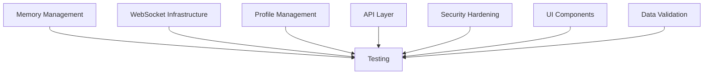

# Bug Remediation Sweep - 67+ Bug Systematic Fix

## Objective
Fix all 67+ bugs identified in comprehensive bug hunt, organized by severity and domain for maximum parallel throughput.

## Success Criteria
- [ ] All 15 Critical bugs fixed and tested
- [ ] All 19 High severity bugs fixed and tested
- [ ] All 23 Medium severity bugs fixed and tested
- [ ] All 10 Low severity bugs fixed and tested
- [ ] 100% test coverage for fixed bugs
- [ ] Zero regressions (all existing tests pass)
- [ ] Memory leak verification tests pass
- [ ] E2E integration tests pass

## Workstreams (Parallel Execution)

### WS1: Memory Management (Critical Priority)
**Agent**: rust-core-dev
**Files**:
- keyrx_ui/src/components/Dashboard.tsx
- keyrx_daemon/src/web/ws.rs
- keyrx_daemon/src/daemon/event_broadcaster.rs

**Bugs**: MEM-001, MEM-002, MEM-003
- Dashboard subscription memory leak
- WebSocket server-side subscription leak
- Unbounded WebSocket queue growth

**Estimated Effort**: 4-6 hours

### WS2: WebSocket Infrastructure (Critical Priority)
**Agent**: daemon-dev
**Files**:
- keyrx_daemon/src/web/ws.rs
- keyrx_daemon/src/daemon/event_broadcaster.rs
- keyrx_daemon/src/web/mod.rs

**Bugs**: WS-001, WS-002, WS-003, WS-004, WS-005
- Missing health check responses
- Incorrect reconnection logic
- Race conditions in event broadcasting
- Message ordering issues
- Duplicate message delivery

**Estimated Effort**: 6-8 hours

### WS3: Profile Management (High Priority)
**Agent**: rust-core-dev
**Files**:
- keyrx_daemon/src/web/api/profiles.rs
- keyrx_daemon/src/profiles/manager.rs
- keyrx_daemon/src/profiles/service.rs

**Bugs**: PROF-001, PROF-002, PROF-003, PROF-004, PROF-005
- Profile switching race conditions
- Missing validation in profile operations
- Incomplete error handling
- Missing activation metadata
- Duplicate profile names allowed

**Estimated Effort**: 5-7 hours

### WS4: API Layer (High Priority)
**Agent**: daemon-dev
**Files**:
- keyrx_daemon/src/web/api/profiles.rs
- keyrx_daemon/src/web/api/simulator.rs
- keyrx_daemon/src/web/api/config.rs

**Bugs**: API-001 through API-010
- Type mismatches in API responses
- Missing fields in responses
- Inconsistent error formats
- Missing request validation
- Path parameter validation missing

**Estimated Effort**: 4-6 hours

### WS5: Security Hardening (Critical Priority)
**Agent**: security-architect
**Files**:
- keyrx_daemon/src/web/mod.rs
- keyrx_daemon/src/web/api/*.rs
- keyrx_daemon/src/auth/ (new module)

**Bugs**: SEC-001 through SEC-012
- Missing authentication layer
- CORS misconfiguration
- Path traversal vulnerabilities
- DoS vulnerabilities
- Missing rate limiting
- Unsafe file operations

**Estimated Effort**: 8-10 hours

### WS6: UI Component Fixes (Medium Priority)
**Agent**: ui-react-dev
**Files**:
- keyrx_ui/src/components/Dashboard.tsx
- keyrx_ui/src/components/ProfileManager.tsx
- keyrx_ui/src/components/ConfigEditor.tsx
- keyrx_ui/src/hooks/useProfiles.ts
- keyrx_ui/src/hooks/useUnifiedApi.ts

**Bugs**: UI-001 through UI-015
- Missing null checks
- Type assertion without validation
- Memory leaks in useEffect
- Race conditions in state updates
- Missing error boundaries

**Estimated Effort**: 6-8 hours

### WS7: Data Validation (High Priority)
**Agent**: rust-core-dev
**Files**:
- keyrx_daemon/src/web/api/profiles.rs
- keyrx_daemon/src/profiles/manager.rs
- keyrx_daemon/src/compiler/validator.rs

**Bugs**: VAL-001 through VAL-005
- Missing profile name validation
- Unsafe path construction
- Missing file size limits
- No content validation
- Missing sanitization

**Estimated Effort**: 3-5 hours

### WS8: Testing Infrastructure (Medium Priority)
**Agent**: tester
**Files**:
- keyrx_daemon/tests/memory_leak_test.rs (new)
- keyrx_daemon/tests/concurrency_test.rs (new)
- keyrx_ui/tests/memory-leak.test.tsx (new)

**Tasks**:
- Create memory leak detection tests
- Create concurrency/race condition tests
- Create E2E integration tests for all fixes
- Verify no regressions

**Estimated Effort**: 6-8 hours

## Dependencies

## Quality Gates

### Per Workstream
- [ ] All bugs in workstream fixed
- [ ] Unit tests added for each fix
- [ ] Integration tests pass
- [ ] Code review passed (automated)
- [ ] Memory leak tests pass
- [ ] No new clippy warnings

### Final Gate
- [ ] All 67+ bugs verified fixed
- [ ] Full test suite passes (962+ tests)
- [ ] Memory leak tests pass (24h stress test)
- [ ] E2E scenarios pass
- [ ] Performance benchmarks stable or improved
- [ ] Zero regressions

## Rollout Strategy

**Phase 1: Critical Fixes (Parallel)**
- WS1: Memory Management
- WS2: WebSocket Infrastructure
- WS5: Security Hardening

**Phase 2: High Priority (Parallel)**
- WS3: Profile Management
- WS4: API Layer
- WS7: Data Validation

**Phase 3: Medium Priority**
- WS6: UI Component Fixes

**Phase 4: Verification**
- WS8: Testing Infrastructure
- Full integration testing
- Stress testing

## Timeline

**Week 1 (Days 1-2)**: Phase 1 completion
**Week 1 (Days 3-4)**: Phase 2 completion
**Week 1 (Day 5)**: Phase 3 completion
**Week 2 (Days 1-2)**: Phase 4 verification and stress testing

**Total Estimated Time**: 7-9 days with 8 parallel agents
