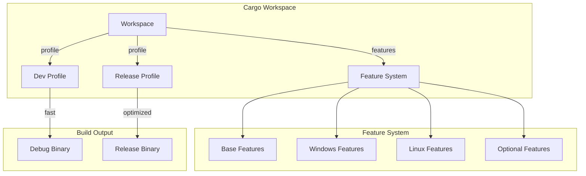

# Design Document

## Overview

This design optimizes the Cargo workspace configuration for minimal dependencies and proper platform gates. The core innovation is a layered feature system where base features are minimal and platform/optional features are additive. Build profiles are optimized for both dev speed and release size.

## Steering Document Alignment

### Technical Standards (tech.md)
- **Minimal Dependencies**: Only what's needed
- **Platform Gates**: Clear cfg annotations
- **Feature Flags**: Additive feature system

### Project Structure (structure.md)
- Workspace in `core/Cargo.toml`
- Platform code in `drivers/{windows,linux}/`
- Features documented in README

## Code Reuse Analysis

### Existing Components to Leverage
- **Cargo workspace**: Already configured
- **cfg attributes**: Already used in some places
- **Profile settings**: Can be enhanced

### Integration Points
- **All crates**: Use optimized features
- **CI/CD**: Use appropriate profiles
- **FFI**: Platform-specific builds

## Architecture



### Modular Design Principles
- **Additive Features**: Features only add, never remove
- **Platform Isolation**: Platform code in separate modules
- **Minimal Defaults**: Base config is minimal
- **Explicit Opt-in**: Optional features require explicit enable

## Components and Interfaces

### Component 1: Workspace Cargo.toml

- **Purpose:** Workspace-wide configuration
- **Interfaces:**
  ```toml
  [workspace]
  members = ["core", "core-ffi"]
  resolver = "2"

  [workspace.dependencies]
  # Shared dependencies with minimal features
  tokio = { version = "1", default-features = false }
  serde = { version = "1", default-features = false }

  [profile.dev]
  opt-level = 0
  debug = true
  incremental = true

  [profile.release]
  opt-level = "z"  # Optimize for size
  lto = "thin"
  codegen-units = 1
  strip = true
  panic = "abort"
  ```
- **Dependencies:** All workspace crates
- **Reuses:** Cargo workspace patterns

### Component 2: Core Cargo.toml Features

- **Purpose:** Feature-gated dependencies
- **Interfaces:**
  ```toml
  [features]
  default = []
  full = ["windows-driver", "linux-driver", "cli"]

  # Platform features
  windows-driver = ["dep:windows"]
  linux-driver = ["dep:evdev", "dep:uinput"]

  # Optional features
  cli = ["dep:clap"]
  ffi = []
  metrics = ["dep:hdrhistogram"]

  [dependencies]
  # Always needed
  log = "0.4"
  thiserror = "1"

  # Feature-gated
  tokio = { workspace = true, features = ["rt", "sync"], optional = true }
  windows = { version = "0.58", optional = true, features = [...] }
  evdev = { version = "0.12", optional = true }

  [target.'cfg(windows)'.dependencies]
  windows = { workspace = true }

  [target.'cfg(target_os = "linux")'.dependencies]
  evdev = { workspace = true }
  ```
- **Dependencies:** Based on features
- **Reuses:** Cargo feature patterns

### Component 3: Platform Conditional Compilation

- **Purpose:** Platform-specific code isolation
- **Interfaces:**
  ```rust
  // In drivers/mod.rs
  #[cfg(windows)]
  pub mod windows;

  #[cfg(target_os = "linux")]
  pub mod linux;

  // Platform-specific type alias
  #[cfg(windows)]
  pub type NativeDriver = windows::WindowsInputSource;

  #[cfg(target_os = "linux")]
  pub type NativeDriver = linux::LinuxInputSource;

  // Feature-gated code
  #[cfg(feature = "metrics")]
  pub mod metrics;

  #[cfg(not(feature = "metrics"))]
  pub mod metrics {
      pub struct NoOpMetrics;
  }
  ```
- **Dependencies:** Platform-specific crates
- **Reuses:** Rust cfg patterns

### Component 4: Build Profiles

- **Purpose:** Optimized build configurations
- **Interfaces:**
  ```toml
  # Fast dev builds
  [profile.dev]
  opt-level = 0
  debug = 2
  incremental = true
  split-debuginfo = "unpacked"

  # Fast dev dependencies
  [profile.dev.package."*"]
  opt-level = 2

  # Size-optimized release
  [profile.release]
  opt-level = "z"
  lto = "thin"
  codegen-units = 1
  strip = true
  panic = "abort"

  # Debug release for profiling
  [profile.release-debug]
  inherits = "release"
  debug = 2
  strip = false
  ```
- **Dependencies:** Cargo
- **Reuses:** Profile optimization patterns

### Component 5: Tokio Feature Minimization

- **Purpose:** Minimal tokio configuration
- **Interfaces:**
  ```toml
  # Before: tokio = { version = "1", features = ["full"] }
  # After:
  [dependencies.tokio]
  version = "1"
  default-features = false
  features = [
      "rt",           # Runtime
      "sync",         # Channels
      "time",         # Timers (if needed)
      "macros",       # #[tokio::main] (if needed)
  ]
  ```
- **Dependencies:** tokio
- **Reuses:** Feature selection patterns

### Component 6: Windows Feature Minimization

- **Purpose:** Minimal windows-rs configuration
- **Interfaces:**
  ```toml
  [target.'cfg(windows)'.dependencies.windows]
  version = "0.58"
  features = [
      "Win32_Foundation",
      "Win32_UI_Input_KeyboardAndMouse",
      "Win32_UI_WindowsAndMessaging",
      # Only what's actually used
  ]
  ```
- **Dependencies:** windows-rs
- **Reuses:** Windows API selection

## Data Models

### Build Metrics
```rust
pub struct BuildMetrics {
    pub dev_time_secs: f64,
    pub release_time_secs: f64,
    pub binary_size_bytes: u64,
    pub dependencies_count: u32,
}
```

## Error Handling

### Error Scenarios

1. **Missing platform feature**
   - **Handling:** Clear compile error with hint
   - **User Impact:** Knows which feature to enable

2. **Incompatible features**
   - **Handling:** Cargo feature resolver handles
   - **User Impact:** Build fails with explanation

## Testing Strategy

### Build Testing
- Test all feature combinations
- Verify cross-compilation works
- Measure build times

### Size Testing
- Track binary sizes
- Verify stripping works
- Test on all platforms

### CI Integration
- Test minimal feature set
- Test full feature set
- Test platform-specific builds
