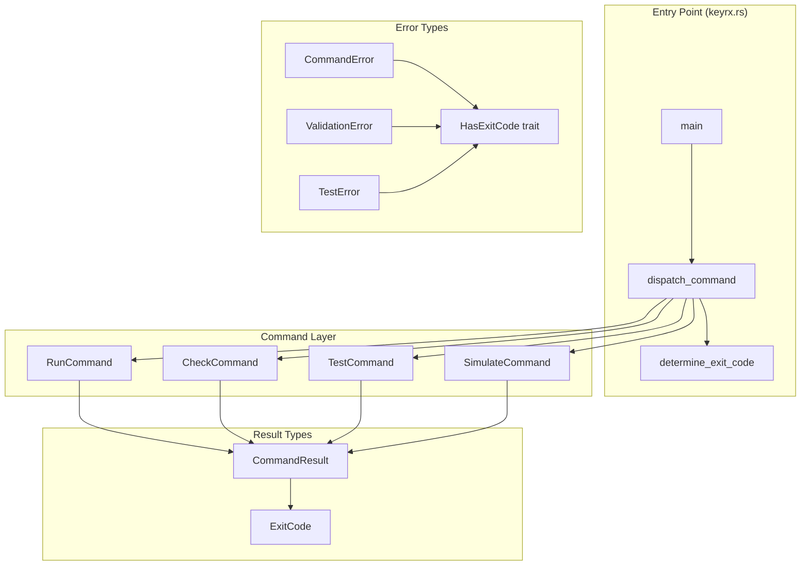

# Design Document

## Overview

This design introduces a type-safe exit code system using Rust's type system to propagate exit codes through the command hierarchy. The core innovation is the `CommandResult<T>` type that carries both the result value and the intended exit code, eliminating string-based exit code extraction.

## Steering Document Alignment

### Technical Standards (tech.md)
- **CLI First**: Reliable CLI is foundational
- **Semantic Exit Codes**: Documented in tech.md (0=success, 1=error, 2=assertion, 3=timeout)
- **Error Handling**: Structured errors with context

### Project Structure (structure.md)
- Entry point remains at `core/src/bin/keyrx.rs` but shrinks to ~150 LOC
- Command structs move to `core/src/cli/commands/`
- Exit code types in `core/src/cli/exit_codes.rs`

## Code Reuse Analysis

### Existing Components to Leverage
- **`config/exit_codes.rs`**: Already defines exit code constants
- **`anyhow::Result`**: Base error handling (wrap, don't replace)
- **clap derive macros**: Keep existing command parsing

### Integration Points
- **All 20+ commands**: Must return `CommandResult<T>`
- **Error types**: Must implement `HasExitCode` trait
- **Main function**: Simplified dispatch logic

## Architecture



### Modular Design Principles
- **Single File Responsibility**: `keyrx.rs` only dispatches, commands implement
- **Component Isolation**: Commands don't know about each other
- **Service Layer Separation**: Parsing (clap) → Dispatch → Command → Core logic
- **Utility Modularity**: Shared error handling in `cli/error.rs`

## Components and Interfaces

### Component 1: ExitCode Enum

- **Purpose:** Type-safe exit code representation with semantics
- **Interfaces:**
  ```rust
  #[derive(Debug, Clone, Copy, PartialEq, Eq)]
  #[repr(u8)]
  pub enum ExitCode {
      Success = 0,
      GeneralError = 1,
      AssertionFailed = 2,
      Timeout = 3,
      ValidationFailed = 4,
      PermissionDenied = 5,
      DeviceNotFound = 6,
      ScriptError = 7,
      // Reserved: 100+ for signals, 101 for panic
  }

  impl ExitCode {
      pub fn as_u8(self) -> u8 { self as u8 }
      pub fn as_process_code(self) -> std::process::ExitCode {
          std::process::ExitCode::from(self.as_u8())
      }
      pub fn description(self) -> &'static str { ... }
  }
  ```
- **Dependencies:** None
- **Reuses:** Constants from `config/exit_codes.rs`

### Component 2: CommandResult<T>

- **Purpose:** Carry both success value and potential exit code through command execution
- **Interfaces:**
  ```rust
  pub struct CommandResult<T> {
      value: Option<T>,
      exit_code: ExitCode,
      messages: Vec<String>,
  }

  impl<T> CommandResult<T> {
      pub fn success(value: T) -> Self;
      pub fn success_with_message(value: T, msg: impl Into<String>) -> Self;
      pub fn failure(code: ExitCode, msg: impl Into<String>) -> Self;
      pub fn from_result(result: Result<T, impl HasExitCode>) -> Self;

      pub fn exit_code(&self) -> ExitCode;
      pub fn is_success(&self) -> bool;
      pub fn value(self) -> Option<T>;
  }
  ```
- **Dependencies:** `ExitCode`
- **Reuses:** Pattern from Rust's `Result`

### Component 3: HasExitCode Trait

- **Purpose:** Allow any error type to specify its exit code
- **Interfaces:**
  ```rust
  pub trait HasExitCode {
      fn exit_code(&self) -> ExitCode;
  }

  impl HasExitCode for anyhow::Error {
      fn exit_code(&self) -> ExitCode {
          self.downcast_ref::<CommandError>()
              .map(|e| e.exit_code())
              .unwrap_or(ExitCode::GeneralError)
      }
  }
  ```
- **Dependencies:** `ExitCode`
- **Reuses:** Rust trait pattern

### Component 4: CommandError

- **Purpose:** Structured command errors with exit codes and context
- **Interfaces:**
  ```rust
  #[derive(Debug, thiserror::Error)]
  pub enum CommandError {
      #[error("Validation failed: {message}")]
      Validation { message: String, location: Option<Location> },

      #[error("Test failed: {passed}/{total} tests passed")]
      TestFailure { passed: usize, total: usize },

      #[error("Device not found: {device_id}")]
      DeviceNotFound { device_id: String },

      #[error("Permission denied: {resource}")]
      PermissionDenied { resource: String },

      #[error("Timeout after {duration:?}")]
      Timeout { duration: Duration },

      #[error("{message}")]
      Other { message: String, code: ExitCode },
  }

  impl HasExitCode for CommandError {
      fn exit_code(&self) -> ExitCode {
          match self {
              Self::Validation { .. } => ExitCode::ValidationFailed,
              Self::TestFailure { .. } => ExitCode::AssertionFailed,
              Self::DeviceNotFound { .. } => ExitCode::DeviceNotFound,
              Self::PermissionDenied { .. } => ExitCode::PermissionDenied,
              Self::Timeout { .. } => ExitCode::Timeout,
              Self::Other { code, .. } => *code,
          }
      }
  }
  ```
- **Dependencies:** `ExitCode`, `thiserror`
- **Reuses:** `thiserror` derive pattern

### Component 5: Command Trait

- **Purpose:** Standardize command execution interface
- **Interfaces:**
  ```rust
  pub trait Command {
      type Output;

      fn execute(&self, ctx: &CommandContext) -> CommandResult<Self::Output>;

      fn name(&self) -> &'static str;
  }

  pub struct CommandContext {
      pub output_format: OutputFormat,
      pub verbosity: Verbosity,
      pub color: ColorChoice,
  }
  ```
- **Dependencies:** `CommandResult`
- **Reuses:** clap command pattern

## Data Models

### Location
```rust
#[derive(Debug, Clone)]
pub struct Location {
    pub file: PathBuf,
    pub line: usize,
    pub column: usize,
}
```

### OutputFormat
```rust
#[derive(Debug, Clone, Copy, Default)]
pub enum OutputFormat {
    #[default]
    Human,
    Json,
    Quiet,
}
```

## Error Handling

### Error Scenarios

1. **Command parsing failure (clap)**
   - **Handling:** clap returns exit code 2 by default
   - **User Impact:** Usage help displayed

2. **Validation error in script**
   - **Handling:** `CommandError::Validation` with location
   - **User Impact:** File:line:col shown with error message

3. **Test assertion failure**
   - **Handling:** `CommandError::TestFailure` with pass/fail counts
   - **User Impact:** Summary and exit code 2

4. **Unhandled panic**
   - **Handling:** Panic hook sets exit code 101
   - **User Impact:** Stack trace in debug mode, clean message in release

## Testing Strategy

### Unit Testing
- Test each `ExitCode` variant serializes correctly
- Test `CommandResult` construction and access
- Test `HasExitCode` implementations

### Integration Testing
- Run each command with expected success/failure inputs
- Verify exit codes match documentation
- Test error message formatting

### End-to-End Testing
- Script that runs commands and checks `$?`
- CI job that verifies exit codes
