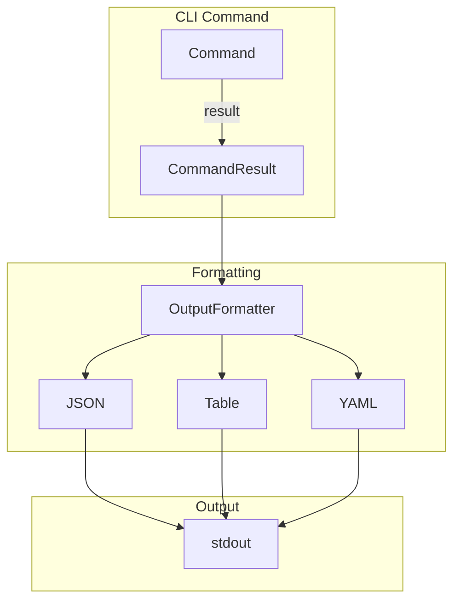

# Design Document

## Overview

This design creates a unified output formatting system for all CLI commands. The core innovation is an `OutputFormatter` trait with implementations for JSON, table, and YAML formats, plus a global `--output-format` flag.

## Architecture



## Components and Interfaces

### Component 1: OutputFormatter Trait

```rust
pub trait OutputFormatter {
    fn format_success<T: Serialize>(&self, data: &T) -> String;
    fn format_error(&self, error: &CommandError) -> String;
    fn format_table(&self, headers: &[&str], rows: &[Vec<String>]) -> String;
}

pub enum OutputFormat {
    Json,
    Table,
    Yaml,
}

impl OutputFormat {
    pub fn from_str(s: &str) -> Result<Self, FormatError>;
    pub fn formatter(&self) -> Box<dyn OutputFormatter>;
}
```

### Component 2: CommandResult

```rust
pub enum CommandResult<T> {
    Success(T),
    Error(CommandError),
}

#[derive(Debug, Serialize)]
pub struct CommandError {
    pub code: String,
    pub message: String,
    pub details: Option<serde_json::Value>,
}

impl<T: Serialize> CommandResult<T> {
    pub fn output(&self, format: OutputFormat) -> String;
}
```

## Testing Strategy

- Unit tests for each format
- Golden tests for output comparison
- Integration tests with real commands
