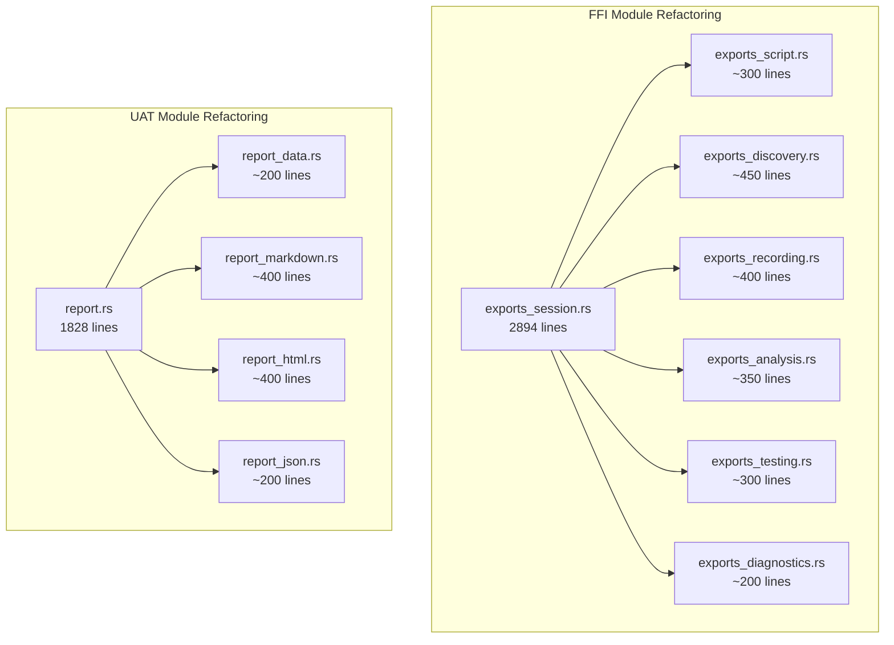

# Design Document: Code Quality Fixes

## Overview

This design addresses code quality violations by:
1. Fixing a failing unit test related to environment variable handling
2. Refactoring 12 files exceeding the 500-line limit into smaller, focused modules

All refactoring maintains backward compatibility through re-exports in `mod.rs` files.

## Steering Document Alignment

### Technical Standards (tech.md)
- **Modular Design**: Split files by single responsibility
- **No Global State**: Use `OnceLock` patterns only at FFI boundary (already in place)
- **Trait Abstraction**: Maintain existing trait patterns

### Project Structure (structure.md)
- **Max 500 lines/file**: Target for all refactored files
- **Module naming**: `snake_case.rs` for new modules
- **Re-exports**: Maintain public API through `mod.rs`

## Code Reuse Analysis

### Existing Patterns to Follow
- **FFI module pattern**: `exports.rs`, `exports_device.rs`, `exports_engine.rs` already split by domain
- **UAT module pattern**: Already has `mod.rs` with re-exports
- **Test utilities**: `serial_test` crate for environment isolation

### Integration Points
- All FFI functions must remain accessible via `ffi::*`
- All UAT types must remain accessible via `uat::*`

## Architecture

### Refactoring Strategy

## Components and Interfaces

### Component 1: Test Fix (discovery/types.rs)

- **Purpose**: Fix `device_profiles_dir_prefers_xdg_config_home` test
- **Issue**: Race condition with parallel tests modifying environment variables
- **Solution**: Use `serial_test` crate's `#[serial]` attribute for env var tests
- **Files**: `src/discovery/types.rs`

### Component 2: FFI Session Split

Split `exports_session.rs` (2894 lines) into 6 focused modules:

| New Module | Functions | Lines |
|------------|-----------|-------|
| `exports_script.rs` | keyrx_load_script, keyrx_check_script, keyrx_eval | ~300 |
| `exports_testing.rs` | keyrx_discover_tests, keyrx_run_tests, keyrx_simulate | ~350 |
| `exports_discovery.rs` | keyrx_start_discovery, keyrx_process_discovery_event, keyrx_cancel_discovery, keyrx_get_discovery_progress, callbacks | ~450 |
| `exports_recording.rs` | keyrx_start_recording, keyrx_stop_recording, keyrx_is_recording, keyrx_get_recording_path, state management | ~400 |
| `exports_analysis.rs` | keyrx_list_sessions, keyrx_analyze_session, keyrx_replay_session | ~350 |
| `exports_diagnostics.rs` | keyrx_run_benchmark, keyrx_run_doctor, platform diagnostics | ~300 |

### Component 3: UAT Report Split

Split `report.rs` (1828 lines) into domain modules:

| New Module | Contents | Lines |
|------------|----------|-------|
| `report_data.rs` | ReportData, CategoryStats structs and methods | ~200 |
| `report_markdown.rs` | Markdown generation methods | ~400 |
| `report_html.rs` | HTML generation methods | ~400 |
| `report_json.rs` | JSON serialization | ~200 |
| `report.rs` | ReportGenerator, re-exports | ~300 |

### Component 4: UAT Golden Split

Split `golden.rs` (1295 lines):

| New Module | Contents | Lines |
|------------|----------|-------|
| `golden_types.rs` | GoldenSession, GoldenEvent, GoldenVerifyResult structs | ~250 |
| `golden_manager.rs` | GoldenSessionManager implementation | ~400 |
| `golden_comparison.rs` | compare_outputs, outputs_match helpers | ~200 |
| `golden.rs` | Re-exports, remaining logic | ~300 |

### Component 5: UAT Performance Split

Split `perf.rs` (1430 lines):

| New Module | Contents | Lines |
|------------|----------|-------|
| `perf_types.rs` | Performance data structures | ~200 |
| `perf_runner.rs` | Test execution and measurement | ~400 |
| `perf_analysis.rs` | Statistical analysis, regression detection | ~400 |
| `perf.rs` | Re-exports, coordination | ~300 |

### Component 6: UAT Runner/Gates/Fuzz/Coverage

Similar splits for remaining oversized files:

| File | Strategy |
|------|----------|
| `runner.rs` (1079) | Split: discovery, execution, filtering |
| `gates.rs` (1011) | Split: gate definitions, evaluation, reporting |
| `fuzz.rs` (650) | Split: generators, execution (or keep if under 700) |
| `coverage.rs` (637) | Split: tracking, reporting (or keep if under 700) |

### Component 7: Engine/CLI Files

| File | Strategy |
|------|----------|
| `engine/tracing.rs` (621) | Split: types, span management, formatters |
| `cli/ci_check.rs` (789) | Split: phases, summary, output |
| `cli/regression.rs` (543) | Keep as-is (close to limit) |

## Data Models

No new data models. Existing structures remain unchanged, only moved between files.

## Error Handling

### Error Scenarios
1. **Import path changes**: Use re-exports to maintain backward compatibility
2. **Test isolation failures**: Use `#[serial]` for env var tests

## Testing Strategy

### Unit Testing
- All existing tests must pass after refactoring
- New modules get tests moved from original files
- Test environment isolation verified

### Integration Testing
- FFI exports verified via existing FFI tests
- UAT functionality verified via existing UAT tests

### Verification
- Run `cargo test --lib` - 0 failures
- Run `cargo llvm-cov` - >= 80% coverage
- Verify no file exceeds 500 lines: `find src -name "*.rs" -exec wc -l {} \; | awk '$1 > 500'`
