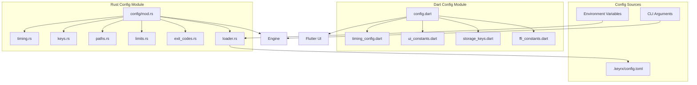

# Design Document: Configuration Centralization

## Overview

This design establishes a systematic configuration architecture for KeyRx that eliminates 90+ magic numbers and 50+ magic strings by organizing them into domain-specific modules. The architecture spans both Rust (core engine) and Dart (Flutter UI) codebases, with an optional TOML runtime config file for user customization.

## Steering Document Alignment

### Technical Standards (tech.md)
- **Dependency Injection**: Config values are injectable, enabling test overrides
- **CLI First**: All timing config is CLI-overridable via `--tap-timeout`, `--combo-timeout` flags
- **Trait Abstraction**: Config loading uses a trait for testability
- **No Global State**: Config structs are passed explicitly, not global singletons

### Project Structure (structure.md)
- **File Naming**: `snake_case.rs` for Rust, `snake_case.dart` for Dart
- **Constants**: `UPPER_SNAKE_CASE` in Rust, `lowerCamelCase` or `UPPER_SNAKE_CASE` in Dart
- **Module Organization**: Config modules follow existing patterns with `mod.rs` re-exports

## Code Reuse Analysis

### Existing Components to Leverage
- **`core/src/engine/decision/timing.rs`**: Already has `TimingConfig` struct - extend it
- **`core/src/discovery/types.rs`**: Uses `device_profiles_dir()` - align path resolution
- **`.keyrx/quality-gates.toml`**: Existing TOML config pattern - reuse loading approach
- **`ui/lib/services/service_registry.dart`**: DI pattern for config injection

### Integration Points
- **CLI Parsing**: `core/src/bin/keyrx.rs` (clap) - add config overrides
- **Engine Initialization**: Inject `Config` struct into `Engine::new()`
- **Flutter State**: Add config to `ServiceRegistry` for UI access

## Architecture

### Configuration Hierarchy

```
Priority (highest to lowest):
1. CLI arguments (--tap-timeout 150)
2. Environment variables (KEYRX_TAP_TIMEOUT=150)
3. Config file (~/.config/keyrx/config.toml)
4. Compiled defaults (constants in config modules)
```

### Module Structure

```
keyrx/
├── .keyrx/
│   ├── quality-gates.toml     # (existing)
│   └── config.toml            # NEW: User runtime config (optional)
│
├── core/src/config/
│   ├── mod.rs                 # Re-exports all config modules
│   ├── timing.rs              # Timing constants (tap_timeout, combo_window, etc.)
│   ├── keys.rs                # Key code constants (evdev, VK codes)
│   ├── paths.rs               # Path constants (uinput, config dirs)
│   ├── limits.rs              # Capacity limits (max_pending, max_modifiers)
│   ├── exit_codes.rs          # CLI exit codes
│   └── loader.rs              # TOML config file loader
│
└── ui/lib/config/
    ├── config.dart            # Barrel export
    ├── timing_config.dart     # UI timing (animation, debounce)
    ├── ui_constants.dart      # Dimensions (padding, elevation, scale)
    ├── storage_keys.dart      # SharedPreferences keys
    └── ffi_constants.dart     # FFI function names, JSON response keys
```

### Modular Design Principles
- **Single File Responsibility**: Each file handles one configuration domain
- **Component Isolation**: Config modules have zero dependencies on business logic
- **Service Layer Separation**: Config loading separate from config usage
- **Utility Modularity**: Each config domain independently importable



## Components and Interfaces

### Component 1: Rust Config Module (`core/src/config/`)

- **Purpose:** Centralize all Rust-side constants and provide config loading
- **Interfaces:**
  ```rust
  // Public API
  pub use timing::{TimingConfig, DEFAULT_TAP_TIMEOUT_MS, ...};
  pub use keys::{KeyCodes, EVDEV_KEY_ESC, VK_ESCAPE, ...};
  pub use paths::{Paths, UINPUT_PATH, ...};
  pub use limits::{Limits, MAX_PENDING_DECISIONS, ...};
  pub use exit_codes::{ExitCode, SUCCESS, ERROR, ...};
  pub use loader::{load_config, Config};
  ```
- **Dependencies:** `toml` crate (already used), `dirs` crate for XDG
- **Reuses:** Existing `TimingConfig` struct pattern

### Component 2: Dart Config Module (`ui/lib/config/`)

- **Purpose:** Centralize all Flutter-side constants
- **Interfaces:**
  ```dart
  // Barrel export from config.dart
  export 'timing_config.dart';
  export 'ui_constants.dart';
  export 'storage_keys.dart';
  export 'ffi_constants.dart';
  ```
- **Dependencies:** None (pure Dart)
- **Reuses:** Existing pattern from `ui/lib/ui/styles/surfaces.dart`

### Component 3: Config Loader (`core/src/config/loader.rs`)

- **Purpose:** Load and validate TOML config file with fallbacks
- **Interfaces:**
  ```rust
  pub struct Config {
      pub timing: TimingConfig,
      pub paths: PathConfig,
      pub limits: LimitConfig,
  }

  pub fn load_config(path: Option<&Path>) -> Config;
  pub fn merge_cli_overrides(config: &mut Config, cli: &CliArgs);
  ```
- **Dependencies:** `toml`, `serde`, `dirs`
- **Reuses:** Pattern from quality-gates.toml loading

## Data Models

### Config File Schema (TOML)

```toml
# ~/.config/keyrx/config.toml
# KeyRx Runtime Configuration

[timing]
# Duration (ms) to distinguish tap from hold. Range: 50-1000
tap_timeout_ms = 200

# Window (ms) for detecting simultaneous keypresses. Range: 10-200
combo_timeout_ms = 50

# Delay (ms) before considering a hold. Range: 0-100
hold_delay_ms = 0

[ui]
# Maximum events to retain in debugger history. Range: 100-1000
max_events_history = 300

# Animation duration in milliseconds. Range: 50-500
animation_duration_ms = 150

[performance]
# Latency warning threshold in microseconds. Range: 1000-100000
latency_warning_us = 20000

# Latency caution threshold in microseconds. Range: 500-50000
latency_caution_us = 10000

# Performance regression threshold in microseconds. Range: 10-1000
regression_threshold_us = 100

[paths]
# Directory for user scripts (relative to config dir)
scripts_dir = "scripts"

# Temporary directory for validation files
temp_dir = "/tmp"
```

### Rust Config Struct

```rust
#[derive(Debug, Clone, Deserialize)]
#[serde(default)]
pub struct Config {
    pub timing: TimingConfig,
    pub ui: UiConfig,
    pub performance: PerformanceConfig,
    pub paths: PathConfig,
}

impl Default for Config {
    fn default() -> Self {
        Self {
            timing: TimingConfig::default(),
            ui: UiConfig::default(),
            performance: PerformanceConfig::default(),
            paths: PathConfig::default(),
        }
    }
}
```

### Dart Constants Classes

```dart
/// UI timing constants
abstract class TimingConfig {
  static const int animationDurationMs = 150;
  static const int debounceMs = 500;
  static const int pulseAnimationMs = 300;
}

/// UI dimension constants
abstract class UiConstants {
  static const double defaultPadding = 16.0;
  static const double smallPadding = 8.0;
  static const double tinyPadding = 4.0;
  static const double defaultElevation = 6.0;
  static const double minKeyboardScale = 0.5;
  static const double maxKeyboardScale = 1.0;
}
```

## Error Handling

### Error Scenarios

1. **Config file not found**
   - **Handling:** Log info message, use compiled defaults
   - **User Impact:** Silent - application works with defaults

2. **Config file parse error (invalid TOML)**
   - **Handling:** Log warning with line number, use defaults
   - **User Impact:** Warning in logs, app continues with defaults

3. **Config value out of range**
   - **Handling:** Log warning, clamp to valid range
   - **User Impact:** Warning that value was adjusted

4. **Config value wrong type**
   - **Handling:** Log warning, use default for that field
   - **User Impact:** Warning that value was ignored

## Testing Strategy

### Unit Testing
- Test each config module in isolation
- Test default values match expected hardcoded values
- Test config loading with valid/invalid/missing files
- Test CLI override merging
- Test value range clamping

### Integration Testing
- Test full config resolution chain (CLI > env > file > default)
- Test engine initialization with custom config
- Test Flutter app startup with config injection

### End-to-End Testing
- Create config file, verify timing behavior changes
- Verify CLI overrides work in actual commands
- Test backward compatibility - no config file = same behavior

## Constants Inventory

### Rust Constants to Extract

| Module | Constant | Current Value | Source File |
|--------|----------|---------------|-------------|
| timing | `DEFAULT_TAP_TIMEOUT_MS` | 200 | `engine/decision/timing.rs:23` |
| timing | `DEFAULT_COMBO_TIMEOUT_MS` | 50 | `engine/decision/timing.rs:24` |
| timing | `DEFAULT_HOLD_DELAY_MS` | 0 | `engine/decision/timing.rs:25` |
| timing | `MICROS_PER_MS` | 1000 | `engine/decision/pending.rs:5` |
| limits | `MAX_PENDING_DECISIONS` | 32 | `engine/decision/pending.rs:86` |
| limits | `MIN_COMBO_KEYS` | 2 | `engine/decision/pending.rs:144` |
| limits | `MAX_COMBO_KEYS` | 4 | `engine/decision/pending.rs:144` |
| limits | `MAX_MODIFIER_ID` | 255 | `engine/state/modifiers.rs:68` |
| limits | `MAX_TIMEOUT_MS` | 5000 | `scripting/builtins.rs:236` |
| keys | `EVDEV_KEY_ESC` | 1 | `drivers/linux/reader.rs:27` |
| keys | `EVDEV_KEY_LEFTCTRL` | 29 | `drivers/linux/reader.rs:21` |
| keys | `EVDEV_KEY_LEFTSHIFT` | 42 | `drivers/linux/reader.rs:23` |
| keys | `EVDEV_KEY_LEFTALT` | 56 | `drivers/linux/reader.rs:25` |
| keys | `EVDEV_KEY_RIGHTCTRL` | 97 | `drivers/linux/reader.rs:22` |
| keys | `EVDEV_KEY_RIGHTSHIFT` | 54 | `drivers/linux/reader.rs:24` |
| keys | `EVDEV_KEY_RIGHTALT` | 100 | `drivers/linux/reader.rs:26` |
| keys | `VK_ESCAPE` | 0x1B | `drivers/windows/hook.rs:28` |
| keys | `VK_CONTROL` | 0x11 | `drivers/windows/hook.rs:29` |
| keys | `VK_SHIFT` | 0x10 | `drivers/windows/hook.rs:30` |
| keys | `VK_MENU` | 0x12 | `drivers/windows/hook.rs:31` |
| paths | `UINPUT_PATH` | "/dev/uinput" | `drivers/linux/mod.rs:25` |
| paths | `UINPUT_DEVICE_NAME` | "KeyRx Virtual Keyboard" | `drivers/linux/writer.rs:17` |
| paths | `REPL_HISTORY_FILE` | ".keyrx_repl_history" | `cli/commands/repl.rs:12` |
| paths | `PERF_BASELINE_FILE` | "target/perf-baseline.json" | `uat/perf.rs:27` |
| exit_codes | `SUCCESS` | 0 | Various CLI commands |
| exit_codes | `ERROR` | 1 | Various CLI commands |
| exit_codes | `VERIFICATION_FAILED` | 2 | Various CLI commands |
| exit_codes | `TIMEOUT` | 3 | Various CLI commands |

### Dart Constants to Extract

| Module | Constant | Current Value | Source File |
|--------|----------|---------------|-------------|
| timing | `animationDurationMs` | 150 | `pages/debugger_page.dart:29` |
| timing | `pulseAnimationMs` | 300 | `pages/debugger_page.dart:51` |
| timing | `debounceMs` | 500 | `pages/debugger_page.dart:73` |
| timing | `keyAnimationMs` | 100 | `widgets/visual_keyboard_keys.dart:96` |
| timing | `typingTimeLimitSec` | 30 | `pages/typing_simulator.dart:33` |
| ui | `defaultPadding` | 16.0 | `pages/editor_page.dart:127` |
| ui | `smallPadding` | 8.0 | Various |
| ui | `tinyPadding` | 4.0 | `pages/trade_off_widgets.dart:41` |
| ui | `defaultElevation` | 6.0 | `ui/styles/surfaces.dart:19` |
| ui | `minKeyboardScale` | 0.5 | `widgets/visual_keyboard.dart:146` |
| ui | `maxKeyboardScale` | 1.0 | `widgets/visual_keyboard.dart:147` |
| ui | `defaultIconSize` | 24.0 | `pages/trade_off_widgets.dart:79` |
| limits | `maxEventsHistory` | 300 | `pages/debugger_page.dart:33` |
| limits | `minKeystrokes` | 10 | `pages/typing_simulator.dart:65` |
| limits | `pauseThresholdMs` | 2000 | `pages/typing_simulator.dart:83` |
| thresholds | `latencyWarningUs` | 20000 | `pages/debugger_meters.dart:14` |
| thresholds | `latencyCautionUs` | 10000 | `pages/debugger_meters.dart:15` |
| thresholds | `warningThresholdNs` | 1000000 | `pages/developer/benchmark_page.dart` |
| storage | `developerModeKey` | "developer_mode" | `state/app_state.dart:13` |
| storage | `trainingProgressKey` | "keyrx_training_progress" | `pages/keyrx_training_screen.dart:26` |
| paths | `defaultScriptPath` | "scripts/generated.rhai" | `pages/editor_page.dart:66` |
| paths | `tempValidationPath` | "/tmp/keyrx_validation.rhai" | `pages/editor_page.dart:67` |
