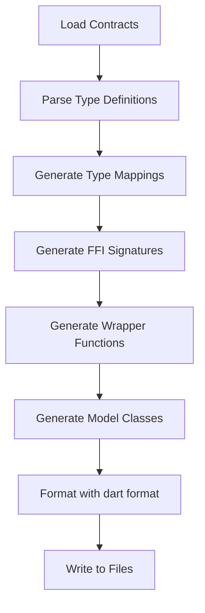

# Design Document

## Overview

The Dart Binding Code Generation feature automatically generates type-safe Dart FFI bindings from JSON contracts using a CLI tool. This eliminates manual synchronization between Rust FFI exports and Dart imports, ensuring that the Flutter UI always has correct function signatures and type definitions.

The generator produces Dart classes with proper null safety, memory management, error handling wrappers, and JSON serialization/deserialization for complex types.

## Steering Document Alignment

### Technical Standards (tech.md)

- **CLI First**: Generator is a Rust CLI tool (`generate-dart-bindings`) that integrates with the build system
- **Error Handling**: Generated Dart code throws `FfiException` for FFI errors with structured error messages
- **Performance**: Generated bindings have minimal overhead; direct FFI calls with efficient JSON serialization
- **Dependency Injection**: Generated code follows Dart patterns for testability

### Project Structure (structure.md)

- **Generator Tool**: `core/tools/generate_dart_bindings/` - Rust CLI tool for code generation
- **Generated Files**:
  - `ui/lib/ffi/generated_bindings.dart` - FFI function signatures and wrappers
  - `ui/lib/models/generated_models.dart` - Dart classes for custom types
- **Naming**: Generated classes follow Dart `PascalCase`, functions follow `camelCase`

## Code Reuse Analysis

### Existing Components to Leverage

- **ContractRegistry**: Load and parse JSON contracts
- **FfiContract / FunctionContract**: Already models contract structure
- **TypeDefinition**: Contract type information for mapping to Dart types
- **FFI Library Loading**: Existing pattern in `ui/lib/ffi/` for loading native library

### Integration Points

- **Dart FFI**: Uses `dart:ffi` package for C interop
- **JSON Serialization**: Uses `dart:convert` for JSON marshaling
- **Build System**: Integrates with `justfile` for automatic regeneration
- **Existing Bridge**: Can work alongside manual `bridge.dart` for custom wrappers

## Architecture

The code generation system follows a template-based generation pipeline:

```
Contract JSON → Load → Map Types → Generate Code → Format → Write Files
```

### Modular Design Principles

- **Single File per Concern**: Separate files for bindings and models
- **Template-Based**: Use string templates for consistent code generation
- **Modular Generator**: Separate modules for type mapping, code generation, and file writing



## Components and Interfaces

### Component 1: CLI Tool (`generate_dart_bindings`)
- **Purpose:** Main entry point for code generation
- **Interfaces:**
  - Command: `cargo run --bin generate-dart-bindings`
  - Exit codes: 0 (success), 1 (error)
- **Dependencies:** `clap` for CLI, `ContractRegistry` for contract loading
- **Reuses:** Contract loading from `keyrx_core`

**CLI Interface:**
```bash
# Generate all bindings
cargo run --bin generate-dart-bindings

# Generate for specific domain
cargo run --bin generate-dart-bindings --domain config

# Check if regeneration needed (timestamps)
cargo run --bin generate-dart-bindings --check

# Verbose mode
cargo run --bin generate-dart-bindings --verbose
```

### Component 2: Type Mapper
- **Purpose:** Convert contract types to Dart FFI types
- **Interfaces:**
  - `map_to_dart_ffi_type(contract_type: &str) -> DartFfiType`
  - `map_to_dart_native_type(contract_type: &str) -> DartType`
  - `needs_json_serialization(contract_type: &str) -> bool`
- **Dependencies:** None
- **Reuses:** Type definitions from contracts

**Type Mapping Table:**
| Contract Type | Native FFI Type | Dart Type | Conversion |
|--------------|-----------------|-----------|------------|
| `string` | `Pointer<Utf8>` | `String` | `.toDartString()` / `.toNativeUtf8()` |
| `int` | `Int32` | `int` | Direct |
| `bool` | `Bool` | `bool` | Direct |
| `void` | `Void` | `void` | - |
| Custom struct | `Pointer<Utf8>` | `CustomClass` | JSON encode/decode |
| `Vec<T>` | `Pointer<Utf8>` | `List<T>` | JSON encode/decode |

### Component 3: Bindings Generator
- **Purpose:** Generate Dart FFI function signatures and wrappers
- **Interfaces:**
  - `generate_bindings(contracts: Vec<FfiContract>) -> String`
  - `generate_function_binding(func: &FunctionContract) -> String`
  - `generate_wrapper_function(func: &FunctionContract) -> String`
- **Dependencies:** Type Mapper
- **Reuses:** None (new functionality)

**Generated Code Structure:**
```dart
// Part 1: Type definitions for FFI signatures
typedef _keyrx_config_save_hardware_profile_native = Pointer<Utf8> Function(
  Pointer<Utf8> profileJson,
  Pointer<Pointer<Utf8>> error,
);
typedef _keyrx_config_save_hardware_profile = Pointer<Utf8> Function(
  Pointer<Utf8> profileJson,
  Pointer<Pointer<Utf8>> error,
);

// Part 2: Function pointer lookup
late final _save_hardware_profile_ptr = _dylib
    .lookup<NativeFunction<_keyrx_config_save_hardware_profile_native>>(
        'keyrx_config_save_hardware_profile')
    .asFunction<_keyrx_config_save_hardware_profile>();

// Part 3: High-level wrapper with error handling
HardwareProfile saveHardwareProfile(String profileJson) {
  final errorPtr = calloc<Pointer<Utf8>>();
  try {
    final profileJsonPtr = profileJson.toNativeUtf8();
    final resultPtr = _save_hardware_profile_ptr(profileJsonPtr, errorPtr);

    calloc.free(profileJsonPtr);

    if (errorPtr.value.address != 0) {
      final error = errorPtr.value.toDartString();
      calloc.free(errorPtr.value);
      throw FfiException(error);
    }

    if (resultPtr.address == 0) {
      throw FfiException('Unexpected null return from FFI');
    }

    final resultJson = resultPtr.toDartString();
    keyrx_free_string(resultPtr);

    return HardwareProfile.fromJson(jsonDecode(resultJson));
  } finally {
    calloc.free(errorPtr);
  }
}
```

### Component 4: Models Generator
- **Purpose:** Generate Dart classes for custom types
- **Interfaces:**
  - `generate_models(types: HashMap<String, TypeDefinition>) -> String`
  - `generate_class(name: &str, type_def: &TypeDefinition) -> String`
- **Dependencies:** Type Mapper
- **Reuses:** None (new functionality)

**Generated Model Structure:**
```dart
class HardwareProfile {
  final String id;
  final String name;
  final int vendorId;
  final int productId;
  final Map<int, String> wiring;

  HardwareProfile({
    required this.id,
    required this.name,
    required this.vendorId,
    required this.productId,
    required this.wiring,
  });

  factory HardwareProfile.fromJson(Map<String, dynamic> json) {
    return HardwareProfile(
      id: json['id'] as String,
      name: json['name'] as String,
      vendorId: json['vendor_id'] as int,
      productId: json['product_id'] as int,
      wiring: (json['wiring'] as Map<String, dynamic>).map(
        (k, v) => MapEntry(int.parse(k), v as String),
      ),
    );
  }

  Map<String, dynamic> toJson() {
    return {
      'id': id,
      'name': name,
      'vendor_id': vendorId,
      'product_id': productId,
      'wiring': wiring.map((k, v) => MapEntry(k.toString(), v)),
    };
  }
}
```

### Component 5: File Writer
- **Purpose:** Write generated code to files and format them
- **Interfaces:**
  - `write_bindings(code: &str, path: &Path) -> Result<()>`
  - `format_dart_code(code: &str) -> Result<String>`
  - `check_if_regeneration_needed(contracts_dir: &Path, output_file: &Path) -> bool`
- **Dependencies:** File I/O, `dart format` command
- **Reuses:** None (new functionality)

**File Writing Strategy:**
1. Generate code in memory
2. Run `dart format` on generated code
3. Check if output file exists and content is identical
4. Only write if content changed (avoid unnecessary recompilations)
5. Add header comment with generation timestamp and warning not to edit

### Component 6: Template Engine
- **Purpose:** Manage code generation templates
- **Interfaces:**
  - `render_template(template: &str, context: &HashMap<String, String>) -> String`
- **Dependencies:** None (simple string replacement)
- **Reuses:** None (new functionality)

**Template Variables:**
- `{{function_name}}` - FFI function name
- `{{dart_function_name}}` - Camel case wrapper name
- `{{parameters}}` - Function parameters
- `{{return_type}}` - Dart return type
- `{{error_handling}}` - Error checking code
- `{{type_conversion}}` - Marshaling code

## Data Models

### DartBinding
```rust
struct DartBinding {
    native_typedef: String,
    dart_typedef: String,
    function_pointer: String,
    wrapper_function: String,
}
```

### DartModel
```rust
struct DartModel {
    class_name: String,
    fields: Vec<DartField>,
    from_json: String,
    to_json: String,
}

struct DartField {
    name: String,
    dart_type: String,
    json_key: String,
    is_required: bool,
}
```

### GenerationContext
```rust
struct GenerationContext {
    contracts: Vec<FfiContract>,
    custom_types: HashMap<String, TypeDefinition>,
    output_dir: PathBuf,
    verbose: bool,
}
```

## Error Handling

### Error Scenarios

1. **Contract File Not Found**
   - **Handling:** Exit with error code 1 and clear message
   - **User Impact:** `Error: Contract file not found: core/src/ffi/contracts/config.ffi-contract.json`

2. **Invalid Contract JSON**
   - **Handling:** Exit with error code 1 and JSON parse error
   - **User Impact:** `Error: Invalid JSON in config.ffi-contract.json: expected '}' at line 45`

3. **Unknown Contract Type**
   - **Handling:** Exit with error listing unknown types
   - **User Impact:** `Error: Unknown type 'CustomWidget' in function 'save_widget'. Add type definition to contract.`

4. **Dart Format Failure**
   - **Handling:** Write unformatted code and warn user
   - **User Impact:** `Warning: dart format failed. Generated code may not be formatted correctly.`

5. **File Write Permission Error**
   - **Handling:** Exit with error code 1
   - **User Impact:** `Error: Permission denied writing to ui/lib/ffi/generated_bindings.dart`

## Testing Strategy

### Unit Testing

- **Type Mapper Tests**: Test contract type to Dart type mappings
  - Input: Contract type string
  - Output: Dart FFI type and native type
  - Cases: All primitive types, custom types, arrays, nullable types

- **Code Generation Tests**: Test template rendering
  - Input: Function contract
  - Output: Generated Dart code
  - Verify: Syntax is valid, types are correct

- **Model Generation Tests**: Test class generation
  - Input: Type definition
  - Output: Dart class with fromJson/toJson
  - Verify: All fields present, JSON keys correct

### Integration Testing

- **End-to-End Generation**: Test full generation pipeline
  - Create sample contracts
  - Run generator
  - Verify output files exist and contain expected code
  - Run `dart analyze` on generated code
  - Verify no warnings or errors

- **Roundtrip Testing**: Test JSON serialization
  - Create Dart object
  - Serialize to JSON
  - Deserialize back to object
  - Verify equality

### End-to-End Testing

- **Build Integration**: Test integration with build system
  - Modify contract
  - Run `just build`
  - Verify bindings regenerated
  - Verify Flutter compilation succeeds

- **FFI Testing**: Test generated bindings with real Rust FFI
  - Call generated Dart functions
  - Verify results are correct
  - Test error scenarios

## Implementation Phases

### Phase 1: CLI Tool Setup
1. Create `core/tools/generate_dart_bindings` binary crate
2. Implement CLI argument parsing
3. Load contracts from directory
4. Validate contract structure

### Phase 2: Type Mapping
1. Implement contract to Dart FFI type mapping
2. Handle primitives, strings, custom types
3. Handle nullable types
4. Unit test all mappings

### Phase 3: Bindings Generation
1. Generate FFI type definitions
2. Generate function pointer lookups
3. Generate wrapper functions
4. Add error handling

### Phase 4: Models Generation
1. Extract custom types from contracts
2. Generate Dart classes
3. Generate fromJson/toJson methods
4. Handle nested types

### Phase 5: Integration
1. Add file writing with dart format
2. Integrate with justfile build process
3. Add CI check for up-to-date bindings
4. Document usage

## Build System Integration

### Justfile Recipe
```just
# Generate Dart FFI bindings
gen-dart-bindings:
    cargo run --bin generate-dart-bindings
    @echo "Dart bindings regenerated"

# Build with automatic binding generation
build: gen-dart-bindings
    cd core && cargo build --release
    cd ui && flutter build linux --release

# Watch mode for development
dev-ui: gen-dart-bindings
    cd ui && flutter run -d linux
```

### Pre-commit Hook
```bash
# Check if bindings are up-to-date
cargo run --bin generate-dart-bindings --check
if [ $? -ne 0 ]; then
    echo "Error: Dart bindings are out of date. Run: just gen-dart-bindings"
    exit 1
fi
```

### CI Integration
```yaml
- name: Check Dart bindings are up-to-date
  run: |
    cargo run --bin generate-dart-bindings
    git diff --exit-code ui/lib/ffi/generated_bindings.dart ui/lib/models/generated_models.dart
```

## Generated File Headers

All generated files include a header:
```dart
// GENERATED CODE - DO NOT EDIT
// This file was generated by the Dart binding generator.
// Generation time: 2025-12-11 10:53:00 UTC
// Source contracts: core/src/ffi/contracts/*.ffi-contract.json
//
// To regenerate: cargo run --bin generate-dart-bindings
// Or: just gen-dart-bindings

// ignore_for_file: non_constant_identifier_names, unused_element
```

## Migration Strategy

### Gradual Migration
1. Generate bindings alongside existing manual bindings
2. Update one page at a time to use generated bindings
3. Test thoroughly
4. Once all pages migrated, remove manual bindings
5. Make generated bindings the only source

### Compatibility
- Generated bindings can coexist with manual bindings
- Use different import paths to avoid conflicts
- Gradually migrate Flutter pages to use generated bindings
