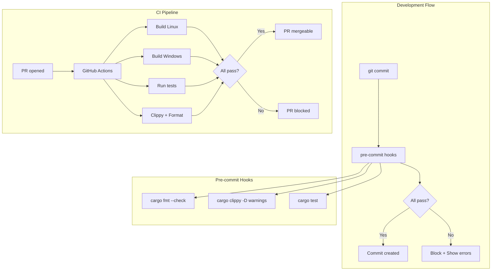

# Design Document: dev-tooling

## Overview

This design establishes development infrastructure for KeyRx including pre-commit hooks, CI/CD pipelines, error handling patterns, documentation, and enhanced mock infrastructure. The goal is to enable fast, reliable iteration for both human developers and AI agents.

## Steering Document Alignment

### Technical Standards (tech.md)
- **Code Quality Tools**: clippy, rustfmt, cargo test as specified
- **Testing Framework**: proptest for fuzzing, criterion for benchmarks
- **Error Handling**: anyhow for application errors, thiserror for library errors

### Project Structure (structure.md)
- Configuration files at repository root
- Documentation in `docs/` directory
- CI configuration in `.github/workflows/`

## Code Reuse Analysis

### Existing Components to Leverage
- **anyhow**: Already in Cargo.toml for error handling
- **thiserror**: Already in Cargo.toml for custom errors
- **tracing**: Already configured for structured logging
- **serde/serde_json**: Already available for JSON output

### Integration Points
- **RhaiRuntime**: Refactor error handling, remove Rc<RefCell>
- **CLI Commands**: Replace process::exit with Result returns
- **Mock implementations**: Extend with call tracking and error injection

## Architecture



## Components and Interfaces

### Component 1: Pre-commit Hook System
- **Purpose**: Enforce code quality before commits
- **Technology**: Shell scripts + cargo commands (no external deps)
- **Files**:
  - `scripts/install-hooks.sh` - One-command hook installation
  - `.githooks/pre-commit` - Hook script
- **Interfaces**: Exit 0 on success, non-zero on failure

### Component 2: GitHub Actions CI
- **Purpose**: Automated build and test on PR
- **Files**:
  - `.github/workflows/ci.yml` - Main CI workflow
- **Jobs**:
  - `check` - Format and lint
  - `test` - Run all tests
  - `build-linux` - Build Linux binary
  - `build-windows` - Cross-compile Windows binary
- **Triggers**: PR open, push to main

### Component 3: Error Handling Refactor
- **Purpose**: Replace silent failures with proper error propagation
- **Pattern**: All functions return `Result<T, E>`, errors bubble up
- **Files to modify**:
  - `scripting/runtime.rs` - Rhai function error returns
  - `cli/commands/*.rs` - Remove process::exit
  - `traits/script_runtime.rs` - Add error variants

### Component 4: Custom Error Types
- **Purpose**: Structured errors with context
- **Files**:
  - `core/src/error.rs` - KeyRx error hierarchy
- **Interface**:
  ```rust
  #[derive(Debug, thiserror::Error)]
  pub enum KeyRxError {
      #[error("Unknown key '{0}'")]
      UnknownKey(String),
      #[error("Script error: {0}")]
      ScriptError(#[from] rhai::EvalAltResult),
      #[error("IO error: {0}")]
      IoError(#[from] std::io::Error),
  }
  ```

### Component 5: Documentation
- **Purpose**: Enable autonomous script development
- **Files**:
  - `docs/SCRIPTING.md` - Rhai API reference
  - `docs/KEYS.md` - Complete key name reference
- **Format**: Markdown with examples

### Component 6: Enhanced Mocks
- **Purpose**: Enable comprehensive testing including error paths
- **Files**:
  - `mocks/mock_input.rs` - Add error injection
  - `mocks/mock_runtime.rs` - Add call tracking
  - `mocks/mock_state.rs` - Add history tracking
- **Interface**:
  ```rust
  impl MockInput {
      pub fn with_error_after(n: usize, error: anyhow::Error) -> Self;
      pub fn call_history(&self) -> &[MockCall];
  }
  ```

### Component 7: Configuration Files
- **Purpose**: Consistent code style across team
- **Files**:
  - `rustfmt.toml` - Formatting rules
  - `clippy.toml` - Lint configuration
  - `Cargo.toml` - Profile optimization
- **Settings**: 100 char lines, Rust 2021 edition imports

## Data Models

### KeyRxError Enum
```rust
#[derive(Debug, thiserror::Error)]
pub enum KeyRxError {
    #[error("Unknown key: '{key}'")]
    UnknownKey { key: String },

    #[error("Script compilation failed: {message}")]
    ScriptCompileError { message: String, line: Option<usize> },

    #[error("Script execution failed: {message}")]
    ScriptRuntimeError { message: String },

    #[error("Invalid path: {path}")]
    InvalidPath { path: String },

    #[error("IO error: {0}")]
    Io(#[from] std::io::Error),

    #[error("Platform error: {message}")]
    PlatformError { message: String },
}
```

### MockCall Tracking
```rust
#[derive(Debug, Clone)]
pub enum MockCall {
    Start,
    Stop,
    PollEvents,
    SendOutput(OutputAction),
    LoadFile(String),
    Execute(String),
    CallHook(String),
    LookupRemap(KeyCode),
}

pub struct CallTracker {
    calls: Vec<MockCall>,
}
```

## Error Handling

### Strategy: Result Everywhere

**Before (silent failure)**:
```rust
fn remap(from: &str, to: &str) {
    let from_key = match KeyCode::from_name(from) {
        Some(k) => k,
        None => {
            tracing::warn!("Unknown key: {}", from);
            return;  // Silent failure!
        }
    };
}
```

**After (error propagation)**:
```rust
fn remap(from: &str, to: &str) -> Result<(), KeyRxError> {
    let from_key = KeyCode::from_name(from)
        .ok_or_else(|| KeyRxError::UnknownKey { key: from.to_string() })?;
    let to_key = KeyCode::from_name(to)
        .ok_or_else(|| KeyRxError::UnknownKey { key: to.to_string() })?;
    // ...
    Ok(())
}
```

### CLI Error Handling

**Before**:
```rust
pub fn run(&self) -> Result<()> {
    match self.validate() {
        Ok(_) => { /* ... */ }
        Err(e) => {
            eprintln!("Error: {}", e);
            std::process::exit(2);  // Hard exit!
        }
    }
}
```

**After**:
```rust
pub fn run(&self) -> Result<()> {
    self.validate()?;  // Propagate error
    // ...
    Ok(())
}

// In main.rs:
fn main() {
    if let Err(e) = run_cli() {
        eprintln!("Error: {}", e);
        std::process::exit(1);
    }
}
```

## Testing Strategy

### Unit Testing
- All new error types have tests
- Mock call tracking verified
- Error injection paths tested

### Integration Testing
- Pre-commit hooks tested in CI
- Error propagation end-to-end tested
- Documentation examples validated

### Validation Testing
- `cargo fmt --check` passes
- `cargo clippy -D warnings` passes
- All existing tests continue to pass

## File Changes Summary

| File | Action | Purpose |
|------|--------|---------|
| `scripts/install-hooks.sh` | Create | One-command hook installation |
| `.githooks/pre-commit` | Create | Pre-commit hook script |
| `.github/workflows/ci.yml` | Create | CI pipeline |
| `rustfmt.toml` | Create | Formatting config |
| `clippy.toml` | Create | Lint config |
| `core/src/error.rs` | Create | Custom error types |
| `core/src/lib.rs` | Modify | Export error module |
| `core/src/scripting/runtime.rs` | Modify | Error returns, remove Rc<RefCell> |
| `core/src/cli/commands/check.rs` | Modify | Remove process::exit |
| `core/src/cli/commands/run.rs` | Modify | Fix path handling |
| `core/src/mocks/mock_input.rs` | Modify | Add error injection + tracking |
| `core/src/mocks/mock_runtime.rs` | Modify | Add call tracking |
| `core/src/mocks/mock_state.rs` | Modify | Add history tracking |
| `core/src/traits/script_runtime.rs` | Modify | Error-returning methods |
| `docs/SCRIPTING.md` | Create | Rhai API documentation |
| `docs/KEYS.md` | Create | Key name reference |
| `Cargo.toml` | Modify | Dev profile optimization |
