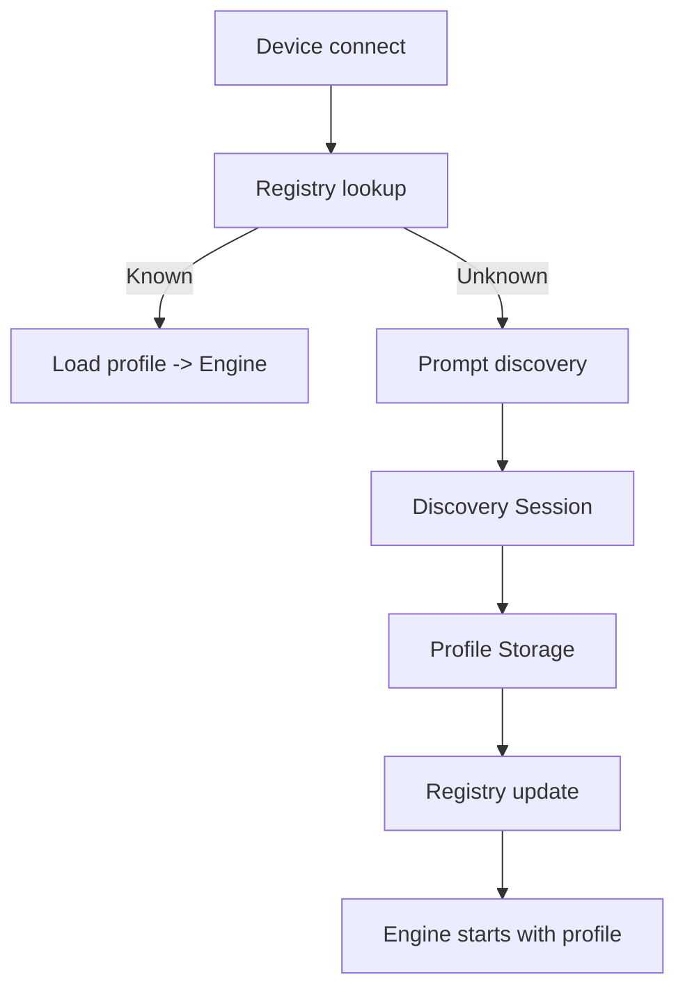

# Design Document

## Overview

Device Discovery introduces a reusable Rust module that detects unknown keyboards, guides users through a structured scan to map physical positions, and persists per-device profiles. It is CLI-first with an API surface for Flutter UI visualization via existing FFI boundaries. Core goals: zero lockouts, fast prompts, deterministic storage, and re-discovery support.

## Steering Document Alignment

### Technical Standards (tech.md)
- Uses trait-based abstraction for input sources and persistence to keep testability.
- Respects “CLI First” by implementing the workflow as a CLI command before GUI hooks.
- Stores profiles under `~/.config/keyrx/devices` as JSON per documented layout and schema versioning.
- Honors emergency-exit guarantee and isolates discovery to the target device.

### Project Structure (structure.md)
- New Rust modules live under `core/src/` (e.g., `discovery/registry.rs`, `discovery/session.rs`, `discovery/storage.rs`).
- CLI entry integrated via existing `core/src/cli/commands/` with a `discover` command.
- FFI exports (if needed for GUI) exposed via `core/src/ffi/exports.rs`, reusing the shared logic from `discovery/`.

## Code Reuse Analysis
- **InputSource trait (drivers/traits.rs)**: Reuse for device event capture and filtering by device_id.
- **State machine patterns (engine/state.rs)**: Mirror pattern for discovery session state (progress, retries).
- **Config path handling (existing CLI utilities)**: Reuse path helpers for `~/.config/keyrx/` resolution.
- **Tracing/diagnostics (observability)**: Reuse tracing spans for discovery events to support replay.

### Existing Components to Leverage
- **drivers::* implementations**: Device detection (vendor_id/product_id) and exclusive grabs.
- **CLI command scaffolding (`cli/commands`)**: Argument parsing, JSON output, exit codes.
- **Serialization stack (serde + JSON)**: Profile persistence and schema versioning.

### Integration Points
- **Engine initialization**: Load profile before starting the event loop; inject registry lookup.
- **GUI**: Optional visualization via FFI events (progress, prompts, summary) without reimplementing logic.
- **Testing harness**: Simulate discovery events via existing simulation utilities to run headless tests.

## Architecture

- **Device Registry**: In-memory cache keyed by (vendor_id, product_id), backed by JSON files. Provides lookup, load, save, and schema validation.
- **Discovery Session**: State machine that sequences expected positions, records scan_code→position, handles duplicates/ambiguities, and emits progress events.
- **Profile Storage**: Versioned JSON persistence with atomic writes (temp file + rename) and corruption fallback.
- **CLI Command (`keyrx discover`)**: Starts discovery for unknown devices automatically or targeted via flag; provides progress indicators and summary with confirm/save.
- **Fallback Strategy**: Default profile for bypass/skip and on errors; never blocks keyboard control.
- **Re-discovery**: Allows rerun using previous dimensions as defaults and writing new versioned profiles.



## Components and Interfaces

### DeviceRegistry
- **Purpose:** Manage profile lookup/load/save with schema validation and versioning.
- **Interfaces:** `load(device_id) -> Result<DeviceProfile>`, `save(profile) -> Result<()>`, `default_profile()`.
- **Dependencies:** Storage backend (filesystem), serde, config path helpers.
- **Reuses:** Existing config path utils and serde configuration.

### DiscoverySession
- **Purpose:** Guide capture of physical layout and produce a `DeviceProfile`.
- **Interfaces:** `start(params)`, `handle_event(event) -> Progress|Error|Complete`, `summary()`.
- **Dependencies:** Input events from `InputSource`, timing for prompts, validator for duplicates/coverage.
- **Reuses:** State machine patterns and tracing spans.

### ProfileStorage
- **Purpose:** Read/write JSON profiles with atomicity and schema version stamping.
- **Interfaces:** `read(path)`, `write(profile)`, `migrate(old_profile)`.
- **Dependencies:** Filesystem, serde, schema version constant.

### CLI Command (`discover`)
- **Purpose:** User-facing entry; runs discovery, handles skip, and surfaces progress/summary.
- **Interfaces:** Arguments: `--device {vid:pid}`, `--force`, `--json`, `--yes`; Exit codes: 0 success, 2 validation failure, 3 canceled.
- **Dependencies:** Registry, DiscoverySession, stdout/stderr, tracing.
- **Reuses:** CLI scaffolding and JSON output formatter.

### FFI Events (optional hook)
- **Purpose:** Stream discovery progress to Flutter without reimplementing logic.
- **Interfaces:** Emits: `DiscoveryStarted`, `Progress { completed, total, current_row, current_col }`, `DuplicateKey { scan_code }`, `Summary { rows, cols, unmapped }`, `Completed { profile_path }`.
- **Dependencies:** Existing FFI bridge; reuses serialized structs.

## Data Models

### DeviceProfile
```
struct DeviceProfile {
  schema_version: u8,
  vendor_id: u16,
  product_id: u16,
  name: String,
  discovered_at: DateTime<Utc>,
  rows: u8,
  cols_per_row: Vec<u8>,
  keymap: HashMap<u16, PhysicalKey>, // scan_code -> PhysicalKey
  aliases: HashMap<String, u16>,     // alias -> scan_code
  source: ProfileSource,             // discovered | default | migrated
}
```

### PhysicalKey
```
struct PhysicalKey {
  scan_code: u16,
  position: (u8, u8),
  alias: String, // e.g., KEY_0_0 or user-defined
}
```

### DiscoverySessionState
```
struct DiscoverySessionState {
  target_rows: u8,
  cols_per_row: Vec<u8>,
  captured: HashMap<u16, (u8, u8)>,
  expected_next: (u8, u8),
  started_at: Instant,
}
```

## Error Handling

### Error Scenarios
1. **Profile load corruption**
   - **Handling:** Log warning, fall back to default profile, prompt user for re-discovery.
   - **User Impact:** Keyboard remains functional; notified to rerun discovery.
2. **Duplicate/ambiguous key press during discovery**
   - **Handling:** Emit explicit error, request re-press, do not advance pointer.
   - **User Impact:** Clear retry message; progress retained.
3. **File write failure (permission/disk)**
   - **Handling:** Abort save, retain in-memory profile, surface actionable error, continue with default.
   - **User Impact:** Informs that profile not persisted; can retry later.
4. **User cancel or timeout**
   - **Handling:** Stop session, discard partial data, keep previous profile active.
   - **User Impact:** No changes applied; can restart discovery anytime.

## Testing Strategy

### Unit Testing
- Registry load/save with schema versioning and corruption fallback.
- DiscoverySession state transitions (expected_next, duplicates, completion).
- CLI argument parsing and exit codes.

### Integration Testing
- Simulated device connect -> prompt -> discovery -> profile saved -> reconnect loads profile.
- Re-discovery overwriting with versioned file while keeping previous profile.
- Error paths: corrupt file, permission denied, duplicate keys.

### End-to-End Testing
- CLI-driven discovery for a representative 60% keyboard (simulate events) with JSON output enabled.
- Replay a recorded discovery session to ensure deterministic behavior.
- Validate emergency exit bypass during discovery in debug builds (simulated).
