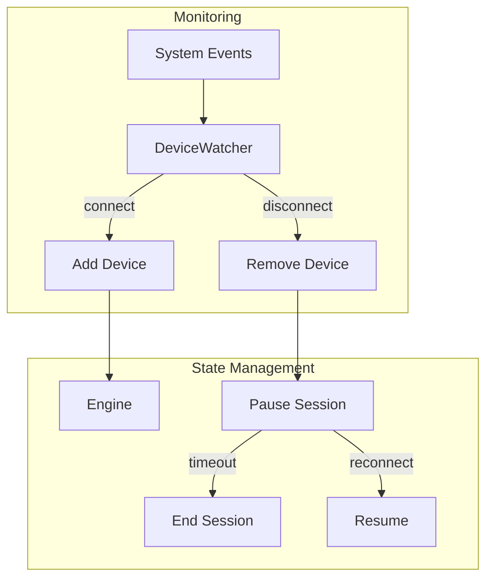

# Design Document

## Overview

This design adds continuous device monitoring with graceful handling of connect/disconnect events. The core innovation is a `DeviceWatcher` that monitors system events (inotify on Linux, WM_DEVICECHANGE on Windows) and coordinates with the engine for seamless device transitions.

## Architecture



## Components and Interfaces

### Component 1: DeviceWatcher

```rust
pub struct DeviceWatcher {
    devices: RwLock<HashMap<String, DeviceState>>,
    event_tx: Sender<DeviceEvent>,
}

pub enum DeviceEvent {
    Connected(DeviceInfo),
    Disconnected(String),
    Error(String, DeviceError),
}

pub enum DeviceState {
    Active,
    Paused { since: Instant },
    Failed { error: DeviceError },
}

impl DeviceWatcher {
    pub fn new() -> Self;
    pub fn start(&self) -> JoinHandle<()>;
    pub fn stop(&self);
    pub fn subscribe(&self) -> Receiver<DeviceEvent>;
    pub fn devices(&self) -> Vec<(String, DeviceState)>;
}
```

### Component 2: Platform Implementations

```rust
#[cfg(target_os = "linux")]
pub struct LinuxDeviceWatcher {
    inotify: Inotify,
}

#[cfg(windows)]
pub struct WindowsDeviceWatcher {
    // WM_DEVICECHANGE handler
}
```

## Testing Strategy

- Unit tests with mock devices
- Integration tests with device simulation
- Stress tests for rapid connect/disconnect
