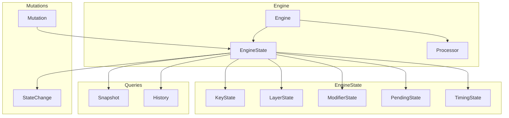

# Design Document

## Overview

This design unifies the distributed engine state into a single `EngineState` struct that owns all state components. The core innovation is the `apply_mutation()` method that batches state changes atomically and emits change events. State components become internal modules that EngineState coordinates.

## Steering Document Alignment

### Technical Standards (tech.md)
- **No Global State**: EngineState is an instance, not global
- **Event Sourcing**: Mutations produce StateChange events
- **Dependency Injection**: State is injectable for testing

### Project Structure (structure.md)
- State in `core/src/engine/state/`
- Components: `keys.rs`, `layers.rs`, `modifiers.rs`, `pending.rs`
- Public API in `core/src/engine/state/mod.rs`

## Code Reuse Analysis

### Existing Components to Leverage
- **`KeyStateTracker`**: Refactor into state component
- **`LayerStack`**: Refactor into state component
- **`ModifierState`**: Refactor into state component
- **`PendingDecisionQueue`**: Refactor into state component

### Integration Points
- **Engine core**: Uses EngineState instead of separate structs
- **FFI exports**: Queries EngineState for snapshots
- **Flutter debugger**: Displays EngineState

## Architecture



### Modular Design Principles
- **Single File Responsibility**: Each state component has one file
- **Component Isolation**: Components don't reference each other
- **Unified Coordination**: EngineState coordinates components
- **Clear Boundaries**: Mutations go through EngineState

## Components and Interfaces

### Component 1: EngineState

- **Purpose:** Unified container for all engine state
- **Interfaces:**
  ```rust
  #[derive(Clone)]
  pub struct EngineState {
      keys: KeyState,
      layers: LayerState,
      modifiers: ModifierState,
      pending: PendingState,
      timing: TimingState,
      version: u64,
  }

  impl EngineState {
      pub fn new() -> Self;

      // === Queries ===
      pub fn is_key_pressed(&self, key: KeyCode) -> bool;
      pub fn active_layers(&self) -> &[LayerId];
      pub fn active_modifiers(&self) -> ModifierSet;
      pub fn pending_decisions(&self) -> &[PendingDecision];
      pub fn version(&self) -> u64;

      // === Mutations ===
      pub fn apply(&mut self, mutation: Mutation) -> Result<StateChange, StateError>;
      pub fn apply_batch(&mut self, mutations: Vec<Mutation>) -> Result<Vec<StateChange>, StateError>;

      // === Snapshots ===
      pub fn snapshot(&self) -> StateSnapshot;
      pub fn diff(&self, other: &Self) -> StateDiff;
  }
  ```
- **Dependencies:** State components
- **Reuses:** Existing state logic

### Component 2: Mutation Enum

- **Purpose:** Explicit state change operations
- **Interfaces:**
  ```rust
  #[derive(Debug, Clone)]
  pub enum Mutation {
      // Key state
      KeyDown { key: KeyCode, timestamp: u64 },
      KeyUp { key: KeyCode, timestamp: u64 },

      // Layer state
      PushLayer { layer: LayerId },
      PopLayer { layer: LayerId },
      SetActiveLayer { layer: LayerId },

      // Modifier state
      ActivateModifier { modifier: ModifierId },
      DeactivateModifier { modifier: ModifierId },
      SetModifiers { modifiers: ModifierSet },

      // Pending decisions
      AddPending { decision: PendingDecision },
      ResolvePending { id: PendingId, resolution: Resolution },
      ClearPending { id: PendingId },

      // Timing
      AdvanceTime { microseconds: u64 },
  }
  ```
- **Dependencies:** Core types
- **Reuses:** Existing operation concepts

### Component 3: StateChange

- **Purpose:** Record of what changed for event emission
- **Interfaces:**
  ```rust
  #[derive(Debug, Clone, Serialize)]
  pub struct StateChange {
      pub version: u64,
      pub mutation: Mutation,
      pub effects: Vec<Effect>,
      pub timestamp: u64,
  }

  #[derive(Debug, Clone, Serialize)]
  pub enum Effect {
      KeyStateChanged { key: KeyCode, pressed: bool },
      LayerActivated { layer: LayerId },
      LayerDeactivated { layer: LayerId },
      ModifierActivated { modifier: ModifierId },
      ModifierDeactivated { modifier: ModifierId },
      DecisionResolved { id: PendingId, resolution: Resolution },
  }
  ```
- **Dependencies:** Mutation type
- **Reuses:** Event pattern

### Component 4: KeyState Component

- **Purpose:** Track which keys are currently pressed
- **Interfaces:**
  ```rust
  #[derive(Clone, Default)]
  pub(crate) struct KeyState {
      pressed: HashSet<KeyCode>,
      timestamps: HashMap<KeyCode, u64>,
  }

  impl KeyState {
      pub fn is_pressed(&self, key: KeyCode) -> bool;
      pub fn press(&mut self, key: KeyCode, timestamp: u64);
      pub fn release(&mut self, key: KeyCode) -> Option<u64>;
      pub fn pressed_keys(&self) -> impl Iterator<Item = KeyCode>;
      pub fn hold_duration(&self, key: KeyCode, now: u64) -> Option<u64>;
  }
  ```
- **Dependencies:** KeyCode
- **Reuses:** Logic from KeyStateTracker

### Component 5: StateSnapshot

- **Purpose:** Serializable state for FFI and persistence
- **Interfaces:**
  ```rust
  #[derive(Debug, Clone, Serialize, Deserialize)]
  pub struct StateSnapshot {
      pub pressed_keys: Vec<KeyCode>,
      pub active_layers: Vec<LayerId>,
      pub active_modifiers: Vec<ModifierId>,
      pub pending_count: usize,
      pub version: u64,
      pub timestamp: u64,
  }

  impl From<&EngineState> for StateSnapshot {
      fn from(state: &EngineState) -> Self { ... }
  }
  ```
- **Dependencies:** serde
- **Reuses:** Serialization patterns

## Data Models

### PendingDecision
```rust
#[derive(Debug, Clone)]
pub struct PendingDecision {
    pub id: PendingId,
    pub decision_type: DecisionType,
    pub keys: Vec<KeyCode>,
    pub started_at: u64,
    pub timeout: u64,
}

#[derive(Debug, Clone, Copy)]
pub enum DecisionType {
    TapOrHold,
    Combo,
    Sequence,
}
```

### StateDiff
```rust
#[derive(Debug, Clone, Serialize)]
pub struct StateDiff {
    pub from_version: u64,
    pub to_version: u64,
    pub changes: Vec<StateChange>,
}
```

## Error Handling

### Error Scenarios

1. **Invalid mutation (release unpressed key)**
   - **Handling:** Return `StateError::InvalidMutation`
   - **User Impact:** Bug caught early

2. **State invariant violation**
   - **Handling:** Debug: panic; Release: log and recover
   - **User Impact:** State remains consistent

3. **Batch mutation partial failure**
   - **Handling:** Rollback all changes
   - **User Impact:** Atomic semantics preserved

## Testing Strategy

### Unit Testing
- Test each state component in isolation
- Verify mutation effects
- Test invariant validation

### Integration Testing
- Test full mutation sequences
- Verify state synchronization
- Test rollback behavior

### Property Testing
- Fuzz mutation sequences
- Verify state consistency after random operations
- Test snapshot/restore round-trips
