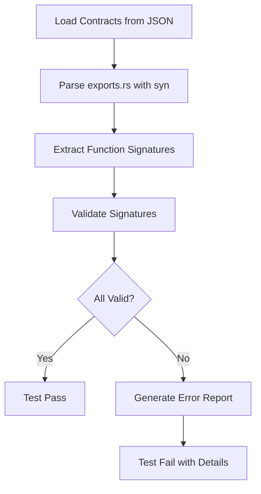

# Design Document

## Overview

The Enhanced Validation feature transforms the existing `contract_adherence.rs` test from simple string matching to comprehensive static analysis using Rust's `syn` crate for AST parsing. This ensures that every FFI function signature exactly matches its JSON contract, eliminating type mismatches, missing parameters, and incorrect return types at compile time.

## Steering Document Alignment

### Technical Standards (tech.md)

- **Dependency Injection**: The validation system will be testable through trait abstractions for file loading and parsing
- **Error Handling**: Fail-fast validation with structured error types following KeyRx's custom exception hierarchy
- **Testing Framework**: Uses `cargo test` with detailed error reporting; integrates seamlessly with CI/CD pipeline
- **CLI First**: The test runs as part of `cargo test` and can be invoked directly for rapid validation

### Project Structure (structure.md)

- **Location**: `core/tests/contract_adherence.rs` (existing file, enhanced)
- **Module Organization**: Separate modules for parsing, validation, and reporting within the test
- **Naming Conventions**: Follows Rust conventions with `snake_case` functions and `PascalCase` structs
- **Code Size**: Each validation function under 50 lines; total file under 500 lines

## Code Reuse Analysis

### Existing Components to Leverage

- **ContractRegistry**: Already exists at `core/src/ffi/contract.rs` - loads and parses all `.ffi-contract.json` files
- **FfiContract / FunctionContract**: Existing structs for representing contract data
- **TypeDefinition**: Already handles primitive, object, array, and enum types
- **File Discovery**: Current test already uses `walkdir` to find contract files

### Integration Points

- **Cargo Test Infrastructure**: Integrates as a standard `#[test]` function
- **Contract Directory**: Reads from `core/src/ffi/contracts/`
- **FFI Exports**: Validates against `core/src/ffi/exports.rs` and domain-specific FFI modules

## Architecture

The enhanced validation system follows a pipeline architecture:

```
Contracts (JSON) → Load → Parse Rust → Extract Signatures → Validate → Report
```

### Modular Design Principles

- **Single Responsibility**: Each function handles one validation concern (signature matching, type mapping, error reporting)
- **Component Isolation**: Parser, validator, and reporter are separate modules that can be tested independently
- **Service Layer Separation**: Contract loading, AST parsing, and validation logic are cleanly separated



## Components and Interfaces

### Component 1: Contract Loader
- **Purpose:** Load all FFI contracts from the contracts directory
- **Interfaces:**
  - `load_all_contracts() -> Result<Vec<FfiContract>, Error>`
- **Dependencies:** `ContractRegistry`, file system
- **Reuses:** Existing `ContractRegistry::load_from_dir()`

### Component 2: Rust AST Parser
- **Purpose:** Parse Rust source files and extract `extern "C"` function signatures
- **Interfaces:**
  - `parse_ffi_exports(file_path: &Path) -> Result<Vec<ParsedFunction>, syn::Error>`
- **Dependencies:** `syn` crate for AST parsing
- **Reuses:** None (new functionality)

**Implementation Details:**
```rust
struct ParsedFunction {
    name: String,              // Function name
    params: Vec<ParsedParam>,  // Parameters with types
    return_type: ParsedType,   // Return type
    file_path: PathBuf,        // Source file
    line_number: usize,        // Line number
}

struct ParsedParam {
    name: String,
    rust_type: String,         // e.g., "*const c_char"
    is_pointer: bool,
    is_mutable: bool,
}

enum ParsedType {
    Unit,                      // ()
    Pointer { target: String, is_mut: bool },
    Primitive(String),         // i32, bool, etc.
}
```

### Component 3: Type Mapper
- **Purpose:** Map contract types to expected Rust FFI types
- **Interfaces:**
  - `map_contract_to_rust(contract_type: &str) -> RustFfiType`
  - `validate_type_match(contract: &str, rust: &ParsedType) -> Result<(), TypeMismatch>`
- **Dependencies:** None
- **Reuses:** None (new functionality)

**Type Mapping Rules:**
| Contract Type | Rust FFI Type |
|--------------|---------------|
| `string` | `*const c_char` |
| `int` | `i32` |
| `bool` | `bool` |
| `void` | `()` |
| `Vec<T>` | `*const c_char` (JSON array) |
| Custom structs | `*const c_char` (JSON object) |
| Error pointer | `*mut *mut c_char` (always last param) |

### Component 4: Signature Validator
- **Purpose:** Compare contract function definitions against parsed Rust signatures
- **Interfaces:**
  - `validate_function(contract: &FunctionContract, parsed: &ParsedFunction) -> Result<(), ValidationError>`
  - `validate_all_functions(contracts: &[FfiContract], parsed: &[ParsedFunction]) -> ValidationReport`
- **Dependencies:** Type Mapper
- **Reuses:** None (new functionality)

**Validation Checks:**
1. Function exists in parsed functions
2. Parameter count matches (accounting for error pointer)
3. Each parameter type matches the mapped contract type
4. Return type matches the contract return type
5. Error pointer is present as last parameter

### Component 5: Error Reporter
- **Purpose:** Generate comprehensive, actionable error messages
- **Interfaces:**
  - `report_missing_function(name: &str, contract_file: &str) -> String`
  - `report_type_mismatch(func: &str, param: &str, expected: &str, found: &str, location: FileLocation) -> String`
  - `generate_full_report(errors: Vec<ValidationError>) -> String`
- **Dependencies:** None
- **Reuses:** None (new functionality)

**Error Message Format:**
```
❌ Validation Errors Found:

1. Function keyrx_config_save_hardware_profile
   File: core/src/ffi/domains/config.rs:45
   Contract: core/src/ffi/contracts/config.ffi-contract.json

   Type Mismatch in return type:
   Expected: *const c_char (HardwareProfile)
   Found:    ()

   Fix: Change return type from () to *const c_char and serialize the result

2. Function keyrx_discovery_scan_devices
   Contract: core/src/ffi/contracts/discovery.ffi-contract.json

   Missing: This function is defined in the contract but not found in the codebase.

   Fix: Implement this function in core/src/ffi/domains/discovery.rs
```

## Data Models

### ValidationError
```rust
#[derive(Debug, Clone)]
enum ValidationError {
    MissingFunction {
        name: String,
        contract_file: String,
    },
    ParameterCountMismatch {
        function: String,
        expected: usize,
        found: usize,
        location: FileLocation,
    },
    ParameterTypeMismatch {
        function: String,
        param_name: String,
        expected_type: String,
        found_type: String,
        location: FileLocation,
    },
    ReturnTypeMismatch {
        function: String,
        expected_type: String,
        found_type: String,
        location: FileLocation,
    },
    UncontractedFunction {
        name: String,
        location: FileLocation,
    },
}

#[derive(Debug, Clone)]
struct FileLocation {
    file: PathBuf,
    line: usize,
}
```

### ValidationReport
```rust
struct ValidationReport {
    total_functions: usize,
    validated: usize,
    errors: Vec<ValidationError>,
    warnings: Vec<ValidationWarning>,
}

impl ValidationReport {
    fn is_success(&self) -> bool {
        self.errors.is_empty()
    }

    fn format_for_display(&self) -> String {
        // Human-readable error report
    }
}
```

## Error Handling

### Error Scenarios

1. **Contract JSON Parse Error**
   - **Handling:** Fail the test immediately with the JSON parse error
   - **User Impact:** Developer sees which contract file has invalid JSON

2. **Rust Syntax Error**
   - **Handling:** Fail with `syn` error pointing to problematic Rust code
   - **User Impact:** Developer sees which file and line has invalid Rust syntax

3. **Type Mismatch**
   - **Handling:** Collect all mismatches and report at the end
   - **User Impact:** Developer sees all type mismatches with expected vs found types

4. **Missing Function**
   - **Handling:** Collect all missing functions and report at the end
   - **User Impact:** Developer sees which contract functions are not implemented

5. **Uncontracted Function**
   - **Handling:** Warning if < 10% uncontracted, error if ≥ 10%
   - **User Impact:** Developer is warned about FFI functions without contracts

## Testing Strategy

### Unit Testing

- **Parser Tests**: Test `syn` parsing with sample Rust function signatures
  - Input: Rust function string
  - Output: `ParsedFunction` struct
  - Cases: Various parameter types, return types, pointer variations

- **Type Mapper Tests**: Verify contract type to Rust FFI type mappings
  - Input: Contract type string
  - Output: Expected Rust type
  - Cases: All primitive types, custom types, arrays, void

- **Validator Tests**: Test signature matching logic
  - Input: Contract function + Parsed function
  - Output: Validation result
  - Cases: Exact matches, type mismatches, missing parameters

### Integration Testing

- **End-to-End Validation**: Test against real contract files
  - Create temporary Rust files with deliberate errors
  - Run validation
  - Verify errors are caught correctly

- **Contract Completeness**: Test uncontracted function detection
  - Create FFI function without contract
  - Run validation
  - Verify warning is generated

### End-to-End Testing

- **CI Integration**: Run as part of `cargo test` in CI pipeline
  - All contracts validated on every PR
  - Build fails if validation errors exist
  - Report shown in CI logs

- **Developer Workflow**: Test can be run locally before commit
  - `cargo test contract_adherence`
  - Clear, actionable error messages
  - File locations for quick navigation

## Implementation Phases

### Phase 1: AST Parsing
1. Add `syn` dependency to `Cargo.toml`
2. Implement `parse_ffi_exports()` function
3. Extract function names, parameters, and return types
4. Unit test the parser with sample functions

### Phase 2: Type Mapping
1. Implement type mapping rules
2. Handle pointer types, primitives, and void
3. Unit test all type mappings

### Phase 3: Validation Logic
1. Implement signature comparison
2. Check parameter counts and types
3. Validate return types
4. Unit test validation logic

### Phase 4: Error Reporting
1. Implement detailed error messages
2. Include file locations and fix suggestions
3. Format report for readability

### Phase 5: Integration
1. Replace string matching in `contract_adherence.rs`
2. Run against real contracts
3. Fix any discovered issues
4. Document in README
