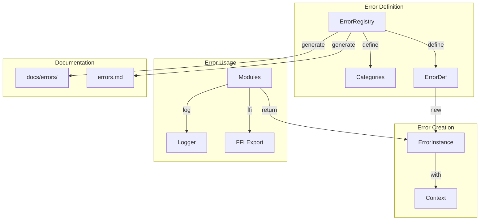

# Design Document

## Overview

This design creates a compile-time error registry using Rust macros. The core innovation is the `define_error!` macro that generates error types, codes, and documentation from a single source. All errors flow through the `ErrorRegistry` for consistency and traceability.

## Steering Document Alignment

### Technical Standards (tech.md)
- **Custom Exception Hierarchy**: ErrorCode enum with categories
- **Error Codes**: KRX-XXXX format for all errors
- **Structured Logging**: JSON format with error codes

### Project Structure (structure.md)
- Registry in `core/src/errors/`
- Domain errors in their modules
- Documentation generated to `docs/errors/`

## Code Reuse Analysis

### Existing Components to Leverage
- **thiserror**: Error derive macros
- **anyhow**: Error context and chaining
- **serde**: Error serialization

### Integration Points
- **All modules**: Use registry errors
- **FFI**: Export error codes
- **Flutter**: Display localized messages

## Architecture



### Modular Design Principles
- **Single Source of Truth**: Registry defines all errors
- **Compile-Time Safety**: Invalid codes caught at build
- **Auto-Documentation**: Docs generated from registry
- **Structured Output**: JSON logs with full context

## Components and Interfaces

### Component 1: ErrorCode

- **Purpose:** Unique error identifier with category
- **Interfaces:**
  ```rust
  #[derive(Debug, Clone, Copy, PartialEq, Eq, Hash)]
  pub struct ErrorCode {
      category: ErrorCategory,
      number: u16,
  }

  impl ErrorCode {
      pub const fn new(category: ErrorCategory, number: u16) -> Self;
      pub fn as_string(&self) -> String; // "KRX-1001"
      pub fn category(&self) -> ErrorCategory;
      pub fn number(&self) -> u16;
  }

  impl std::fmt::Display for ErrorCode {
      fn fmt(&self, f: &mut std::fmt::Formatter) -> std::fmt::Result {
          write!(f, "KRX-{}{:03}", self.category.prefix(), self.number)
      }
  }

  #[derive(Debug, Clone, Copy, PartialEq, Eq, Hash)]
  pub enum ErrorCategory {
      Config,      // C - 1xxx
      Runtime,     // R - 2xxx
      Driver,      // D - 3xxx
      Validation,  // V - 4xxx
      Ffi,         // F - 5xxx
      Internal,    // I - 9xxx
  }
  ```
- **Dependencies:** None
- **Reuses:** Standard patterns

### Component 2: ErrorDef

- **Purpose:** Error definition with message template
- **Interfaces:**
  ```rust
  pub struct ErrorDef {
      pub code: ErrorCode,
      pub message_template: &'static str,
      pub hint: Option<&'static str>,
      pub severity: ErrorSeverity,
      pub doc_link: Option<&'static str>,
  }

  #[derive(Debug, Clone, Copy)]
  pub enum ErrorSeverity {
      Fatal,
      Error,
      Warning,
      Info,
  }

  impl ErrorDef {
      pub fn format(&self, args: &[(&str, &str)]) -> String;
      pub fn with_context<C: std::fmt::Display>(self, context: C) -> KeyrxError;
  }
  ```
- **Dependencies:** ErrorCode
- **Reuses:** Template string pattern

### Component 3: KeyrxError

- **Purpose:** Runtime error instance with context
- **Interfaces:**
  ```rust
  #[derive(Debug, thiserror::Error)]
  pub struct KeyrxError {
      def: &'static ErrorDef,
      message: String,
      context: Option<String>,
      source: Option<Box<dyn std::error::Error + Send + Sync>>,
  }

  impl KeyrxError {
      pub fn code(&self) -> ErrorCode;
      pub fn message(&self) -> &str;
      pub fn hint(&self) -> Option<&str>;
      pub fn with_source<E: std::error::Error + Send + Sync + 'static>(self, e: E) -> Self;
      pub fn to_json(&self) -> serde_json::Value;
  }

  impl std::fmt::Display for KeyrxError {
      fn fmt(&self, f: &mut std::fmt::Formatter) -> std::fmt::Result {
          write!(f, "[{}] {}", self.code(), self.message)
      }
  }
  ```
- **Dependencies:** ErrorDef, thiserror, serde
- **Reuses:** Error handling patterns

### Component 4: ErrorRegistry

- **Purpose:** Central registry of all error definitions
- **Interfaces:**
  ```rust
  pub struct ErrorRegistry {
      errors: HashMap<ErrorCode, &'static ErrorDef>,
  }

  impl ErrorRegistry {
      pub fn global() -> &'static Self;
      pub fn get(&self, code: ErrorCode) -> Option<&'static ErrorDef>;
      pub fn by_category(&self, cat: ErrorCategory) -> Vec<&'static ErrorDef>;
      pub fn all(&self) -> impl Iterator<Item = &'static ErrorDef>;
  }

  // Macro for defining errors
  macro_rules! define_errors {
      (
          $category:ident {
              $(
                  $name:ident = $num:literal {
                      message: $msg:literal,
                      $(hint: $hint:literal,)?
                      severity: $sev:ident,
                  }
              ),* $(,)?
          }
      ) => { ... };
  }
  ```
- **Dependencies:** ErrorCode, ErrorDef
- **Reuses:** Static registry pattern

### Component 5: Error Macros

- **Purpose:** Convenient error creation
- **Interfaces:**
  ```rust
  // Create error with code
  macro_rules! keyrx_err {
      ($code:expr) => { ... };
      ($code:expr, $($key:ident = $val:expr),*) => { ... };
  }

  // Create error and return early
  macro_rules! bail_keyrx {
      ($code:expr) => { return Err(keyrx_err!($code)); };
      ($code:expr, $($args:tt)*) => { return Err(keyrx_err!($code, $($args)*)); };
  }

  // Ensure condition or error
  macro_rules! ensure_keyrx {
      ($cond:expr, $code:expr) => {
          if !$cond { bail_keyrx!($code); }
      };
  }
  ```
- **Dependencies:** ErrorRegistry
- **Reuses:** anyhow macro patterns

### Component 6: Documentation Generator

- **Purpose:** Generate error documentation from registry
- **Interfaces:**
  ```rust
  pub struct ErrorDocGenerator {
      registry: &'static ErrorRegistry,
  }

  impl ErrorDocGenerator {
      pub fn generate_markdown(&self) -> String;
      pub fn generate_by_category(&self, cat: ErrorCategory) -> String;
      pub fn write_to_file(&self, path: &Path) -> io::Result<()>;
  }
  ```
- **Dependencies:** ErrorRegistry
- **Reuses:** Documentation patterns

## Data Models

### LogEntry
```rust
#[derive(Serialize)]
pub struct ErrorLogEntry {
    pub timestamp: String,
    pub level: &'static str,
    pub code: String,
    pub message: String,
    pub context: Option<String>,
    pub hint: Option<String>,
    pub source: Option<String>,
}
```

### FfiError
```rust
#[repr(C)]
pub struct FfiError {
    pub code: *const c_char,
    pub message: *const c_char,
    pub hint: *const c_char,
}
```

## Error Handling

### Error Scenarios

1. **Duplicate error code**
   - **Handling:** Compile-time error via macro
   - **User Impact:** None - caught in development

2. **Missing error definition**
   - **Handling:** Return Internal error with original code
   - **User Impact:** Generic error with tracking

3. **Template format failure**
   - **Handling:** Return raw template with warning
   - **User Impact:** Less pretty message

## Testing Strategy

### Unit Testing
- Test error code formatting
- Test message templating
- Test serialization

### Compile-Time Testing
- Verify duplicate detection
- Test macro expansion
- Verify doc generation

### Integration Testing
- Test error propagation
- Test FFI export
- Test logging output
