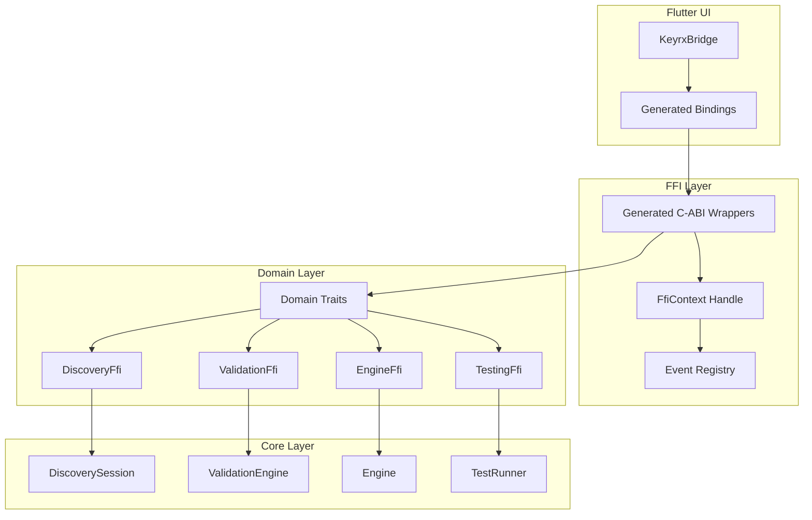

# Design Document

## Overview

This design introduces a trait-based FFI architecture that replaces the current 10 export modules with a unified, auto-generated system. The core innovation is the `FfiExportable` trait that domain modules implement, with procedural macros generating C-ABI wrappers, callback management, and Dart bindings automatically.

## Steering Document Alignment

### Technical Standards (tech.md)
- **No Global State**: Replaces `OnceLock<Mutex<...>>` singletons with handle-based state management
- **Dependency Injection**: FFI context is injectable for testing
- **Trait-based OS Abstraction**: Extends pattern to FFI layer with `FfiExportable` trait

### Project Structure (structure.md)
- FFI code remains in `core/src/ffi/` but reorganized by domain
- New `core/src/ffi/macros/` for procedural macros
- Dart bindings in `ui/lib/ffi/generated/`

## Code Reuse Analysis

### Existing Components to Leverage
- **`CallbackRegistry`** (`ffi/callbacks.rs`): Refactor to generic event-based system
- **`keyrx_free_string`** (`ffi/exports.rs`): Keep as shared utility
- **JSON serialization patterns**: Standardize across all exports

### Integration Points
- **Discovery module**: First migration candidate (well-tested, self-contained)
- **Validation module**: Benefits from new callback system
- **Flutter KeyrxBridge**: Will consume generated Dart bindings

## Architecture

The new architecture separates concerns into layers:



### Modular Design Principles
- **Single File Responsibility**: Each domain has one `*_ffi.rs` implementing its trait
- **Component Isolation**: Domain FFI modules don't import each other
- **Service Layer Separation**: FFI (boundary) → Domain Trait (contract) → Core (logic)
- **Utility Modularity**: Shared utilities in `ffi/common.rs`

## Components and Interfaces

### Component 1: FfiExportable Trait

- **Purpose:** Define contract for FFI-exportable domain modules
- **Interfaces:**
  ```rust
  pub trait FfiExportable {
      /// Domain name for namespacing (e.g., "discovery", "validation")
      const DOMAIN: &'static str;

      /// Initialize domain state within context
      fn init(ctx: &mut FfiContext) -> Result<(), FfiError>;

      /// Clean up domain state
      fn cleanup(ctx: &mut FfiContext);
  }

  /// Attribute macro for FFI methods
  #[ffi_export]
  fn start_discovery(&self, device_id: &str, rows: u8, cols: &[u8]) -> Result<StartResult, FfiError>;
  ```
- **Dependencies:** None (trait definition only)
- **Reuses:** Patterns from existing `InputSource` trait

### Component 2: FfiContext

- **Purpose:** Hold all FFI state per-instance, replacing global statics
- **Interfaces:**
  ```rust
  pub struct FfiContext {
      handle: u64,
      event_registry: EventRegistry,
      domains: HashMap<&'static str, Box<dyn Any + Send>>,
  }

  impl FfiContext {
      pub fn new() -> Self;
      pub fn register_callback(&mut self, event: EventType, cb: EventCallback);
      pub fn emit_event(&self, event: EventType, payload: &impl Serialize);
      pub fn get_domain<T: 'static>(&self) -> Option<&T>;
      pub fn get_domain_mut<T: 'static>(&mut self) -> Option<&mut T>;
  }
  ```
- **Dependencies:** `serde`, `serde_json`
- **Reuses:** Callback invocation pattern from `CallbackRegistry`

### Component 3: EventRegistry

- **Purpose:** Unified callback management replacing per-domain callback functions
- **Interfaces:**
  ```rust
  #[derive(Clone, Copy, PartialEq, Eq, Hash)]
  pub enum EventType {
      // Discovery events
      DiscoveryProgress,
      DiscoveryDuplicate,
      DiscoverySummary,
      // Validation events
      ValidationProgress,
      ValidationComplete,
      // Engine events
      EngineStateChange,
      EngineError,
      // ... extensible
  }

  pub type EventCallback = extern "C" fn(*const u8, usize);

  impl EventRegistry {
      pub fn register(&mut self, event: EventType, cb: Option<EventCallback>);
      pub fn invoke(&self, event: EventType, payload: &[u8]);
      pub fn has_callback(&self, event: EventType) -> bool;
  }
  ```
- **Dependencies:** None
- **Reuses:** Callback pattern from `callbacks.rs`

### Component 4: Procedural Macro `#[ffi_export]`

- **Purpose:** Generate C-ABI wrapper, error handling, and JSON serialization
- **Interfaces:**
  ```rust
  // Input (developer writes):
  #[ffi_export]
  impl DiscoveryFfi {
      pub fn start(&mut self, device_id: &str, rows: u8, cols: Vec<u8>) -> Result<StartResult, FfiError> {
          // domain logic
      }
  }

  // Output (macro generates):
  #[no_mangle]
  pub unsafe extern "C" fn keyrx_discovery_start(
      ctx: *mut FfiContext,
      device_id: *const c_char,
      rows: u8,
      cols_json: *const c_char,
  ) -> *mut c_char {
      // null checks, UTF-8 validation, JSON parsing
      // call domain method
      // serialize result to JSON
      // return "ok:{...}" or "error:{...}"
  }
  ```
- **Dependencies:** `syn`, `quote`, `proc-macro2`
- **Reuses:** Error handling patterns from existing exports

### Component 5: Dart Binding Generator

- **Purpose:** Generate type-safe Dart FFI bindings from Rust exports
- **Interfaces:**
  ```dart
  // Generated: ui/lib/ffi/generated/discovery_bindings.dart
  class DiscoveryBindings {
    final DynamicLibrary _lib;

    late final Pointer<Utf8> Function(
      Pointer<FfiContext>,
      Pointer<Utf8>,
      int,
      Pointer<Utf8>,
    ) _start;

    Future<StartResult> start(String deviceId, int rows, List<int> cols) async {
      final result = _start(_ctx, deviceId.toNativeUtf8(), rows, jsonEncode(cols).toNativeUtf8());
      return _parseResult<StartResult>(result);
    }
  }
  ```
- **Dependencies:** `ffigen` (or custom generator)
- **Reuses:** Patterns from existing `KeyrxBridge`

## Data Models

### FfiError
```rust
#[derive(Serialize)]
pub struct FfiError {
    pub code: String,        // e.g., "INVALID_UTF8", "DEVICE_NOT_FOUND"
    pub message: String,     // Human-readable message
    pub details: Option<serde_json::Value>,  // Additional context
}

impl FfiError {
    pub fn invalid_input(msg: &str) -> Self;
    pub fn internal(msg: &str) -> Self;
    pub fn not_found(resource: &str) -> Self;
}
```

### FfiResult
```rust
pub type FfiResult<T> = Result<T, FfiError>;

// Serialization format:
// Success: "ok:{...serialized T...}"
// Error: "error:{code, message, details?}"
```

### EventPayload
```rust
#[derive(Serialize)]
pub struct EventPayload<T: Serialize> {
    pub event_type: String,
    pub timestamp_ms: u64,
    pub data: T,
}
```

## Error Handling

### Error Scenarios

1. **Null pointer input**
   - **Handling:** Return `error:{code: "NULL_POINTER", message: "..."}`
   - **User Impact:** Flutter receives parseable error, displays friendly message

2. **Invalid UTF-8 in string parameter**
   - **Handling:** Return `error:{code: "INVALID_UTF8", message: "parameter X contains invalid UTF-8"}`
   - **User Impact:** Developer sees which parameter failed

3. **Domain operation failure**
   - **Handling:** Domain returns `FfiError`, wrapper serializes it
   - **User Impact:** Specific error (e.g., "device not found") displayed

4. **Panic in domain code**
   - **Handling:** `catch_unwind` in wrapper, convert to `error:{code: "INTERNAL_ERROR"}`
   - **User Impact:** App doesn't crash, error logged for debugging

## Testing Strategy

### Unit Testing
- Test each domain's `FfiExportable` implementation in isolation
- Mock `FfiContext` to verify state management
- Test error handling paths with invalid inputs

### Integration Testing
- Test full FFI round-trip: Dart → C-ABI → Rust → C-ABI → Dart
- Verify callback invocation with real payloads
- Test context lifecycle (create, use, dispose)

### Property Testing
- Fuzz FFI inputs with proptest
- Verify no panics escape FFI boundary
- Test JSON serialization round-trips

### Parallel Test Safety
- Each test creates isolated `FfiContext`
- No global state accessed
- Tests run with `cargo nextest` for true parallelism
