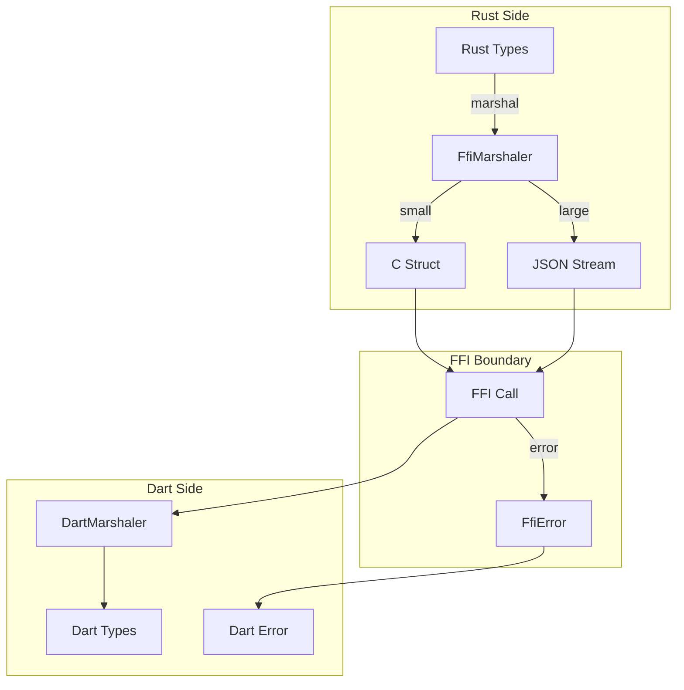

# Design Document

## Overview

This design creates a unified FFI marshaling layer using the `FfiMarshaler` trait and procedural macros for automatic implementation. The core innovation is a two-tier system: fast C-compatible structs for small/frequent data, and JSON streaming for large/complex data. All error handling flows through `FfiResult<T>`.

## Steering Document Alignment

### Technical Standards (tech.md)
- **Clear Interfaces**: Unified marshaling trait
- **Performance**: Zero-copy where possible
- **Error Handling**: Consistent FFI error propagation

### Project Structure (structure.md)
- Marshaling in `core/src/ffi/marshal/`
- Traits in `core/src/ffi/marshal/traits.rs`
- Implementations in `core/src/ffi/marshal/impls/`

## Code Reuse Analysis

### Existing Components to Leverage
- **ffi-architecture-overhaul spec**: Builds on this
- **serde**: JSON serialization
- **cbindgen**: C header generation

### Integration Points
- **All FFI exports**: Use marshaling layer
- **Flutter**: Receives marshaled data
- **Error system**: Uses FfiError

## Architecture



### Modular Design Principles
- **Trait-Based**: All marshaling through FfiMarshaler
- **Size-Aware**: Different strategies for different sizes
- **Error-First**: All operations return FfiResult
- **Generated**: Derive macros for common cases

## Components and Interfaces

### Component 1: FfiMarshaler Trait

- **Purpose:** Unified interface for FFI data transfer
- **Interfaces:**
  ```rust
  /// Trait for types that can cross FFI boundary.
  pub trait FfiMarshaler: Sized {
      /// The C-compatible representation.
      type CRepr: CRepr;

      /// Convert to C representation.
      fn to_c(&self) -> FfiResult<Self::CRepr>;

      /// Convert from C representation.
      fn from_c(c: Self::CRepr) -> FfiResult<Self>;

      /// Estimated size for buffer allocation.
      fn estimated_size(&self) -> usize;

      /// Whether to use streaming for this instance.
      fn use_streaming(&self) -> bool {
          self.estimated_size() > STREAMING_THRESHOLD
      }
  }

  /// Marker trait for C-compatible types.
  pub trait CRepr: Copy + Send + 'static {}

  /// Streaming marshaler for large data.
  pub trait FfiStreamMarshaler: Sized {
      type Chunk: CRepr;

      fn chunk_count(&self) -> usize;
      fn get_chunk(&self, index: usize) -> FfiResult<Self::Chunk>;
      fn from_chunks(chunks: &[Self::Chunk]) -> FfiResult<Self>;
  }

  const STREAMING_THRESHOLD: usize = 1024 * 1024; // 1MB
  ```
- **Dependencies:** None
- **Reuses:** Trait patterns

### Component 2: FfiResult Type

- **Purpose:** Result type for FFI operations
- **Interfaces:**
  ```rust
  /// FFI-safe result type.
  #[repr(C)]
  pub struct FfiResult<T: CRepr> {
      success: bool,
      value: MaybeUninit<T>,
      error: FfiErrorPtr,
  }

  impl<T: CRepr> FfiResult<T> {
      pub fn ok(value: T) -> Self;
      pub fn err(error: FfiError) -> Self;

      pub fn is_ok(&self) -> bool;
      pub fn into_result(self) -> Result<T, FfiError>;
  }

  /// C-compatible error pointer.
  #[repr(C)]
  pub struct FfiErrorPtr {
      ptr: *const FfiErrorData,
  }

  #[repr(C)]
  pub struct FfiErrorData {
      code: u32,
      message: *const c_char,
      hint: *const c_char,
      context: *const c_char,
  }
  ```
- **Dependencies:** FfiError
- **Reuses:** Result patterns

### Component 3: FfiError

- **Purpose:** FFI-safe error type
- **Interfaces:**
  ```rust
  /// Error type for FFI boundary.
  #[derive(Debug)]
  pub struct FfiError {
      code: u32,
      message: String,
      hint: Option<String>,
      context: Option<String>,
  }

  impl FfiError {
      pub fn new(code: u32, message: impl Into<String>) -> Self;
      pub fn with_hint(self, hint: impl Into<String>) -> Self;
      pub fn with_context(self, context: impl Into<String>) -> Self;

      /// Convert to C representation (allocates).
      pub fn to_c(&self) -> FfiErrorData;

      /// Free C representation.
      pub unsafe fn free_c(data: FfiErrorData);

      /// Create from any error.
      pub fn from_error<E: std::error::Error>(e: E) -> Self;
  }

  impl From<CriticalError> for FfiError {
      fn from(e: CriticalError) -> Self { ... }
  }

  impl From<anyhow::Error> for FfiError {
      fn from(e: anyhow::Error) -> Self { ... }
  }
  ```
- **Dependencies:** error-code-registry (if available)
- **Reuses:** Error conversion patterns

### Component 4: Common Marshalers

- **Purpose:** Pre-built marshalers for common types
- **Interfaces:**
  ```rust
  // Primitive types - direct C repr
  impl FfiMarshaler for u8 { type CRepr = u8; ... }
  impl FfiMarshaler for u16 { type CRepr = u16; ... }
  impl FfiMarshaler for u32 { type CRepr = u32; ... }
  impl FfiMarshaler for u64 { type CRepr = u64; ... }
  impl FfiMarshaler for bool { type CRepr = u8; ... }

  // Strings - null-terminated C strings
  impl FfiMarshaler for String {
      type CRepr = *const c_char;
      ...
  }

  // Arrays - length-prefixed
  impl<T: FfiMarshaler> FfiMarshaler for Vec<T>
  where
      T::CRepr: CRepr,
  {
      type CRepr = FfiArray<T::CRepr>;
      ...
  }

  #[repr(C)]
  pub struct FfiArray<T: CRepr> {
      data: *const T,
      len: usize,
      capacity: usize,
  }

  // JSON fallback for complex types
  impl<T: Serialize + DeserializeOwned> FfiMarshaler for JsonWrapper<T> {
      type CRepr = *const c_char; // JSON string
      ...
  }
  ```
- **Dependencies:** serde
- **Reuses:** Type conversion patterns

### Component 5: Derive Macro

- **Purpose:** Auto-generate FfiMarshaler implementations
- **Interfaces:**
  ```rust
  /// Derive FfiMarshaler for structs.
  ///
  /// # Example
  /// ```rust
  /// #[derive(FfiMarshaler)]
  /// #[ffi(strategy = "json")] // or "c_struct" or "auto"
  /// pub struct KeyEvent {
  ///     pub key: KeyCode,
  ///     pub pressed: bool,
  ///     pub timestamp: u64,
  /// }
  /// ```
  #[proc_macro_derive(FfiMarshaler, attributes(ffi))]
  pub fn derive_ffi_marshaler(input: TokenStream) -> TokenStream;
  ```
- **Dependencies:** proc-macro2, syn, quote
- **Reuses:** Derive macro patterns

### Component 6: Callback Registry

- **Purpose:** Unified callback management
- **Interfaces:**
  ```rust
  /// Registry for FFI callbacks.
  pub struct CallbackRegistry {
      callbacks: DashMap<CallbackId, Box<dyn FfiCallback>>,
      next_id: AtomicU64,
  }

  pub trait FfiCallback: Send + Sync {
      fn invoke(&self, data: &[u8]) -> FfiResult<()>;
      fn callback_type(&self) -> &'static str;
  }

  impl CallbackRegistry {
      pub fn global() -> &'static Self;

      /// Register a callback, returns ID.
      pub fn register<C: FfiCallback + 'static>(&self, callback: C) -> CallbackId;

      /// Unregister a callback.
      pub fn unregister(&self, id: CallbackId) -> bool;

      /// Invoke callback by ID.
      pub fn invoke(&self, id: CallbackId, data: &[u8]) -> FfiResult<()>;
  }

  #[derive(Debug, Clone, Copy, PartialEq, Eq, Hash)]
  pub struct CallbackId(u64);
  ```
- **Dependencies:** dashmap
- **Reuses:** Registry patterns

## Data Models

### FfiArray
```rust
#[repr(C)]
pub struct FfiArray<T: CRepr> {
    pub data: *const T,
    pub len: usize,
    pub capacity: usize,
}

impl<T: CRepr> FfiArray<T> {
    pub fn from_vec(v: Vec<T>) -> Self;
    pub unsafe fn into_vec(self) -> Vec<T>;
    pub unsafe fn free(self);
}
```

### FfiString
```rust
#[repr(C)]
pub struct FfiString {
    pub data: *const c_char,
    pub len: usize,
}

impl FfiString {
    pub fn from_str(s: &str) -> Self;
    pub unsafe fn to_string(&self) -> String;
    pub unsafe fn free(self);
}
```

## Error Handling

### Error Scenarios

1. **Marshaling fails**
   - **Handling:** Return FfiResult::err with details
   - **User Impact:** Flutter receives error

2. **Memory allocation fails**
   - **Handling:** Return null pointer with error
   - **User Impact:** Graceful failure

3. **Invalid callback ID**
   - **Handling:** Return error, log warning
   - **User Impact:** Callback silently fails

## Testing Strategy

### Unit Testing
- Test each marshaler
- Test round-trip conversion
- Test error propagation

### Integration Testing
- Test FFI boundary crossing
- Test callback invocation
- Test large data streaming

### Memory Testing
- Verify no leaks
- Test allocation failure
- Verify proper cleanup
