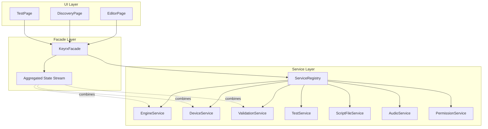

# Design Document

## Overview

This design introduces `KeyrxFacade`, a unified service interface that wraps the 19 existing services behind a cohesive API. The facade coordinates multi-step operations, aggregates state streams, and simplifies testing by providing a single mock target. It coexists with `ServiceRegistry` for backward compatibility.

## Steering Document Alignment

### Technical Standards (tech.md)
- **Dependency Injection**: Facade accepts `ServiceRegistry` as constructor dependency
- **No Global State**: Facade is an instance, not a singleton
- **CLI First, GUI Later**: Facade operations mirror CLI commands for consistency

### Project Structure (structure.md)
- New files in `ui/lib/services/facade/`
- Interface in `keyrx_facade.dart`, implementation in `keyrx_facade_impl.dart`
- Mock in `ui/test/mocks/mock_keyrx_facade.dart`

## Code Reuse Analysis

### Existing Components to Leverage
- **`ServiceRegistry`**: Provides all underlying services
- **`ErrorTranslator`**: Reused for error message translation
- **`EngineService`/`DeviceService`**: Core services wrapped by facade

### Integration Points
- **`EditorPage`**: First migration candidate (uses 7+ services)
- **Provider/State management**: Facade exposed via Provider for widget tree
- **Existing tests**: Can gradually migrate to facade mocks

## Architecture



### Modular Design Principles
- **Single File Responsibility**: `keyrx_facade.dart` (interface), `keyrx_facade_impl.dart` (impl), `facade_state.dart` (state models)
- **Component Isolation**: Facade doesn't expose internal service instances
- **Service Layer Separation**: Facade (coordination) → Services (domain) → FFI (boundary)
- **Utility Modularity**: Shared error handling in `facade_error.dart`

## Components and Interfaces

### Component 1: KeyrxFacade Interface

- **Purpose:** Define the unified API contract for all KeyRx operations
- **Interfaces:**
  ```dart
  abstract class KeyrxFacade {
    // === Factories ===
    factory KeyrxFacade.real(ServiceRegistry registry) = KeyrxFacadeImpl;
    factory KeyrxFacade.mock() = MockKeyrxFacade;

    // === State ===
    Stream<FacadeState> get stateStream;
    FacadeState get currentState;

    // === Engine Operations ===
    Future<Result<void>> startEngine(String scriptPath);
    Future<Result<void>> stopEngine();
    Future<Result<EngineStatus>> getEngineStatus();

    // === Script Operations ===
    Future<Result<ValidationResult>> validateScript(String content);
    Future<Result<String>> loadScript(String path);
    Future<Result<void>> saveScript(String path, String content);

    // === Device Operations ===
    Future<Result<List<DeviceInfo>>> listDevices();
    Future<Result<void>> startDiscovery(DeviceInfo device, LayoutConfig layout);
    Future<Result<void>> cancelDiscovery();

    // === Testing Operations ===
    Future<Result<TestResults>> runTests(String scriptPath);
    Future<Result<void>> cancelTests();

    // === Lifecycle ===
    Future<void> dispose();

    // === Advanced Access ===
    ServiceRegistry get services;  // Escape hatch for rare cases
  }
  ```
- **Dependencies:** `ServiceRegistry`, `rxdart` (for stream combining)
- **Reuses:** Service method signatures

### Component 2: FacadeState

- **Purpose:** Aggregated state combining engine, device, and validation status
- **Interfaces:**
  ```dart
  @freezed
  class FacadeState with _$FacadeState {
    const factory FacadeState({
      required EngineStatus engineStatus,
      required DeviceStatus deviceStatus,
      required ValidationStatus validationStatus,
      required DiscoveryStatus discoveryStatus,
      String? activeScriptPath,
      String? lastError,
    }) = _FacadeState;

    factory FacadeState.initial() => FacadeState(
      engineStatus: EngineStatus.stopped,
      deviceStatus: DeviceStatus.disconnected,
      validationStatus: ValidationStatus.none,
      discoveryStatus: DiscoveryStatus.idle,
    );
  }

  enum EngineStatus { stopped, starting, running, stopping, error }
  enum DeviceStatus { disconnected, connecting, connected, error }
  enum ValidationStatus { none, validating, valid, invalid }
  enum DiscoveryStatus { idle, inProgress, completed, cancelled }
  ```
- **Dependencies:** `freezed` for immutable state
- **Reuses:** Status enums from existing services

### Component 3: KeyrxFacadeImpl

- **Purpose:** Concrete implementation coordinating services
- **Interfaces:**
  ```dart
  class KeyrxFacadeImpl implements KeyrxFacade {
    KeyrxFacadeImpl(this._registry) {
      _initStateStream();
    }

    final ServiceRegistry _registry;
    final _stateController = BehaviorSubject<FacadeState>.seeded(FacadeState.initial());

    @override
    Future<Result<void>> startEngine(String scriptPath) async {
      _updateState((s) => s.copyWith(engineStatus: EngineStatus.starting));

      // Step 1: Validate script
      final validation = await validateScript(await loadScript(scriptPath));
      if (validation.isError) {
        _updateState((s) => s.copyWith(engineStatus: EngineStatus.error));
        return Result.error(validation.error);
      }

      // Step 2: Start engine
      try {
        await _registry.engineService.start(scriptPath);
        _updateState((s) => s.copyWith(
          engineStatus: EngineStatus.running,
          activeScriptPath: scriptPath,
        ));
        return Result.ok(null);
      } catch (e) {
        _updateState((s) => s.copyWith(
          engineStatus: EngineStatus.error,
          lastError: _registry.errorTranslator.translate(e),
        ));
        return Result.error(FacadeError.fromException(e));
      }
    }
  }
  ```
- **Dependencies:** `ServiceRegistry`, `rxdart`
- **Reuses:** All existing service implementations

### Component 4: Result Type

- **Purpose:** Explicit success/failure without exceptions
- **Interfaces:**
  ```dart
  @freezed
  sealed class Result<T> with _$Result<T> {
    const factory Result.ok(T value) = Ok<T>;
    const factory Result.error(FacadeError error) = Err<T>;
  }

  extension ResultExtension<T> on Result<T> {
    bool get isOk => this is Ok<T>;
    bool get isError => this is Err<T>;
    T get value => (this as Ok<T>).value;
    FacadeError get error => (this as Err<T>).error;

    Result<U> map<U>(U Function(T) f);
    Future<Result<U>> flatMap<U>(Future<Result<U>> Function(T) f);
  }
  ```
- **Dependencies:** `freezed`
- **Reuses:** Pattern from Rust's Result type

### Component 5: FacadeError

- **Purpose:** Structured errors with user-friendly messages
- **Interfaces:**
  ```dart
  @freezed
  class FacadeError with _$FacadeError {
    const factory FacadeError({
      required String code,
      required String message,
      required String userMessage,
      Object? originalError,
      StackTrace? stackTrace,
    }) = _FacadeError;

    factory FacadeError.validation(List<ValidationIssue> issues) => FacadeError(
      code: 'VALIDATION_FAILED',
      message: 'Script validation failed with ${issues.length} issues',
      userMessage: 'Your script has errors. Please fix them before running.',
    );

    factory FacadeError.deviceNotFound(String deviceId) => FacadeError(
      code: 'DEVICE_NOT_FOUND',
      message: 'Device $deviceId not found',
      userMessage: 'The selected keyboard was disconnected. Please reconnect it.',
    );

    factory FacadeError.fromException(Object e) => /* translate using ErrorTranslator */;
  }
  ```
- **Dependencies:** `freezed`, `ErrorTranslator`
- **Reuses:** Error translation logic from `ErrorTranslatorImpl`

## Data Models

### DeviceInfo
```dart
@freezed
class DeviceInfo with _$DeviceInfo {
  const factory DeviceInfo({
    required String id,           // "vendorId:productId"
    required String name,
    required String path,
    required int vendorId,
    required int productId,
    bool? hasProfile,
  }) = _DeviceInfo;
}
```

### LayoutConfig
```dart
@freezed
class LayoutConfig with _$LayoutConfig {
  const factory LayoutConfig({
    required int rows,
    required List<int> colsPerRow,
  }) = _LayoutConfig;
}
```

### ValidationResult
```dart
@freezed
class ValidationResult with _$ValidationResult {
  const factory ValidationResult({
    required bool isValid,
    required List<ValidationIssue> errors,
    required List<ValidationIssue> warnings,
    List<String>? suggestions,
  }) = _ValidationResult;
}
```

## Error Handling

### Error Scenarios

1. **Engine start with invalid script**
   - **Handling:** Validate first, return `Result.error` with validation issues
   - **User Impact:** UI shows specific validation errors with line numbers

2. **Device disconnection during discovery**
   - **Handling:** Cancel discovery, emit state change, return error
   - **User Impact:** "Device disconnected" message with reconnect option

3. **Concurrent operation conflict**
   - **Handling:** Queue or reject with `OPERATION_IN_PROGRESS` error
   - **User Impact:** Button disabled or "Please wait" message

4. **Service disposal during operation**
   - **Handling:** Cancel pending operations, clean up state
   - **User Impact:** Graceful shutdown, no crashes

## Testing Strategy

### Unit Testing
- Mock `ServiceRegistry` to test facade coordination logic
- Verify state transitions for each operation
- Test error translation and Result wrapping

### Integration Testing
- Use real `ServiceRegistry` with mock FFI bridge
- Test full operation flows (start → stop, validate → run)
- Verify state stream emissions

### Widget Testing
- Inject `MockKeyrxFacade` into widget tests
- Stub specific methods as needed
- Test UI response to facade state changes

### Backward Compatibility Testing
- Verify pages work with both facade and direct service access
- Test gradual migration scenario
- Ensure no state conflicts between access methods
