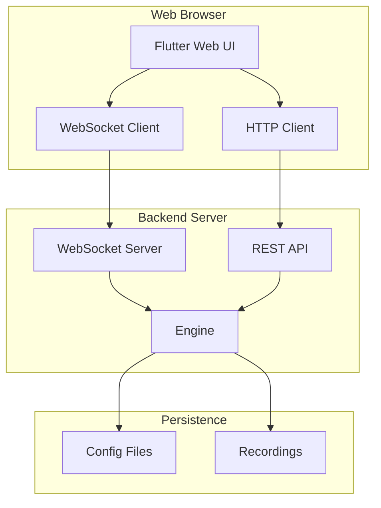

# Design Document

## Overview

This design enables Flutter web builds with a REST/WebSocket backend replacing the C-ABI FFI. The backend runs as a local HTTP server or remote service, with the web UI communicating via standard web protocols.

## Architecture



## Components and Interfaces

### Component 1: HTTP API

```rust
pub struct WebServer {
    engine: Arc<Mutex<Engine>>,
    config: WebConfig,
}

// REST Endpoints
// GET  /api/state         - Current engine state
// POST /api/config        - Update configuration
// GET  /api/recordings    - List recordings
// GET  /api/recordings/:id - Get recording
// POST /api/validate      - Validate script
// POST /api/session/start - Start session
// POST /api/session/stop  - Stop session
```

### Component 2: WebSocket Protocol

```rust
pub enum WsMessage {
    // Server -> Client
    StateUpdate(EngineState),
    KeyEvent(KeyEventInfo),
    ValidationResult(ValidationResult),

    // Client -> Server
    Subscribe(Vec<Subscription>),
    ExecuteAction(Action),
    UpdateConfig(ConfigPatch),
}

pub enum Subscription {
    State,
    KeyEvents,
    Metrics,
}
```

### Component 3: Flutter Platform Abstraction

```dart
abstract class EngineBridge {
  Future<EngineState> getState();
  Stream<KeyEvent> keyEvents();
  Future<void> updateConfig(Config config);
}

class FfiBridge implements EngineBridge { /* Desktop */ }
class WebBridge implements EngineBridge { /* Web via HTTP/WS */ }
```

## Testing Strategy

- Unit tests for API endpoints
- Integration tests for WebSocket communication
- E2E tests with Playwright for web UI
