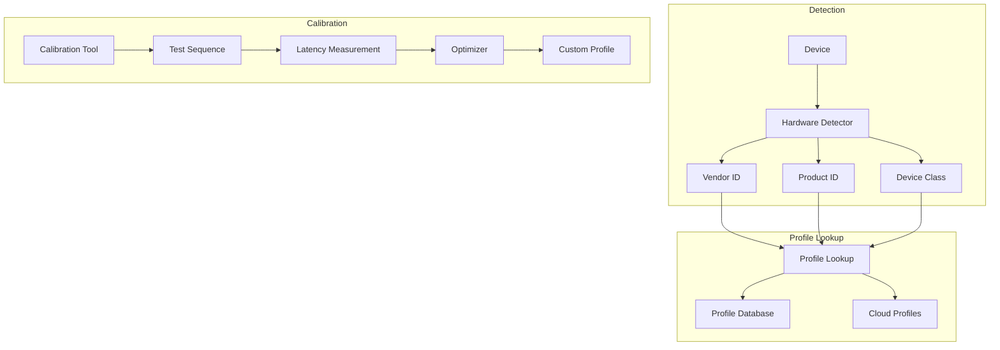

# Design Document

## Overview

This design adds hardware-specific timing profiles with automatic detection, a profile database, and interactive calibration tools. Profiles are keyed by vendor ID and product ID, with fallback to device class.

## Architecture



## Components and Interfaces

### Component 1: HardwareDetector

```rust
pub struct HardwareDetector;

pub struct HardwareInfo {
    pub vendor_id: u16,
    pub product_id: u16,
    pub vendor_name: Option<String>,
    pub product_name: Option<String>,
    pub device_class: DeviceClass,
}

pub enum DeviceClass {
    MechanicalKeyboard,
    MembraneKeyboard,
    LaptopKeyboard,
    VirtualKeyboard,
    Unknown,
}

impl HardwareDetector {
    pub fn detect(device: &Device) -> HardwareInfo;
    pub fn detect_all() -> Vec<HardwareInfo>;
}
```

### Component 2: HardwareProfile

```rust
#[derive(Debug, Clone, Serialize, Deserialize)]
pub struct HardwareProfile {
    pub vendor_id: u16,
    pub product_id: u16,
    pub name: String,
    pub timing: TimingConfig,
    pub source: ProfileSource,
}

pub struct TimingConfig {
    pub debounce_ms: u32,
    pub repeat_delay_ms: u32,
    pub repeat_rate_ms: u32,
    pub scan_interval_us: u32,
}

pub enum ProfileSource {
    Builtin,
    Community,
    Calibrated,
    Custom,
}
```

### Component 3: Calibrator

```rust
pub struct Calibrator {
    config: CalibrationConfig,
}

pub struct CalibrationResult {
    pub measured_latency: Duration,
    pub optimal_timing: TimingConfig,
    pub confidence: f64,
}

impl Calibrator {
    pub fn new(config: CalibrationConfig) -> Self;
    pub async fn run(&self, device: &Device) -> CalibrationResult;
    pub fn compare(&self, before: &TimingConfig, after: &TimingConfig) -> Comparison;
}
```

## Testing Strategy

- Unit tests for hardware detection
- Integration tests for profile application
- User testing for calibration accuracy
