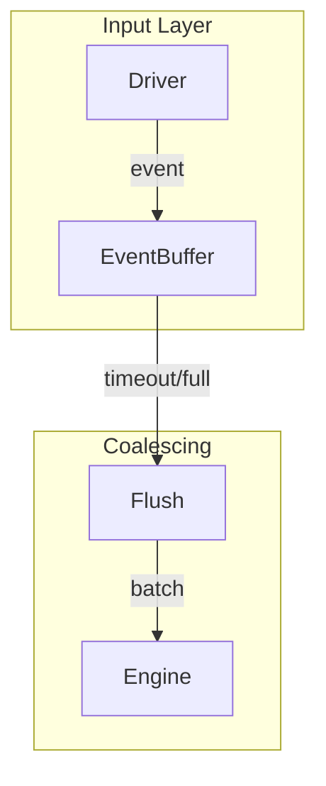

# Design Document

## Overview

This design adds an event coalescing layer between input drivers and the engine. Events are buffered and flushed based on time windows or batch size limits, reducing per-event overhead while preserving timing semantics.

## Architecture



## Components and Interfaces

### Component 1: EventBuffer

```rust
pub struct EventBuffer {
    events: VecDeque<TimestampedEvent>,
    config: CoalescingConfig,
    last_flush: Instant,
}

pub struct CoalescingConfig {
    pub max_batch_size: usize,
    pub flush_timeout: Duration,
    pub coalesce_repeats: bool,
}

impl EventBuffer {
    pub fn push(&mut self, event: InputEvent) -> Option<Vec<InputEvent>>;
    pub fn flush(&mut self) -> Vec<InputEvent>;
    pub fn should_flush(&self) -> bool;
}
```

### Component 2: CoalescingEngine

```rust
pub struct CoalescingEngine<E: Engine> {
    inner: E,
    buffer: EventBuffer,
}

impl<E: Engine> CoalescingEngine<E> {
    pub fn process(&mut self, event: InputEvent) -> Vec<OutputEvent>;
}
```

## Testing Strategy

- Unit tests for coalescing rules
- Benchmark FFI call reduction
- Integration tests for timing preservation
