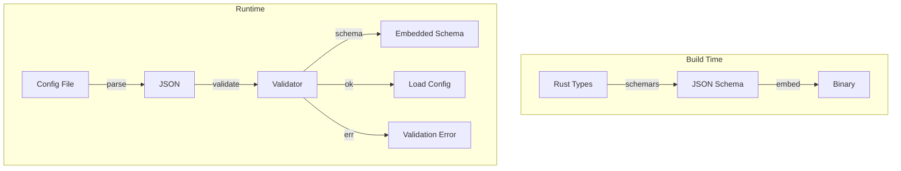

# Design Document

## Overview

This design uses `schemars` to generate JSON Schemas from Rust types and `jsonschema` for validation. Schemas are generated at build time and embedded or written to files. Config loading validates against schemas with clear error messages.

## Architecture



## Components and Interfaces

### Component 1: SchemaRegistry

```rust
pub struct SchemaRegistry {
    schemas: HashMap<&'static str, RootSchema>,
}

impl SchemaRegistry {
    pub fn global() -> &'static Self;
    pub fn get(&self, name: &str) -> Option<&RootSchema>;
    pub fn validate(&self, name: &str, json: &Value) -> Result<(), ValidationErrors>;
}

#[derive(Debug)]
pub struct ValidationErrors {
    pub errors: Vec<ValidationError>,
}

#[derive(Debug)]
pub struct ValidationError {
    pub path: String,
    pub message: String,
    pub expected: String,
    pub actual: String,
}
```

### Component 2: Derive Integration

```rust
use schemars::JsonSchema;

#[derive(Serialize, Deserialize, JsonSchema)]
pub struct DeviceProfile {
    pub name: String,
    pub device_id: String,
    pub layers: Vec<Layer>,
}
```

## Testing Strategy

- Unit tests for schema generation
- Validation tests with invalid configs
- Migration tests for version upgrades
