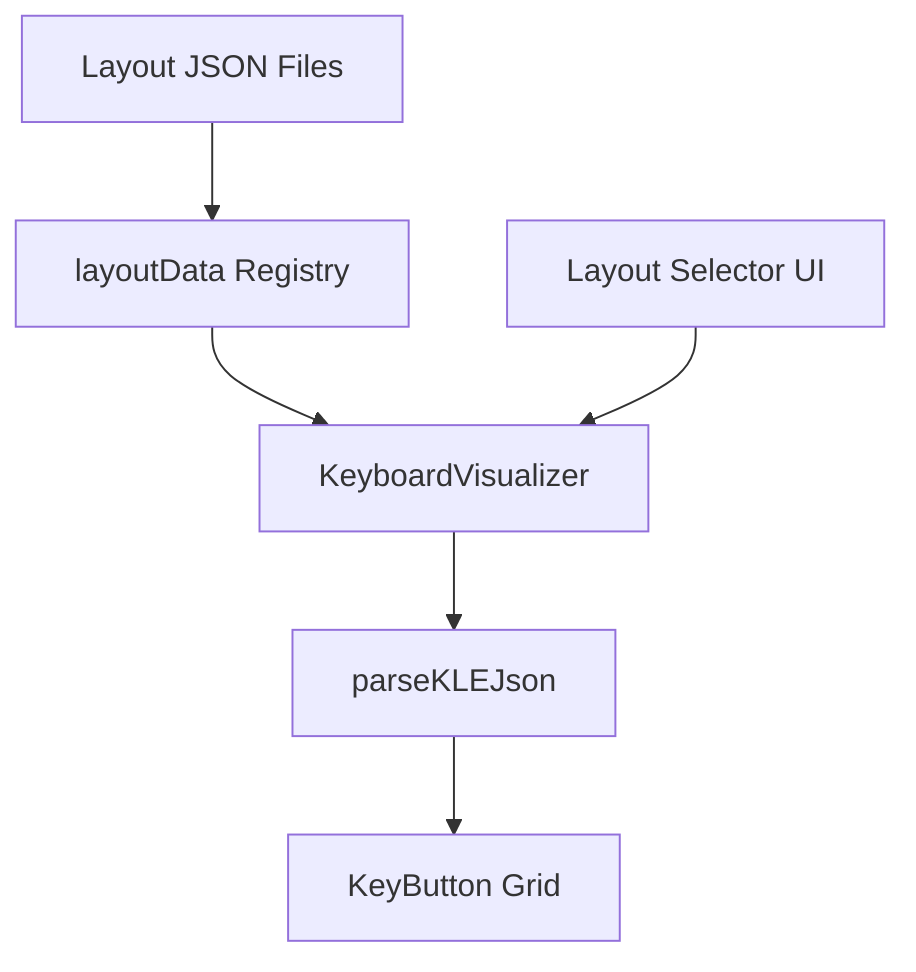

# Design Document

## Overview

This feature implements comprehensive keyboard layout support for the KeyboardVisualizer component. The implementation adds 9 new layout JSON files and updates the existing type system and component to support layout selection.

## Steering Document Alignment

### Technical Standards (tech.md)
- **React 18+ with TypeScript 5+**: All new code follows existing TypeScript patterns
- **JSON data format**: Layout data uses JSON for static configuration (per data storage conventions)
- **Component-based UI**: KeyboardVisualizer remains the single rendering component

### Project Structure (structure.md)
- Layout JSON files placed in `keyrx_ui/src/data/layouts/`
- Type definitions in `keyrx_ui/src/types/`
- Component updates in `keyrx_ui/src/components/`

## Code Reuse Analysis

### Existing Components to Leverage
- **KeyboardVisualizer.tsx**: Primary component for rendering keyboard layouts
- **parseKLEJson**: Existing parser for converting layout JSON to grid positions
- **KeyButton**: Existing key rendering component
- **ANSI_104.json**: Reference implementation for layout JSON structure

### Integration Points
- **layoutData object**: Central registry in KeyboardVisualizer.tsx for layout mapping
- **Layout type union**: TypeScript type defining valid layout names

## Architecture

### Modular Design Principles
- **Single File Responsibility**: Each layout JSON contains data for exactly one keyboard layout
- **Component Isolation**: KeyboardVisualizer handles all layouts via dynamic import
- **Utility Modularity**: parseKLEJson handles all layout formats consistently



## Components and Interfaces

### Layout JSON Schema
- **Purpose:** Define keyboard key positions and metadata
- **Interfaces:**
  ```typescript
  interface LayoutKey {
    code: string;    // QMK-style keycode (KC_A, KC_LSFT)
    label: string;   // Display label
    x: number;       // X position in units
    y: number;       // Y position in units
    w?: number;      // Width in units (default 1)
    h?: number;      // Height in units (default 1)
  }

  interface KeyboardLayout {
    name: string;
    keys: LayoutKey[];
  }
  ```
- **Dependencies:** None (pure JSON)
- **Reuses:** Existing ANSI_104.json structure

### Updated KeyboardVisualizer
- **Purpose:** Render any supported keyboard layout
- **Interfaces:**
  - Props: `layout: LayoutType` (expanded union type)
  - Internal: `layoutData` object with all layout imports
- **Dependencies:** All layout JSON files, parseKLEJson
- **Reuses:** Existing rendering logic, KeyButton component

### Layout Type Definition
- **Purpose:** Type-safe layout selection
- **Interfaces:**
  ```typescript
  type LayoutType =
    | 'ANSI_104' | 'ANSI_87'
    | 'ISO_105' | 'ISO_88'
    | 'JIS_109'
    | 'COMPACT_60' | 'COMPACT_65' | 'COMPACT_75'
    | 'COMPACT_96'
    | 'HHKB'
    | 'NUMPAD';
  ```
- **Dependencies:** None
- **Reuses:** Existing type patterns

## Data Models

### Layout File Structure
```json
{
  "name": "Layout Name",
  "keys": [
    {"code": "KC_ESC", "label": "Esc", "x": 0, "y": 0, "w": 1},
    ...
  ]
}
```

### Layout Categories (for UI grouping)
```typescript
const layoutCategories = {
  fullSize: ['ANSI_104', 'ISO_105', 'JIS_109'],
  tenkeyless: ['ANSI_87', 'ISO_88'],
  compact: ['COMPACT_60', 'COMPACT_65', 'COMPACT_75', 'COMPACT_96'],
  specialized: ['HHKB', 'NUMPAD']
};
```

## Error Handling

### Error Scenarios
1. **Layout JSON not found**
   - **Handling:** Fall back to ANSI_104
   - **User Impact:** User sees default layout with console warning

2. **Invalid layout key data**
   - **Handling:** Skip invalid keys, log error
   - **User Impact:** Layout renders with missing keys, error logged

## Testing Strategy

### Unit Testing
- Validate each layout JSON against schema
- Test parseKLEJson with each layout type
- Test KeyboardVisualizer renders correct key count per layout

### Integration Testing
- Test layout switching in full application context
- Test key mappings persist across layout changes

### End-to-End Testing
- User can select each layout from dropdown
- Each layout displays correct number of keys
- Key clicks work on all layouts
