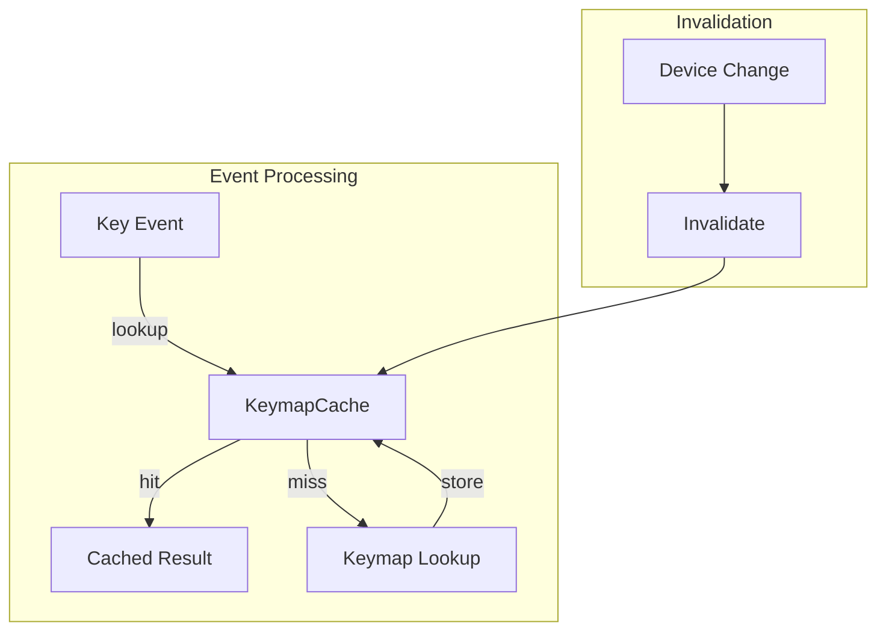

# Design Document

## Overview

This design adds an LRU cache layer for keymap lookups on both Linux and Windows. The core innovation is a platform-agnostic `KeymapCache` trait with platform-specific implementations that cache scan code to key code mappings with automatic invalidation on device changes.

## Steering Document Alignment

### Technical Standards (tech.md)
- **Performance**: O(1) cache lookup
- **Memory Bounded**: Fixed-size LRU cache
- **Platform Abstraction**: Common trait, platform impls

### Project Structure (structure.md)
- Cache in `core/src/drivers/common/cache.rs`
- Linux impl in `core/src/drivers/linux/cache.rs`
- Windows impl in `core/src/drivers/windows/cache.rs`

## Architecture



## Components and Interfaces

### Component 1: KeymapCache Trait

```rust
pub trait KeymapCache: Send + Sync {
    fn get(&self, scan_code: u32, device_id: &str) -> Option<KeyCode>;
    fn insert(&self, scan_code: u32, device_id: &str, key: KeyCode);
    fn invalidate_device(&self, device_id: &str);
    fn clear(&self);
    fn stats(&self) -> CacheStats;
}

#[derive(Debug, Clone)]
pub struct CacheStats {
    pub hits: u64,
    pub misses: u64,
    pub size: usize,
    pub capacity: usize,
}
```

### Component 2: LruKeymapCache

```rust
pub struct LruKeymapCache {
    cache: Mutex<LruCache<(u32, String), KeyCode>>,
    stats: CacheStatsTracker,
}

impl LruKeymapCache {
    pub fn new(capacity: usize) -> Self;
}
```

## Error Handling

- Cache miss: Fall back to direct lookup
- Cache corruption: Clear and rebuild
- Memory pressure: LRU eviction handles automatically

## Testing Strategy

- Unit tests for cache operations
- Benchmark cache hit rate
- Integration tests with device simulation
