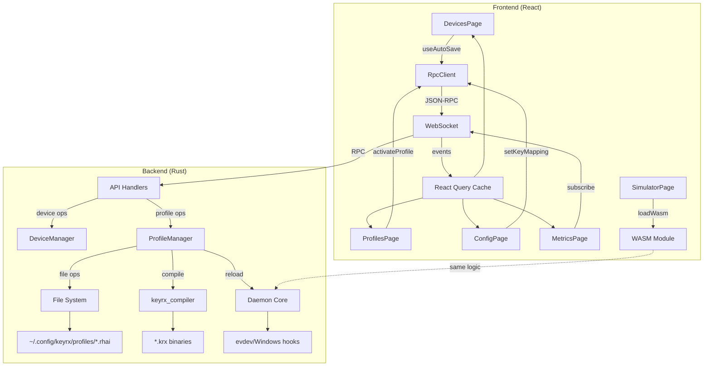

# Design Document

## Overview

This design implements a comprehensive UI/UX refinement for KeyRX web interface, addressing critical usability issues and modernizing the configuration workflow. The design focuses on:

1. **Data Consistency Layer**: Unified React Query cache strategy ensures all UI components display consistent device counts, profile states, and daemon status
2. **Auto-Save Architecture**: Debounced mutation pattern with optimistic updates provides instant feedback while persisting changes to backend
3. **Profile-Config Integration**: Complete lifecycle management connecting UI profiles to .rhai source files, compiled .krx binaries, and daemon runtime state
4. **Visual Configuration Editor**: QMK-inspired drag-and-drop interface with device-scoped key mapping, layer management, and WASM validation
5. **Contextual Navigation**: Flat route structure with query parameter context passing, breadcrumb navigation, and shared state via React Query

The implementation leverages existing RPC infrastructure, WASM validation, and React Query patterns while introducing new visual editor components and enhanced backend APIs.

## Steering Document Alignment

### Technical Standards (tech.md)

**React + WASM Frontend Architecture** (tech.md lines 69-73):
- Reuses existing `useWasm()` hook for validation
- Extends `useUnifiedApi()` RPC client with new methods
- Maintains WASM simulation in SimulatorPage (as designed)

**WebSocket Real-Time Communication** (tech.md lines 314-317):
- Profile activation triggers WebSocket event to update all connected clients
- Device connection/disconnection events propagate to Dashboard and Devices pages
- Daemon state changes reflect in Metrics page header (active profile)

**State Management** (tech.md lines 324-327):
- React Query as single source of truth for server state
- Zustand for WebSocket-driven metrics (already implemented)
- WASM memory for simulator state (already implemented)

**Dependency Injection** (tech.md lines 318-334):
- All new API calls use RpcClient wrapper (type-safe, testable)
- Device layout persistence uses existing `useUnifiedApi()` hook
- WASM validation injected via `WasmProvider` context

**Code Quality** (tech.md lines 389-411):
- Pre-commit hooks enforce clippy, rustfmt, tests (Rust backend)
- Prettier + ESLint for TypeScript frontend (already configured)
- Test coverage: 80% minimum (enforced via CI)

### Project Structure (structure.md)

**Frontend Organization** (structure.md lines 89-107):
```
keyrx_ui/
├── src/
│   ├── pages/              # Existing pages to modify
│   │   ├── DevicesPage.tsx      # Add auto-save layout
│   │   ├── ProfilesPage.tsx     # Add .rhai integration
│   │   ├── ConfigPage.tsx       # Replace with visual editor
│   │   ├── MetricsPage.tsx      # Add active profile header
│   │   └── SimulatorPage.tsx    # Add profile selector
│   ├── components/         # New components
│   │   ├── KeyboardVisualizer/  # Extended for drag-drop
│   │   ├── KeyAssignmentPanel/  # New: key palette
│   │   ├── DeviceScopeToggle/   # New: global vs device-specific
│   │   └── ActiveProfileBadge/  # New: shared component
│   ├── hooks/              # Extended hooks
│   │   ├── useDevices.ts        # New: device management
│   │   ├── useProfileConfig.ts  # New: profile-config integration
│   │   └── useAutoSave.ts       # New: debounced save hook
│   └── api/                # Extended RPC methods
│       ├── rpc.ts               # Add new methods
│       └── profiles.ts          # Add .rhai operations
```

**Backend Organization** (structure.md lines 62-85):
```
keyrx_daemon/
├── src/
│   ├── web/api/
│   │   ├── profiles.rs          # Add .rhai CRUD
│   │   ├── devices.rs           # Add layout persistence
│   │   └── config.rs            # Add key mapping API
│   └── profile_manager.rs       # New: profile-config lifecycle
```

**Naming Conventions** (structure.md lines 109-135):
- React Components: `PascalCase.tsx` (e.g., `KeyAssignmentPanel.tsx`)
- Hooks: `use[Feature].ts` (e.g., `useAutoSave.ts`)
- Rust modules: `snake_case.rs` (e.g., `profile_manager.rs`)
- API endpoints: REST path `/api/profiles/:name/config`

## Code Reuse Analysis

### Existing Components to Leverage

**Frontend (React)**:
- **`useUnifiedApi()` hook** (`src/hooks/useUnifiedApi.ts`): Extend with new RPC methods (`setDeviceLayout`, `getProfileConfig`, `setKeyMapping`)
- **`useWasm()` hook** (`src/hooks/useWasm.ts`): Reuse for config validation in visual editor
- **`RpcClient` class** (`src/api/rpc.ts`): Add new methods for profile-config operations
- **React Query hooks** (`src/lib/queryClient.ts`): Extend query keys for device layouts, profile configs
- **`KeyboardVisualizer` component** (`src/components/KeyboardVisualizer.tsx`): Extend with drag-drop handlers
- **`WasmProvider` context** (`src/contexts/WasmContext.tsx`): Reuse for visual editor validation

**Backend (Rust)**:
- **`axum` RPC handlers** (`keyrx_daemon/src/web/api/*.rs`): Add new endpoints
- **`keyrx_compiler`** (`keyrx_compiler/src/main.rs`): Invoke to compile .rhai → .krx
- **Profile API** (`keyrx_daemon/src/web/api/profiles.rs`): Extend with config file operations

### Integration Points

**React Query Cache Integration**:
- New query keys: `deviceLayout(serial)`, `profileConfig(profile)`, `activeProfile`
- Invalidation strategy: Profile activation invalidates `activeProfile`, `daemonState`, `profileConfig`
- Optimistic updates: Layout changes, key mappings show immediately, rollback on error

**WASM Integration**:
- Config editor: Validate .rhai syntax before saving to file
- Simulator: Load profile's compiled .krx, run simulation with same engine as daemon

**WebSocket Events**:
- `daemon-state` event includes active profile name (backend change)
- `device-connected` / `device-disconnected` events trigger React Query refetch

**File System Integration**:
- Profile CRUD maps to `~/.config/keyrx/profiles/[name].rhai`
- Daemon watches profile directory for changes (future: hot reload)

## Architecture

### Modular Design Principles

**Single File Responsibility**:
- `useAutoSave.ts`: Generic debounced save hook (reusable across pages)
- `KeyAssignmentPanel.tsx`: Key palette only (drag sources)
- `DeviceScopeToggle.tsx`: Global vs device-specific toggle only
- `profile_manager.rs`: Profile lifecycle (create → compile → activate → delete)

**Component Isolation**:
- Visual editor split into 4 components: `KeyboardVisualizer`, `KeyAssignmentPanel`, `DeviceScopeToggle`, `LayerSelector`
- Each component < 300 lines, single responsibility

**Service Layer Separation**:
- Frontend: API calls → RPC client → WebSocket → Backend
- Backend: API handlers → profile_manager → file operations + daemon control

**Utility Modularity**:
- `debounce.ts`: Generic debounce utility (used by auto-save)
- `keyCodeMapping.ts`: Existing key code utilities (reuse for visual editor)

### Architecture Diagram



## Components and Interfaces

### Component 1: Auto-Save Hook (`useAutoSave.ts`)

**Purpose**: Generic debounced auto-save hook for any form input

**Interface**:
```typescript
interface UseAutoSaveOptions<T> {
  saveFn: (data: T) => Promise<void>;
  debounceMs?: number; // Default 500ms
  onSuccess?: () => void;
  onError?: (error: Error) => void;
}

function useAutoSave<T>(options: UseAutoSaveOptions<T>) {
  return {
    save: (data: T) => void;
    isSaving: boolean;
    error: Error | null;
    lastSavedAt: Date | null;
  };
}
```

**Dependencies**: `lodash.debounce` (or custom debounce utility)

**Reuses**: None (new utility)

**Usage Example**:
```typescript
// In DevicesPage
const { save, isSaving } = useAutoSave({
  saveFn: (layout) => rpc.setDeviceLayout(deviceSerial, layout),
  debounceMs: 500,
});

// On layout change
<select onChange={(e) => save(e.target.value)}>
```

### Component 2: Profile Manager Service (`profile_manager.rs`)

**Purpose**: Backend service managing profile lifecycle (create → compile → activate → delete)

**Interface**:
```rust
pub struct ProfileManager {
    config_dir: PathBuf,
    compiler: Arc<Compiler>,
    daemon_control: Arc<DaemonControl>,
}

impl ProfileManager {
    pub async fn create_profile(&self, name: &str, template: Option<&str>) -> Result<Profile>;
    pub async fn activate_profile(&self, name: &str) -> Result<()>;
    pub async fn delete_profile(&self, name: &str) -> Result<()>;
    pub async fn get_profile_config(&self, name: &str) -> Result<String>; // .rhai source
    pub async fn set_profile_config(&self, name: &str, source: &str) -> Result<()>;
    pub async fn compile_profile(&self, name: &str) -> Result<PathBuf>; // Returns .krx path
}
```

**Dependencies**:
- `keyrx_compiler` crate (for .rhai → .krx compilation)
- `tokio::fs` (async file operations)
- `serde` (profile metadata serialization)

**Reuses**:
- Existing `keyrx_compiler::compile()` function
- Existing daemon reload mechanism (signal or API call)

**Error Handling**:
- Compilation errors: Return error with line/column info
- File I/O errors: Return error with file path
- Daemon reload errors: Return error with daemon status

### Component 3: Visual Config Editor (`ConfigPage.tsx`)

**Purpose**: QMK-style visual key assignment editor with drag-drop

**Interface** (Component Props):
```typescript
interface ConfigPageProps {
  // No props - reads profile from query params
}

// Internal state
interface ConfigEditorState {
  selectedDevice: string | 'global';
  selectedLayer: string;
  keyMappings: Map<number, KeyMapping>; // keyCode -> mapping
  isDirty: boolean;
}
```

**Child Components**:
1. **`KeyboardVisualizer`** (extended): Shows keyboard layout with current mappings
   - Props: `layout`, `keyMappings`, `onKeyClick`, `onKeyDrop`
   - Reuses existing component, adds drag-drop handlers

2. **`KeyAssignmentPanel`**: Palette of available keys (VK_*, MD_*, LK_*)
   - Props: `onDragStart`
   - New component, categorized key list

3. **`DeviceScopeToggle`**: Toggle between global and device-specific
   - Props: `devices`, `selectedScope`, `onChange`
   - New component, radio group or segmented control

4. **`LayerSelector`**: Dropdown to switch layers
   - Props: `layers`, `selectedLayer`, `onChange`
   - New component, simple dropdown

**Dependencies**:
- `react-dnd` or `@dnd-kit/core` (drag-drop library)
- `useWasm()` hook (validation)
- `useAutoSave()` hook (auto-save key mappings)
- `useProfileConfig()` custom hook (fetch/update config)

**Reuses**:
- `KeyboardVisualizer` component (extend with drag handlers)
- `useWasm()` hook for validation
- `RpcClient` for API calls

**Data Flow**:
```
User drags key from palette → Drop on keyboard key
  → Update local state (keyMappings)
  → useAutoSave triggers after 500ms
  → RPC call: setKeyMapping(profile, layer, keyCode, mapping)
  → Backend updates .rhai file
  → React Query cache invalidated
  → UI reflects saved state
```

### Component 4: Device List with Auto-Save (`DevicesPage.tsx`)

**Purpose**: Extend existing DevicesPage with auto-save layout selection

**Changes**:
```typescript
// Before: No save on layout change
<select value={selectedLayout} onChange={(e) => setSelectedLayout(e.target.value)}>

// After: Auto-save with visual feedback
const { save, isSaving, lastSavedAt } = useAutoSave({
  saveFn: (layout) => rpc.setDeviceLayout(device.serial, layout),
});

<select
  value={selectedLayout}
  onChange={(e) => {
    setSelectedLayout(e.target.value);
    save(e.target.value);
  }}
>
{isSaving && <Spinner />}
{lastSavedAt && <CheckIcon />}
```

**Dependencies**: `useAutoSave()` hook, `RpcClient`

**Reuses**: Existing DevicesPage component, extend with auto-save logic

### Component 5: Profile Activation Flow (`ProfilesPage.tsx`)

**Purpose**: Extend existing ProfilesPage with proper activation persistence

**Changes**:
```typescript
// Before: Optimistic update without backend persistence
const { mutate: activateProfile } = useActivateProfile();

// After: Backend persists active state + compiles + reloads daemon
const { mutate: activateProfile } = useMutation({
  mutationFn: async (name: string) => {
    const result = await rpc.activateProfile(name); // Backend compiles + reloads
    return result;
  },
  onSuccess: (data, name) => {
    // Update React Query cache
    queryClient.setQueryData(['activeProfile'], name);
    queryClient.invalidateQueries(['profiles']);
    queryClient.invalidateQueries(['daemonState']);
  },
  onError: (error) => {
    toast.error(`Failed to activate: ${error.message}`);
  },
});
```

**Backend Flow**:
1. Frontend calls `rpc.activateProfile(name)`
2. Backend:
   - Read `~/.config/keyrx/profiles/{name}.rhai`
   - Compile to `~/.config/keyrx/profiles/{name}.krx`
   - Persist active profile to `~/.config/keyrx/active_profile.txt`
   - Signal daemon to reload with new .krx
3. Daemon reloads, sends WebSocket `daemon-state` event with new profile name
4. All connected UIs update via React Query cache invalidation

**Dependencies**: `RpcClient`, React Query, toast notifications

**Reuses**: Existing `useActivateProfile()` hook, extend backend logic

## Data Models

### Frontend Models (TypeScript)

#### DeviceLayout
```typescript
interface DeviceLayout {
  serial: string;
  layout: 'ANSI_104' | 'ISO_105' | 'JIS_109' | 'HHKB' | 'NUMPAD';
  savedAt: Date;
}
```

#### ProfileConfig
```typescript
interface ProfileConfig {
  profileName: string;
  rhaiSource: string; // Full .rhai file content
  layers: string[]; // Layer names defined in config
  devices: string[]; // Device serials referenced in config
  lastModified: Date;
}
```

#### KeyMapping
```typescript
interface KeyMapping {
  type: 'key' | 'modifier' | 'lock' | 'layer_toggle' | 'macro';
  value: string; // e.g., 'VK_A', 'MD_1', 'LK_CAPS', 'layer(vim)'
  label?: string; // Human-readable label
  tapAction?: KeyMapping; // For tap-hold
  holdAction?: KeyMapping;
}
```

#### ActiveProfile
```typescript
interface ActiveProfile {
  name: string;
  krxPath: string; // Path to compiled .krx
  activatedAt: Date;
}
```

### Backend Models (Rust)

#### Profile
```rust
#[derive(Debug, Serialize, Deserialize)]
pub struct Profile {
    pub name: String,
    pub description: String,
    pub rhai_path: PathBuf,
    pub krx_path: Option<PathBuf>, // Present after compilation
    pub created_at: DateTime<Utc>,
    pub modified_at: DateTime<Utc>,
    pub is_active: bool,
}
```

#### ProfileConfig
```rust
#[derive(Debug, Serialize, Deserialize)]
pub struct ProfileConfig {
    pub source: String, // .rhai source code
    pub layers: Vec<String>,
    pub devices: Vec<String>,
}
```

#### DeviceLayoutPreference
```rust
#[derive(Debug, Serialize, Deserialize)]
pub struct DeviceLayoutPreference {
    pub serial: String,
    pub layout: KeyboardLayout,
    pub saved_at: DateTime<Utc>,
}

#[derive(Debug, Serialize, Deserialize)]
pub enum KeyboardLayout {
    ANSI104,
    ISO105,
    JIS109,
    HHKB,
    Numpad,
}
```

## Error Handling

### Error Scenarios

#### 1. Profile Activation Fails (Compilation Error)

**Scenario**: User activates profile, but .rhai file has syntax error

**Handling**:
- Backend `ProfileManager::activate_profile()` catches compilation error
- Returns `Result::Err` with line/column info from compiler
- Frontend receives RPC error response
- Optimistic update rolls back (profile not marked active)
- Toast notification shows: "Failed to activate 'profile-name': Syntax error at line 42, column 15"

**User Impact**: Profile remains inactive, error message guides user to fix .rhai file

#### 2. Auto-Save Fails (Network Error)

**Scenario**: User changes device layout, but backend is unreachable

**Handling**:
- `useAutoSave` hook catches promise rejection
- Calls `onError` callback
- UI shows error indicator (red X icon instead of checkmark)
- Toast notification: "Failed to save layout. Retrying..."
- Auto-retry after 3s (up to 3 attempts)

**User Impact**: User sees immediate feedback, knows change wasn't saved, can manually retry

#### 3. WASM Validation Fails

**Scenario**: User drags key to assign, but creates invalid configuration

**Handling**:
- `useWasm()` hook validates new config before calling `useAutoSave`
- If validation fails, prevent save operation
- Show inline error message near the key assignment
- Revert UI to previous state

**User Impact**: Invalid changes blocked before persisting, clear error message

#### 4. Daemon Reload Fails

**Scenario**: Profile compiled successfully, but daemon fails to reload .krx

**Handling**:
- Backend `ProfileManager::activate_profile()` detects daemon reload failure
- Rolls back: deletes .krx, reverts active profile marker
- Returns error to frontend
- Frontend rolls back optimistic update

**User Impact**: Profile remains inactive, error message: "Daemon failed to reload. Check logs."

#### 5. File System Errors

**Scenario**: .rhai file is missing, or disk is full

**Handling**:
- Backend file operations wrapped in `Result`
- Specific error messages:
  - File not found: "Profile 'name' configuration file missing. Recreate?"
  - Disk full: "Cannot save: disk full"
  - Permission denied: "Cannot write to config directory. Check permissions."
- Frontend shows error dialog with action buttons (e.g., "Recreate", "Cancel")

**User Impact**: Clear error messages with recovery options

### Error Recovery Patterns

**Optimistic Updates with Rollback**:
```typescript
const mutation = useMutation({
  mutationFn: saveFn,
  onMutate: async (newData) => {
    // Cancel in-flight queries
    await queryClient.cancelQueries(['key']);

    // Snapshot previous value
    const previous = queryClient.getQueryData(['key']);

    // Optimistically update
    queryClient.setQueryData(['key'], newData);

    return { previous }; // Context for rollback
  },
  onError: (err, newData, context) => {
    // Rollback to previous value
    queryClient.setQueryData(['key'], context.previous);
    toast.error(err.message);
  },
});
```

**Retry Logic**:
```typescript
const { mutate } = useMutation({
  mutationFn: saveFn,
  retry: 3, // React Query built-in retry
  retryDelay: (attemptIndex) => Math.min(1000 * 2 ** attemptIndex, 30000),
});
```

## Testing Strategy

### Unit Testing

**Frontend (Vitest + Testing Library)**:

1. **`useAutoSave` Hook**:
   - Test debouncing: Multiple rapid changes trigger single save
   - Test error handling: Failed save shows error state
   - Test success callback: Successful save updates `lastSavedAt`
   - Mock `saveFn` to verify arguments

2. **`KeyAssignmentPanel` Component**:
   - Test drag initiation: Sets correct drag data
   - Test keyboard navigation: Arrow keys navigate key palette
   - Test search filter: Filters keys by name

3. **`ProfileManager` Integration**:
   - Test profile creation: Creates .rhai file with template
   - Test activation flow: Compiles, persists, reloads daemon
   - Mock filesystem and compiler

**Backend (Rust)**:

1. **`ProfileManager` Service**:
   - Test `create_profile()`: File created with correct content
   - Test `activate_profile()`:
     - Success: .krx compiled, daemon reloaded, active marker set
     - Failure: Rollback on compilation error
   - Test `delete_profile()`: Files removed, active marker cleared if was active
   - Mock filesystem with `tempfile` crate

2. **API Handlers**:
   - Test `/api/profiles/:name/activate` endpoint
   - Test `/api/devices/:serial/layout` endpoint
   - Mock `ProfileManager` and `DeviceManager`

### Integration Testing

**Frontend Integration**:

1. **Config Editor Flow**:
   - User loads profile → Config fetched from backend
   - User drags key → UI updates → Auto-save triggered
   - User switches layer → Mappings reload
   - Mock RPC client, WASM module

2. **Profile Activation Flow**:
   - User clicks "Activate" → Optimistic update
   - Backend compiles → Success response
   - React Query cache invalidated → UI updates
   - Mock backend responses

**Backend Integration**:

1. **Profile Lifecycle**:
   - Create profile → .rhai file exists
   - Edit config → .rhai updated
   - Activate profile → .krx compiled, daemon reloaded
   - Delete profile → Files removed
   - Use real filesystem (temp directory)

### End-to-End Testing

**E2E Scenarios (Playwright or Cypress)**:

1. **Device Layout Persistence**:
   - Navigate to Devices page
   - Change layout dropdown
   - See "Saving..." indicator
   - Refresh page
   - Verify layout persisted

2. **Profile Activation**:
   - Navigate to Profiles page
   - Click "Activate" on profile
   - See [Active] badge appear
   - Navigate to Metrics page
   - Verify active profile displayed in header
   - Refresh browser
   - Verify profile still active

3. **Visual Config Editor**:
   - Navigate to Config page with `?profile=test`
   - Select device from list
   - Drag key from palette to keyboard
   - See key assigned visually
   - Navigate away and back
   - Verify assignment persisted

4. **Error Handling**:
   - Activate profile with syntax error in .rhai
   - See error toast with line number
   - Verify profile not marked active
   - Fix error in code editor
   - Activate again → Success

**E2E Test Environment**:
- Run daemon in test mode (mock OS hooks)
- Use test config directory (`/tmp/keyrx-test/`)
- Clean state between tests
