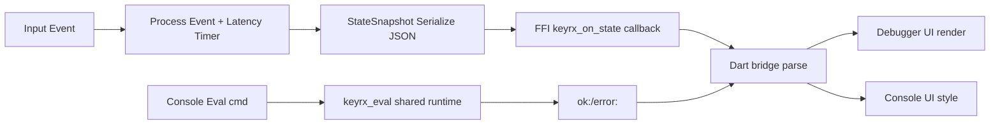

# Design Document

## Overview
Implement the live UI/FFI hardening feature: emit full engine state snapshots with timing and latency, execute `keyrx_eval` against the running runtime, expose a canonical key registry, and extend the Dart bridge/UI to consume the richer payloads with clear success/error handling. The goal is a real-time debugger and REPL that reflect true engine state with safe, structured FFI contracts.

## Steering Document Alignment

### Technical Standards (tech.md)
- Follows hybrid Rust core + Flutter UI via FFI.
- Preserves CLI-first principle: FFI exports mirror CLI behaviors with JSON-friendly payloads and `ok:`/`error:` responses.
- Meets low-latency target (<1ms added): latency measured and surfaced without expanding critical path beyond minimal serialization.
- Uses Rhai sandbox and avoids unsafe state mutation by serializing eval access.

### Project Structure (structure.md)
- Rust changes stay under `core/src/ffi` (exports), `core/src/engine` (state/latency), and `core/src/scripting` (runtime handle).
- Dart bridge updates under `ui/lib/ffi` (bindings/bridge) and UI rendering in `ui/lib/pages` / `ui/lib/widgets`.
- Tests land in `core/tests` or colocated Rust modules, and `ui/test` for Flutter widget/integration tests.

## Code Reuse Analysis
- **StateStore/engine state**: reuse existing state tracking (`core/src/engine/state.rs`) to populate snapshot fields.
- **RhaiRuntime**: reuse existing runtime initialization; add shared handle/channel rather than new instances.
- **FFI string contracts**: reuse `keyrx_free_string` and existing JSON serialization patterns for FFI outputs.
- **Flutter bridge models**: extend existing `BridgeState`/`EngineSnapshot` parsing instead of redefining structures.

### Existing Components to Leverage
- **`core/src/ffi/exports.rs`**: extend exports for state stream, eval, and list keys.
- **`core/src/scripting/runtime.rs`**: expose shared runtime handle or command channel for eval.
- **`ui/lib/ffi/bridge.dart`**: parse new state fields and handle `ok:`/`error:` responses.
- **`ui/lib/pages/debugger.dart` & `ui/lib/pages/console.dart`**: render modifiers/pending/timing and eval results.

### Integration Points
- **Engine event loop**: hook latency measurement and state snapshot publication around `process_event`.
- **FFI callbacks**: deliver serialized snapshots via existing `keyrx_on_state` callback mechanism.
- **Key registry**: read canonical key definitions (aliases + OS codes) from engine registry and serialize to JSON.
- **UI state stream**: Dart bridge updates `EngineSnapshot` model; UI listens via existing stream/subscription.

## Architecture
- **State stream**: Event loop publishes `StateSnapshot` (layers, modifiers, held, pending, event summary, latency_us, timing) on each event/change. Serialization to JSON feeds `keyrx_on_state` callback when registered.
- **Shared eval**: `keyrx_eval` routes commands to the active `RhaiRuntime` through a synchronized handle (e.g., `Arc<Mutex<RuntimeHandle>>` or mpsc to the engine task). Responses prefixed `ok:`/`error:`.
- **Key registry**: `keyrx_list_keys` returns JSON array of `{name, aliases, evdev, vk}` derived from canonical registry.
- **Bridge/UI**: Dart FFI decodes new fields, updates models, and UI renders debugger timeline (including timing thresholds), modifiers, pending queue, and keyed validation. Console styles outputs based on prefix.

### Modular Design Principles
- **Single File Responsibility**: FFI exports limited to C-ABI surface; engine state logic remains in engine modules; UI rendering separated from bridge parsing.
- **Component Isolation**: State serialization helpers live in Rust modules; Dart bridge maps payloads to plain models consumed by pages/widgets.
- **Service Layer Separation**: Eval routing encapsulated behind a runtime handle/channel; UI interacts only via bridge.
- **Utility Modularity**: Pending decision formatting and timing snapshot helpers are reusable, unit-testable utilities.



## Components and Interfaces

### Component 1: State Snapshot Publisher (Rust)
- **Purpose:** Capture engine state + timing per event and deliver via `keyrx_on_state`.
- **Interfaces:** Internal helper `build_state_snapshot(event_ctx) -> StateSnapshot`; exposed via `keyrx_on_state` FFI callback.
- **Dependencies:** Engine state store, decision queue, timing config, monotonic clock for latency.
- **Reuses:** Existing state getters (`active_layers`, modifier state) and JSON serialization utilities.

### Component 2: Shared Eval Handler (Rust)
- **Purpose:** Execute eval requests on the running `RhaiRuntime` safely.
- **Interfaces:** `keyrx_eval(cmd: *const c_char) -> *const c_char` returning `ok:`/`error:` strings.
- **Dependencies:** Shared runtime handle (Arc<Mutex<...>> or channel), Rhai runtime execute API.
- **Reuses:** Existing runtime initialization and error formatting helpers.

### Component 3: Canonical Key Registry Export (Rust)
- **Purpose:** Provide authoritative key metadata for UI validation.
- **Interfaces:** `keyrx_list_keys() -> *const c_char` JSON array.
- **Dependencies:** Key registry definitions (names, aliases, evdev/vk codes).
- **Reuses:** Existing key definition tables.

### Component 4: Dart Bridge Parsing Extensions
- **Purpose:** Decode new state fields and eval/key registry responses.
- **Interfaces:** `BridgeState`/`EngineSnapshot` with `modifiers`, `pending`, `timing`; bridge methods `listKeys()`, `eval()`.
- **Dependencies:** Generated FFI bindings, json decode.
- **Reuses:** Existing bridge stream handling and error normalization.

### Component 5: UI Rendering Updates
- **Purpose:** Display modifiers/pending/timing in debugger; style console responses; load key registry for editor validation.
- **Interfaces:** Debugger widgets consume `EngineSnapshot`; console consumes eval result; editor consumes `KeyMappings`.
- **Dependencies:** Bridge-provided models/streams.
- **Reuses:** Existing debugger timeline, console UI, key mapping editor.

## Data Models

### StateSnapshot (Rust serialized JSON)
```
{
  "layers": [string],
  "modifiers": { "standard": [string], "virtual": [string] },
  "held": [string],
  "pending": [string],        // human-readable descriptions
  "event": string,            // e.g., "Key A down; tap-or-hold pending"
  "latency_us": u64,
  "timing": {
    "tap_timeout_ms": u32,
    "combo_timeout_ms": u32,
    "hold_delay_ms": u32,
    "eager_tap": bool,
    "permissive_hold": bool,
    "retro_tap": bool
  }
}
```

### KeyRegistry Entry (Rust serialized JSON array)
```
{
  "name": String,
  "aliases": Vec<String>,
  "evdev": u16,
  "vk": u16
}
```

### Dart Bridge Models
```
class EngineSnapshot {
  List<String> layers;
  List<String> held;
  ModifierSet modifiers; // standard + virtual
  List<String> pending;
  String event;
  int latencyUs;
  TimingConfig? timing;
}

class KeyEntry {
  String name;
  List<String> aliases;
  int evdev;
  int vk;
}
```

## Error Handling

### Error Scenarios
1. **No engine initialized when eval called**
   - **Handling:** Return `error: engine not initialized`; no panic.
   - **User Impact:** Console shows error styling with message.

2. **FFI callback not registered for state**
   - **Handling:** Skip publish; log debug trace only.
   - **User Impact:** UI simply receives no snapshot; no crash.

3. **Key registry fetch fails**
   - **Handling:** Return `error:` string; Dart falls back to static list and logs.
   - **User Impact:** Editor uses fallback keys; inline badge indicates invalid keys if present.

4. **JSON serialization error**
   - **Handling:** Return `error:`; avoid unwinding across FFI boundary.
   - **User Impact:** UI shows error banner/toast; stream continues on next event.

## Testing Strategy

### Unit Testing
- Rust: tests for `keyrx_eval` ok/error paths with shared runtime handle; `keyrx_list_keys` schema/content; state snapshot serialization includes timing and latency.
- Dart: model parsing tests for `EngineSnapshot` with modifiers/pending/timing; eval response parsing for ok/error; key registry normalization.

### Integration Testing
- Rust: integration test for `keyrx_on_state` with mock callback capturing snapshot JSON.
- Flutter: widget tests for debugger rendering modifiers/pending/timing and console styling; editor key validation using fetched key list.

### End-to-End Testing
- Simulated stateStream and eval round-trip in Flutter test harness to ensure bridge → UI flow works with timing data.
- Optional smoke in Rust with sample event sequence to assert latency measurement and state publication cadence.
