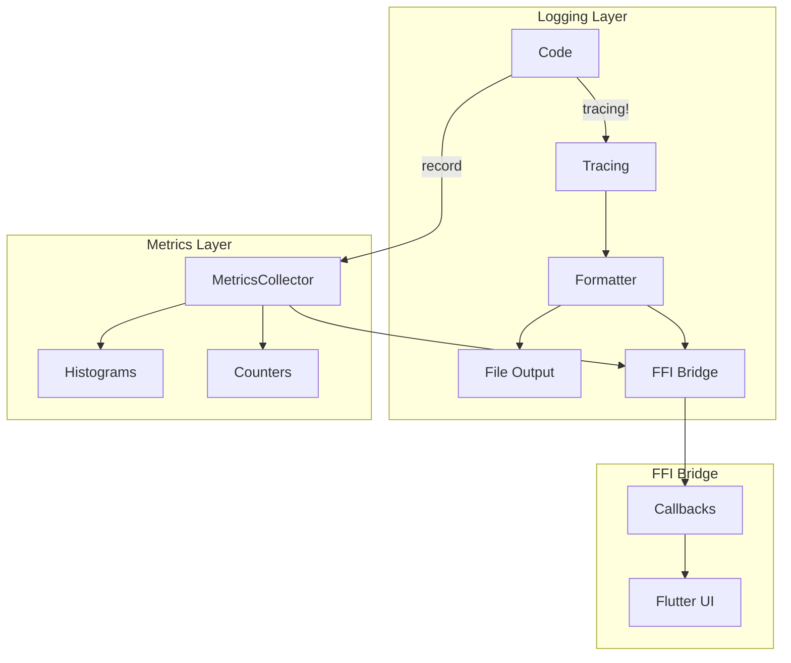

# Design Document

## Overview

This design standardizes logging across KeyRx using the `tracing` crate with structured output. The core innovation is a `LogBridge` that routes logs and metrics to both file output and FFI callbacks, enabling real-time observability in Flutter. All println/eprintln calls are replaced with structured tracing macros.

## Steering Document Alignment

### Technical Standards (tech.md)
- **Structured Logging**: JSON format with context
- **Observability**: Metrics available via FFI
- **Debug Mode**: Verbose logging when enabled

### Project Structure (structure.md)
- Logging in `core/src/observability/`
- Metrics in `core/src/observability/metrics/`
- FFI bridge in `core/src/ffi/exports_observability.rs`

## Code Reuse Analysis

### Existing Components to Leverage
- **tracing crate**: Already used in some places
- **tracing-subscriber**: Log formatting
- **perf-monitoring spec**: Metrics components

### Integration Points
- **All modules**: Use tracing macros
- **FFI**: Export observability
- **Flutter**: Receive logs and metrics

## Architecture



### Modular Design Principles
- **Single Pattern**: All logging through tracing
- **Pluggable Output**: File, FFI, or both
- **Structured Data**: JSON-serializable logs
- **Observable**: Metrics visible externally

## Components and Interfaces

### Component 1: StructuredLogger

- **Purpose:** Configure structured logging output
- **Interfaces:**
  ```rust
  /// Configure structured logging for the application.
  pub struct StructuredLogger {
      subscriber: tracing_subscriber::Registry,
      json_output: bool,
      ffi_bridge: Option<LogBridge>,
  }

  impl StructuredLogger {
      pub fn new() -> Self;

      /// Enable JSON output format.
      pub fn with_json(mut self) -> Self;

      /// Set minimum log level.
      pub fn with_level(mut self, level: Level) -> Self;

      /// Add file output.
      pub fn with_file(mut self, path: &Path) -> Self;

      /// Add FFI bridge for Flutter.
      pub fn with_ffi_bridge(mut self, bridge: LogBridge) -> Self;

      /// Initialize as global logger.
      pub fn init(self) -> Result<(), LogError>;
  }

  /// Log level configuration by module.
  pub struct LogConfig {
      pub default_level: Level,
      pub module_levels: HashMap<String, Level>,
  }
  ```
- **Dependencies:** tracing, tracing-subscriber
- **Reuses:** tracing patterns

### Component 2: LogBridge

- **Purpose:** Bridge logs to FFI for Flutter
- **Interfaces:**
  ```rust
  /// Bridge for sending logs to FFI.
  pub struct LogBridge {
      callback: Option<LogCallback>,
      buffer: Mutex<RingBuffer<LogEntry>>,
      enabled: AtomicBool,
  }

  pub type LogCallback = extern "C" fn(*const LogEntryFfi);

  impl LogBridge {
      pub fn new() -> Self;

      /// Set callback for log entries.
      pub fn set_callback(&self, callback: LogCallback);

      /// Clear callback.
      pub fn clear_callback(&self);

      /// Get buffered entries (for polling).
      pub fn drain(&self) -> Vec<LogEntry>;

      /// Enable/disable bridge.
      pub fn set_enabled(&self, enabled: bool);
  }

  impl<S: Subscriber> Layer<S> for LogBridge {
      fn on_event(&self, event: &Event, ctx: Context<S>) {
          // Convert to LogEntry and send via callback or buffer
      }
  }

  #[derive(Debug, Clone, Serialize)]
  pub struct LogEntry {
      pub timestamp: u64,
      pub level: Level,
      pub target: String,
      pub message: String,
      pub fields: HashMap<String, Value>,
      pub span: Option<String>,
  }

  #[repr(C)]
  pub struct LogEntryFfi {
      pub timestamp: u64,
      pub level: u8,
      pub target: *const c_char,
      pub message: *const c_char,
      pub fields_json: *const c_char,
  }
  ```
- **Dependencies:** tracing-subscriber
- **Reuses:** Layer pattern

### Component 3: MetricsBridge

- **Purpose:** Bridge metrics to FFI for Flutter
- **Interfaces:**
  ```rust
  /// Bridge for sending metrics to FFI.
  pub struct MetricsBridge {
      collector: Arc<dyn MetricsCollector>,
      callback: Option<MetricsCallback>,
      update_interval: Duration,
  }

  pub type MetricsCallback = extern "C" fn(*const MetricsSnapshotFfi);

  impl MetricsBridge {
      pub fn new(collector: Arc<dyn MetricsCollector>) -> Self;

      /// Set callback for metrics updates.
      pub fn set_callback(&self, callback: MetricsCallback);

      /// Set update interval for callbacks.
      pub fn set_interval(&self, interval: Duration);

      /// Get current snapshot.
      pub fn snapshot(&self) -> MetricsSnapshot;

      /// Start background update thread.
      pub fn start_updates(&self);

      /// Stop background updates.
      pub fn stop_updates(&self);
  }

  #[repr(C)]
  pub struct MetricsSnapshotFfi {
      pub timestamp: u64,
      pub event_latency_p50: u64,
      pub event_latency_p95: u64,
      pub event_latency_p99: u64,
      pub events_processed: u64,
      pub errors_count: u64,
      pub memory_used: u64,
  }
  ```
- **Dependencies:** MetricsCollector (from perf-monitoring)
- **Reuses:** Callback patterns

### Component 4: TracingMacros

- **Purpose:** Convenience macros for common patterns
- **Interfaces:**
  ```rust
  /// Log with structured context.
  ///
  /// # Example
  /// ```rust
  /// log_event!(Level::INFO, "key_processed",
  ///     key_code = event.key,
  ///     latency_us = elapsed.as_micros(),
  /// );
  /// ```
  #[macro_export]
  macro_rules! log_event {
      ($level:expr, $event:literal, $($field:tt)*) => {
          tracing::event!($level, event = $event, $($field)*);
      };
  }

  /// Log error with context.
  #[macro_export]
  macro_rules! log_error {
      ($err:expr, $context:literal) => {
          tracing::error!(
              error = %$err,
              context = $context,
              "Error occurred"
          );
      };
      ($err:expr, $context:literal, $($field:tt)*) => {
          tracing::error!(
              error = %$err,
              context = $context,
              $($field)*,
              "Error occurred"
          );
      };
  }

  /// Create a timed span.
  #[macro_export]
  macro_rules! timed_span {
      ($name:literal) => {
          tracing::info_span!($name)
      };
      ($name:literal, $($field:tt)*) => {
          tracing::info_span!($name, $($field)*)
      };
  }
  ```
- **Dependencies:** tracing
- **Reuses:** Macro patterns

### Component 5: PrintlnMigrator

- **Purpose:** Tool to help migrate println calls
- **Interfaces:**
  ```rust
  /// Guide for migrating println/eprintln to tracing.
  ///
  /// Before:
  /// ```rust
  /// println!("Processing key: {}", key);
  /// eprintln!("Error: {}", err);
  /// ```
  ///
  /// After:
  /// ```rust
  /// tracing::info!(key = %key, "Processing key");
  /// tracing::error!(error = %err, "Error occurred");
  /// ```
  ///
  /// Migration rules:
  /// - println! -> tracing::info! or tracing::debug!
  /// - eprintln! -> tracing::error! or tracing::warn!
  /// - dbg! -> tracing::debug! with fields
  /// - User-facing messages -> keep println but wrap in UI layer
  ```
- **Dependencies:** None (documentation)
- **Reuses:** Migration patterns

### Component 6: FFI Exports

- **Purpose:** Export observability to Flutter
- **Interfaces:**
  ```rust
  /// FFI exports for observability.

  /// Set log callback.
  #[no_mangle]
  pub extern "C" fn keyrx_set_log_callback(callback: LogCallback) {
      LOG_BRIDGE.set_callback(callback);
  }

  /// Set log level.
  #[no_mangle]
  pub extern "C" fn keyrx_set_log_level(level: u8) -> bool {
      // Update tracing filter
  }

  /// Get buffered log entries.
  #[no_mangle]
  pub extern "C" fn keyrx_drain_logs() -> FfiArray<LogEntryFfi> {
      LOG_BRIDGE.drain().into_ffi()
  }

  /// Set metrics callback.
  #[no_mangle]
  pub extern "C" fn keyrx_set_metrics_callback(callback: MetricsCallback) {
      METRICS_BRIDGE.set_callback(callback);
  }

  /// Get metrics snapshot.
  #[no_mangle]
  pub extern "C" fn keyrx_get_metrics() -> MetricsSnapshotFfi {
      METRICS_BRIDGE.snapshot().into_ffi()
  }
  ```
- **Dependencies:** LogBridge, MetricsBridge
- **Reuses:** FFI patterns

## Data Models

### LogLevel Mapping
```rust
#[repr(u8)]
pub enum FfiLogLevel {
    Trace = 0,
    Debug = 1,
    Info = 2,
    Warn = 3,
    Error = 4,
}

impl From<Level> for FfiLogLevel {
    fn from(level: Level) -> Self {
        match level {
            Level::TRACE => Self::Trace,
            Level::DEBUG => Self::Debug,
            Level::INFO => Self::Info,
            Level::WARN => Self::Warn,
            Level::ERROR => Self::Error,
        }
    }
}
```

### LogFilter
```rust
pub struct LogFilter {
    pub min_level: Level,
    pub include_targets: Vec<String>,
    pub exclude_targets: Vec<String>,
}
```

## Error Handling

### Error Scenarios

1. **Logger initialization fails**
   - **Handling:** Fall back to stderr
   - **User Impact:** Logs still work

2. **FFI callback fails**
   - **Handling:** Buffer entries, log warning
   - **User Impact:** Some entries may be lost

3. **Log buffer full**
   - **Handling:** Drop oldest entries
   - **User Impact:** Oldest logs lost

## Testing Strategy

### Unit Testing
- Test log formatting
- Test level filtering
- Test FFI bridge

### Integration Testing
- Test full logging pipeline
- Test metrics collection
- Test Flutter integration

### Performance Testing
- Benchmark logging overhead
- Test under high load
- Verify disabled logging is zero-cost
