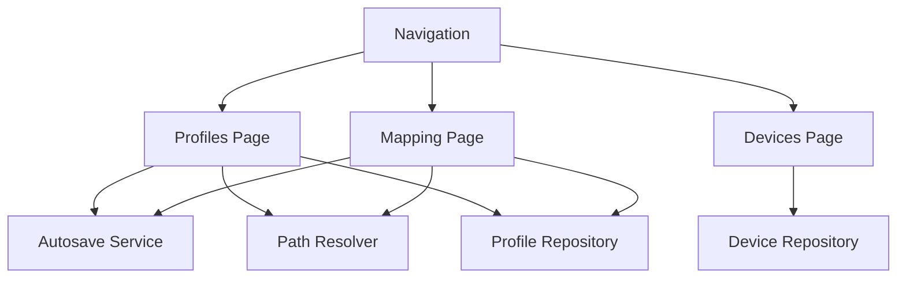

# Design Document

## Overview
This design delivers the Mapping Screen Refresh feature in Flutter: rename the Editor screen to Profiles, add a dedicated Mapping screen for per-key assignment, improve the Profiles layout setup UX, and auto-save profiles to the user home directory (`~/.keyrx` or `%USERPROFILE%/.keyrx`) without an explicit save button. It also clarifies the Devices screen for discovery and friendly naming. The implementation reuses existing pages, repositories, and state patterns, adding shared services for storage location resolution and autosave.

## Steering Document Alignment

### Technical Standards (tech.md)
- Flutter UI with FFI bridge—no platform-specific shortcuts.
- Persist data in user-space paths; avoid elevated permissions.
- Maintain consistent state management and error handling patterns already used in UI.

### Project Structure (structure.md)
- Pages live under `ui/lib/pages/`; shared widgets in `ui/lib/widgets/`; services/repositories in `ui/lib/services` and `ui/lib/repositories`.
- Follow snake_case filenames and keep widgets/screen files focused.

## Code Reuse Analysis
- Reuse existing navigation and routing scaffolding to relabel Editor → Profiles.
- Reuse profile/device repositories for data; extend with autosave and path resolver.
- Reuse grid/keycap widgets from `visual_editor_widgets.dart` where possible to render the mapping grid.
- Reuse existing toast/snackbar utilities for autosave feedback.

### Existing Components to Leverage
- `ui/lib/pages/visual_editor_page.dart` and `visual_editor_widgets.dart`: base grid rendering and controls for mapping; adapt for the new Mapping screen.
- `ui/lib/pages/devices_page.dart`: device listing and discovery hooks.
- `ui/lib/services` / `ui/lib/repositories`: persistence and state patterns to extend for autosave.
- Toast/snackbar utilities in UI shell (app scaffold).

### Integration Points
- Filesystem writes via repository/service layer to `~/.keyrx` or `%USERPROFILE%/.keyrx`.
- Navigation routes: update labels and add Mapping route.
- State management: profiles and mapping state share autosave service.

## Architecture
Layered UI with shared services:
- **UI pages**: Devices, Profiles (renamed), Mapping (new).
- **Shared widgets**: grid renderer, layout controls, mapping editor panel, empty/loading states.
- **Services**: storage path resolver (OS-aware), autosave controller (debounced, retry), mapping repository extension.
- **Routing**: update labels and add mapping route entry.

### Modular Design Principles
- Single-file responsibility per page; shared sub-widgets extracted.
- Services isolated (path resolver, autosave) to avoid duplication.
- Reuse existing repositories/state rather than new globals.

## Components and Interfaces

### Navigation Label Update
- **Purpose:** Relabel “Editor” to “Profiles” without breaking routes.
- **Interfaces:** Existing navigation items; route names unchanged unless currently named “editor”.
- **Dependencies:** Nav configuration file.
- **Reuses:** Existing navigation/scaffold.

### Autosave Service
- **Purpose:** Debounced saves to disk with retries and feedback.
- **Interfaces:** `saveProfile(Profile profile)` returning success/error; emits status updates (in-progress, success timestamp, error).
- **Dependencies:** Path resolver, profile repository, debounce utility, snackbar/toast surface.
- **Reuses:** Existing profile repo write logic.

### Path Resolver
- **Purpose:** Resolve user home storage path cross-platform.
- **Interfaces:** `String resolveProfilesDir()` -> `~/.keyrx` (Linux) or `%USERPROFILE%/.keyrx` (Windows); ensures directory exists.
- **Dependencies:** `dart:io` Platform/environment, filesystem utils.

### Profiles Page Updates
- **Purpose:** Layout setup UX (rows/cols per row) with responsive preview.
- **Interfaces:** Layout form (row count, cols per row list), preview widget, validation.
- **Dependencies:** Existing profile model; grid widget for preview.
- **Reuses:** Visual editor widgets for grid rendering.

### Mapping Page (New)
- **Purpose:** Dedicated per-key assignment with density controls and search/filter.
- **Interfaces:** Grid view, mapping inspector/editor panel, search/filter input, density toggle (comfortable/compact).
- **Dependencies:** Mapping state, profile layout data, autosave service, path resolver.
- **Reuses:** Grid rendering widgets; action editor components.

### Devices Page Enhancements
- **Purpose:** Friendly naming and clearer discovery/empty/loading states.
- **Interfaces:** Inline name edit or dialog; empty state; progress indicator.
- **Dependencies:** Device repository/discovery.
- **Reuses:** Existing device list components.

## Data Models

### Profile (extended for storage path use)
- `id: String`
- `name: String`
- `layout: { rows: int, colsPerRow: List<int> }`
- `mappings: Map<KeyPos, MappingAction>`
- `updatedAt: DateTime`
- (storage path handled by path resolver; model unchanged otherwise)

### Autosave Status
- `state: enum { idle, saving, success, error }`
- `message: String?`
- `lastSavedAt: DateTime?`

## Error Handling

### Error Scenarios
1. **Filesystem write fails (permissions/path):**
   - **Handling:** Retry up to 3x with backoff; surface toast/banner with path and suggestion.
   - **User Impact:** Non-blocking notice; edits kept in memory.
2. **Invalid layout input:**
   - **Handling:** Inline validation; disable proceed; no save.
   - **User Impact:** Clear message near inputs.
3. **Autosave in-progress conflicts:**
   - **Handling:** Queue/debounce saves; latest wins.
   - **User Impact:** Status indicator shows saving/last saved.

## Testing Strategy

### Unit Testing
- Path resolver (Windows vs Linux env) for correct directory and creation.
- Autosave service debounce and retry logic.
- Layout validation logic (rows/cols per row).

### Integration Testing
- Profile edit triggers autosave; persistence to resolved path.
- Mapping edit triggers autosave and shows feedback.
- Devices naming persists and updates UI.

### End-to-End Testing
- Flow: Device discovery (empty/loaded) → Profiles layout setup → Mapping assignments with search/filter → autosave feedback and file presence in `.keyrx`.***
