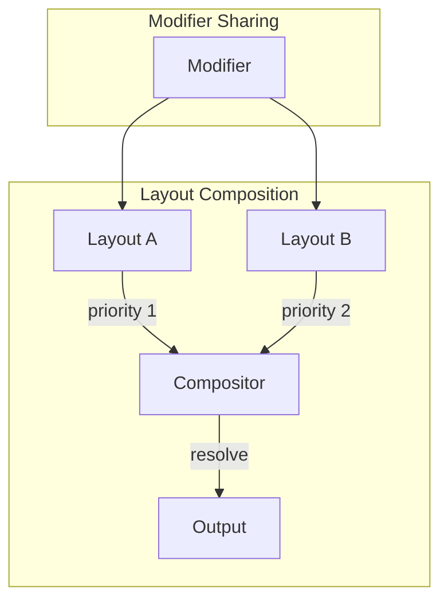

# Design Document

## Overview

This design extends the layer system to support multiple simultaneous layouts with priority-based conflict resolution. Layouts become first-class entities that contain layers, with cross-layout modifier sharing.

## Architecture



## Components and Interfaces

### Component 1: LayoutCompositor

```rust
pub struct LayoutCompositor {
    layouts: Vec<ActiveLayout>,
    shared_modifiers: ModifierSet,
}

pub struct ActiveLayout {
    layout: Layout,
    priority: i32,
    enabled: bool,
}

impl LayoutCompositor {
    pub fn new() -> Self;
    pub fn add_layout(&mut self, layout: Layout, priority: i32);
    pub fn remove_layout(&mut self, id: &str);
    pub fn process(&mut self, event: KeyEvent) -> Vec<Action>;
    pub fn set_priority(&mut self, id: &str, priority: i32);
}
```

### Component 2: CrossLayoutModifier

```rust
pub enum ModifierScope {
    Global,           // Shared across all layouts
    Layout(String),   // Specific to one layout
    Temporary,        // Active only while held
}

pub struct CrossLayoutModifier {
    modifier: ModifierId,
    scope: ModifierScope,
}
```

## Testing Strategy

- Unit tests for composition
- Integration tests for modifier sharing
- User scenario tests
