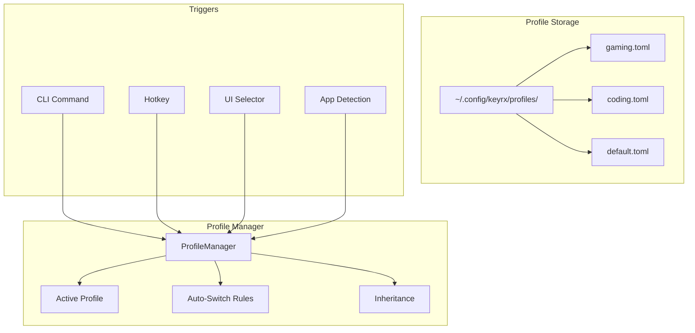

# Design Document

## Overview

This design adds a profile system for managing multiple configurations with fast switching. Profiles are stored in the config directory, with support for inheritance, auto-switching, and import/export.

## Architecture



## Components and Interfaces

### Component 1: Profile

```rust
#[derive(Debug, Clone, Serialize, Deserialize)]
pub struct Profile {
    pub id: String,
    pub name: String,
    pub icon: Option<String>,
    pub inherits: Option<String>,
    pub config: Config,
    pub auto_switch: Vec<AutoSwitchRule>,
}

#[derive(Debug, Clone, Serialize, Deserialize)]
pub struct AutoSwitchRule {
    pub application: String,       // Process name or window title
    pub match_type: MatchType,     // Exact, Contains, Regex
}

pub enum MatchType {
    Exact,
    Contains,
    Regex(String),
}
```

### Component 2: ProfileManager

```rust
pub struct ProfileManager {
    profiles_dir: PathBuf,
    active: Option<Profile>,
    watcher: Option<AppWatcher>,
}

impl ProfileManager {
    pub fn new(profiles_dir: PathBuf) -> Self;
    pub fn list(&self) -> Vec<ProfileInfo>;
    pub fn get(&self, id: &str) -> Option<Profile>;
    pub fn create(&mut self, profile: Profile) -> Result<(), ProfileError>;
    pub fn delete(&mut self, id: &str) -> Result<(), ProfileError>;
    pub fn switch(&mut self, id: &str) -> Result<(), ProfileError>;
    pub fn export(&self, id: &str, path: &Path) -> Result<(), ProfileError>;
    pub fn import(&mut self, path: &Path) -> Result<String, ProfileError>;
}
```

### Component 3: AppWatcher

```rust
pub struct AppWatcher {
    rules: Vec<(AutoSwitchRule, String)>, // (rule, profile_id)
}

impl AppWatcher {
    pub fn start(&mut self, callback: impl Fn(&str));
    pub fn stop(&mut self);
    pub fn check_active_window(&self) -> Option<String>; // Returns profile_id
}
```

## Testing Strategy

- Unit tests for profile CRUD
- Integration tests for auto-switching
- E2E tests for hotkey switching
