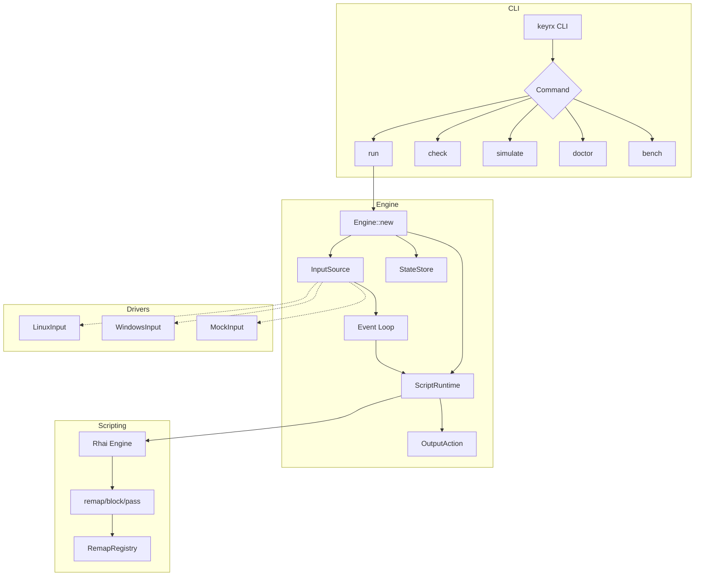

# Design Document: MVP

## Overview

This design specifies the MVP implementation for KeyRx - completing the foundational infrastructure to make the engine installable, runnable, configurable, and testable via CLI. The design builds upon the existing DI architecture in `core/` and fills in the gaps to achieve a working end-to-end remapping pipeline.

## Steering Document Alignment

### Technical Standards (tech.md)
- **3-Layer Hybrid Architecture**: Engine (Rust) → Traits → OS Drivers
- **Dependency Injection**: All components use trait-based DI (`InputSource`, `ScriptRuntime`, `StateStore`)
- **Tokio Async**: Event loop uses async/await pattern
- **CLI First**: All features CLI-exercisable before GUI

### Project Structure (structure.md)
- `core/src/engine/` - Event processing logic
- `core/src/cli/commands/` - CLI command implementations
- `core/src/scripting/` - Rhai runtime with remap functions
- `core/src/drivers/` - Platform-specific input drivers
- `core/src/mocks/` - Test doubles for all traits

## Code Reuse Analysis

### Existing Components to Leverage
- **`Engine<I, S, St>`** (`engine/event_loop.rs`): DI-ready engine skeleton, needs event processing loop
- **`RhaiRuntime`** (`scripting/runtime.rs`): Script loading/execution, needs remap function bindings
- **`OutputWriter`** (`cli/output.rs`): JSON/Human output formatting
- **`MockInput/MockRuntime/MockState`** (`mocks/`): Test doubles for simulation
- **`clap` CLI skeleton** (`bin/keyrx.rs`): Command structure with check, run, doctor, bench, repl

### Integration Points
- **Rhai Engine**: Register `remap()`, `block()`, `pass()` functions
- **Event Pipeline**: InputEvent → ScriptRuntime → OutputAction
- **CLI Commands**: Complete stub implementations for simulate, bench, repl

## Architecture



### Modular Design Principles
- **Single File Responsibility**: Each command in its own file, each trait in its own file
- **Component Isolation**: Drivers are hot-swappable via traits
- **Service Layer Separation**: CLI → Engine → Scripting → Drivers
- **Utility Modularity**: Output formatting, error handling isolated

## Components and Interfaces

### Component 1: Event Processing Pipeline
- **Purpose**: Process input events through script runtime to produce output actions
- **Interfaces**:
  ```rust
  impl Engine<I, S, St> {
      async fn process_event(&mut self, event: InputEvent) -> Result<OutputAction>;
      async fn run_loop(&mut self) -> Result<()>;
  }
  ```
- **Dependencies**: InputSource, ScriptRuntime, StateStore
- **Reuses**: Existing Engine struct, trait definitions

### Component 2: Remap Function Registry
- **Purpose**: Track key remappings defined in Rhai scripts
- **Interfaces**:
  ```rust
  pub struct RemapRegistry {
      mappings: HashMap<KeyCode, RemapAction>,
  }

  impl RemapRegistry {
      fn remap(&mut self, from: KeyCode, to: KeyCode);
      fn block(&mut self, key: KeyCode);
      fn lookup(&self, key: KeyCode) -> RemapAction;
  }
  ```
- **Dependencies**: None (pure data structure)
- **Reuses**: KeyCode enum from engine/types.rs

### Component 3: Simulate Command
- **Purpose**: Process simulated key events without real input drivers
- **Interfaces**:
  ```rust
  pub struct SimulateCommand {
      input: String,           // Comma-separated keys
      script_path: PathBuf,
      output: OutputWriter,
  }

  impl SimulateCommand {
      fn run(&self) -> Result<()>;
  }
  ```
- **Dependencies**: MockInput, RhaiRuntime, InMemoryState
- **Reuses**: Engine, OutputWriter, MockInput

### Component 4: Bench Command
- **Purpose**: Measure and report input processing latency
- **Interfaces**:
  ```rust
  pub struct BenchCommand {
      iterations: usize,
      output: OutputWriter,
  }

  impl BenchCommand {
      fn run(&self) -> Result<BenchResult>;
  }

  pub struct BenchResult {
      min_ns: u64,
      max_ns: u64,
      mean_ns: u64,
      p99_ns: u64,
  }
  ```
- **Dependencies**: Engine, MockInput
- **Reuses**: Criterion patterns, OutputWriter

### Component 5: Doctor Diagnostics
- **Purpose**: Verify system prerequisites and permissions
- **Interfaces**:
  ```rust
  pub struct DoctorCommand {
      verbose: bool,
      output: OutputWriter,
  }

  pub struct DiagnosticCheck {
      name: String,
      status: CheckStatus,
      message: String,
  }
  ```
- **Dependencies**: Platform-specific checks
- **Reuses**: OutputWriter

### Component 6: Platform Drivers (Stubs)
- **Purpose**: OS-specific keyboard hook implementations
- **Interfaces**: Implement `InputSource` trait
- **Dependencies**: `windows-rs` (Windows), `evdev` (Linux)
- **Reuses**: InputSource trait, InputEvent/OutputAction types

## Data Models

### InputEvent
```rust
pub struct InputEvent {
    pub key: KeyCode,
    pub pressed: bool,      // true = key down, false = key up
    pub timestamp: Instant,
}
```

### OutputAction
```rust
pub enum OutputAction {
    Emit(KeyCode),          // Output a key
    Block,                  // Suppress the input
    Pass,                   // Forward unchanged
}
```

### RemapAction
```rust
pub enum RemapAction {
    Remap(KeyCode),         // Remap to different key
    Block,                  // Block this key
    Pass,                   // Pass through unchanged
}
```

### BenchResult
```rust
pub struct BenchResult {
    pub iterations: usize,
    pub min_ns: u64,
    pub max_ns: u64,
    pub mean_ns: u64,
    pub p99_ns: u64,
    pub warning: Option<String>,  // Set if mean > 1ms
}
```

### DiagnosticCheck
```rust
pub struct DiagnosticCheck {
    pub name: String,
    pub status: CheckStatus,  // Passed, Failed, Skipped
    pub message: String,
    pub remediation: Option<String>,
}
```

## Error Handling

### Error Scenarios

1. **Script File Not Found**
   - **Handling**: Return `Err` with clear path in message
   - **User Impact**: Exit code 1, display "Script not found: {path}"

2. **Script Syntax Error**
   - **Handling**: Catch Rhai parse error, extract line/column
   - **User Impact**: Exit code 2, display "Syntax error at line X, column Y: {message}"

3. **Permission Denied (Linux uinput)**
   - **Handling**: Detect during doctor check
   - **User Impact**: Display remediation: "Add user to 'input' group or run with sudo"

4. **Keyboard Hook Failed (Windows)**
   - **Handling**: Catch Windows API error
   - **User Impact**: Display "Failed to install keyboard hook. Antivirus may be blocking."

5. **Script Execution Timeout**
   - **Handling**: Rhai max_operations limit triggers error
   - **User Impact**: Exit code 1, display "Script exceeded maximum operations (infinite loop?)"

## Testing Strategy

### Unit Testing
- **Engine Event Processing**: Test `process_event` with MockInput, MockRuntime, MockState
- **RemapRegistry**: Test remap/block/lookup with various key combinations
- **CLI Commands**: Test command parsing and output formatting
- **Coverage Target**: 80% for all core modules

### Integration Testing
- **End-to-End Script Loading**: Load Rhai file, verify hooks detected
- **Simulate Pipeline**: `simulate --input "A" --script test.rhai` → verify output
- **Doctor Checks**: Verify all diagnostic checks run without panic

### End-to-End Testing
- **Build Verification**: `cargo build --release` succeeds on Linux and Windows
- **CLI Smoke Test**: All commands run with `--help` without error
- **Script Validation**: `keyrx check scripts/std/layouts/ansi.rhai` returns exit 0

### Property-Based Testing
- **Fuzz RemapRegistry**: Random key sequences produce valid outputs
- **Fuzz Event Processing**: Random InputEvents don't panic engine

## File Changes Summary

| File | Action | Purpose |
|------|--------|---------|
| `core/src/engine/event_loop.rs` | Modify | Add `process_event`, `run_loop` |
| `core/src/engine/types.rs` | Modify | Add `RemapAction`, ensure `KeyCode` complete |
| `core/src/scripting/runtime.rs` | Modify | Register remap/block/pass functions |
| `core/src/scripting/registry.rs` | Create | `RemapRegistry` struct |
| `core/src/cli/commands/simulate.rs` | Create | Simulate command |
| `core/src/cli/commands/bench.rs` | Create | Bench command with latency stats |
| `core/src/cli/commands/doctor.rs` | Modify | Complete platform diagnostics |
| `core/src/cli/commands/mod.rs` | Modify | Export new commands |
| `core/src/drivers/linux.rs` | Modify | Stub InputSource implementation |
| `core/src/drivers/windows.rs` | Modify | Stub InputSource implementation |
| `core/src/bin/keyrx.rs` | Modify | Wire up simulate command |
| `scripts/std/example.rhai` | Create | Example remap script |
| `core/tests/engine_test.rs` | Create | Engine integration tests |
| `core/tests/simulate_test.rs` | Create | Simulate command tests |
