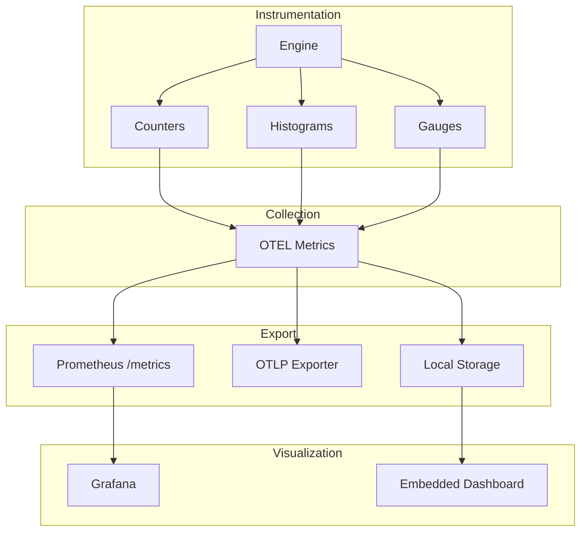

# Design Document

## Overview

This design extends OpenTelemetry integration with metrics collection (counters, histograms, gauges), Prometheus export, and pre-built Grafana dashboards. Local visualization is available via embedded dashboard.

## Architecture



## Components and Interfaces

### Component 1: MetricsCollector

```rust
pub struct MetricsCollector {
    meter: Meter,

    // Counters
    key_events_total: Counter<u64>,
    errors_total: Counter<u64>,

    // Histograms
    processing_latency: Histogram<f64>,
    script_execution_time: Histogram<f64>,

    // Gauges
    active_sessions: UpDownCounter<i64>,
    active_devices: UpDownCounter<i64>,
}

impl MetricsCollector {
    pub fn record_key_event(&self, key_code: u32, action: &str);
    pub fn record_latency(&self, duration: Duration);
    pub fn record_error(&self, error_type: &str);
    pub fn set_active_sessions(&self, count: i64);
}
```

### Component 2: PrometheusExporter

```rust
pub struct PrometheusExporter {
    registry: Registry,
    endpoint: String,
}

impl PrometheusExporter {
    pub fn new(config: PrometheusConfig) -> Self;
    pub fn start(&self) -> JoinHandle<()>;
    pub fn metrics_handler(&self) -> impl Fn(Request) -> Response;
}
```

### Component 3: GrafanaDashboard

```rust
pub struct GrafanaDashboard;

impl GrafanaDashboard {
    pub fn generate_json() -> String;
    pub fn panels() -> Vec<Panel>;
}

pub struct Panel {
    pub title: String,
    pub panel_type: PanelType,
    pub query: String,
}

pub enum PanelType {
    Graph,
    Gauge,
    Table,
    Heatmap,
}
```

## Testing Strategy

- Unit tests for metrics recording
- Integration tests for Prometheus export
- Dashboard validation tests
