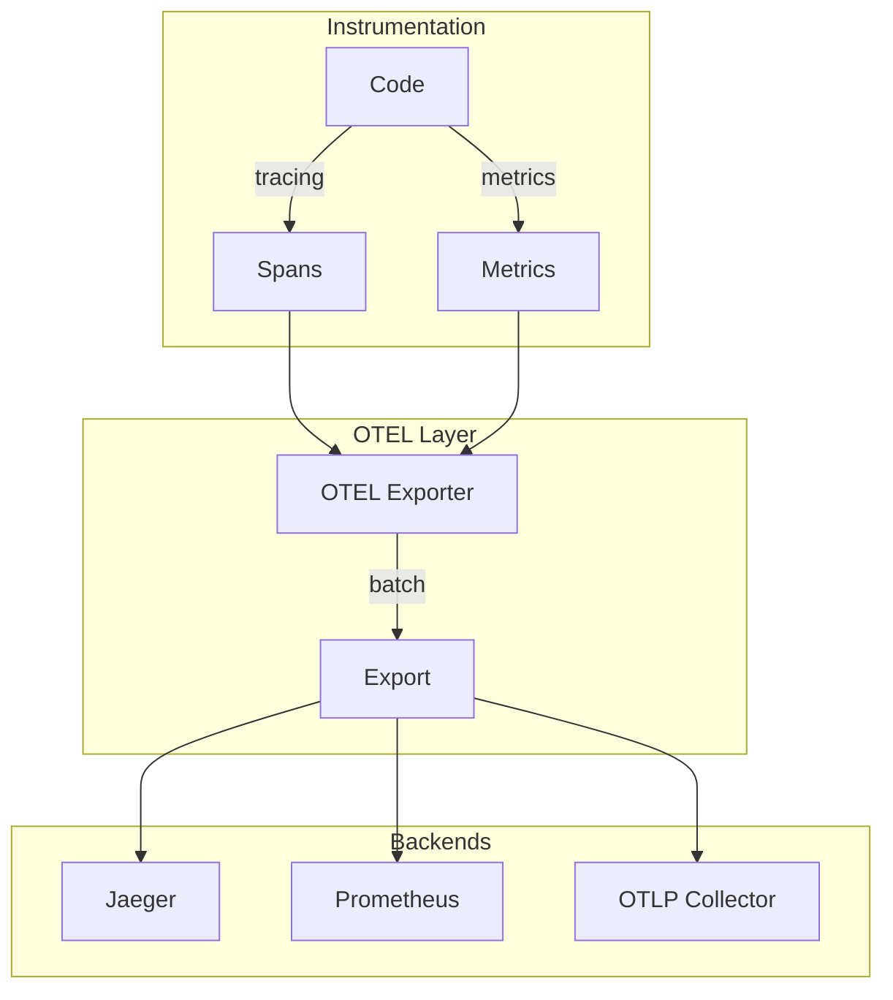

# Design Document

## Overview

This design implements OpenTelemetry tracing and metrics export using the `opentelemetry` and `tracing-opentelemetry` crates. Export is batched and async to minimize overhead, with configurable endpoints via environment variables.

## Architecture



## Components and Interfaces

### Component 1: OtelConfig

```rust
#[derive(Debug, Clone)]
pub struct OtelConfig {
    pub enabled: bool,
    pub endpoint: String,
    pub service_name: String,
    pub batch_size: usize,
    pub export_interval: Duration,
}

impl OtelConfig {
    pub fn from_env() -> Self {
        Self {
            enabled: env::var("OTEL_ENABLED").is_ok(),
            endpoint: env::var("OTEL_EXPORTER_OTLP_ENDPOINT")
                .unwrap_or_else(|_| "http://localhost:4317".into()),
            service_name: env::var("OTEL_SERVICE_NAME")
                .unwrap_or_else(|_| "keyrx".into()),
            batch_size: 512,
            export_interval: Duration::from_secs(5),
        }
    }
}
```

### Component 2: OtelLayer

```rust
pub fn init_otel(config: &OtelConfig) -> Result<(), OtelError> {
    if !config.enabled {
        return Ok(());
    }

    let tracer = opentelemetry_otlp::new_pipeline()
        .tracing()
        .with_exporter(/* ... */)
        .install_batch(runtime::Tokio)?;

    let layer = tracing_opentelemetry::layer().with_tracer(tracer);

    // Add to global subscriber
    Ok(())
}
```

## Testing Strategy

- Unit tests for configuration
- Integration tests with mock collector
- Benchmark overhead
