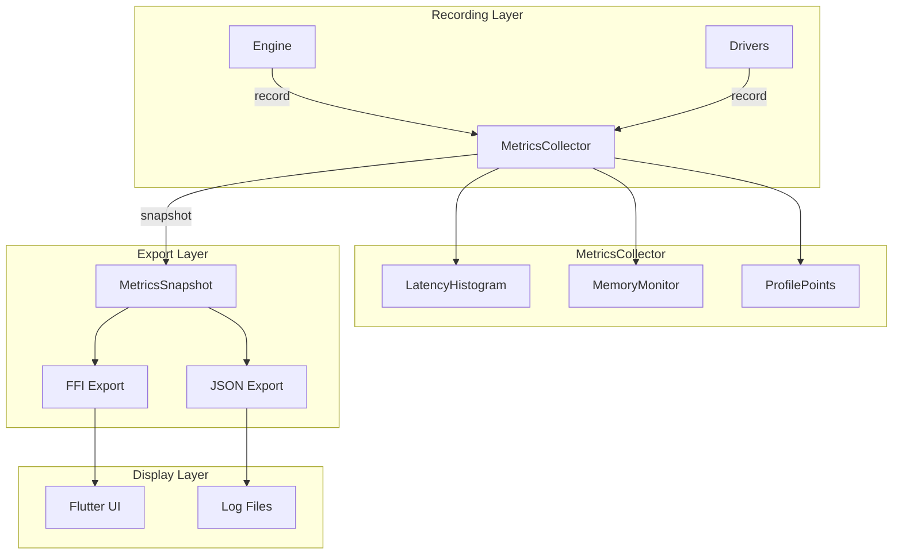

# Design Document

## Overview

This design adds a zero-allocation metrics system using HDR histograms for latency tracking and bounded buffers for memory stats. The core innovation is the `MetricsCollector` trait that allows pluggable implementations - from no-op in release builds to full profiling in debug. All hot-path metrics use pre-allocated storage.

## Steering Document Alignment

### Technical Standards (tech.md)
- **Performance First**: Sub-microsecond overhead
- **No Allocations**: Pre-allocated metric storage
- **Debug Mode**: Full profiling when enabled

### Project Structure (structure.md)
- Metrics in `core/src/metrics/`
- FFI exports in `core/src/ffi/exports_metrics.rs`
- Flutter display in `ui/lib/widgets/metrics/`

## Code Reuse Analysis

### Existing Components to Leverage
- **hdrhistogram**: Industry-standard latency histograms
- **parking_lot**: Fast synchronization
- **serde**: Metric serialization

### Integration Points
- **Engine**: Records latency per event
- **FFI**: Exports metric snapshots
- **Flutter**: Displays real-time metrics

## Architecture



### Modular Design Principles
- **Single File Responsibility**: Each metric type isolated
- **Component Isolation**: Metrics don't depend on engine internals
- **Zero Allocation**: Hot path uses pre-allocated storage
- **Pluggable Implementation**: NoOp vs Full collectors

## Components and Interfaces

### Component 1: MetricsCollector Trait

- **Purpose:** Abstract interface for metrics collection
- **Interfaces:**
  ```rust
  pub trait MetricsCollector: Send + Sync {
      fn record_latency(&self, operation: Operation, micros: u64);
      fn record_memory(&self, bytes: usize);
      fn start_profile(&self, name: &'static str) -> ProfileGuard;
      fn snapshot(&self) -> MetricsSnapshot;
      fn reset(&self);
  }

  #[derive(Debug, Clone, Copy)]
  pub enum Operation {
      EventProcess,
      RuleMatch,
      ActionExecute,
      DriverRead,
      DriverWrite,
  }

  pub struct ProfileGuard<'a> {
      collector: &'a dyn MetricsCollector,
      name: &'static str,
      start: Instant,
  }

  impl Drop for ProfileGuard<'_> {
      fn drop(&mut self) {
          let elapsed = self.start.elapsed().as_micros() as u64;
          self.collector.record_profile(self.name, elapsed);
      }
  }
  ```
- **Dependencies:** std::time
- **Reuses:** RAII guard pattern

### Component 2: LatencyHistogram

- **Purpose:** Track latency percentiles with bounded memory
- **Interfaces:**
  ```rust
  pub struct LatencyHistogram {
      histogram: Histogram<u64>,
      thresholds: LatencyThresholds,
  }

  impl LatencyHistogram {
      pub fn new(max_value: u64, precision: u8) -> Self;
      pub fn record(&self, micros: u64);
      pub fn percentile(&self, p: f64) -> u64;
      pub fn stats(&self) -> LatencyStats;
      pub fn reset(&self);
  }

  #[derive(Debug, Clone, Serialize)]
  pub struct LatencyStats {
      pub count: u64,
      pub min: u64,
      pub max: u64,
      pub mean: f64,
      pub p50: u64,
      pub p95: u64,
      pub p99: u64,
      pub p999: u64,
  }

  pub struct LatencyThresholds {
      pub warn_micros: u64,
      pub error_micros: u64,
  }
  ```
- **Dependencies:** hdrhistogram crate
- **Reuses:** HDR histogram algorithm

### Component 3: MemoryMonitor

- **Purpose:** Track memory usage and detect leaks
- **Interfaces:**
  ```rust
  pub struct MemoryMonitor {
      samples: RingBuffer<MemorySample>,
      baseline: AtomicUsize,
      peak: AtomicUsize,
  }

  impl MemoryMonitor {
      pub fn new(sample_capacity: usize) -> Self;
      pub fn record(&self, bytes: usize);
      pub fn set_baseline(&self);
      pub fn stats(&self) -> MemoryStats;
      pub fn detect_leak(&self, growth_threshold: f64) -> Option<LeakInfo>;
  }

  #[derive(Debug, Clone, Serialize)]
  pub struct MemoryStats {
      pub current: usize,
      pub peak: usize,
      pub baseline: usize,
      pub growth_rate: f64,
  }

  #[derive(Debug, Clone, Serialize)]
  pub struct LeakInfo {
      pub bytes_leaked: usize,
      pub duration_secs: f64,
      pub rate_per_sec: f64,
  }
  ```
- **Dependencies:** std::sync::atomic
- **Reuses:** Ring buffer pattern

### Component 4: ProfilePoints

- **Purpose:** Function-level timing for profiling
- **Interfaces:**
  ```rust
  pub struct ProfilePoints {
      points: DashMap<&'static str, ProfileStats>,
      enabled: AtomicBool,
  }

  impl ProfilePoints {
      pub fn new() -> Self;
      pub fn record(&self, name: &'static str, micros: u64);
      pub fn enable(&self, enabled: bool);
      pub fn hot_spots(&self, top_n: usize) -> Vec<HotSpot>;
      pub fn flamegraph_data(&self) -> FlamegraphData;
  }

  #[derive(Debug, Clone, Serialize)]
  pub struct HotSpot {
      pub name: &'static str,
      pub total_micros: u64,
      pub call_count: u64,
      pub avg_micros: f64,
      pub max_micros: u64,
  }
  ```
- **Dependencies:** dashmap
- **Reuses:** Profiling patterns

### Component 5: MetricsSnapshot

- **Purpose:** Serializable metrics export
- **Interfaces:**
  ```rust
  #[derive(Debug, Clone, Serialize)]
  pub struct MetricsSnapshot {
      pub timestamp: u64,
      pub uptime_secs: f64,
      pub latency: HashMap<Operation, LatencyStats>,
      pub memory: MemoryStats,
      pub hot_spots: Vec<HotSpot>,
  }

  impl MetricsSnapshot {
      pub fn to_json(&self) -> String;
      pub fn to_ffi(&self) -> FfiMetrics;
  }
  ```
- **Dependencies:** serde
- **Reuses:** Snapshot pattern

### Component 6: NoOpCollector

- **Purpose:** Zero-overhead collector for release builds
- **Interfaces:**
  ```rust
  pub struct NoOpCollector;

  impl MetricsCollector for NoOpCollector {
      fn record_latency(&self, _: Operation, _: u64) {}
      fn record_memory(&self, _: usize) {}
      fn start_profile(&self, _: &'static str) -> ProfileGuard { ... }
      fn snapshot(&self) -> MetricsSnapshot { MetricsSnapshot::empty() }
      fn reset(&self) {}
  }
  ```
- **Dependencies:** None
- **Reuses:** Null object pattern

## Data Models

### RingBuffer
```rust
pub struct RingBuffer<T> {
    data: Box<[T]>,
    head: AtomicUsize,
    len: AtomicUsize,
}
```

### FfiMetrics
```rust
#[repr(C)]
pub struct FfiMetrics {
    pub event_latency_p99: u64,
    pub memory_current: u64,
    pub memory_peak: u64,
    pub uptime_secs: f64,
}
```

## Error Handling

### Error Scenarios

1. **Histogram overflow**
   - **Handling:** Clamp to max value, log warning
   - **User Impact:** Extreme values capped

2. **Memory read failure**
   - **Handling:** Skip sample, use last known
   - **User Impact:** Slight accuracy loss

3. **Export serialization failure**
   - **Handling:** Return error with partial data
   - **User Impact:** Degraded but functional

## Testing Strategy

### Unit Testing
- Test histogram accuracy
- Verify percentile calculations
- Test memory tracking

### Performance Testing
- Benchmark recording overhead
- Verify no allocations in hot path
- Test under high load

### Integration Testing
- Test FFI export
- Verify Flutter display
- Test metric persistence
