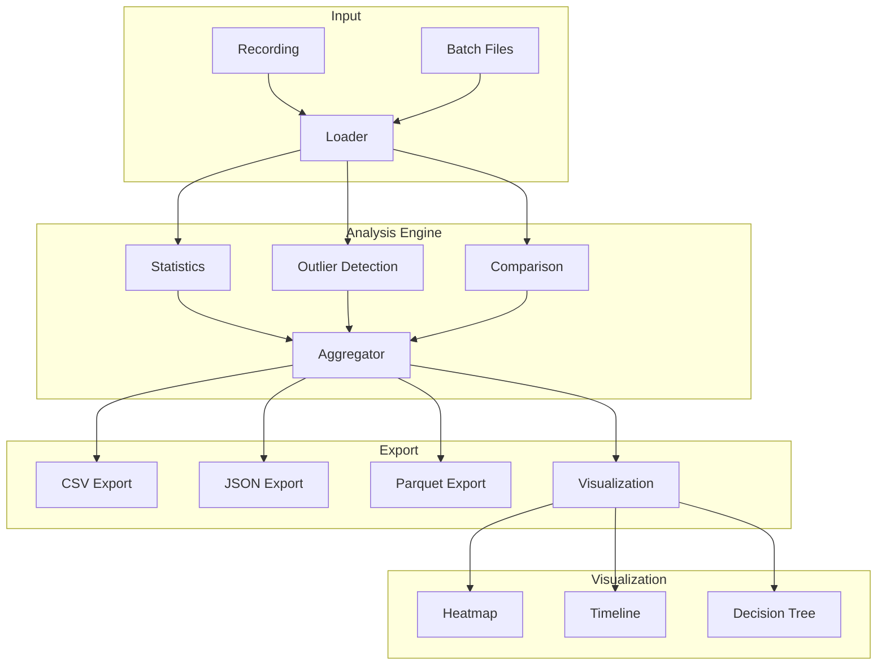

# Design Document

## Overview

This design extends the replay module with statistical analysis, multiple export formats, and visualization generation. Analysis is streaming-capable for large recordings, with batch processing support.

## Architecture



## Components and Interfaces

### Component 1: AnalysisEngine

```rust
pub struct AnalysisEngine {
    config: AnalysisConfig,
}

pub struct AnalysisResult {
    pub latency: LatencyStats,
    pub outliers: Vec<OutlierEvent>,
    pub key_frequency: HashMap<KeyCode, u64>,
    pub decision_paths: Vec<DecisionPath>,
}

pub struct LatencyStats {
    pub min: Duration,
    pub max: Duration,
    pub mean: Duration,
    pub p50: Duration,
    pub p95: Duration,
    pub p99: Duration,
    pub std_dev: Duration,
}

impl AnalysisEngine {
    pub fn analyze(&self, recording: &Recording) -> AnalysisResult;
    pub fn compare(&self, a: &Recording, b: &Recording) -> ComparisonResult;
    pub fn detect_regressions(&self, baseline: &AnalysisResult, current: &AnalysisResult) -> Vec<Regression>;
}
```

### Component 2: Exporter

```rust
pub trait Exporter {
    fn export(&self, result: &AnalysisResult, writer: &mut dyn Write) -> Result<(), ExportError>;
}

pub struct CsvExporter { pub config: CsvConfig }
pub struct JsonExporter { pub pretty: bool }
pub struct ParquetExporter { pub compression: Compression }

impl Exporter for CsvExporter { /* ... */ }
impl Exporter for JsonExporter { /* ... */ }
impl Exporter for ParquetExporter { /* ... */ }
```

### Component 3: Visualizer

```rust
pub enum VisualizationType {
    Heatmap,
    Timeline,
    DecisionTree,
    Comparison,
}

pub struct Visualizer;

impl Visualizer {
    pub fn generate_svg(&self, result: &AnalysisResult, viz_type: VisualizationType) -> String;
    pub fn generate_html(&self, result: &AnalysisResult) -> String;
}
```

## Testing Strategy

- Unit tests for statistical calculations
- Integration tests for export format validity
- Visual regression tests for SVG output
