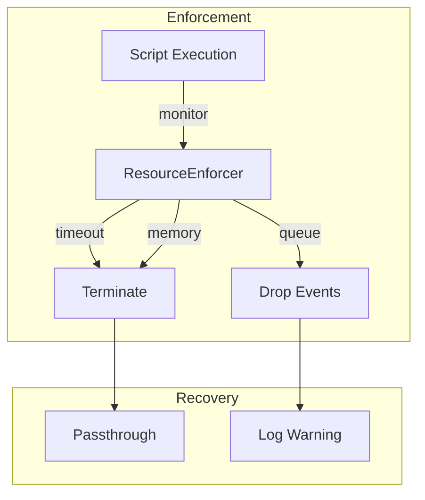

# Design Document

## Overview

This design adds runtime resource enforcement beyond Rhai sandbox limits. The core innovation is a `ResourceEnforcer` that monitors execution time, memory, and queue depth with configurable limits and automatic recovery.

## Architecture



## Components and Interfaces

### Component 1: ResourceEnforcer

```rust
pub struct ResourceEnforcer {
    timeout: Duration,
    memory_limit: usize,
    queue_limit: usize,
    current_memory: AtomicUsize,
    queue_depth: AtomicUsize,
}

impl ResourceEnforcer {
    pub fn new(config: ResourceLimits) -> Self;
    pub fn start_execution(&self) -> ExecutionGuard;
    pub fn check_memory(&self) -> Result<(), ResourceExhausted>;
    pub fn check_queue(&self) -> Result<(), ResourceExhausted>;
    pub fn record_allocation(&self, bytes: usize);
    pub fn record_deallocation(&self, bytes: usize);
}

pub struct ExecutionGuard<'a> {
    enforcer: &'a ResourceEnforcer,
    start: Instant,
}

impl Drop for ExecutionGuard<'_> {
    fn drop(&mut self) {
        // Check timeout, log if exceeded
    }
}
```

### Component 2: ResourceLimits

```rust
#[derive(Debug, Clone, Serialize, Deserialize)]
pub struct ResourceLimits {
    pub execution_timeout: Duration,
    pub memory_limit: usize,
    pub queue_limit: usize,
}

impl Default for ResourceLimits {
    fn default() -> Self {
        Self {
            execution_timeout: Duration::from_millis(100),
            memory_limit: 10 * 1024 * 1024, // 10MB
            queue_limit: 1000,
        }
    }
}
```

## Testing Strategy

- Unit tests for each limit type
- Integration tests with limit-exceeding scripts
- Benchmark enforcement overhead
