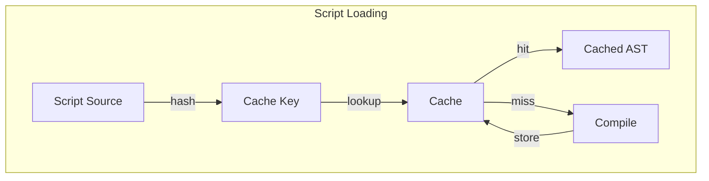

# Design Document

## Overview

This design adds a content-addressable cache for compiled Rhai ASTs. Scripts are identified by their content hash, and compiled ASTs are serialized to disk. On startup, the cache is checked before compilation.

## Architecture



## Components and Interfaces

### Component 1: ScriptCache

```rust
pub struct ScriptCache {
    cache_dir: PathBuf,
    index: Mutex<CacheIndex>,
    max_size: usize,
}

impl ScriptCache {
    pub fn new(cache_dir: PathBuf) -> Self;
    pub fn get(&self, script: &str) -> Option<AST>;
    pub fn put(&self, script: &str, ast: &AST) -> Result<()>;
    pub fn clear(&self) -> Result<()>;
    pub fn stats(&self) -> CacheStats;
}

struct CacheIndex {
    entries: HashMap<String, CacheEntry>, // hash -> entry
}

struct CacheEntry {
    hash: String,
    path: PathBuf,
    size: usize,
    last_used: SystemTime,
}
```

### Component 2: CacheKey

```rust
pub fn cache_key(script: &str) -> String {
    let mut hasher = blake3::Hasher::new();
    hasher.update(script.as_bytes());
    hasher.finalize().to_hex().to_string()
}
```

## Testing Strategy

- Unit tests for cache operations
- Integration tests with real scripts
- Benchmark startup improvement
