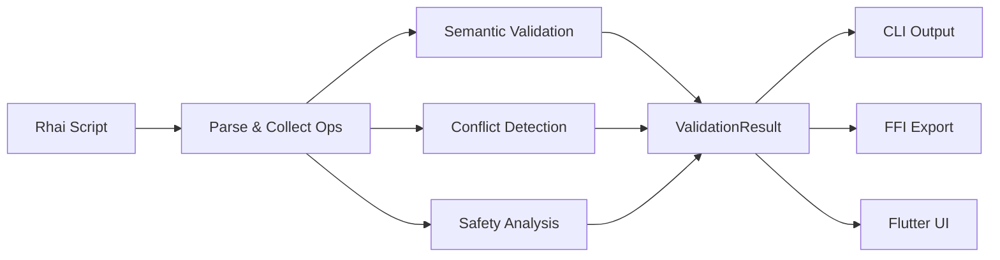

# Design Document: Script Validation & Safety

## Overview

This feature adds a comprehensive validation layer to KeyRx's script processing pipeline. The validation system performs static analysis of Rhai scripts before runtime, detecting semantic errors, conflicts, and dangerous patterns. It integrates with the existing `keyrx check` CLI command, adds new simulation capabilities, and exposes validation through FFI for Flutter UI integration.

The design follows the existing module patterns in `core/src/` and reuses the scripting infrastructure (Rhai engine, key parsing, layer/modifier state) in a non-destructive read-only mode.

## Steering Document Alignment

### Technical Standards (tech.md)

- **Dependency Injection**: Validation uses the same trait-based DI pattern as other modules. `ValidationEngine` accepts injected dependencies for testability.
- **CLI First**: All validation features are CLI-exercisable before any Flutter UI integration.
- **Error Handling**: Follows the structured `KeyRxError` hierarchy with actionable remediation hints.
- **Rhai Contract**: Reuses `KeyCode::from_name()` and existing Rhai bindings for consistent key validation.

### Project Structure (structure.md)

- **Module Location**: `core/src/validation/` following the existing pattern (`core/src/engine/`, `core/src/scripting/`, etc.)
- **Naming Conventions**: `snake_case.rs` files, `PascalCase` structs, `snake_case` functions
- **Test Location**: `core/src/validation/*.rs` with `#[cfg(test)]` modules and `core/tests/validation_integration.rs`
- **CLI Command**: `core/src/cli/commands/check.rs` extended, new `simulate.rs` features

## Code Reuse Analysis

### Existing Components to Leverage

- **`KeyCode::from_name()`** (`drivers/keycodes/mod.rs`): Key name validation with alias support
- **`parse_key_or_error()`** (`scripting/helpers.rs`): Key parsing with error formatting
- **`PendingOps`** (`scripting/pending_ops.rs`): Collects script operations - can be analyzed for conflicts
- **`LayerView` / `ModifierView`** (`scripting/builtins.rs`): Track layer/modifier definitions during script execution
- **`RhaiRuntime`** (`scripting/runtime.rs`): Rhai engine setup with KeyRx bindings
- **`KeyRxError`** (`error.rs`): Error type hierarchy with remediation hints
- **`OutputWriter`** (`cli/output.rs`): JSON/human-readable output formatting

### Integration Points

- **`keyrx check` command** (`cli/commands/check.rs`): Extend from syntax-only to semantic validation
- **`keyrx simulate` command** (`cli/commands/simulate.rs`): Already exists, extend with script-aware simulation
- **FFI layer** (`ffi/exports_script.rs`): Add validation result exports for Flutter UI
- **Flutter UI** (`ui/lib/pages/editor_page.dart`): Display validation results inline

## Architecture

The validation system uses a pipeline architecture where the script is processed through multiple validation passes:



### Modular Design Principles

- **Single File Responsibility**: Each validation type in its own file (`semantic.rs`, `conflicts.rs`, `safety.rs`)
- **Component Isolation**: Validators are independent and can run in parallel
- **Service Layer Separation**: Validation logic separated from CLI presentation and FFI export
- **Utility Modularity**: Key similarity matching in dedicated `suggestions.rs` module

## Components and Interfaces

### ValidationEngine (`validation/engine.rs`)

- **Purpose**: Orchestrates all validation passes and aggregates results
- **Interfaces**:
  ```rust
  pub fn validate(script: &str) -> ValidationResult
  pub fn validate_with_options(script: &str, options: ValidationOptions) -> ValidationResult
  ```
- **Dependencies**: `SemanticValidator`, `ConflictDetector`, `SafetyAnalyzer`
- **Reuses**: `RhaiRuntime` for script parsing, `PendingOps` for operation collection

### SemanticValidator (`validation/semantic.rs`)

- **Purpose**: Validates key names, layer references, modifier references, timing values
- **Interfaces**:
  ```rust
  pub fn validate_operations(ops: &[PendingOp]) -> Vec<ValidationError>
  pub fn suggest_similar_keys(invalid: &str) -> Vec<String>
  ```
- **Dependencies**: `KeyCode`, `strsim` crate for Levenshtein distance
- **Reuses**: `KeyCode::from_name()`, `KeyCode::all_names()`

### ConflictDetector (`validation/conflicts.rs`)

- **Purpose**: Detects overlapping remaps, remap+block conflicts, combo shadowing
- **Interfaces**:
  ```rust
  pub fn detect_conflicts(ops: &[PendingOp]) -> Vec<ValidationWarning>
  pub fn detect_circular_remaps(ops: &[PendingOp]) -> Vec<ValidationWarning>
  ```
- **Dependencies**: None (pure logic on `PendingOp` list)
- **Reuses**: `PendingOp` enum variants

### SafetyAnalyzer (`validation/safety.rs`)

- **Purpose**: Warns about dangerous patterns (lockout risks, emergency combo interference)
- **Interfaces**:
  ```rust
  pub fn analyze_safety(ops: &[PendingOp]) -> Vec<ValidationWarning>
  ```
- **Dependencies**: Emergency exit key codes from `drivers/emergency_exit.rs`
- **Reuses**: `EMERGENCY_EXIT_KEYS` constant

### CoverageAnalyzer (`validation/coverage.rs`)

- **Purpose**: Generates coverage report showing affected keys
- **Interfaces**:
  ```rust
  pub fn analyze_coverage(ops: &[PendingOp]) -> CoverageReport
  pub fn render_ascii_keyboard(coverage: &CoverageReport) -> String
  ```
- **Dependencies**: None
- **Reuses**: `KeyCode` enum for keyboard layout

### ValidationResult (`validation/types.rs`)

- **Purpose**: Structured result type aggregating all validation output
- **Interfaces**: Data structure (see Data Models below)
- **Dependencies**: None
- **Reuses**: None

## Data Models

### ValidationResult

```rust
pub struct ValidationResult {
    /// Script is valid (no errors, warnings allowed)
    pub is_valid: bool,
    /// Semantic and structural errors
    pub errors: Vec<ValidationError>,
    /// Conflict and safety warnings
    pub warnings: Vec<ValidationWarning>,
    /// Coverage analysis (if requested)
    pub coverage: Option<CoverageReport>,
}
```

### ValidationError

```rust
pub struct ValidationError {
    /// Error code for categorization (e.g., "E001")
    pub code: String,
    /// Human-readable error message
    pub message: String,
    /// Source location if available
    pub location: Option<SourceLocation>,
    /// Suggested fixes
    pub suggestions: Vec<String>,
}

pub struct SourceLocation {
    pub line: usize,
    pub column: Option<usize>,
    pub context: Option<String>,  // The problematic line
}
```

### ValidationWarning

```rust
pub struct ValidationWarning {
    /// Warning code for categorization (e.g., "W001")
    pub code: String,
    /// Warning category
    pub category: WarningCategory,
    /// Human-readable message
    pub message: String,
    /// Source location if available
    pub location: Option<SourceLocation>,
}

pub enum WarningCategory {
    Conflict,
    Safety,
    Performance,
}
```

### CoverageReport

```rust
pub struct CoverageReport {
    /// Keys that are remapped
    pub remapped: Vec<KeyCode>,
    /// Keys that are blocked
    pub blocked: Vec<KeyCode>,
    /// Keys with tap-hold behavior
    pub tap_hold: Vec<KeyCode>,
    /// Keys involved in combos
    pub combo_triggers: Vec<KeyCode>,
    /// Keys unaffected by script
    pub unaffected: Vec<KeyCode>,
    /// Per-layer coverage
    pub layers: HashMap<String, LayerCoverage>,
}
```

### ValidationConfig (`validation/config.rs`)

Centralized configuration for all validation thresholds and limits. Loaded from `~/.config/keyrx/validation.toml` with sensible defaults.

```rust
/// Validation configuration - all magic numbers centralized here.
/// Loaded from ~/.config/keyrx/validation.toml or uses defaults.
#[derive(Debug, Clone, Serialize, Deserialize)]
#[serde(default)]
pub struct ValidationConfig {
    /// Maximum errors to report before stopping (prevents flood)
    pub max_errors: usize,
    /// Maximum suggestions for invalid key names
    pub max_suggestions: usize,
    /// Levenshtein distance threshold for "similar" keys
    pub similarity_threshold: usize,
    /// Number of blocked keys before warning user
    pub blocked_keys_warning_threshold: usize,
    /// Maximum depth for circular remap detection (A→B→C→...→A)
    pub max_cycle_depth: usize,
    /// Tap timeout range for warnings [min, max] in ms
    pub tap_timeout_warn_range: (u32, u32),
    /// Combo timeout range for warnings [min, max] in ms
    pub combo_timeout_warn_range: (u32, u32),
    /// Debounce delay for Flutter UI validation (ms)
    pub ui_validation_debounce_ms: u32,
}

impl Default for ValidationConfig {
    fn default() -> Self {
        Self {
            max_errors: 20,
            max_suggestions: 5,
            similarity_threshold: 3,
            blocked_keys_warning_threshold: 10,
            max_cycle_depth: 10,
            tap_timeout_warn_range: (50, 500),
            combo_timeout_warn_range: (10, 100),
            ui_validation_debounce_ms: 500,
        }
    }
}

impl ValidationConfig {
    /// Load from file or return defaults
    pub fn load() -> Self {
        Self::load_from_path(config_path()).unwrap_or_default()
    }

    /// Load from specific path (for testing)
    pub fn load_from_path(path: impl AsRef<Path>) -> Option<Self> {
        let content = std::fs::read_to_string(path).ok()?;
        toml::from_str(&content).ok()
    }
}

fn config_path() -> PathBuf {
    dirs::config_dir()
        .unwrap_or_else(|| PathBuf::from("."))
        .join("keyrx")
        .join("validation.toml")
}
```

**Example `~/.config/keyrx/validation.toml`:**
```toml
# Validation Configuration
max_errors = 20
max_suggestions = 5
similarity_threshold = 3
blocked_keys_warning_threshold = 10
max_cycle_depth = 10
tap_timeout_warn_range = [50, 500]
combo_timeout_warn_range = [10, 100]
ui_validation_debounce_ms = 500
```

### ValidationOptions

```rust
pub struct ValidationOptions {
    /// Treat warnings as errors
    pub strict: bool,
    /// Suppress warnings
    pub no_warnings: bool,
    /// Include coverage analysis
    pub include_coverage: bool,
    /// Include ASCII keyboard visualization
    pub include_visual: bool,
    /// Override config values (optional)
    pub config_override: Option<ValidationConfig>,
}
```

## Error Handling

### Error Scenarios

1. **Invalid Key Name**
   - **Handling**: Collect error with line/column, compute similar key suggestions using Levenshtein distance
   - **User Impact**: See error with location and "Did you mean: X, Y, Z?" suggestions

2. **Undefined Layer Reference**
   - **Handling**: Collect error, list defined layers as suggestions
   - **User Impact**: See error with "Layer 'foo' not defined. Defined layers: base, nav, symbols"

3. **Conflicting Remaps**
   - **Handling**: Collect warning showing both mappings and which one wins
   - **User Impact**: See warning "Key 'A' remapped twice: A→B (line 5) overridden by A→C (line 10)"

4. **Dangerous Pattern**
   - **Handling**: Collect warning with specific risk description
   - **User Impact**: See warning "Blocking Escape key may make it difficult to exit applications"

5. **Script Parse Error**
   - **Handling**: Fall back to existing Rhai compile error with line/column
   - **User Impact**: Existing behavior preserved

## Testing Strategy

### Unit Testing

- **Semantic validation**: Test each key name validation, layer/modifier reference validation
- **Conflict detection**: Test duplicate remap, remap+block, combo shadowing scenarios
- **Safety analysis**: Test each dangerous pattern detection
- **Suggestions**: Test Levenshtein similarity with known typos
- **Coverage**: Test coverage categorization

### Integration Testing

- Test full validation pipeline with real scripts
- Test CLI output format (human and JSON)
- Test FFI export roundtrip
- Test interaction with existing `keyrx check` behavior

### End-to-End Testing

- Validate sample scripts from `scripts/` directory
- Ensure no false positives on valid scripts
- Test Flutter UI displays validation results correctly
