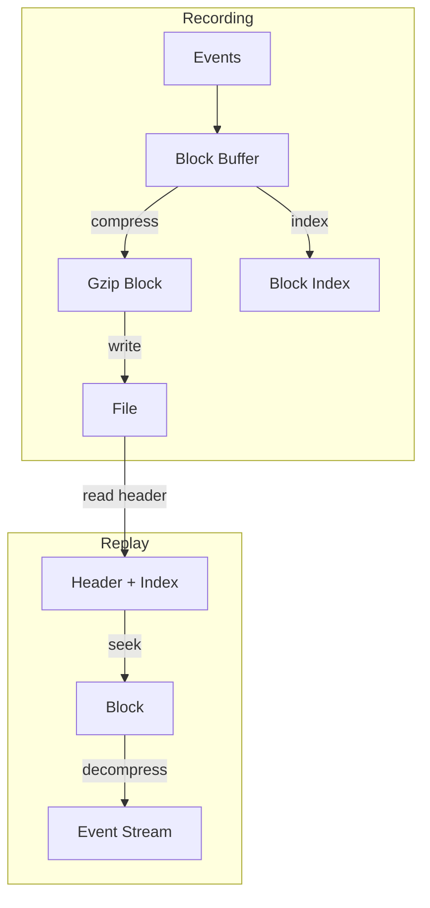

# Design Document

## Overview

This design optimizes session recording with gzip compression, time-based indexing, and streaming replay. The file format includes a header with index, compressed event blocks, and allows random access via block offsets.

## Architecture



## Components and Interfaces

### Component 1: SessionRecorder

```rust
pub struct SessionRecorder {
    file: BufWriter<File>,
    buffer: Vec<RecordedEvent>,
    index: Vec<BlockIndex>,
    compressor: GzEncoder<Vec<u8>>,
}

struct BlockIndex {
    start_time: u64,
    end_time: u64,
    offset: u64,
    compressed_size: u32,
}

impl SessionRecorder {
    pub fn new(path: &Path) -> Result<Self>;
    pub fn record(&mut self, event: InputEvent);
    pub fn flush(&mut self) -> Result<()>;
    pub fn finish(self) -> Result<SessionMetadata>;
}
```

### Component 2: SessionPlayer

```rust
pub struct SessionPlayer {
    file: BufReader<File>,
    index: Vec<BlockIndex>,
    current_block: Option<DecompressedBlock>,
}

impl SessionPlayer {
    pub fn open(path: &Path) -> Result<Self>;
    pub fn seek(&mut self, time: u64) -> Result<()>;
    pub fn next(&mut self) -> Option<RecordedEvent>;
    pub fn metadata(&self) -> &SessionMetadata;
}
```

## Testing Strategy

- Unit tests for compression/decompression
- Integration tests with real sessions
- Benchmark recording overhead
