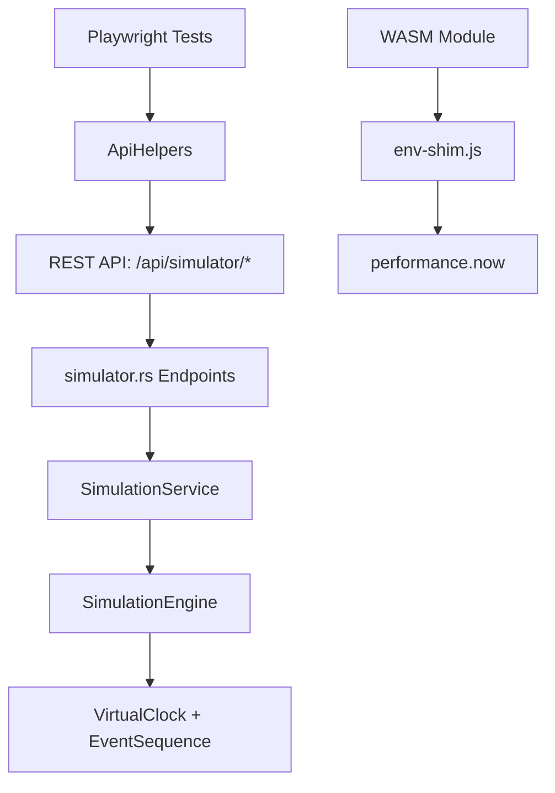

# Design Document: Simulation REST API

## Overview

Wire the existing `SimulationEngine` to REST API endpoints, fix the WASM `env.now` import error, and extend E2E test infrastructure. This completes the simulation infrastructure for deterministic keyboard configuration testing.

## Steering Document Alignment

### Technical Standards (tech.md)
- **Four-Crate Architecture**: Changes limited to keyrx_daemon (services, API) and keyrx_ui (WASM shim, E2E tests)
- **axum Web Framework**: New endpoints follow existing Router + State pattern
- **Dependency Injection**: SimulationService injected via AppState
- **Structured Logging**: JSON responses follow existing ApiError patterns

### Project Structure (structure.md)
- Services go in `keyrx_daemon/src/services/`
- API endpoints in `keyrx_daemon/src/web/api/`
- E2E tests in `keyrx_ui/tests/e2e/`

## Code Reuse Analysis

### Existing Components to Leverage

- **SimulationEngine** (`keyrx_daemon/src/config/simulation_engine.rs`): Complete simulation logic with VirtualClock, event replay, built-in scenarios
- **ApiError** (`keyrx_daemon/src/web/error.rs`): Standardized error responses
- **AppState** (`keyrx_daemon/src/web/mod.rs`): Dependency injection pattern
- **TestApp** (`keyrx_daemon/tests/common/test_app.rs`): Backend integration test fixture
- **ApiHelpers** (`keyrx_ui/tests/e2e/fixtures/api.ts`): E2E API test utilities

### Integration Points

- **Existing simulator.rs**: Extend with SimulationService calls
- **Existing services/mod.rs**: Register new SimulationService
- **Existing env-shim.js**: Add `now()` function for WASM

## Architecture



### Modular Design Principles
- **Single File Responsibility**: SimulationService handles lifecycle, SimulationEngine handles logic
- **Component Isolation**: Service layer separates HTTP from simulation
- **Service Layer Separation**: API → Service → Engine hierarchy
- **Utility Modularity**: Event DSL parsing stays in SimulationEngine

## Components and Interfaces

### SimulationService
- **Purpose:** Manage SimulationEngine lifecycle and provide simulation operations
- **Interfaces:**
  - `load_profile(name: &str) -> Result<(), SimulationError>`
  - `replay(sequence: &EventSequence) -> Result<Vec<OutputEvent>, SimulationError>`
  - `run_scenario(scenario: BuiltinScenario) -> Result<ScenarioResult, SimulationError>`
  - `run_all_scenarios() -> Result<Vec<ScenarioResult>, SimulationError>`
  - `replay_dsl(dsl: &str, seed: u64) -> Result<Vec<OutputEvent>, SimulationError>`
  - `reset()`
- **Dependencies:** SimulationEngine, config directory path
- **Reuses:** SimulationEngine from `keyrx_daemon/src/config/simulation_engine.rs`

### Updated simulator.rs Endpoints
- **Purpose:** REST API endpoints for simulation operations
- **Interfaces:**
  - `POST /api/simulator/load-profile` - Load profile for simulation
  - `POST /api/simulator/events` - Simulate events (scenario/DSL/custom)
  - `POST /api/simulator/scenarios/all` - Run all built-in scenarios
  - `POST /api/simulator/reset` - Reset simulator state
- **Dependencies:** SimulationService via AppState
- **Reuses:** ApiError for error handling, existing Router patterns

### Updated env-shim.js
- **Purpose:** Provide WASM environment imports
- **Interfaces:**
  - `now() -> BigInt` - Returns high-resolution timestamp in nanoseconds
- **Dependencies:** performance.now() browser API
- **Reuses:** Existing shim file structure

### Extended ApiHelpers
- **Purpose:** E2E test utilities for simulation endpoints
- **Interfaces:**
  - `loadSimulatorProfile(name: string)`
  - `simulateEventsDsl(dsl: string, seed?: number)`
  - `simulateScenario(name: string)`
  - `runAllScenarios()`
- **Dependencies:** Playwright APIRequestContext
- **Reuses:** Existing ApiHelpers class patterns

## Data Models

### SimulateEventsRequest
```typescript
interface SimulateEventsRequest {
  scenario?: string;      // Built-in scenario name
  dsl?: string;           // Event DSL (e.g., "press:A,wait:50,release:A")
  events?: SimulatedEvent[];  // Custom event sequence
  seed?: number;          // Seed for deterministic behavior
}
```

### SimulateEventsResponse
```typescript
interface SimulateEventsResponse {
  success: boolean;
  event_count: number;
  outputs: OutputEvent[];
  duration_us: number;
}
```

### OutputEvent
```typescript
interface OutputEvent {
  key: string;
  event_type: 'press' | 'release';
  timestamp_us: number;
}
```

### AllScenariosResponse
```typescript
interface AllScenariosResponse {
  success: boolean;
  scenarios: ScenarioResult[];
  passed: number;
  failed: number;
}
```

## Error Handling

### Error Scenarios

1. **Profile Not Found**
   - **Handling:** Return 400 Bad Request with "Unknown profile" message
   - **User Impact:** Clear error message with available profiles list

2. **No Profile Loaded**
   - **Handling:** Return 500 Internal Error with "No profile loaded" message
   - **User Impact:** Clear guidance to load profile first

3. **Invalid DSL Syntax**
   - **Handling:** Return 400 Bad Request with parsing error details
   - **User Impact:** Error includes expected format examples

4. **Unknown Scenario**
   - **Handling:** Return 400 Bad Request listing available scenarios
   - **User Impact:** Error includes list of valid scenario names

5. **WASM Module Load Failure**
   - **Handling:** Browser console error with diagnostic info
   - **User Impact:** WASM status badge shows error state

## Testing Strategy

### Unit Testing
- SimulationService methods tested with mock KRX files
- Event DSL parsing edge cases
- Error handling for missing profiles

### Integration Testing
- Backend tests via TestApp fixture
- Full request/response validation
- Deterministic replay verification (same seed = same result)

### End-to-End Testing
- Playwright tests via ApiHelpers
- Built-in scenario execution
- DSL simulation
- Error handling scenarios
- UI integration (if WASM loads successfully)

## Files to Modify/Create

| File | Action | Purpose |
|------|--------|---------|
| `keyrx_ui/src/wasm/env-shim.js` | Modify | Add `now()` function |
| `keyrx_daemon/src/services/simulation_service.rs` | Create | SimulationService |
| `keyrx_daemon/src/services/mod.rs` | Modify | Export SimulationService |
| `keyrx_daemon/src/web/mod.rs` | Modify | Add SimulationService to AppState |
| `keyrx_daemon/src/web/api/simulator.rs` | Modify | Wire endpoints to service |
| `keyrx_daemon/src/main.rs` | Modify | Initialize SimulationService |
| `keyrx_daemon/tests/common/test_app.rs` | Modify | Add SimulationService to TestApp |
| `keyrx_daemon/tests/simulator_api_test.rs` | Create | Backend integration tests |
| `keyrx_ui/tests/e2e/fixtures/api.ts` | Modify | Add simulation methods |
| `keyrx_ui/tests/e2e/api/simulator.spec.ts` | Create | E2E API tests |
