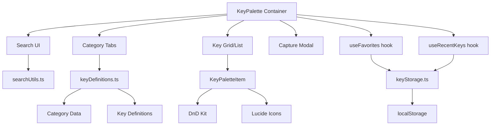

# Design Document

## Overview

The sophisticated-key-palette feature transforms the current basic 4-category key palette into a comprehensive, professional-grade key selection interface inspired by industry-leading keyboard configurators (QMK Configurator and VIA). The feature provides users with a categorized catalog of 250+ keycodes, fuzzy search capabilities, physical key capture, drag-and-drop visual feedback, and advanced features like recent/favorite keys and custom keycode input.

This design follows a modular architecture with clear separation of concerns:
- **Data Layer**: Comprehensive key definitions database with metadata
- **UI Layer**: React components for palette display, search, and interaction
- **Integration Layer**: Hooks for localStorage persistence and WebSocket communication
- **Testing Layer**: Comprehensive unit tests with mock implementations

The implementation prioritizes code reuse, leveraging existing components (Card, Button, Dropdown) and utilities (keyCodeMapping.ts, timeFormatting.ts). New utilities will be extracted into shared modules to prevent duplication.

## Steering Document Alignment

### Technical Standards (tech.md)

**SOLID Principles**:
- **Single Responsibility**: Each component has one clear purpose
  - `KeyPalette.tsx`: Category navigation, search UI, layout
  - `KeyPaletteItem.tsx`: Individual key display and interactions
  - `keyDefinitions.ts`: Single source of truth for key metadata
  - `searchUtils.ts`: Fuzzy search logic
  - `keyStorage.ts`: localStorage persistence abstraction

- **Open/Closed**: Extensible via data-driven design
  - New categories added by extending `keyDefinitions.ts`
  - New key types added without modifying component logic

- **Liskov Substitution**: Storage abstractions are substitutable
  - `KeyStorage` interface allows mock implementations for testing

- **Interface Segregation**: Focused interfaces
  - `onKeySelect` callback remains unchanged for backward compatibility
  - Internal interfaces (`KeyDefinition`, `PaletteKey`) are focused

- **Dependency Inversion**: Abstractions over concrete implementations
  - localStorage accessed via `KeyStorage` abstraction
  - Key definitions accessed via utility functions

**Dependency Injection**:
- `KeyStorage` interface injected into components for testability
- Mock implementations provided for tests
- No hard-coded localStorage references in components

**SSOT (Single Source of Truth)**:
- `keyDefinitions.ts` is the ONLY source for key metadata
- Recent/favorite keys stored in localStorage with validation
- No duplication of key data across components

**KISS (Keep It Simple)**:
- Custom fuzzy search (no external library) using simple scoring
- Grid/list view toggle via Tailwind classes (no complex layout library)
- Physical capture uses standard DOM keyboard events

**Code Quality**:
- Maximum 500 lines per file (enforced by pre-commit)
- Maximum 50 lines per function
- 80% minimum test coverage (90% for critical paths)
- Structured error handling with user feedback

### Project Structure (structure.md)

**File Organization**:
```
keyrx_ui/src/
├── components/
│   ├── KeyPalette.tsx              # Main palette (≤500 lines)
│   ├── KeyPaletteItem.tsx          # Individual key display
│   ├── KeyPaletteSearch.tsx        # Search UI
│   └── KeyCaptureModal.tsx         # Physical capture modal
├── data/
│   └── keyDefinitions.ts           # Key database (≤500 lines)
├── utils/
│   ├── searchUtils.ts              # Fuzzy search logic
│   └── keyStorage.ts               # localStorage abstraction
├── hooks/
│   ├── useFavorites.ts             # Favorites state management
│   └── useRecentKeys.ts            # Recent keys state management
└── __tests__/
    ├── KeyPalette.test.tsx
    ├── KeyPaletteItem.test.tsx
    └── searchUtils.test.ts
```

**Naming Conventions**:
- Components: `PascalCase.tsx`
- Hooks: `use[Feature].ts`
- Utilities: `camelCase.ts`
- Test files: `[Component].test.tsx`

**Import Order**:
```typescript
// 1. React and framework
import React, { useState, useEffect } from 'react';

// 2. External dependencies
import { Search, Star, Keyboard } from 'lucide-react';

// 3. Internal modules (absolute from src/)
import { Card } from '@/components/Card';
import { getKeysByCategory, searchKeys } from '@/data/keyDefinitions';

// 4. Relative imports
import { KeyPaletteItem } from './KeyPaletteItem';

// 5. Styles
import './KeyPalette.css';
```

## Code Reuse Analysis

### Existing Components to Leverage

- **Card**: Used for palette container (already exists)
- **Button**: Used for category tabs, actions (already exists)
- **Dropdown**: Potential use for layer selection in LT() function
- **Existing KeyPalette.tsx**: Starting point for refactor
  - Current categories: virtual_key, modifier, lock, layer
  - Current keys: ~100 basic keys
  - Grid layout already implemented

### Existing Utilities to Leverage

- **keyCodeMapping.ts**: Translation between key codes and labels
  - `formatKeyCode()`: Convert code to label
  - `keyCodeToLabel()`: Label conversion
  - `parseKeyCode()`: Reverse lookup
  - Will extend with QMK prefix support (KC_, VK_)

- **useLocalStorage hook** (if exists): Persist recent/favorites
  - If not exists, will create abstraction

### Integration Points

- **onKeySelect callback**: Unchanged for backward compatibility
  - Current signature: `(key: PaletteKey) => void`
  - Will continue to work with existing consumers

- **PaletteKey interface**: Extended, not broken
  - Current: `{ id, label, category, description? }`
  - New: `{ id, label, category, subcategory?, description?, aliases?, icon? }`
  - Backward compatible (optional fields)

- **DnD Kit (@dnd-kit)**: Already integrated for drag-and-drop
  - Will enhance with DragOverlay, drop zone feedback
  - No new dependencies needed

- **localStorage**: Persist user preferences
  - Recent keys (max 10, FIFO)
  - Favorite keys
  - View mode (grid/list)

## Architecture

### High-Level Architecture



### Data Flow

1. **Initialization**:
   - Load key definitions from `keyDefinitions.ts`
   - Restore recent/favorites from localStorage
   - Restore view preference from localStorage

2. **Search Flow**:
   - User types in search input
   - `searchUtils.ts` filters keys using fuzzy matching
   - Matching text highlighted in results
   - Empty state shown if no results

3. **Selection Flow**:
   - User clicks key OR drags key to keyboard
   - Key added to recent list (FIFO, max 10)
   - `onKeySelect` callback invoked
   - Recent list persisted to localStorage

4. **Favorites Flow**:
   - User clicks star icon on key
   - Key added/removed from favorites
   - Favorites persisted to localStorage

5. **Physical Capture Flow**:
   - User clicks "Capture Key" button
   - Modal opens, listens for keydown
   - DOM event.code mapped to key ID
   - Confirmation shown, user accepts/cancels

### Modular Design Principles

**Single File Responsibility**:
- `KeyPalette.tsx` (≤500 lines): Layout, category navigation, search orchestration
- `KeyPaletteItem.tsx` (≤200 lines): Individual key rendering, tooltips, icons
- `KeyPaletteSearch.tsx` (≤150 lines): Search input, keyboard navigation
- `KeyCaptureModal.tsx` (≤200 lines): Physical capture UI and logic
- `keyDefinitions.ts` (≤500 lines): Key data, category structure, utility functions
- `searchUtils.ts` (≤200 lines): Fuzzy search algorithm, highlighting
- `keyStorage.ts` (≤150 lines): localStorage abstraction, validation

**Component Isolation**:
- Each component receives props, not global state
- Components don't directly access localStorage
- Hooks (`useFavorites`, `useRecentKeys`) manage state

**Service Layer Separation**:
- Data access: `keyDefinitions.ts` (read-only)
- Storage: `keyStorage.ts` (read/write localStorage)
- Business logic: `searchUtils.ts` (search/filter)
- Presentation: Components (React)

**Utility Modularity**:
- `searchUtils.ts`: Focused on search only
- `keyStorage.ts`: Focused on persistence only
- No mixed concerns

## Components and Interfaces

### KeyPalette (Main Container)

**Purpose**: Orchestrates palette UI, category navigation, search, and view mode

**Props**:
```typescript
interface KeyPaletteProps {
  onKeySelect: (key: PaletteKey) => void;
  selectedKey?: PaletteKey | null;
  storage?: KeyStorage; // Injected for testing
}
```

**State**:
```typescript
const [activeCategory, setActiveCategory] = useState<Category>('basic');
const [searchQuery, setSearchQuery] = useState<string>('');
const [viewMode, setViewMode] = useState<'grid' | 'list'>('grid');
const [isCaptureMode, setIsCaptureMode] = useState<boolean>(false);
```

**Hooks**:
```typescript
const { favorites, toggleFavorite } = useFavorites(storage);
const { recentKeys, addRecent } = useRecentKeys(storage);
```

**Responsibilities**:
- Render category tabs
- Render search input
- Render recent/favorites sections
- Render key grid/list
- Manage view toggle
- Trigger capture modal

**Dependencies**:
- `Card` component
- `Button` component
- `KeyPaletteSearch`
- `KeyPaletteItem`
- `KeyCaptureModal`
- `useFavorites` hook
- `useRecentKeys` hook

**Reuses**:
- Existing `Card` component for container
- Existing grid layout pattern from current palette

### KeyPaletteItem

**Purpose**: Renders individual key with icon, label, tooltip, and interactions

**Props**:
```typescript
interface KeyPaletteItemProps {
  keyDef: KeyDefinition;
  isSelected: boolean;
  isFavorite: boolean;
  viewMode: 'grid' | 'list';
  onSelect: (key: KeyDefinition) => void;
  onToggleFavorite: (keyId: string) => void;
}
```

**Responsibilities**:
- Display key icon (category-specific)
- Display key label and secondary text
- Display tooltip on hover
- Render star icon for favorites
- Handle click selection
- Support drag-and-drop

**Dependencies**:
- Lucide icons (Keyboard, Layers, Volume, etc.)
- `@dnd-kit` for drag-and-drop

**Reuses**:
- Existing button styling patterns
- Existing tooltip patterns (if exists)

### KeyPaletteSearch

**Purpose**: Search input with fuzzy matching and keyboard navigation

**Props**:
```typescript
interface KeyPaletteSearchProps {
  onSearch: (query: string) => void;
  resultCount: number;
}
```

**State**:
```typescript
const [query, setQuery] = useState<string>('');
const [selectedIndex, setSelectedIndex] = useState<number>(0);
```

**Responsibilities**:
- Render search input
- Handle keyboard navigation (arrows, enter, escape)
- Display result count
- Display "No results" state with suggestions

**Dependencies**:
- Lucide `Search` icon

### KeyCaptureModal

**Purpose**: Captures physical key press and maps to key ID

**Props**:
```typescript
interface KeyCaptureModalProps {
  isOpen: boolean;
  onCapture: (keyId: string) => void;
  onCancel: () => void;
}
```

**State**:
```typescript
const [capturedKey, setCapturedKey] = useState<string | null>(null);
const [capturedLabel, setCapturedLabel] = useState<string>('');
```

**Responsibilities**:
- Listen for keydown events when open
- Map DOM event.code to key ID
- Show confirmation UI
- Prevent default browser behavior
- Handle escape to cancel

**Dependencies**:
- `keyCodeMapping.ts` for event.code → key ID mapping

**Reuses**:
- Existing modal patterns (if exists)

### useFavorites Hook

**Purpose**: Manage favorite keys state with localStorage persistence

**Interface**:
```typescript
function useFavorites(storage?: KeyStorage): {
  favorites: Set<string>;
  toggleFavorite: (keyId: string) => void;
  isFavorite: (keyId: string) => boolean;
}
```

**Responsibilities**:
- Load favorites from storage on mount
- Add/remove favorites
- Persist changes to storage
- Handle storage errors gracefully

**Dependencies**:
- `keyStorage.ts` abstraction

### useRecentKeys Hook

**Purpose**: Manage recent keys list with FIFO logic

**Interface**:
```typescript
function useRecentKeys(storage?: KeyStorage): {
  recentKeys: string[]; // Array of key IDs (max 10)
  addRecent: (keyId: string) => void;
}
```

**Responsibilities**:
- Load recent keys from storage on mount
- Add key to front of list
- Remove duplicates
- Enforce max 10 items (FIFO)
- Persist changes to storage

**Dependencies**:
- `keyStorage.ts` abstraction

## Data Models

### KeyDefinition

```typescript
interface KeyDefinition {
  id: string;           // Unique identifier (e.g., "A", "F1", "MD_00")
  label: string;        // Display label (e.g., "A", "F1", "Mod 0")
  category: KeyCategory; // Primary category
  subcategory?: string; // Optional subcategory (e.g., "Letters", "Function")
  description?: string; // Tooltip description
  aliases?: string[];   // Alternative names (e.g., ["KC_A", "VK_A"])
  icon?: string;        // Lucide icon name (optional)
}

type KeyCategory =
  | 'basic'      // Letters, numbers, punctuation, navigation
  | 'modifiers'  // Standard + custom modifiers
  | 'media'      // Volume, playback, brightness
  | 'macro'      // User-defined macros
  | 'layers'     // Layer functions (MO, TO, TG, OSL, LT)
  | 'special'    // Mouse, system, unicode
  | 'any';       // Custom keycode input
```

### PaletteKey (Backward Compatible)

```typescript
// Extended from existing interface
export interface PaletteKey {
  id: string;
  label: string;
  category: 'virtual_key' | 'modifier' | 'lock' | 'layer'; // Legacy categories
  description?: string;

  // New optional fields (backward compatible)
  subcategory?: string;
  aliases?: string[];
  icon?: string;
}
```

**Migration Strategy**:
- New categories map to legacy categories:
  - `basic` → `virtual_key`
  - `modifiers` → `modifier`
  - `layers` → `layer`
- Components using `PaletteKey` continue to work
- New features use `KeyDefinition` internally

### CategoryDefinition

```typescript
interface CategoryDefinition {
  id: KeyCategory;
  label: string;
  icon: string; // Lucide icon name
  subcategories?: SubcategoryDefinition[];
}

interface SubcategoryDefinition {
  id: string;
  label: string;
  keys: string[]; // Array of key IDs
}
```

### KeyStorage Interface

```typescript
interface KeyStorage {
  get<T>(key: string): T | null;
  set<T>(key: string, value: T): void;
  remove(key: string): void;
}

class LocalStorageImpl implements KeyStorage {
  get<T>(key: string): T | null {
    try {
      const item = localStorage.getItem(key);
      return item ? JSON.parse(item) : null;
    } catch {
      return null;
    }
  }

  set<T>(key: string, value: T): void {
    try {
      localStorage.setItem(key, JSON.stringify(value));
    } catch (err) {
      console.warn('localStorage write failed:', err);
    }
  }

  remove(key: string): void {
    try {
      localStorage.removeItem(key);
    } catch {}
  }
}

class MockStorage implements KeyStorage {
  private store = new Map<string, unknown>();

  get<T>(key: string): T | null {
    return (this.store.get(key) as T) || null;
  }

  set<T>(key: string, value: T): void {
    this.store.set(key, value);
  }

  remove(key: string): void {
    this.store.delete(key);
  }
}
```

## Error Handling

### Error Scenarios

1. **localStorage Unavailable**
   - **Handling**: Graceful degradation, in-memory fallback
   - **User Impact**: Recent/favorites not persisted, but feature still works
   - **Implementation**: Try/catch around localStorage calls, log warning

2. **localStorage Quota Exceeded**
   - **Handling**: Log error, continue with in-memory state
   - **User Impact**: Favorites/recent not saved, no visual error
   - **Implementation**: Catch QuotaExceededError, warn user via console

3. **Invalid JSON in localStorage**
   - **Handling**: Clear corrupted data, start fresh
   - **User Impact**: Lost recent/favorites, no crash
   - **Implementation**: JSON.parse in try/catch, remove key on error

4. **Custom Keycode Validation Failure**
   - **Handling**: Display red X icon and error message
   - **User Impact**: Cannot apply invalid keycode, clear guidance provided
   - **Implementation**: Validate regex patterns, show specific error

5. **Physical Key Capture - Unmappable Key**
   - **Handling**: Show "Key not supported" message
   - **User Impact**: User understands limitation, can cancel and search manually
   - **Implementation**: Check event.code against known mappings

6. **Search Returns No Results**
   - **Handling**: Display empty state with suggestions
   - **User Impact**: User gets guidance on alternative searches
   - **Implementation**: Show "Try: basic, modifiers, media" message

7. **Drag-and-Drop Browser Incompatibility**
   - **Handling**: Fall back to click-to-select mode
   - **User Impact**: Click works even if drag doesn't
   - **Implementation**: Feature detection, hide drag affordances if unsupported

## Testing Strategy

### Unit Testing

**Components**:
- `KeyPalette.test.tsx`:
  - Renders all category tabs
  - Switches categories on click
  - Filters keys based on search
  - Displays recent keys section
  - Displays favorites section
  - Persists view mode to storage
  - Opens capture modal on button click

- `KeyPaletteItem.test.tsx`:
  - Renders key with label and icon
  - Shows tooltip on hover
  - Calls onSelect on click
  - Toggles favorite on star click
  - Renders differently in grid vs list view
  - Applies selected state styling

- `KeyPaletteSearch.test.tsx`:
  - Filters keys as user types
  - Shows result count
  - Navigates results with arrow keys
  - Selects key on Enter
  - Clears search on Escape
  - Shows "No results" state

- `KeyCaptureModal.test.tsx`:
  - Captures physical key press
  - Maps event.code to key ID
  - Shows confirmation UI
  - Cancels on Escape
  - Prevents default browser behavior

**Utilities**:
- `searchUtils.test.ts`:
  - Fuzzy matches across id, label, description
  - Scores matches correctly
  - Highlights matching text
  - Handles empty query
  - Handles no results

- `keyStorage.test.ts`:
  - Reads from localStorage
  - Writes to localStorage
  - Handles JSON parse errors
  - Handles quota exceeded
  - MockStorage works correctly

**Hooks**:
- `useFavorites.test.ts`:
  - Loads favorites from storage
  - Toggles favorite on/off
  - Persists changes
  - Handles storage errors

- `useRecentKeys.test.ts`:
  - Loads recent keys from storage
  - Adds key to front of list
  - Removes duplicates
  - Enforces max 10 items
  - Persists changes

**Mock Implementations**:
- Use `MockStorage` for localStorage in tests
- Mock `keyCodeMapping.ts` functions
- Mock DOM keyboard events for capture tests
- Use React Testing Library's `renderWithProviders`

### Integration Testing

**End-to-End Flows**:
1. **Full Search Flow**:
   - User types "ctrl"
   - Results filtered to control-related keys
   - Matching text highlighted
   - User presses Enter
   - First result selected
   - Recent keys updated

2. **Favorites Flow**:
   - User clicks star on key
   - Key added to favorites section
   - Favorites persisted to localStorage
   - Page reload restores favorites

3. **Physical Capture Flow**:
   - User clicks "Capture Key"
   - Modal opens
   - User presses "A" key
   - Confirmation shows "A"
   - User confirms
   - Key "A" selected

4. **Drag-and-Drop Flow**:
   - User drags key from palette
   - Drag preview follows cursor
   - Drop zone highlighted on keyboard
   - User drops key
   - onKeySelect called
   - Success animation plays

**Test Data**:
- Fixtures for key definitions
- Mock localStorage data
- Mock keyboard events

**Coverage Goals**:
- Overall: ≥80% line and branch coverage
- Critical paths (search, persistence): ≥90% coverage
- Integration tests verify cross-component interactions

### End-to-End Testing

**User Scenarios**:
1. **First-time user discovers media keys**:
   - Opens palette
   - Clicks "Media" tab
   - Sees volume, playback, brightness keys
   - Clicks a key, assigns to keyboard

2. **Power user inputs custom keycode**:
   - Opens palette
   - Clicks "Any" tab
   - Types "LCTL(KC_C)"
   - Validation passes (green checkmark)
   - Clicks Apply
   - Custom keycode assigned

3. **Frequent user assigns common key**:
   - Opens palette
   - Sees "Recent" section
   - Clicks previously-used key directly
   - Key assigned without search

**Accessibility Testing**:
- Keyboard navigation works (Tab, Arrow keys, Enter)
- Focus indicators visible
- ARIA labels on interactive elements
- Screen reader compatible

**Performance Testing**:
- Search completes in <50ms for 250+ keys
- Grid renders without jank (60fps)
- Drag preview renders within 16ms

## Implementation Phases

### Phase 1: Foundation (Tasks 1.1-1.2)

**Deliverables**:
- `keyDefinitions.ts` with 250+ keys
- Updated `KeyPalette.tsx` with 7 categories
- Basic category navigation working
- All existing keys categorized

**Testing**:
- Unit tests for key definitions
- Category navigation tests

### Phase 2: Search (Tasks 2.1-2.2)

**Deliverables**:
- `searchUtils.ts` with fuzzy search
- `KeyPaletteSearch.tsx` component
- Recent/favorites sections
- `useFavorites` and `useRecentKeys` hooks
- `keyStorage.ts` abstraction

**Testing**:
- Search utility tests
- Recent/favorites persistence tests
- Hook tests

### Phase 3: Visual Enhancements (Tasks 4.1-4.2)

**Deliverables**:
- `KeyPaletteItem.tsx` with icons and tooltips
- Grid/list view toggle
- Category-specific color coding
- View preference persistence

**Testing**:
- Item rendering tests
- View toggle tests

### Phase 4: Advanced Features (Tasks 3.1, 5.1, 6.1, 7.1)

**Deliverables**:
- Custom keycode input ("Any" category)
- Enhanced drag-and-drop feedback
- Physical key capture
- Layer function keys (MO, TO, TG, OSL, LT)

**Testing**:
- Custom input validation tests
- Capture modal tests
- Layer function tests

### Phase 5: Testing and Polish (Task 8.1)

**Deliverables**:
- Comprehensive test suite
- Bug fixes
- Performance optimization
- Documentation

**Testing**:
- All tests passing
- Coverage ≥80% (≥90% for critical paths)
- Integration tests verified

## Security Considerations

**Custom Input Validation**:
- No `eval()` or `innerHTML` with user input
- Regex-based validation for QMK syntax
- Reject script injection attempts

**localStorage Sanitization**:
- Validate JSON structure before parsing
- Reject malformed data
- Clear corrupted data without crash

**XSS Prevention**:
- All user input displayed via text nodes
- No dangerouslySetInnerHTML
- Sanitize custom keycodes before display

## Performance Optimization

**Search Performance**:
- Debounce search input (150ms)
- Limit results to 100 keys
- Use memoization for filtered results

**Render Performance**:
- Virtualize grid if >200 keys
- Use React.memo for KeyPaletteItem
- Optimize re-renders with useMemo/useCallback

**localStorage Performance**:
- Async writes (don't block UI)
- Batch updates (debounce persistence)
- Limit stored data size

## Accessibility

**Keyboard Navigation**:
- Tab through all interactive elements
- Arrow keys navigate search results
- Enter selects highlighted key
- Escape closes modals

**Screen Reader Support**:
- ARIA labels on buttons
- ARIA live regions for dynamic content
- Semantic HTML (buttons, not divs)

**Visual Accessibility**:
- WCAG 2.2 Level AA contrast (4.5:1)
- Clear focus indicators (ring-2)
- Minimum 44px touch targets
- Color not sole indicator (use icons + color)

## Migration Strategy

**Backward Compatibility**:
- Existing `onKeySelect` callback unchanged
- `PaletteKey` interface extended (optional fields)
- Legacy categories map to new categories
- No breaking changes for consumers

**Gradual Rollout**:
- Phase 1 maintains existing functionality
- Each phase adds new features
- Can deploy incrementally
- Rollback possible at any phase
