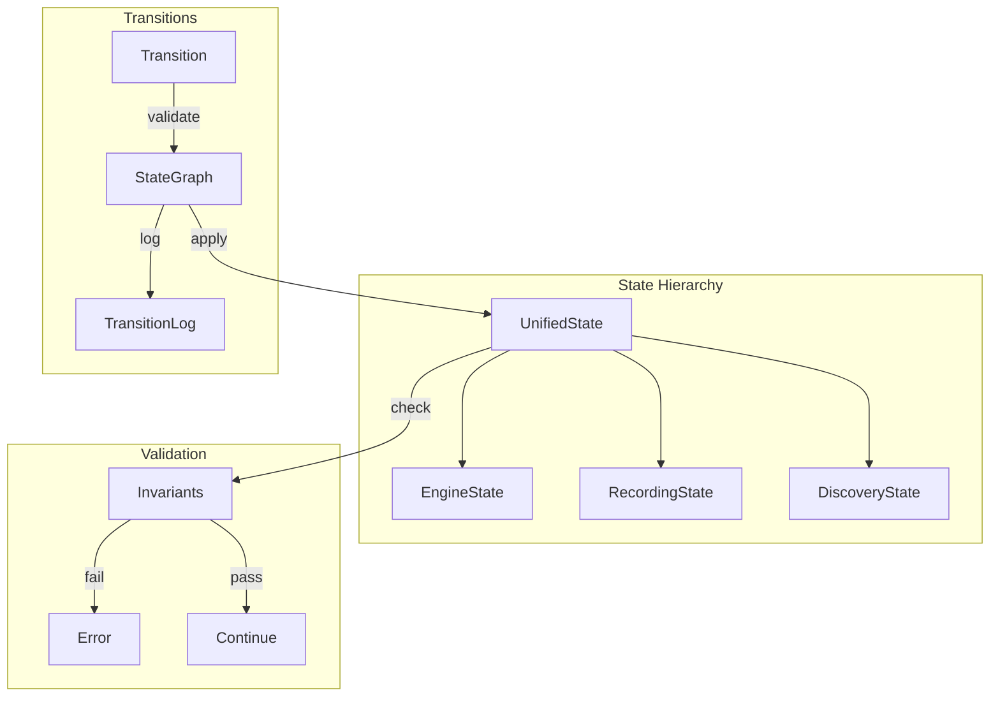

# Design Document

## Overview

This design audits all 15+ state types in KeyRx and creates a unified state management architecture. The core innovation is a `StateGraph` that defines valid transitions with compile-time enforcement, and a `TransitionLog` for debugging and replay. Overlapping state types are consolidated into a clear hierarchy.

## Steering Document Alignment

### Technical Standards (tech.md)
- **No Global State**: State owned by specific components
- **Event Sourcing**: Transitions logged for replay
- **Type Safety**: Invalid transitions caught at compile time

### Project Structure (structure.md)
- State types in `core/src/engine/state/`
- Transition graph in `core/src/engine/transitions/`
- Audit results in `docs/state-audit.md`

## Code Reuse Analysis

### Existing Components to Leverage
- **engine-state-unification spec**: Builds on this work
- **Existing state types**: Refactor, don't rewrite
- **serde**: State serialization

### Integration Points
- **Engine**: Uses unified state
- **FFI**: Exports state snapshots
- **Debugging**: Uses transition log

## Architecture



### Modular Design Principles
- **Explicit Transitions**: All changes through transition enum
- **Validated Changes**: Invariants checked on every transition
- **Logged History**: Every transition recorded
- **Clear Ownership**: Each state type has one owner

## Components and Interfaces

### Component 1: StateInventory (Audit Result)

- **Purpose:** Document all existing state types
- **Interfaces:**
  ```rust
  /// Audit of all state types in codebase.
  /// This is documentation, not runtime code.
  pub mod state_inventory {
      // Engine Domain
      // - EngineState (advanced.rs) - Serializable snapshot
      // - EngineState (engine/mod.rs) - Runtime state [DUPLICATE]
      // - KeyStateTracker - Pressed keys
      // - ModifierState - Active modifiers
      // - LayerStack - Layer state
      // - PendingDecisionQueue - Pending decisions

      // Recording Domain
      // - RecordingState - Session recording state
      // - ReplayState - Replay session state

      // Discovery Domain
      // - DiscoverySessionState - Device discovery state

      // Testing Domain
      // - MockState - Test mock state

      // FFI Domain
      // - FfiState - State for FFI export

      // Consolidation Plan:
      // 1. Merge duplicate EngineState definitions
      // 2. Extract common SessionState for Recording/Replay
      // 3. Use composition not inheritance
  }
  ```
- **Dependencies:** None (documentation)
- **Reuses:** Existing type analysis

### Component 2: StateTransition Enum

- **Purpose:** Explicit enumeration of all valid transitions
- **Interfaces:**
  ```rust
  #[derive(Debug, Clone, Serialize)]
  pub enum StateTransition {
      // Engine transitions
      KeyPressed { key: KeyCode, timestamp: u64 },
      KeyReleased { key: KeyCode, timestamp: u64 },
      LayerPushed { layer: LayerId },
      LayerPopped { layer: LayerId },
      ModifierActivated { modifier: ModifierId },
      ModifierDeactivated { modifier: ModifierId },
      DecisionResolved { id: PendingId, resolution: Resolution },

      // Session transitions
      RecordingStarted { session_id: String },
      RecordingStopped,
      ReplayStarted { session_id: String },
      ReplayStopped,

      // Discovery transitions
      DeviceDiscovered { device: DeviceInfo },
      DeviceLost { device_id: String },

      // System transitions
      ConfigReloaded,
      EngineReset,
      FallbackActivated { reason: String },
      FallbackDeactivated,
  }

  impl StateTransition {
      pub fn timestamp(&self) -> Option<u64>;
      pub fn category(&self) -> TransitionCategory;
  }

  #[derive(Debug, Clone, Copy)]
  pub enum TransitionCategory {
      Engine,
      Session,
      Discovery,
      System,
  }
  ```
- **Dependencies:** Core types
- **Reuses:** engine-state-unification Mutation enum

### Component 3: StateGraph

- **Purpose:** Define and enforce valid state transitions
- **Interfaces:**
  ```rust
  pub struct StateGraph {
      rules: HashMap<(StateKind, TransitionCategory), TransitionRule>,
  }

  pub struct TransitionRule {
      pub allowed: bool,
      pub preconditions: Vec<Precondition>,
      pub postconditions: Vec<Postcondition>,
  }

  impl StateGraph {
      pub fn new() -> Self;

      /// Check if transition is valid
      pub fn is_valid(&self, from: &UnifiedState, transition: &StateTransition) -> bool;

      /// Apply transition if valid
      pub fn apply(
          &self,
          state: &mut UnifiedState,
          transition: StateTransition,
      ) -> Result<TransitionResult, TransitionError>;

      /// Get valid transitions from current state
      pub fn valid_transitions(&self, state: &UnifiedState) -> Vec<TransitionCategory>;
  }

  #[derive(Debug)]
  pub struct TransitionResult {
      pub transition: StateTransition,
      pub effects: Vec<StateEffect>,
      pub duration_micros: u64,
  }

  #[derive(Debug, thiserror::Error)]
  pub enum TransitionError {
      #[error("Invalid transition {transition:?} from state {state:?}")]
      InvalidTransition {
          state: StateKind,
          transition: StateTransition,
      },
      #[error("Precondition failed: {condition}")]
      PreconditionFailed { condition: String },
      #[error("Invariant violated: {invariant}")]
      InvariantViolated { invariant: String },
  }
  ```
- **Dependencies:** StateTransition, UnifiedState
- **Reuses:** State machine patterns

### Component 4: TransitionLog

- **Purpose:** Log all transitions for debugging and replay
- **Interfaces:**
  ```rust
  pub struct TransitionLog {
      entries: RingBuffer<TransitionEntry>,
      enabled: AtomicBool,
  }

  #[derive(Debug, Clone, Serialize)]
  pub struct TransitionEntry {
      pub sequence: u64,
      pub timestamp: u64,
      pub transition: StateTransition,
      pub state_before: StateSnapshot,
      pub state_after: StateSnapshot,
      pub duration_micros: u64,
  }

  impl TransitionLog {
      pub fn new(capacity: usize) -> Self;

      /// Log a transition
      pub fn log(&self, entry: TransitionEntry);

      /// Get recent entries
      pub fn recent(&self, count: usize) -> Vec<TransitionEntry>;

      /// Search entries
      pub fn search(&self, filter: TransitionFilter) -> Vec<TransitionEntry>;

      /// Export for replay
      pub fn export(&self) -> Vec<TransitionEntry>;

      /// Enable/disable logging
      pub fn set_enabled(&self, enabled: bool);
  }

  pub struct TransitionFilter {
      pub category: Option<TransitionCategory>,
      pub from_sequence: Option<u64>,
      pub to_sequence: Option<u64>,
  }
  ```
- **Dependencies:** StateTransition
- **Reuses:** Ring buffer, logging patterns

### Component 5: StateValidator

- **Purpose:** Validate state invariants
- **Interfaces:**
  ```rust
  pub struct StateValidator {
      invariants: Vec<Box<dyn Invariant>>,
  }

  pub trait Invariant: Send + Sync {
      fn name(&self) -> &str;
      fn check(&self, state: &UnifiedState) -> Result<(), InvariantViolation>;
  }

  impl StateValidator {
      pub fn new() -> Self;

      /// Add an invariant
      pub fn add<I: Invariant + 'static>(&mut self, invariant: I);

      /// Validate all invariants
      pub fn validate(&self, state: &UnifiedState) -> Result<(), Vec<InvariantViolation>>;

      /// Validate specific category
      pub fn validate_category(
          &self,
          state: &UnifiedState,
          category: TransitionCategory,
      ) -> Result<(), Vec<InvariantViolation>>;
  }

  #[derive(Debug)]
  pub struct InvariantViolation {
      pub invariant: String,
      pub message: String,
      pub state_snapshot: StateSnapshot,
  }

  // Example invariants
  pub struct NoOrphanedModifiers;
  pub struct LayerStackNotEmpty;
  pub struct PendingDecisionsHaveKeys;
  ```
- **Dependencies:** UnifiedState, Invariant trait
- **Reuses:** Validation patterns

## Data Models

### StateKind
```rust
#[derive(Debug, Clone, Copy, PartialEq, Eq, Hash)]
pub enum StateKind {
    Idle,
    Processing,
    Recording,
    Replaying,
    Discovering,
    Fallback,
}
```

### StateSnapshot
```rust
#[derive(Debug, Clone, Serialize)]
pub struct StateSnapshot {
    pub kind: StateKind,
    pub pressed_keys: Vec<KeyCode>,
    pub active_layers: Vec<LayerId>,
    pub active_modifiers: Vec<ModifierId>,
    pub pending_count: usize,
    pub session_id: Option<String>,
    pub version: u64,
}
```

## Error Handling

### Error Scenarios

1. **Invalid transition attempted**
   - **Handling:** Return TransitionError, state unchanged
   - **User Impact:** Operation rejected with reason

2. **Invariant violated**
   - **Handling:** Debug: panic; Release: log and recover
   - **User Impact:** State remains consistent

3. **Log buffer full**
   - **Handling:** Overwrite oldest entries
   - **User Impact:** Oldest history lost

## Testing Strategy

### Unit Testing
- Test each transition type
- Verify invariant checking
- Test log operations

### Property Testing
- Fuzz transition sequences
- Verify invariants never violated
- Test state graph completeness

### Integration Testing
- Test full state machine
- Verify logging works
- Test replay from log
