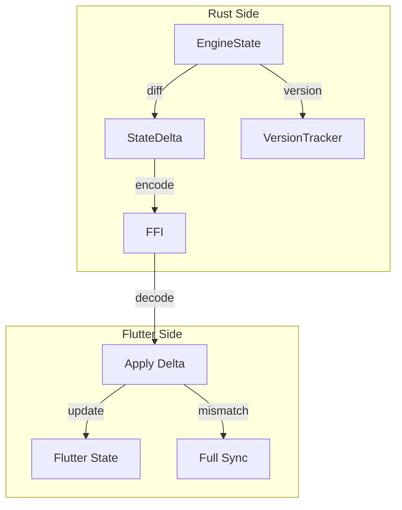

# Design Document

## Overview

This design implements a delta-based state synchronization protocol between Rust and Flutter. The core innovation is a `StateDelta` type that captures only changed fields, with version tracking for consistency and automatic fallback to full sync on mismatch.

## Architecture



## Components and Interfaces

### Component 1: StateDelta

```rust
#[derive(Debug, Clone, Serialize)]
pub struct StateDelta {
    pub from_version: u64,
    pub to_version: u64,
    pub changes: Vec<StateChange>,
}

#[derive(Debug, Clone, Serialize)]
pub enum StateChange {
    KeyPressed(KeyCode),
    KeyReleased(KeyCode),
    LayerActivated(LayerId),
    LayerDeactivated(LayerId),
    ModifierChanged { id: ModifierId, active: bool },
    PendingAdded(PendingId),
    PendingResolved(PendingId),
}

impl StateDelta {
    pub fn is_empty(&self) -> bool;
    pub fn should_use_full_sync(&self) -> bool; // If delta > 50% of full
}
```

### Component 2: DeltaTracker

```rust
pub struct DeltaTracker {
    current_version: AtomicU64,
    pending_changes: Mutex<Vec<StateChange>>,
}

impl DeltaTracker {
    pub fn record(&self, change: StateChange);
    pub fn take_delta(&self) -> StateDelta;
    pub fn current_version(&self) -> u64;
}
```

## Testing Strategy

- Unit tests for delta encoding/decoding
- Property tests for state consistency
- Benchmark delta vs full sync
