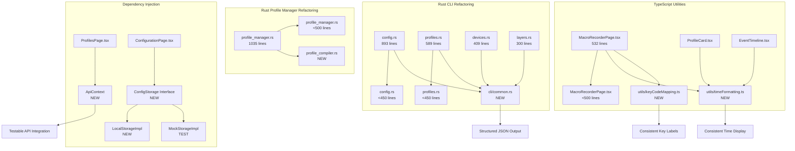

# Design Document

## Overview

This document outlines the technical design for systematically remediating technical debt across the keyrx2 codebase. The remediation addresses seven categories of violations identified through automated analysis: file size limits, missing test coverage, hard-coded dependencies, code duplication, error handling gaps, insufficient documentation, and outstanding TODOs.

The design follows a phased approach: (1) extract and consolidate duplicated code into utilities, (2) refactor oversized files into modular components, (3) implement dependency injection, (4) add comprehensive test coverage, (5) enhance error handling with structured logging, (6) complete documentation, and (7) resolve or track outstanding TODOs. This sequence minimizes merge conflicts and enables incremental validation.

## Steering Document Alignment

### Technical Standards (tech.md)

This design strictly adheres to the technical standards defined in tech.md:

- **Four-Crate Architecture**: All refactoring maintains separation between keyrx_core (no_std), keyrx_compiler, keyrx_daemon, and keyrx_ui
- **SOLID Principles**: Dependency injection replaces hard-coded dependencies; Single Responsibility drives file extraction
- **Code Quality Enforcement**: All changes verified by pre-commit hooks (clippy, rustfmt, tests, coverage)
- **AI-First Verification**: Structured logging enables machine-parseable diagnostics; dependency injection enables automated testing
- **Rust/TypeScript Standards**: Follows established naming conventions (snake_case for Rust, camelCase for TypeScript)

### Project Structure (structure.md)

Module extraction and file reorganization follow the structure defined in structure.md:

- **Rust Modules**: Extracted modules placed in appropriate crate locations (e.g., `keyrx_daemon/src/cli/common.rs`)
- **TypeScript Utilities**: New utilities placed in `keyrx_ui/src/utils/` following existing patterns
- **Test Organization**: Unit tests in same file (`#[cfg(test)]`), integration tests in `tests/` directory
- **Import Patterns**: Absolute imports for workspace crates, relative imports within modules
- **File Size Limits**: Enforce 500-line maximum (excluding comments/blanks) and 50-line function maximum

## Code Reuse Analysis

### Existing Components to Leverage

**Rust Testing Infrastructure:**
- **Location**: `keyrx_daemon/src/config/profile_manager.rs` (lines 800-1035)
- **Usage**: Existing test patterns demonstrate comprehensive unit testing with fixtures, mocking, and edge case coverage
- **Reuse Strategy**: Apply same test structure to new test files for React components

**TypeScript Test Utilities:**
- **Location**: `keyrx_ui/src/components/ProfilesPage.test.tsx`, `keyrx_ui/src/components/VirtualKeyboard.test.tsx`
- **Usage**: Existing test utilities use React Testing Library, mock implementations, and store mocking patterns
- **Reuse Strategy**: Extract common test setup logic into `keyrx_ui/tests/testUtils.ts` for reuse across new test files

**Structured Logging Pattern (Rust):**
- **Location**: `keyrx_daemon/src/logger.rs`
- **Usage**: JSON-formatted structured logging with timestamp, level, service, event_type, context
- **Reuse Strategy**: Apply same logging pattern to refactored CLI modules

**API Context Pattern (React):**
- **Location**: `keyrx_ui/src/hooks/useDaemon.ts`
- **Usage**: WebSocket connection management with configurable URLs
- **Reuse Strategy**: Create similar context for API base URL injection

### Integration Points

**CLI Module Integration:**
- **Existing System**: `keyrx_daemon/src/cli/*.rs` modules (config, profiles, layers, devices)
- **Integration**: Extracted `cli/common.rs` will be imported by all CLI handler modules
- **Data Flow**: Handler functions → common output functions → standardized JSON/text output

**React Component Integration:**
- **Existing System**: Zustand store (`configBuilderStore.ts`), API hooks (`useDaemon.ts`)
- **Integration**: New components will integrate with existing store and hooks; injected dependencies will flow through React Context
- **Data Flow**: Props/Context → Component → Hooks → API/Storage

**Error Handling Integration:**
- **Existing System**: Rust `Result<T, E>` types, React error boundaries
- **Integration**: Enhanced error handling will propagate through existing error types; structured logging will augment existing log calls
- **Data Flow**: Error occurrence → structured log → error propagation → user feedback (React) or exit code (CLI)

## Architecture

The remediation follows a modular extraction and consolidation pattern, respecting the existing four-crate architecture while improving code organization within each crate.

### Modular Design Principles

**Single File Responsibility:**
- `cli/common.rs`: CLI output formatting (JSON and text) only
- `utils/timeFormatting.ts`: Time/timestamp formatting utilities only
- `utils/keyCodeMapping.ts`: Key code translation and formatting only
- `contexts/ApiContext.tsx`: API base URL dependency injection only

**Component Isolation:**
- Extract inline functions from MacroRecorderPage.tsx into dedicated utility files
- Split profile_manager.rs into core manager + separate compilation module
- Break config.rs and profiles.rs into handler functions + common utilities

**Service Layer Separation:**
- Storage abstraction layer (`ConfigStorage` interface) separates business logic from browser APIs
- API context layer separates components from hard-coded endpoint URLs

**Utility Modularity:**
- Each utility module provides focused, single-purpose functions
- Test coverage ≥90% for all utilities (higher than general 80% requirement)



## Components and Interfaces

### Component 1: CLI Common Output Module (Rust)

- **Purpose:** Centralize JSON and text output formatting for all CLI commands
- **Location:** `keyrx_daemon/src/cli/common.rs`
- **Interfaces:**
  ```rust
  pub fn output_success<T: Serialize>(data: T, json: bool);
  pub fn output_error(message: &str, code: u32, json: bool);
  pub fn output_list<T: Serialize>(items: Vec<T>, json: bool);
  ```
- **Dependencies:** serde, serde_json
- **Reuses:** Existing CLI output patterns from config.rs, profiles.rs

### Component 2: Profile Compiler Module (Rust)

- **Purpose:** Extract compilation logic from profile_manager.rs
- **Location:** `keyrx_daemon/src/config/profile_compiler.rs`
- **Interfaces:**
  ```rust
  pub struct ProfileCompiler;
  impl ProfileCompiler {
      pub fn compile_profile(source: &Path, output: &Path) -> Result<()>;
      pub fn validate_config(path: &Path) -> Result<()>;
  }
  ```
- **Dependencies:** keyrx_compiler, profile_manager (core types)
- **Reuses:** Existing compilation logic from profile_manager.rs lines 200-350

### Component 3: Time Formatting Utility (TypeScript)

- **Purpose:** Provide consistent timestamp formatting across UI components
- **Location:** `keyrx_ui/src/utils/timeFormatting.ts`
- **Interfaces:**
  ```typescript
  export function formatTimestampMs(timestampUs: number): string;
  export function formatTimestampRelative(timestamp: number): string;
  export function formatDuration(durationMs: number): string;
  ```
- **Dependencies:** None (pure functions)
- **Reuses:** Logic from ProfileCard.tsx:21-38, MacroRecorderPage.tsx:33-40, EventTimeline.tsx:27-32

### Component 4: Key Code Mapping Utility (TypeScript)

- **Purpose:** Translate and format key codes consistently
- **Location:** `keyrx_ui/src/utils/keyCodeMapping.ts`
- **Interfaces:**
  ```typescript
  export function formatKeyCode(code: number): string;
  export function keyCodeToLabel(code: number): string;
  export function parseKeyCode(label: string): number | null;
  ```
- **Dependencies:** None (pure functions)
- **Reuses:** Logic from MacroRecorderPage.tsx:42-65, multiple other components

### Component 5: API Context Provider (React)

- **Purpose:** Inject API base URL into components for testability
- **Location:** `keyrx_ui/src/contexts/ApiContext.tsx`
- **Interfaces:**
  ```typescript
  export interface ApiContextValue {
    apiBaseUrl: string;
    wsBaseUrl: string;
  }
  export const ApiContext = React.createContext<ApiContextValue>(...);
  export function ApiProvider({ children, baseUrl }: Props): JSX.Element;
  export function useApi(): ApiContextValue;
  ```
- **Dependencies:** React
- **Reuses:** Pattern from existing useDaemon.ts hook

### Component 6: Config Storage Abstraction (TypeScript)

- **Purpose:** Abstract browser storage APIs for testability
- **Location:** `keyrx_ui/src/services/ConfigStorage.ts`
- **Interfaces:**
  ```typescript
  export interface ConfigStorage {
    save(key: string, content: string): Promise<void>;
    load(key: string): Promise<string | null>;
    delete(key: string): Promise<void>;
  }
  export class LocalStorageImpl implements ConfigStorage {...}
  export class MockStorageImpl implements ConfigStorage {...}
  ```
- **Dependencies:** None (interface), browser localStorage (LocalStorageImpl)
- **Reuses:** Dependency injection pattern from tech.md

### Component 7: Test Utilities Module (TypeScript)

- **Purpose:** Provide shared test setup, mocking, and assertion helpers
- **Location:** `keyrx_ui/tests/testUtils.ts`
- **Interfaces:**
  ```typescript
  export function renderWithProviders(ui: ReactElement, options?: RenderOptions);
  export function createMockStore(initialState?: Partial<ConfigState>);
  export function waitForAsync(callback: () => void, timeout?: number);
  ```
- **Dependencies:** @testing-library/react, Zustand
- **Reuses:** Patterns from ProfilesPage.test.tsx, VirtualKeyboard.test.tsx

## Data Models

### Model 1: CLI Output Response (Rust)

```rust
// Common CLI output structure
#[derive(Serialize)]
pub struct SuccessOutput<T> {
    pub success: bool,
    pub data: T,
}

#[derive(Serialize)]
pub struct ErrorOutput {
    pub success: bool,
    pub error: String,
    pub code: u32,
}
```

### Model 2: Structured Log Entry (Rust)

```rust
// Enhanced structured logging format
#[derive(Serialize)]
pub struct LogEntry {
    pub timestamp: String,        // ISO 8601 format
    pub level: String,             // DEBUG, INFO, WARN, ERROR
    pub service: String,           // keyrx_daemon, keyrx_compiler
    pub event_type: String,        // key_remap, config_load, etc.
    pub context: serde_json::Value,// Event-specific data
    pub correlation_id: Option<String>,
}
```

### Model 3: API Context Configuration (TypeScript)

```typescript
// API configuration for dependency injection
export interface ApiConfig {
  apiBaseUrl: string;
  wsBaseUrl: string;
  timeout?: number;
}

export const DEFAULT_API_CONFIG: ApiConfig = {
  apiBaseUrl: 'http://localhost:3030',
  wsBaseUrl: 'ws://localhost:9867',
  timeout: 5000,
};
```

## Error Handling

### Error Scenarios

1. **Scenario: File extraction breaks existing imports**
   - **Handling:** Run full test suite after each extraction; use compiler to verify all imports resolve
   - **User Impact:** No impact if tests pass; rollback extraction if compilation fails

2. **Scenario: Dependency injection breaks existing functionality**
   - **Handling:** Maintain backward compatibility with default values; add integration tests verifying both injected and default paths
   - **User Impact:** Existing code continues to work; new code can inject dependencies

3. **Scenario: Utility extraction introduces circular dependencies**
   - **Handling:** Analyze dependency graph before extraction; ensure utilities have no dependencies on higher-level modules
   - **User Impact:** No impact (prevented by design)

4. **Scenario: Test coverage measurement fails**
   - **Handling:** Use cargo tarpaulin for Rust, nyc/istanbul for TypeScript; verify tools are installed in CI
   - **User Impact:** CI pipeline fails if coverage <80%; prevents merging incomplete work

5. **Scenario: Structured logging adds performance overhead**
   - **Handling:** Benchmark before/after with criterion; use conditional compilation for debug logs; ensure production logs are minimal
   - **User Impact:** No measurable impact (<1% CPU overhead per product.md requirements)

6. **Scenario: Documentation generation fails**
   - **Handling:** Run `cargo doc` and TypeDoc locally before commit; fix syntax errors in doc comments
   - **User Impact:** No impact (caught in pre-commit hooks)

## Testing Strategy

### Unit Testing

**Rust Modules:**
- `cli/common.rs`: Test JSON serialization, text formatting, error output (15+ test cases)
- `profile_compiler.rs`: Test compilation success, validation errors, file I/O (20+ test cases)
- All unit tests in same file using `#[cfg(test)] mod tests`

**TypeScript Utilities:**
- `utils/timeFormatting.ts`: Test all formatting functions with edge cases (0, negative, very large values)
- `utils/keyCodeMapping.ts`: Test key code translation, unknown codes, reverse mapping
- `services/ConfigStorage.ts`: Test LocalStorageImpl and MockStorageImpl with success/failure scenarios
- Test files: `*.test.ts` in same directory as source

**React Components:**
- All 9 missing component tests following existing patterns from ProfilesPage.test.tsx
- Test rendering, user interactions, store integration, error states
- Use React Testing Library, mock Zustand stores, mock API calls

### Integration Testing

**CLI Integration:**
- Test full command execution with common output module
- Verify JSON output is valid and parseable
- Test error scenarios produce correct exit codes

**React Integration:**
- Test components with real ApiContext provider
- Test components with real ConfigStorage implementation
- Verify end-to-end flows (user interaction → API call → state update → UI update)

**Cross-Module Integration:**
- Test profile_manager using profile_compiler
- Test CLI handlers using common output module
- Verify no circular dependencies or import errors

### End-to-End Testing

**File Size Verification:**
- Automated script to count lines (excluding comments/blanks) in all source files
- Fail CI if any file >500 lines
- Run after each refactoring phase

**Coverage Verification:**
- Run cargo tarpaulin for Rust (target: 80% minimum, 90% for keyrx_core)
- Run nyc/istanbul for TypeScript (target: 80% minimum)
- Fail CI if coverage drops below threshold

**Dependency Injection Verification:**
- Integration tests demonstrating mock injection
- E2E tests with real implementations
- Verify no hard-coded URLs or dependencies in production code

**Code Duplication Verification:**
- Run copy-paste detector (jscpd for TypeScript, cargo-geiger for Rust)
- Fail CI if duplication >5%
- Verify extracted utilities eliminate duplicated code blocks
