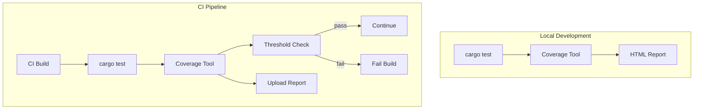

# Design Document

## Overview

This design integrates `cargo-tarpaulin` or `llvm-cov` for coverage measurement with CI integration and HTML report generation. Coverage thresholds are enforced as CI gates.

## Architecture



## Components and Interfaces

### Component 1: Coverage Configuration

```toml
# .cargo/config.toml or tarpaulin.toml
[coverage]
engine = "llvm"
output-types = ["html", "json", "lcov"]
exclude-files = ["tests/*", "benches/*"]
fail-under = 80.0
```

### Component 2: CI Workflow

```yaml
# .github/workflows/coverage.yml
coverage:
  runs-on: ubuntu-latest
  steps:
    - uses: actions/checkout@v4
    - name: Install coverage tool
      run: cargo install cargo-tarpaulin
    - name: Run coverage
      run: cargo tarpaulin --out Html --fail-under 80
    - name: Upload report
      uses: actions/upload-artifact@v3
```

## Testing Strategy

- Verify coverage measurement accuracy
- Test threshold enforcement
- Validate report generation
