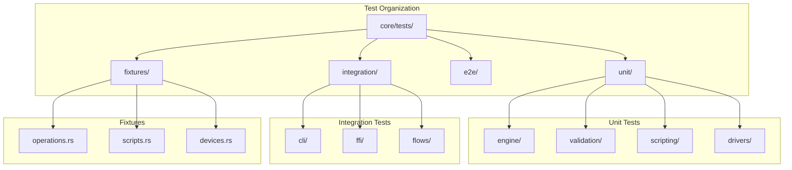

# Design Document

## Overview

This design establishes a hierarchical test organization that splits monolithic test files into focused modules, extracts inline tests to dedicated test files, and creates shared fixtures for common setup patterns. The resulting structure supports parallel execution and fast test discovery.

## Steering Document Alignment

### Technical Standards (tech.md)
- **Max 500 lines/file**: Applied to test files
- **80% test coverage**: Maintained through reorganization
- **Testing Framework**: cargo test, proptest, criterion

### Project Structure (structure.md)
- Tests in `core/tests/` organized by category
- Shared fixtures in `core/tests/fixtures/`
- Integration tests separated from unit tests

## Code Reuse Analysis

### Existing Components to Leverage
- **proptest**: Property-based testing already in use
- **serial_test**: For tests that can't run in parallel
- **Existing test helpers**: Scattered but reusable

### Integration Points
- **CI pipeline**: Must support new test organization
- **Coverage tools**: llvm-cov integration
- **IDE**: Test discovery and navigation

## Architecture



### Modular Design Principles
- **Single File Responsibility**: Each test file tests one concern
- **Component Isolation**: Tests don't share mutable state
- **Fixture Modularity**: Fixtures are composable
- **Clear Naming**: `test_<module>_<scenario>.rs`

## Components and Interfaces

### Component 1: Test Directory Structure

- **Purpose:** Organize tests by type and domain
- **Structure:**
  ```
  core/tests/
  ├── fixtures/           # Shared test utilities
  │   ├── mod.rs
  │   ├── operations.rs   # PendingOp builders
  │   ├── scripts.rs      # Rhai script fixtures
  │   ├── devices.rs      # Mock device fixtures
  │   └── engine.rs       # Engine test helpers
  ├── unit/               # Fast, isolated tests
  │   ├── mod.rs
  │   ├── engine/
  │   │   ├── mod.rs
  │   │   ├── decision_tests.rs
  │   │   ├── layer_tests.rs
  │   │   └── modifier_tests.rs
  │   ├── validation/
  │   │   ├── mod.rs
  │   │   ├── conflict_tests.rs
  │   │   ├── cycle_tests.rs
  │   │   └── safety_tests.rs
  │   └── scripting/
  │       ├── mod.rs
  │       ├── binding_tests.rs
  │       └── runtime_tests.rs
  ├── integration/        # Cross-module tests
  │   ├── mod.rs
  │   ├── cli/
  │   │   ├── check_tests.rs
  │   │   ├── run_tests.rs
  │   │   └── simulate_tests.rs
  │   ├── ffi/
  │   │   ├── discovery_tests.rs
  │   │   └── engine_tests.rs
  │   └── flows/
  │       ├── remap_flow_tests.rs
  │       └── combo_flow_tests.rs
  └── e2e/                # Full system tests
      ├── mod.rs
      └── scenario_tests.rs
  ```
- **Dependencies:** None (directory structure)
- **Reuses:** Existing test patterns

### Component 2: Test Fixtures Module

- **Purpose:** Shared builders and helpers for test setup
- **Interfaces:**
  ```rust
  // fixtures/operations.rs
  pub struct OperationBuilder {
      ops: Vec<PendingOp>,
  }

  impl OperationBuilder {
      pub fn new() -> Self;
      pub fn remap(self, from: KeyCode, to: KeyCode) -> Self;
      pub fn block(self, key: KeyCode) -> Self;
      pub fn combo(self, keys: &[KeyCode], output: KeyCode) -> Self;
      pub fn build(self) -> Vec<PendingOp>;
  }

  // fixtures/scripts.rs
  pub fn minimal_script() -> &'static str;
  pub fn complex_layer_script() -> &'static str;
  pub fn script_with_errors() -> &'static str;

  // fixtures/engine.rs
  pub struct TestEngine {
      engine: Engine<MockInput, MockScript, MockState>,
  }

  impl TestEngine {
      pub fn new() -> Self;
      pub fn with_script(script: &str) -> Self;
      pub fn process(&mut self, event: InputEvent) -> Vec<OutputAction>;
  }
  ```
- **Dependencies:** Core types
- **Reuses:** Builder pattern

### Component 3: Test Categories

- **Purpose:** Organize tests by execution characteristics
- **Interfaces:**
  ```rust
  // Unit tests: fast, isolated, no I/O
  #[cfg(test)]
  mod tests {
      #[test]
      fn test_specific_behavior() { ... }
  }

  // Integration tests: cross-module, may have I/O
  // In tests/integration/
  #[test]
  fn test_cli_check_with_valid_script() { ... }

  // E2E tests: full system, may need devices
  // In tests/e2e/
  #[test]
  #[ignore = "requires real keyboard"]
  fn test_full_remap_flow() { ... }
  ```
- **Dependencies:** Test framework
- **Reuses:** Standard Rust test patterns

### Component 4: Validation Test Split

- **Purpose:** Break 27K LOC validation_integration.rs into focused files
- **Target Files:**
  ```
  tests/integration/validation/
  ├── mod.rs
  ├── conflict_integration_tests.rs    (~500 LOC)
  ├── cycle_integration_tests.rs       (~400 LOC)
  ├── shadowing_integration_tests.rs   (~400 LOC)
  ├── safety_integration_tests.rs      (~500 LOC)
  ├── coverage_integration_tests.rs    (~400 LOC)
  └── edge_case_tests.rs               (~300 LOC)
  ```
- **Dependencies:** Validation module
- **Reuses:** Existing test logic

### Component 5: Phase Test Split

- **Purpose:** Break 21K LOC phase_1_3_integration_test.rs into features
- **Target Files:**
  ```
  tests/integration/phases/
  ├── mod.rs
  ├── phase1_basic_remap_tests.rs      (~600 LOC)
  ├── phase1_block_tests.rs            (~400 LOC)
  ├── phase2_layer_tests.rs            (~700 LOC)
  ├── phase2_modifier_tests.rs         (~600 LOC)
  ├── phase3_combo_tests.rs            (~700 LOC)
  ├── phase3_timing_tests.rs           (~500 LOC)
  └── regression_tests.rs              (~400 LOC)
  ```
- **Dependencies:** Engine module
- **Reuses:** Existing test logic

## Data Models

### TestResult
```rust
pub struct TestResult {
    pub name: String,
    pub passed: bool,
    pub duration: Duration,
    pub message: Option<String>,
}
```

### TestCategory
```rust
pub enum TestCategory {
    Unit,
    Integration,
    E2E,
    Property,
    Benchmark,
}
```

## Error Handling

### Error Scenarios

1. **Test fixture creation fails**
   - **Handling:** Panic with clear message about missing dependencies
   - **User Impact:** Developer knows what's missing

2. **Parallel test conflict**
   - **Handling:** Use `#[serial]` attribute
   - **User Impact:** Tests run correctly but sequentially

3. **Missing test file after split**
   - **Handling:** CI catches with coverage check
   - **User Impact:** PR blocked until fixed

## Testing Strategy

### Unit Testing
- Test fixtures themselves have tests
- Verify builder patterns work correctly

### Integration Testing
- Run reorganized tests to verify no breakage
- Compare coverage before/after

### CI Integration
- Update CI to run test categories appropriately
- Add coverage thresholds per category
