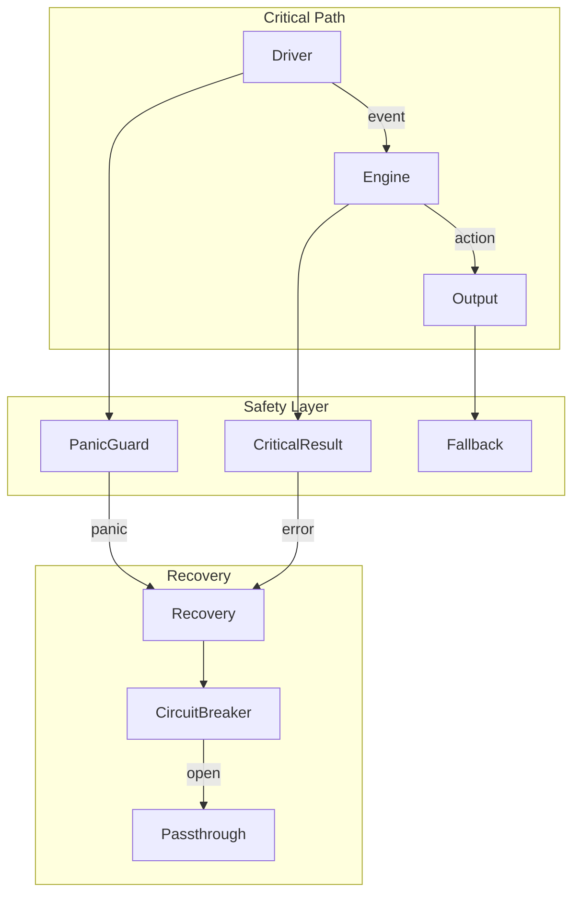

# Design Document

## Overview

This design systematically eliminates panics from KeyRx's critical input path. The core innovation is a `CriticalResult<T>` type that enforces error handling at compile time, combined with `PanicGuard` wrappers that catch and recover from panics in driver threads. A `CircuitBreaker` pattern prevents repeated failures from degrading the system.

## Steering Document Alignment

### Technical Standards (tech.md)
- **No Panics in Critical Path**: Enforced by lint and type system
- **Graceful Degradation**: Fallback to passthrough on errors
- **Error Handling**: Result types for all fallible operations

### Project Structure (structure.md)
- Error types in `core/src/errors/`
- Panic guards in `core/src/safety/`
- Fallback logic in `core/src/engine/fallback/`

## Code Reuse Analysis

### Existing Components to Leverage
- **anyhow/thiserror**: Error handling infrastructure
- **std::panic::catch_unwind**: Panic catching
- **tracing**: Panic logging

### Integration Points
- **Drivers**: Wrap in PanicGuard
- **Engine**: Use CriticalResult
- **FFI**: Report panics to Flutter

## Architecture



### Modular Design Principles
- **Defense in Depth**: Multiple recovery layers
- **Fail Safe**: Default to passthrough
- **Observable**: All failures logged
- **Testable**: Panic scenarios covered

## Components and Interfaces

### Component 1: CriticalResult Type

- **Purpose:** Result type that must be handled, no unwrap allowed
- **Interfaces:**
  ```rust
  /// Result type for critical path operations.
  /// Deliberately does not implement methods that panic.
  #[must_use = "CriticalResult must be handled"]
  pub struct CriticalResult<T> {
      inner: Result<T, CriticalError>,
  }

  impl<T> CriticalResult<T> {
      pub fn ok(value: T) -> Self;
      pub fn err(error: CriticalError) -> Self;

      /// Handle result with explicit fallback
      pub fn unwrap_or_fallback(self, fallback: T) -> T;

      /// Handle result with fallback function
      pub fn unwrap_or_else<F: FnOnce(CriticalError) -> T>(self, f: F) -> T;

      /// Map success value
      pub fn map<U, F: FnOnce(T) -> U>(self, f: F) -> CriticalResult<U>;

      /// Chain operations
      pub fn and_then<U, F: FnOnce(T) -> CriticalResult<U>>(self, f: F) -> CriticalResult<U>;

      // NOTE: No unwrap(), expect(), or panic-inducing methods
  }

  impl<T: Default> CriticalResult<T> {
      pub fn unwrap_or_default(self) -> T;
  }
  ```
- **Dependencies:** CriticalError
- **Reuses:** Result patterns without panic methods

### Component 2: CriticalError Type

- **Purpose:** Error type for critical path failures
- **Interfaces:**
  ```rust
  #[derive(Debug, thiserror::Error)]
  pub enum CriticalError {
      #[error("Driver failure: {message}")]
      DriverFailure {
          message: String,
          recoverable: bool,
          fallback: FallbackAction,
      },

      #[error("Engine error: {message}")]
      EngineError {
          message: String,
          state_snapshot: Option<StateSnapshot>,
      },

      #[error("Panic recovered: {message}")]
      PanicRecovered {
          message: String,
          backtrace: String,
          location: &'static str,
      },

      #[error("Config error: {message}")]
      ConfigError {
          message: String,
          using_defaults: bool,
      },
  }

  #[derive(Debug, Clone, Copy)]
  pub enum FallbackAction {
      Passthrough,
      UseDefaults,
      RetryOnce,
      Disable,
  }

  impl CriticalError {
      pub fn fallback_action(&self) -> FallbackAction;
      pub fn is_recoverable(&self) -> bool;
      pub fn should_report(&self) -> bool;
  }
  ```
- **Dependencies:** thiserror
- **Reuses:** Error hierarchy patterns

### Component 3: PanicGuard

- **Purpose:** Catch panics in driver threads
- **Interfaces:**
  ```rust
  /// Guard that catches panics and converts to CriticalError.
  pub struct PanicGuard {
      name: &'static str,
      on_panic: Box<dyn Fn(PanicInfo) + Send + Sync>,
  }

  impl PanicGuard {
      pub fn new(name: &'static str) -> Self;

      /// Set custom panic handler
      pub fn on_panic<F: Fn(PanicInfo) + Send + Sync + 'static>(mut self, f: F) -> Self;

      /// Run closure with panic catching
      pub fn run<T, F: FnOnce() -> T + UnwindSafe>(&self, f: F) -> CriticalResult<T>;

      /// Run with fallback value on panic
      pub fn run_or<T, F: FnOnce() -> T + UnwindSafe>(&self, fallback: T, f: F) -> T;
  }

  #[derive(Debug)]
  pub struct PanicInfo {
      pub message: String,
      pub location: String,
      pub backtrace: String,
      pub thread_name: String,
  }
  ```
- **Dependencies:** std::panic
- **Reuses:** catch_unwind patterns

### Component 4: CircuitBreaker

- **Purpose:** Prevent repeated failures from degrading system
- **Interfaces:**
  ```rust
  /// Circuit breaker for failure-prone operations.
  pub struct CircuitBreaker {
      state: AtomicU8,  // Closed=0, Open=1, HalfOpen=2
      failure_count: AtomicU32,
      last_failure: AtomicU64,
      config: CircuitBreakerConfig,
  }

  pub struct CircuitBreakerConfig {
      pub failure_threshold: u32,
      pub reset_timeout: Duration,
      pub half_open_requests: u32,
  }

  impl CircuitBreaker {
      pub fn new(config: CircuitBreakerConfig) -> Self;

      /// Check if operation should proceed
      pub fn allow(&self) -> bool;

      /// Record success
      pub fn record_success(&self);

      /// Record failure
      pub fn record_failure(&self);

      /// Get current state
      pub fn state(&self) -> CircuitState;

      /// Run operation with circuit breaker
      pub fn run<T, F: FnOnce() -> CriticalResult<T>>(&self, f: F) -> CriticalResult<T>;
  }

  #[derive(Debug, Clone, Copy)]
  pub enum CircuitState {
      Closed,    // Normal operation
      Open,      // Failing, reject requests
      HalfOpen,  // Testing recovery
  }
  ```
- **Dependencies:** std::sync::atomic
- **Reuses:** Circuit breaker pattern

### Component 5: FallbackEngine

- **Purpose:** Provide fallback behavior when engine fails
- **Interfaces:**
  ```rust
  /// Minimal engine that passes keys through unchanged.
  pub struct FallbackEngine {
      active: AtomicBool,
      reason: Mutex<Option<CriticalError>>,
  }

  impl FallbackEngine {
      pub fn new() -> Self;

      /// Activate fallback mode
      pub fn activate(&self, reason: CriticalError);

      /// Deactivate and return to normal
      pub fn deactivate(&self) -> Option<CriticalError>;

      /// Check if active
      pub fn is_active(&self) -> bool;

      /// Process key in fallback mode (always passthrough)
      pub fn process(&self, event: KeyEvent) -> KeyAction {
          KeyAction::Passthrough
      }
  }
  ```
- **Dependencies:** None
- **Reuses:** Null object pattern

### Component 6: Unwrap Removal Utilities

- **Purpose:** Help migrate unwrap calls
- **Interfaces:**
  ```rust
  /// Extension trait for Option with fallback logging
  pub trait OptionExt<T> {
      fn unwrap_or_log(self, default: T, context: &str) -> T;
      fn ok_or_critical(self, error: CriticalError) -> CriticalResult<T>;
  }

  /// Extension trait for Result with fallback logging
  pub trait ResultExt<T, E> {
      fn unwrap_or_log(self, default: T, context: &str) -> T;
      fn map_critical(self) -> CriticalResult<T> where E: std::error::Error;
  }

  impl<T> OptionExt<T> for Option<T> {
      fn unwrap_or_log(self, default: T, context: &str) -> T {
          match self {
              Some(v) => v,
              None => {
                  tracing::warn!(context, "Option was None, using default");
                  default
              }
          }
      }
  }
  ```
- **Dependencies:** tracing
- **Reuses:** Extension trait patterns

## Data Models

### StateSnapshot
```rust
#[derive(Debug, Clone, Serialize)]
pub struct StateSnapshot {
    pub pressed_keys: Vec<KeyCode>,
    pub active_layers: Vec<LayerId>,
    pub pending_count: usize,
    pub timestamp: u64,
}
```

### RecoveryReport
```rust
#[derive(Debug, Clone, Serialize)]
pub struct RecoveryReport {
    pub error: String,
    pub action_taken: FallbackAction,
    pub timestamp: u64,
    pub state_before: Option<StateSnapshot>,
    pub state_after: Option<StateSnapshot>,
}
```

## Error Handling

### Error Scenarios

1. **Panic in hook callback**
   - **Handling:** PanicGuard catches, returns Passthrough
   - **User Impact:** Key works normally, bug logged

2. **Engine state corruption**
   - **Handling:** Reset to clean state, activate fallback
   - **User Impact:** Brief passthrough, auto-recovery

3. **Repeated driver failures**
   - **Handling:** CircuitBreaker opens, passthrough mode
   - **User Impact:** Keys work, no remapping until recovery

4. **Config parsing failure**
   - **Handling:** Use default config, warn user
   - **User Impact:** Basic functionality preserved

## Testing Strategy

### Unit Testing
- Test CriticalResult API
- Test PanicGuard catches panics
- Test CircuitBreaker state transitions

### Integration Testing
- Test panic recovery in drivers
- Test fallback mode activation
- Test circuit breaker under load

### Chaos Testing
- Inject panics at random points
- Verify keyboard remains functional
- Test emergency exit works
