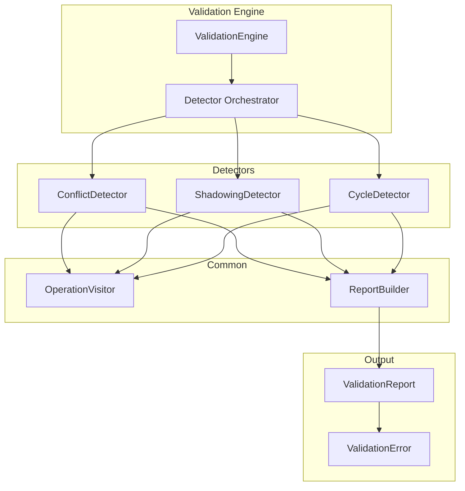

# Design Document

## Overview

This design decomposes the monolithic `conflicts.rs` (1,321 LOC) into focused submodules organized by detection concern. The core innovation is the `Detector` trait that allows the validation engine to orchestrate multiple detection passes uniformly while each detector focuses on its specific concern.

## Steering Document Alignment

### Technical Standards (tech.md)
- **Single Responsibility**: Each detector handles one concern
- **Modular Design**: Detectors are pluggable
- **Dependency Injection**: Detectors receive operations, don't fetch them

### Project Structure (structure.md)
- New structure: `validation/detectors/{conflicts,shadowing,cycles}.rs`
- Shared utilities: `validation/common/{visitor,error,report}.rs`
- Tests: `validation/tests/`

## Code Reuse Analysis

### Existing Components to Leverage
- **`PendingOp`**: Operation type already well-defined
- **`ValidationEngine`**: Orchestrator that will consume detectors
- **`Span`/location types**: Reuse for error reporting

### Integration Points
- **ValidationEngine**: Calls each detector in sequence
- **CLI check command**: Receives detector results
- **Flutter validation display**: Consumes structured errors

## Architecture



### Modular Design Principles
- **Single File Responsibility**: Each detector file handles one detection type
- **Component Isolation**: Detectors communicate only through common types
- **Service Layer Separation**: Engine (orchestration) → Detectors (analysis) → Common (utilities)
- **Utility Modularity**: Shared visitor, error, report building

## Components and Interfaces

### Component 1: Detector Trait

- **Purpose:** Common interface for all validation detectors
- **Interfaces:**
  ```rust
  pub trait Detector: Send + Sync {
      /// Detector name for reporting
      fn name(&self) -> &'static str;

      /// Run detection on operations
      fn detect(&self, ops: &[PendingOp], ctx: &DetectorContext) -> DetectorResult;

      /// Whether this detector can be skipped (for performance)
      fn is_skippable(&self) -> bool { false }
  }

  pub struct DetectorContext {
      pub script_path: Option<PathBuf>,
      pub config: ValidationConfig,
  }

  pub struct DetectorResult {
      pub issues: Vec<ValidationIssue>,
      pub stats: DetectorStats,
  }
  ```
- **Dependencies:** None (trait definition)
- **Reuses:** Rust trait pattern

### Component 2: ConflictDetector

- **Purpose:** Detect remap/block conflicts for same key
- **Interfaces:**
  ```rust
  pub struct ConflictDetector;

  impl Detector for ConflictDetector {
      fn name(&self) -> &'static str { "conflict" }

      fn detect(&self, ops: &[PendingOp], ctx: &DetectorContext) -> DetectorResult {
          let mut issues = Vec::new();
          let mut key_ops: HashMap<KeyCode, Vec<&PendingOp>> = HashMap::new();

          // Group operations by target key
          for op in ops {
              key_ops.entry(op.target_key()).or_default().push(op);
          }

          // Detect conflicts within each group
          for (key, ops) in key_ops {
              if ops.len() > 1 {
                  issues.push(self.build_conflict_issue(key, &ops));
              }
          }

          DetectorResult { issues, stats: self.stats() }
      }
  }
  ```
- **Dependencies:** `Detector` trait, `PendingOp`, `ValidationIssue`
- **Reuses:** Logic from current `conflicts.rs` conflict detection

### Component 3: ShadowingDetector

- **Purpose:** Detect combo shadowing by individual remaps
- **Interfaces:**
  ```rust
  pub struct ShadowingDetector;

  impl Detector for ShadowingDetector {
      fn name(&self) -> &'static str { "shadowing" }

      fn detect(&self, ops: &[PendingOp], ctx: &DetectorContext) -> DetectorResult {
          let combos: Vec<_> = ops.iter().filter(|op| op.is_combo()).collect();
          let remaps: Vec<_> = ops.iter().filter(|op| op.is_remap()).collect();

          let mut issues = Vec::new();

          for combo in &combos {
              // Check if any combo key is individually remapped
              for key in combo.keys() {
                  if let Some(remap) = remaps.iter().find(|r| r.source_key() == key) {
                      issues.push(self.build_shadowing_issue(combo, remap));
                  }
              }
          }

          DetectorResult { issues, stats: self.stats() }
      }

      fn is_skippable(&self) -> bool { true }  // Can skip for performance
  }
  ```
- **Dependencies:** `Detector` trait, combo/remap operation types
- **Reuses:** Logic from current shadowing detection

### Component 4: CycleDetector

- **Purpose:** Detect circular remap dependencies using DFS
- **Interfaces:**
  ```rust
  pub struct CycleDetector;

  impl Detector for CycleDetector {
      fn name(&self) -> &'static str { "cycle" }

      fn detect(&self, ops: &[PendingOp], ctx: &DetectorContext) -> DetectorResult {
          // Build adjacency list from remaps
          let graph = self.build_remap_graph(ops);

          // DFS to find cycles
          let cycles = self.find_cycles(&graph);

          let issues = cycles.into_iter()
              .map(|cycle| self.build_cycle_issue(cycle))
              .collect();

          DetectorResult { issues, stats: self.stats() }
      }
  }

  impl CycleDetector {
      fn find_cycles(&self, graph: &HashMap<KeyCode, KeyCode>) -> Vec<Vec<KeyCode>> {
          // Tarjan's or simple DFS with coloring
          let mut cycles = Vec::new();
          let mut visited = HashSet::new();
          let mut rec_stack = HashSet::new();

          for &start in graph.keys() {
              if !visited.contains(&start) {
                  self.dfs(start, graph, &mut visited, &mut rec_stack, &mut cycles);
              }
          }

          cycles
      }
  }
  ```
- **Dependencies:** `Detector` trait, graph algorithms
- **Reuses:** Logic from current cycle detection

### Component 5: OperationVisitor

- **Purpose:** Shared utility for traversing operations
- **Interfaces:**
  ```rust
  pub trait OperationVisitor {
      fn visit_remap(&mut self, op: &RemapOp);
      fn visit_block(&mut self, op: &BlockOp);
      fn visit_combo(&mut self, op: &ComboOp);
      fn visit_pass(&mut self, op: &PassOp);
  }

  pub fn visit_all(ops: &[PendingOp], visitor: &mut impl OperationVisitor) {
      for op in ops {
          match op {
              PendingOp::Remap(r) => visitor.visit_remap(r),
              PendingOp::Block(b) => visitor.visit_block(b),
              PendingOp::Combo(c) => visitor.visit_combo(c),
              PendingOp::Pass(p) => visitor.visit_pass(p),
          }
      }
  }
  ```
- **Dependencies:** `PendingOp` variants
- **Reuses:** Visitor pattern

## Data Models

### ValidationIssue
```rust
#[derive(Debug, Clone, Serialize)]
pub struct ValidationIssue {
    pub severity: Severity,
    pub detector: &'static str,
    pub message: String,
    pub locations: Vec<SourceLocation>,
    pub suggestion: Option<String>,
}

#[derive(Debug, Clone, Copy, Serialize)]
pub enum Severity {
    Error,
    Warning,
    Info,
}
```

### DetectorStats
```rust
#[derive(Debug, Default)]
pub struct DetectorStats {
    pub operations_checked: usize,
    pub issues_found: usize,
    pub duration_us: u64,
}
```

## Error Handling

### Error Scenarios

1. **Multiple conflicts for same key**
   - **Handling:** Group into single issue with all conflicting operations
   - **User Impact:** See all conflicts at once

2. **Complex cycle (3+ keys)**
   - **Handling:** Report full cycle path
   - **User Impact:** Understand complete dependency chain

3. **Performance timeout**
   - **Handling:** Skip expensive detectors if flagged
   - **User Impact:** Faster validation, warning about skipped checks

## Testing Strategy

### Unit Testing
- Test each detector in isolation with mock operations
- Verify issue detection accuracy
- Test edge cases (empty ops, single op, etc.)

### Integration Testing
- Test full validation pipeline with all detectors
- Verify detector ordering doesn't affect results
- Test with real Rhai scripts

### Performance Testing
- Benchmark each detector with large operation sets
- Verify O(n) or O(V+E) complexity claims
- Test detector skipping mechanism
