# Design Document: Web UI Bugfix and Enhancement

## Overview

This design addresses 8 critical bugs and missing features in the existing `keyrx_ui/` web interface by **modifying existing components** and **adding new drag-and-drop configuration functionality**. The design emphasizes code reuse, modular architecture, and minimal changes to achieve maximum impact.

**Key Principles**:
1. **Fix bugs in existing files** (not create duplicates)
2. **Reuse existing hooks and components** (useAutoSave, KeyboardVisualizer, DeviceScopeToggle)
3. **Add new drag-and-drop layer** on top of existing config system
4. **Maintain backward compatibility** with existing API endpoints

## Steering Document Alignment

### Technical Standards (tech.md)

**React + WASM Architecture**:
- Continue using React 18+ with TypeScript 5+ for type safety
- Leverage existing WASM integration (`useWasm` hook) for simulator
- Use existing axum web server endpoints (no backend changes needed for most fixes)

**Existing Dependencies to Leverage**:
- `@tanstack/react-query`: Already installed, use for server state management
- `zustand`: Already installed for UI state (avoid for server state)
- `react-router-dom`: Already installed for navigation

**New Dependencies Required**:
- `@dnd-kit/core` + `@dnd-kit/utilities`: For keyboard-accessible drag-and-drop (14KB gzipped, aligns with bundle budget)
- `@headlessui/react`: Already used (DeviceScopeToggle uses it), no new dependency

### Project Structure (structure.md)

**File Organization**:
```
keyrx_ui/src/
├── pages/              # Modify existing: HomePage, DevicesPage, ProfilesPage, ConfigPage, MetricsPage, SimulatorPage
├── components/         # Modify existing: DeviceListCard, ActiveProfileCard
│   └── config/         # NEW: ConfigPage-specific components
│       ├── KeyMappingDialog.tsx
│       ├── DragKeyPalette.tsx
│       └── ProfileHeader.tsx
├── hooks/              # Reuse existing: useAutoSave, useProfiles, useDevices, useWasm
│   └── useDragAndDrop.ts  # NEW: Drag-and-drop state management
├── api/                # Reuse existing: devices.ts, profiles.ts, config.ts
├── types/              # Extend existing types
│   └── config.ts       # NEW: KeyMapping, Layer, AssignableKey types
└── utils/              # Reuse existing: cn, errorUtils, keyCodeMapping
```

## Code Reuse Analysis

### Existing Components to Leverage

1. **useAutoSave** (`src/hooks/useAutoSave.ts`)
   - **Already implemented** with debouncing (500ms), retry logic (3 attempts), error handling
   - **Reuse in**: DevicesPage (layout auto-save), ConfigPage (key mapping auto-save)
   - **Status**: No changes needed, already works correctly

2. **KeyboardVisualizer** (`src/components/KeyboardVisualizer.tsx`)
   - **Already renders** visual keyboard layout with configurable layouts (ANSI, ISO, JIS, HHKB, Numpad)
   - **Modify for**: Drag-and-drop targets, display key mappings, layer visualization
   - **Changes**: Add `onKeyDrop` callback, highlight drop zones, show mapping labels

3. **DeviceScopeToggle** (`src/components/DeviceScopeToggle.tsx`)
   - **Already implemented** with global/device-specific toggle and device selector dropdown
   - **Reuse in**: ConfigPage without modifications
   - **Status**: No changes needed

4. **useProfiles** (`src/hooks/useProfiles.ts`)
   - **Already fetches** profiles from API with React Query
   - **Extend**: Add `refetchOnActivation` option to update active profile state
   - **Changes**: Minor - ensure cache invalidation on activation

5. **useWasm** (`src/hooks/useWasm.ts`)
   - **Already loads** keyrx_core WASM module and provides validation
   - **Reuse in**: SimulatorPage for event processing
   - **Status**: No changes needed

6. **Modal** (`src/components/Modal.tsx`)
   - **Already implemented** accessible modal with focus trap, Escape key handling
   - **Reuse in**: KeyMappingDialog, error dialogs
   - **Status**: No changes needed

7. **Card, Button, Dropdown, Input** (`src/components/*.tsx`)
   - **Already implemented** with consistent design tokens
   - **Reuse in**: All new components
   - **Status**: No changes needed

### Existing API Endpoints to Use

**No new backend endpoints needed** for bugfixes. Existing endpoints cover all functionality:

1. `GET /api/devices` - Fetch device list (exists, used by DevicesPage)
2. `PUT /api/devices/:serial/layout` - Save device layout (via RPC `setDeviceLayout`)
3. `GET /api/profiles` - Fetch profiles with `isActive` flag (exists)
4. `POST /api/profiles/:name/activate` - Activate profile (exists)
5. `GET /api/config/:profile` - Fetch profile configuration (exists)
6. `PUT /api/config/:profile/key` - Save key mapping (exists)
7. `GET /api/metrics` - Fetch latency metrics (exists)
8. `WS /ws` - WebSocket for real-time updates (exists)

**All bugfixes use existing APIs.** Only frontend changes required.

## Architecture

### Overall System Architecture

```mermaid
graph TD
    subgraph "Frontend (React + TypeScript)"
        HP[HomePage]
        DP[DevicesPage]
        PP[ProfilesPage]
        CP[ConfigPage]
        MP[MetricsPage]
        SP[SimulatorPage]

        HP --> DLC[DeviceListCard - FIXED]
        HP --> APC[ActiveProfileCard]

        DP --> UAS[useAutoSave - REUSED]

        PP --> UP[useProfiles - EXTENDED]

        CP --> KV[KeyboardVisualizer - MODIFIED]
        CP --> KMD[KeyMappingDialog - NEW]
        CP --> DKP[DragKeyPalette - NEW]
        CP --> DST[DeviceScopeToggle - REUSED]

        SP --> UW[useWasm - REUSED]
        SP --> KV2[KeyboardVisualizer - REUSED]
    end

    subgraph "API Layer (Existing)"
        API[REST API]
        WS[WebSocket]
    end

    subgraph "Backend (axum + keyrx_daemon)"
        Daemon[keyrx_daemon]
    end

    HP --> API
    DP --> API
    PP --> API
    CP --> API
    MP --> API
    MP --> WS
    SP --> WS

    API --> Daemon
    WS --> Daemon

    style DLC fill:#ffeb3b
    style UAS fill:#81c784
    style UP fill:#fff176
    style KV fill:#fff176
    style KMD fill:#4fc3f7
    style DKP fill:#4fc3f7
    style DST fill:#81c784
    style UW fill:#81c784

    classDef fixed fill:#ffeb3b
    classDef new fill:#4fc3f7
    classDef extended fill:#fff176
    classDef reused fill:#81c784
```



**Legend**:
- 🟨 Yellow: Fixed (bugfix in existing component)
- 🟦 Blue: New (new component)
- 🟡 Light Yellow: Extended (modified existing component)
- 🟩 Green: Reused (no changes)

---

## Components and Interfaces

### Requirement 1: Dashboard Device Count Fix

**Component: DeviceListCard** (MODIFY EXISTING)

**File**: `keyrx_ui/src/components/DeviceListCard.tsx`

**Purpose**: Display connected devices count with live data from API

**Current Bug**: Hardcoded `devices` prop, doesn't fetch from API

**Changes Required**:
```typescript
// BEFORE (current):
export const DeviceListCard: React.FC<{ devices: Device[] }> = ({ devices }) => {
  return <div>Connected Devices ({devices.length})</div>;
};

// AFTER (fixed):
export const DeviceListCard: React.FC = () => {
  const { data: devices, isLoading, error } = useDevices(); // Use React Query hook

  if (isLoading) return <LoadingSkeleton variant="card" />;
  if (error) return <ErrorState error={error} onRetry={() => refetch()} />;

  return <div>Connected Devices ({devices?.length ?? 0})</div>;
};
```

**Dependencies**:
- `useDevices` hook (already exists in `src/hooks/useDevices.ts`)
- `LoadingSkeleton` (already exists)
- `ErrorState` (already exists)

**Integration**: HomePage renders DeviceListCard without props (remove `devices` prop)

**Testing**:
- Unit test: Mock `useDevices` hook, verify count updates
- E2E test: Start daemon with 3 devices, verify Dashboard shows "Connected Devices (3)"

---

### Requirement 2: Device Layout Auto-Save Fix

**Component: DevicesPage** (VERIFY EXISTING)

**File**: `keyrx_ui/src/pages/DevicesPage.tsx` (lines 76-88)

**Purpose**: Persist layout selection using `useAutoSave` hook

**Current Implementation**: Already correct! Uses `useAutoSave` with `rpcClient.setDeviceLayout(serial, layout)`.

**Potential Bug**: API endpoint might not be persisting correctly.

**Changes Required**: **None in frontend.** If bug persists, investigate backend `setDeviceLayout` RPC handler.

**Testing**:
- Integration test: Select JIS 109, navigate away, return, verify JIS 109 is still selected
- Check API: `GET /api/devices` should return `layout: "JIS_109"` after save

---

### Requirement 3: Profile Activation State Persistence Fix

**Component: ProfilesPage** (MODIFY EXISTING)

**File**: `keyrx_ui/src/pages/ProfilesPage.tsx` (lines 113-132)

**Purpose**: Persist active profile state after activation

**Current Bug**: `isActive` badge disappears after ~1 second

**Root Cause Analysis**:
```typescript
// Current code (lines 113-132):
const handleActivateProfile = async (profileId: string) => {
  setActivationError(null);
  try {
    const result = await activateProfileMutation.mutateAsync(profileId);

    // BUG: Compilation errors set activationError but don't prevent badge from appearing
    if (result.errors && result.errors.length > 0) {
      const errorMessage = result.errors.join('\n');
      setActivationError(`Compilation failed:\n${errorMessage}`);
      console.error('Compilation errors:', result.errors);
    }
  } catch (err) {
    setActivationError(`Failed to activate profile: ${errorMessage}`);
  }
};
```

**Problem**: React Query cache might not be updating `isActive` flag correctly after activation.

**Solution**: Invalidate profiles cache and refetch after successful activation:
```typescript
const handleActivateProfile = async (profileId: string) => {
  setActivationError(null);
  try {
    const result = await activateProfileMutation.mutateAsync(profileId);

    if (result.errors && result.errors.length > 0) {
      setActivationError(`Compilation failed:\n${result.errors.join('\n')}`);
      return; // Don't update cache if compilation failed
    }

    // SUCCESS: Invalidate cache to refetch updated isActive state
    await queryClient.invalidateQueries({ queryKey: ['profiles'] });

  } catch (err) {
    setActivationError(`Failed to activate profile: ${getErrorMessage(err)}`);
  }
};
```

**Dependencies**:
- `useQueryClient` hook from `@tanstack/react-query`
- Existing `activateProfileMutation` (already implemented)

**Testing**:
- E2E test: Click "Activate" on profile, wait 5 seconds, verify [Active] badge persists
- API test: Verify `GET /api/profiles` returns correct `isActive: true` after activation

---

### Requirement 4: QMK-Style Drag-and-Drop Configuration Editor

**NEW COMPONENTS**:

#### 4.1 DragKeyPalette Component

**File**: `keyrx_ui/src/components/config/DragKeyPalette.tsx` (NEW)

**Purpose**: Display draggable virtual keys, modifiers, layers, macros

**Interface**:
```typescript
export interface AssignableKey {
  id: string;           // e.g., "VK_A", "MD_SHIFT", "LK_CAPSLOCK"
  category: 'vk' | 'modifier' | 'lock' | 'layer' | 'macro';
  label: string;        // e.g., "A", "Shift", "CapsLock"
  description: string;  // e.g., "Virtual Key A"
  icon?: React.ReactNode;
}

export interface DragKeyPaletteProps {
  onDragStart?: (key: AssignableKey) => void;
  onDragEnd?: () => void;
  filterCategory?: string; // Filter by category
  className?: string;
}

export const DragKeyPalette: React.FC<DragKeyPaletteProps> = ({...}) => {
  const { attributes, listeners, setNodeRef, transform } = useDraggable({
    id: key.id,
    data: { key },
  });

  return (
    <div className="grid grid-cols-4 gap-2">
      {assignableKeys.map((key) => (
        <div
          key={key.id}
          ref={setNodeRef}
          {...listeners}
          {...attributes}
          className="p-2 bg-slate-700 rounded cursor-grab active:cursor-grabbing"
        >
          {key.label}
        </div>
      ))}
    </div>
  );
};
```

**Dependencies**:
- `@dnd-kit/core`: For `useDraggable` hook
- Existing `Button` component for styling consistency

**Data Source**: Static list of assignable keys (VK_A through VK_Z, MD_*, LK_*, Layer names)

---

#### 4.2 KeyMappingDialog Component

**File**: `keyrx_ui/src/components/config/KeyMappingDialog.tsx` (NEW)

**Purpose**: Modal for configuring individual key mappings (click-to-edit alternative to drag-and-drop)

**Interface**:
```typescript
export interface KeyMapping {
  keyCode: string;      // Physical key code (e.g., "CapsLock")
  type: 'simple' | 'tap-hold' | 'macro' | 'layer-switch';
  simple?: string;      // VK_A for simple mapping
  tapHold?: {
    tap: string;        // Tap action
    hold: string;       // Hold action
    timeoutMs: number;  // Tap/hold threshold
  };
  macro?: string[];     // Array of key codes for macro
  layer?: string;       // Layer name for layer switch
}

export interface KeyMappingDialogProps {
  open: boolean;
  onClose: () => void;
  keyCode: string;              // e.g., "CapsLock"
  currentMapping?: KeyMapping;
  onSave: (mapping: KeyMapping) => Promise<void>;
}

export const KeyMappingDialog: React.FC<KeyMappingDialogProps> = ({...}) => {
  const [mappingType, setMappingType] = useState<KeyMapping['type']>('simple');
  const [tapAction, setTapAction] = useState('');
  const [holdAction, setHoldAction] = useState('');
  const [timeout, setTimeout] = useState(200);

  const handleSave = async () => {
    const mapping: KeyMapping = {
      keyCode,
      type: mappingType,
      tapHold: mappingType === 'tap-hold' ? { tap: tapAction, hold: holdAction, timeoutMs: timeout } : undefined,
    };
    await onSave(mapping);
    onClose();
  };

  return (
    <Modal open={open} onClose={onClose} title={`Configure ${keyCode}`}>
      {/* Form fields based on mappingType */}
    </Modal>
  );
};
```

**Dependencies**:
- `Modal` component (already exists)
- `Dropdown` component (already exists) for action selection
- `Input` component (already exists) for timeout slider

---

#### 4.3 Modified KeyboardVisualizer Component

**File**: `keyrx_ui/src/components/KeyboardVisualizer.tsx` (MODIFY EXISTING)

**Purpose**: Add drag-and-drop drop zones to existing keyboard visualizer

**Current Implementation**: Renders keyboard layout with clickable keys

**Changes Required**:
```typescript
// ADD: New prop for drag-and-drop support
export interface KeyboardVisualizerProps {
  // ... existing props ...
  onKeyDrop?: (keyCode: string, assignedKey: AssignableKey) => void;  // NEW
  keyMappings?: Map<string, KeyMapping>;  // NEW: Display current mappings
  activeLayer?: string;  // NEW: Show layer-specific mappings
}

// MODIFY: KeyButton to be droppable
const KeyButtonWithDrop: React.FC<...> = ({ keyCode, onDrop, mapping }) => {
  const { isOver, setNodeRef } = useDroppable({
    id: keyCode,
    data: { keyCode },
  });

  return (
    <div
      ref={setNodeRef}
      className={cn(
        "key-button",
        isOver && "ring-2 ring-blue-500", // Highlight on drag-over
        mapping && "bg-primary-500" // Show mapping exists
      )}
    >
      <div className="key-label">{keyCode}</div>
      {mapping && <div className="mapping-label">{mapping.simple ?? '...'}</div>}
    </div>
  );
};
```

**Dependencies**:
- `@dnd-kit/core`: For `useDroppable` hook
- Existing `KeyButton` component (modify to add drop zone)

**Backward Compatibility**: All new props are optional, existing usage still works

---

#### 4.4 Modified ConfigPage

**File**: `keyrx_ui/src/pages/ConfigPage.tsx` (MAJOR MODIFICATION)

**Purpose**: Add drag-and-drop UI layer on top of existing Monaco editor

**New Architecture**:
```typescript
export const ConfigPage: React.FC<ConfigPageProps> = ({ profileName }) => {
  const [activeTab, setActiveTab] = useState<'visual' | 'code'>('visual');
  const [selectedLayer, setSelectedLayer] = useState('base');
  const [scope, setScope] = useState<MappingScope>('global');
  const [selectedDevice, setSelectedDevice] = useState<string>('');
  const [keyMappings, setKeyMappings] = useState<Map<string, KeyMapping>>(new Map());
  const [activeDragKey, setActiveDragKey] = useState<AssignableKey | null>(null);

  // Drag-and-drop handlers
  const handleDragStart = (key: AssignableKey) => setActiveDragKey(key);
  const handleDragEnd = () => setActiveDragKey(null);

  const handleKeyDrop = async (keyCode: string) => {
    if (!activeDragKey) return;

    // Create mapping
    const newMapping: KeyMapping = {
      keyCode,
      type: 'simple',
      simple: activeDragKey.id,
    };

    // Update local state
    setKeyMappings(prev => new Map(prev).set(keyCode, newMapping));

    // Auto-save via API
    await setProfileConfig({
      name: profileName,
      key: keyCode,
      mapping: newMapping,
    });
  };

  return (
    <DndContext onDragStart={handleDragStart} onDragEnd={handleDragEnd}>
      <ProfileHeader profileName={profileName} />
      <DeviceScopeToggle scope={scope} onScopeChange={setScope} devices={devices} />
      <LayerSelector activeLayer={selectedLayer} onLayerChange={setSelectedLayer} />

      <div className="grid grid-cols-[300px_1fr] gap-4">
        <DragKeyPalette onDragStart={handleDragStart} />
        <KeyboardVisualizer
          layout={selectedLayout}
          keyMappings={keyMappings}
          onKeyDrop={handleKeyDrop}
          activeLayer={selectedLayer}
        />
      </div>

      {/* Fallback: Monaco editor for advanced users */}
      <MonacoEditor code={configCode} onChange={setConfigCode} />
    </DndContext>
  );
};
```

**Dependencies**:
- `DndContext` from `@dnd-kit/core` (NEW)
- All child components listed above (NEW + MODIFIED)
- `useProfileConfig` hook (already exists)

---

### Requirement 5: Profile-Centric Configuration Workflow

**NEW COMPONENT: ProfileHeader**

**File**: `keyrx_ui/src/components/config/ProfileHeader.tsx` (NEW)

**Purpose**: Display profile context in ConfigPage header

**Interface**:
```typescript
export interface ProfileHeaderProps {
  profileName: string;
  isActive?: boolean;
  lastModified?: Date;
  onProfileChange?: (newProfileName: string) => void;
  availableProfiles?: string[];
}

export const ProfileHeader: React.FC<ProfileHeaderProps> = ({...}) => {
  return (
    <div className="flex items-center justify-between">
      <div className="flex items-center gap-4">
        <h1>Editing: {profileName}</h1>
        {isActive && <Badge variant="success">Active</Badge>}
      </div>
      <Dropdown
        options={availableProfiles.map(p => ({ value: p, label: p }))}
        value={profileName}
        onChange={onProfileChange}
        aria-label="Select profile"
      />
    </div>
  );
};
```

**Dependencies**:
- `Dropdown` component (already exists)
- `Badge` component (create simple version or use span with styles)

**Integration**: ConfigPage renders ProfileHeader at top, passes profile name from URL query param

---

### Requirement 6: Metrics Page Profile Display

**Component: MetricsPage** (MODIFY EXISTING)

**File**: `keyrx_ui/src/pages/MetricsPage.tsx`

**Purpose**: Add active profile display to header

**Changes Required**:
```typescript
// ADD: Fetch active profile from API
export const MetricsPage: React.FC = () => {
  const { data: profiles } = useProfiles();
  const activeProfile = profiles?.find(p => p.isActive);

  return (
    <div className="metrics-page">
      {/* NEW: Profile header */}
      <div className="flex items-center gap-4 mb-4">
        <h1>Performance Metrics</h1>
        {activeProfile && (
          <div className="flex items-center gap-2 text-sm text-slate-400">
            <span>Active Profile:</span>
            <Link to={`/config?profile=${activeProfile.name}`} className="text-primary-500 hover:underline">
              {activeProfile.name}
            </Link>
            <span>({activeProfile.name}.rhai)</span>
          </div>
        )}
      </div>

      {/* Existing metrics components */}
      <MetricsChart data={latencyHistory} />
      {/* ... */}
    </div>
  );
};
```

**Dependencies**:
- `useProfiles` hook (already exists)
- `Link` from `react-router-dom` (already installed)

---

### Requirement 7: WASM Simulator Dedicated Page

**Component: SimulatorPage** (MODIFY EXISTING)

**File**: `keyrx_ui/src/pages/SimulatorPage.tsx`

**Purpose**: Move WASM simulation to dedicated page with profile selector

**Current Implementation**: Likely basic or empty

**New Implementation**:
```typescript
export const SimulatorPage: React.FC = () => {
  const [selectedProfile, setSelectedProfile] = useState('Default');
  const { data: profileConfig } = useGetProfileConfig(selectedProfile);
  const { processKeyEvent, isWasmReady } = useWasm();
  const [eventLog, setEventLog] = useState<KeyEvent[]>([]);
  const [currentState, setCurrentState] = useState<DaemonState | null>(null);

  const handleKeyPress = async (keyCode: string) => {
    if (!isWasmReady) return;

    const result = await processKeyEvent(keyCode, 'press');

    // Update event log
    setEventLog(prev => [...prev, { input: keyCode, output: result.outputEvents }]);

    // Update state
    setCurrentState(result.newState);
  };

  return (
    <div className="simulator-page">
      <div className="flex items-center gap-4 mb-4">
        <h1>Keyboard Simulator</h1>
        <Dropdown
          options={profiles.map(p => ({ value: p.name, label: p.name }))}
          value={selectedProfile}
          onChange={setSelectedProfile}
          aria-label="Select profile to simulate"
        />
      </div>

      <div className="grid grid-cols-2 gap-4">
        <div>
          <h2>Visual Keyboard</h2>
          <KeyboardVisualizer
            layout="ANSI_104"
            onKeyClick={handleKeyPress}
            simulatorMode={true}
          />
        </div>

        <div>
          <h2>Event Log</h2>
          <EventLogList events={eventLog} />

          <h2>State Inspector</h2>
          <StateIndicatorPanel state={currentState} />
        </div>
      </div>
    </div>
  );
};
```

**Dependencies**:
- `useWasm` hook (already exists)
- `KeyboardVisualizer` component (already exists, reuse)
- `StateIndicatorPanel` component (already exists)
- New `EventLogList` component (simple list rendering)

---

### Requirement 8: Device List Integration in ConfigPage

**Already Implemented**: ConfigPage uses `DeviceScopeToggle` component which has device list integration.

**Verification**: Ensure `DeviceScopeToggle` receives real devices from `useDevices` hook, not mock data.

**Changes Required**:
```typescript
// ConfigPage.tsx - Update devices source
const { data: devices, isLoading: isLoadingDevices } = useDevices(); // Fetch real devices

const deviceOptions: DeviceOption[] = useMemo(() =>
  devices?.map(d => ({
    serial: d.serial ?? d.id,
    name: d.name,
  })) ?? [],
  [devices]
);

<DeviceScopeToggle
  scope={scope}
  onScopeChange={setScope}
  devices={deviceOptions}  // Pass real devices, not mock
  selectedDevice={selectedDevice}
  onDeviceChange={setSelectedDevice}
/>
```

**Dependencies**: `useDevices` hook (already exists)

---

## Data Models

### KeyMapping Type

```typescript
/**
 * Represents a key mapping configuration
 */
export interface KeyMapping {
  /** Physical key code (e.g., "CapsLock", "A") */
  keyCode: string;

  /** Mapping type */
  type: 'simple' | 'tap-hold' | 'macro' | 'layer-switch';

  /** Simple key mapping (VK_A, VK_ENTER, etc.) */
  simple?: string;

  /** Tap-hold configuration */
  tapHold?: {
    tap: string;        // Tap action (VK_A)
    hold: string;       // Hold action (VK_SHIFT, Layer("nav"))
    timeoutMs: number;  // Threshold (100-500ms)
  };

  /** Macro sequence */
  macro?: string[];

  /** Layer name for layer switch */
  layer?: string;
}
```

### AssignableKey Type

```typescript
/**
 * Represents a draggable virtual key in the palette
 */
export interface AssignableKey {
  /** Unique identifier (e.g., "VK_A", "MD_SHIFT") */
  id: string;

  /** Category for filtering */
  category: 'vk' | 'modifier' | 'lock' | 'layer' | 'macro';

  /** Display label */
  label: string;

  /** Tooltip description */
  description: string;

  /** Optional icon */
  icon?: React.ReactNode;
}
```

### Layer Type

```typescript
/**
 * Represents a keyboard layer
 */
export interface Layer {
  /** Layer identifier (e.g., "base", "nav", "num") */
  id: string;

  /** Display name */
  name: string;

  /** Key mappings specific to this layer */
  mappings: Map<string, KeyMapping>;
}
```

---

## Error Handling

### Error Scenarios

#### 1. Device API Fetch Failure

**Scenario**: `GET /api/devices` returns 500 error or timeout

**Handling**:
```typescript
const { data: devices, isLoading, error, refetch } = useDevices();

if (error) {
  return (
    <ErrorState
      error={new Error("Failed to fetch devices")}
      onRetry={refetch}
      message="Unable to connect to daemon. Please check if keyrx daemon is running."
    />
  );
}
```

**User Impact**: Dashboard shows error message with "Retry" button, doesn't crash app

---

#### 2. Profile Activation Compilation Error

**Scenario**: Activating profile fails due to Rhai syntax error

**Handling**:
```typescript
const handleActivateProfile = async (profileId: string) => {
  try {
    const result = await activateProfileMutation.mutateAsync(profileId);

    if (result.errors && result.errors.length > 0) {
      // Show detailed error modal
      setActivationError({
        title: "Compilation Failed",
        errors: result.errors,
        suggestion: "Check your Rhai configuration for syntax errors",
      });
      return; // Don't update cache
    }

    // Success: invalidate cache
    await queryClient.invalidateQueries({ queryKey: ['profiles'] });

  } catch (err) {
    setActivationError({
      title: "Activation Failed",
      message: getErrorMessage(err),
      suggestion: "Check daemon logs for details",
    });
  }
};
```

**User Impact**: Error modal with line numbers and syntax errors, previous profile remains active

---

#### 3. Drag-and-Drop Save Failure

**Scenario**: Dropping key onto keyboard fails to save to API

**Handling**:
```typescript
const handleKeyDrop = async (keyCode: string) => {
  const optimisticMapping = { keyCode, simple: activeDragKey.id };

  // Optimistic update
  setKeyMappings(prev => new Map(prev).set(keyCode, optimisticMapping));

  try {
    await setProfileConfig({ name: profileName, key: keyCode, mapping: optimisticMapping });
  } catch (err) {
    // Rollback on error
    setKeyMappings(prev => {
      const newMap = new Map(prev);
      newMap.delete(keyCode);
      return newMap;
    });

    // Show error toast
    toast.error(`Failed to save mapping: ${getErrorMessage(err)}`);
  }
};
```

**User Impact**: Visual feedback on success/failure, automatic rollback on error

---

#### 4. WASM Module Load Failure

**Scenario**: keyrx_core WASM fails to load in SimulatorPage

**Handling**:
```typescript
const { isWasmReady, wasmError } = useWasm();

if (wasmError) {
  return (
    <ErrorState
      error={wasmError}
      message="WASM module failed to load. Try refreshing the page."
      onRetry={() => window.location.reload()}
    />
  );
}

if (!isWasmReady) {
  return <LoadingSkeleton variant="page" message="Loading simulator..." />;
}
```

**User Impact**: Clear error message with refresh button, doesn't break entire app

---

## Testing Strategy

### Unit Testing

**Components to Test**:
1. **DragKeyPalette**: Verify draggable items render, drag events fire
2. **KeyMappingDialog**: Verify form validation, save callback
3. **ProfileHeader**: Verify profile name display, dropdown interaction
4. **DeviceListCard**: Verify device count updates, loading states

**Example Test**:
```typescript
// DeviceListCard.test.tsx
describe('DeviceListCard', () => {
  it('should display device count from API', async () => {
    mockUseDevices.mockReturnValue({
      data: [{ id: '1', name: 'Device 1' }, { id: '2', name: 'Device 2' }],
      isLoading: false,
      error: null,
    });

    const { getByText } = render(<DeviceListCard />);

    await waitFor(() => {
      expect(getByText('Connected Devices (2)')).toBeInTheDocument();
    });
  });

  it('should show error state when API fails', async () => {
    mockUseDevices.mockReturnValue({
      data: null,
      isLoading: false,
      error: new Error('API Error'),
    });

    const { getByText, getByRole } = render(<DeviceListCard />);

    expect(getByText(/Unable to connect/i)).toBeInTheDocument();
    expect(getByRole('button', { name: /retry/i })).toBeInTheDocument();
  });
});
```

---

### Integration Testing

**Critical User Flows**:

#### 1. Drag-and-Drop Key Assignment Flow

**Test**: User drags VK_A from palette and drops onto CapsLock key

```typescript
// ConfigPage.integration.test.tsx
describe('ConfigPage - Drag and Drop', () => {
  it('should assign key mapping via drag and drop', async () => {
    const { getByText, getByTestId } = render(<ConfigPage profileName="gaming" />);

    // 1. Find draggable key
    const vkA = getByText('A');
    const capsLock = getByTestId('key-CapsLock');

    // 2. Drag and drop
    fireEvent.dragStart(vkA);
    fireEvent.dragOver(capsLock);
    fireEvent.drop(capsLock);

    // 3. Verify mapping appears
    await waitFor(() => {
      expect(capsLock).toHaveTextContent('A');
    });

    // 4. Verify API was called
    expect(mockSetProfileConfig).toHaveBeenCalledWith({
      name: 'gaming',
      key: 'CapsLock',
      mapping: { keyCode: 'CapsLock', type: 'simple', simple: 'VK_A' },
    });
  });
});
```

#### 2. Profile Activation Persistence Flow

**Test**: User activates profile, refreshes page, badge persists

```typescript
// ProfilesPage.integration.test.tsx
describe('ProfilesPage - Activation', () => {
  it('should persist active profile badge after page refresh', async () => {
    const { getByText, getByRole } = render(<ProfilesPage />);

    // 1. Activate profile
    const activateButton = getByRole('button', { name: /activate.*gaming/i });
    fireEvent.click(activateButton);

    // 2. Wait for activation
    await waitFor(() => {
      expect(getByText('[Active]')).toBeInTheDocument();
    });

    // 3. Simulate page refresh (re-mount component)
    const { getByText: getByText2 } = render(<ProfilesPage />);

    // 4. Verify badge still appears
    await waitFor(() => {
      expect(getByText2('[Active]')).toBeInTheDocument();
    });
  });
});
```

---

### End-to-End Testing (Playwright)

**Critical E2E Scenarios**:

#### 1. Complete Configuration Workflow

```typescript
// e2e/configuration-workflow.spec.ts
test('complete keyboard configuration workflow', async ({ page }) => {
  // 1. Navigate to profiles page
  await page.goto('http://localhost:5173/profiles');

  // 2. Create new profile
  await page.click('button:has-text("Create Profile")');
  await page.fill('input[name="profileName"]', 'e2e-test-profile');
  await page.click('button:has-text("Create")');

  // 3. Navigate to config page
  await page.click(`a:has-text("Edit Configuration")`);

  // 4. Assign key mapping via drag-and-drop
  const vkA = page.locator('text=A').first();
  const capsLock = page.locator('[data-testid="key-CapsLock"]');
  await vkA.dragTo(capsLock);

  // 5. Verify mapping appears
  await expect(capsLock).toContainText('A');

  // 6. Activate profile
  await page.click('button:has-text("Activate Profile")');

  // 7. Verify in metrics page
  await page.goto('http://localhost:5173/metrics');
  await expect(page.locator('text=Active Profile: e2e-test-profile')).toBeVisible();
});
```

---

### Accessibility Testing

**Automated Checks** (using axe-core):
```typescript
// accessibility.spec.ts
describe('Accessibility', () => {
  it('ConfigPage should have no accessibility violations', async () => {
    const { container } = render(<ConfigPage profileName="default" />);
    const results = await axe(container);
    expect(results.violations).toHaveLength(0);
  });
});
```

**Manual Checks**:
1. **Keyboard Navigation**: Tab through ConfigPage, verify all interactive elements are reachable
2. **Screen Reader**: Test with NVDA/JAWS, verify drag-and-drop announces "Grabbed VK_A, use arrows to select drop target"
3. **Focus Indicators**: Verify 2px outline visible on all focusable elements

---

## Performance Considerations

### Bundle Size Impact

**New Dependencies**:
- `@dnd-kit/core`: 14KB gzipped
- `@dnd-kit/utilities`: 3KB gzipped
- **Total**: 17KB added (well within 50KB budget)

**Code Splitting**:
```typescript
// Lazy load ConfigPage to reduce initial bundle
const ConfigPage = lazy(() => import('./pages/ConfigPage'));

// In router:
<Route path="/config" element={
  <Suspense fallback={<LoadingSkeleton variant="page" />}>
    <ConfigPage />
  </Suspense>
} />
```

### Rendering Performance

**KeyboardVisualizer Optimization**:
- Use `React.memo` to prevent unnecessary re-renders
- Memoize key mappings to avoid recalculating on every render

```typescript
const KeyboardVisualizer = React.memo<KeyboardVisualizerProps>(({ keyMappings, ...props }) => {
  const memoizedMappings = useMemo(() => keyMappings, [keyMappings]);

  return (
    <div className="keyboard-visualizer">
      {keys.map(key => (
        <KeyButton
          key={key.code}
          mapping={memoizedMappings.get(key.code)}
        />
      ))}
    </div>
  );
});
```

### Auto-Save Debouncing

Already implemented in `useAutoSave` hook with 500ms debounce. No additional optimization needed.

---

## Migration Strategy

### Phase 1: Bugfixes (Low Risk)

1. Fix DeviceListCard to fetch from API (Req 1)
2. Verify DevicesPage auto-save works (Req 2)
3. Fix ProfilesPage activation persistence (Req 3)
4. Add ProfileHeader to ConfigPage (Req 5)
5. Add active profile to MetricsPage (Req 6)

**Estimated Time**: 2-4 hours
**Risk**: Low (minor changes to existing components)

### Phase 2: Simulator Enhancement (Medium Risk)

7. Enhance SimulatorPage with profile selector (Req 7)
8. Integrate useWasm for event processing

**Estimated Time**: 3-5 hours
**Risk**: Medium (WASM integration complexity)

### Phase 3: Drag-and-Drop Editor (High Complexity)

4. Create DragKeyPalette component
5. Create KeyMappingDialog component
6. Modify KeyboardVisualizer for drop zones
7. Integrate @dnd-kit in ConfigPage
8. Add keyboard accessibility (Space to grab, arrows to move)

**Estimated Time**: 8-12 hours
**Risk**: High (new feature, complex interactions)

### Rollback Plan

If drag-and-drop implementation fails or has critical bugs:
1. Keep Monaco editor as primary interface
2. Feature-flag drag-and-drop behind `enableDragAndDrop` query param
3. Provide toggle switch: "Use Visual Editor" vs "Use Code Editor"

---

## Dependencies

### New NPM Packages

```json
{
  "dependencies": {
    "@dnd-kit/core": "^6.0.8",
    "@dnd-kit/utilities": "^3.2.1"
  }
}
```

**Installation**:
```bash
cd keyrx_ui
npm install @dnd-kit/core @dnd-kit/utilities
```

### Existing Dependencies (No Changes)

- `@tanstack/react-query`: Already used, no version change
- `react-router-dom`: Already used
- `zustand`: Already used
- `@headlessui/react`: Already used (in DeviceScopeToggle)

---

## API Contract

**No backend changes required.** All existing API endpoints support the requirements:

### GET /api/devices

**Response**:
```json
{
  "devices": [
    {
      "id": "serial-JP",
      "name": "ARCHISS PK85PD",
      "path": "/dev/input/event2",
      "serial": "JP",
      "active": true,
      "scope": null,
      "layout": "JIS_109"
    }
  ]
}
```

**Used By**: DeviceListCard, DevicesPage, ConfigPage

---

### GET /api/profiles

**Response**:
```json
{
  "profiles": [
    {
      "name": "gaming",
      "isActive": true,
      "modifiedAt": "2026-01-03T15:56:21Z"
    }
  ]
}
```

**Used By**: ProfilesPage, MetricsPage, ConfigPage, SimulatorPage

---

### PUT /api/config/:profile/key

**Request**:
```json
{
  "key": "CapsLock",
  "mapping": {
    "keyCode": "CapsLock",
    "type": "simple",
    "simple": "VK_A"
  }
}
```

**Response**:
```json
{
  "success": true
}
```

**Used By**: ConfigPage (drag-and-drop save)

---

## Accessibility Compliance (WCAG 2.2 Level AA)

### Keyboard Navigation

**All interactive elements accessible via keyboard**:
- Tab/Shift+Tab: Navigate between elements
- Space: Grab/drop dragged item, activate buttons
- Arrow keys: Move dragged item to adjacent drop zone
- Enter: Activate links, open dialogs
- Escape: Close dialogs, cancel drag operation

### Screen Reader Support

**ARIA labels for all components**:
```typescript
// DragKeyPalette
<div
  role="button"
  aria-label={`Draggable key ${key.label}`}
  aria-describedby={`${key.id}-description`}
  tabIndex={0}
>
  {key.label}
</div>
<div id={`${key.id}-description`} className="sr-only">
  {key.description}
</div>

// KeyboardVisualizer with drop zones
<div
  role="button"
  aria-label={`Key ${keyCode}, ${mapping ? `mapped to ${mapping.simple}` : 'not mapped'}`}
  aria-dropeffect="move"
  tabIndex={0}
>
  {keyCode}
</div>
```

### Focus Management

**Focus indicators visible (2px outline)**:
```css
.key-button:focus,
.draggable-key:focus {
  outline: 2px solid var(--color-primary-500);
  outline-offset: 2px;
}
```

**Focus trap in modals**:
- KeyMappingDialog: Focus automatically moves to first input
- Escape key closes modal, focus returns to trigger button

### Color Contrast

**All text meets WCAG AA requirements (4.5:1 for normal text)**:
- Background: `slate-900` (#0F172A)
- Text: `slate-100` (#F1F5F9)
- Contrast ratio: 15.8:1 ✅

---

## Summary

This design provides a **comprehensive, modular solution** to fix 8 critical bugs and add QMK-style drag-and-drop functionality to the existing keyrx web UI. The approach emphasizes:

1. **Code Reuse**: Leverages existing hooks (useAutoSave, useProfiles, useWasm), components (KeyboardVisualizer, Modal, DeviceScopeToggle)
2. **Minimal Changes**: Bugfixes modify existing files, new features are additive
3. **Backward Compatibility**: All new props are optional, existing usage still works
4. **Accessibility First**: Full WCAG 2.2 Level AA compliance with keyboard navigation and screen reader support
5. **Performance**: Bundle size increase <17KB, lazy loading for ConfigPage

**Next Phase**: Break down into implementation tasks in `tasks.md`.
