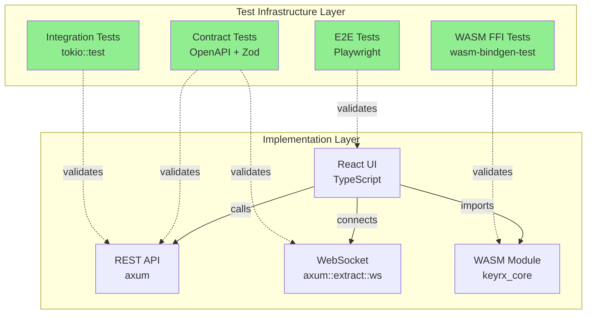

# Design Document

## Overview

This design implements a **test-infrastructure-first** approach to fixing critical UI/UX gaps in the keyrx web interface. The design prioritizes building comprehensive test infrastructure for all FFI boundaries (WASM ↔ JavaScript, REST API ↔ UI, WebSocket ↔ UI) before implementing feature fixes. This ensures autonomous development can catch bugs automatically without human UAT, aligning with keyrx's "AI-First Verification" principle.

**Key Design Principles:**
1. **Test Infrastructure First**: Build comprehensive tests before features (Requirement 0 blocks all others)
2. **Contract-Driven Development**: Define API contracts, then verify with tests, then implement
3. **Fail Fast in CI/CD**: Every boundary violation fails CI/CD before reaching production
4. **Zero Human UAT**: 100% automated verification through integration and E2E tests
5. **Type Safety at FFI Boundaries**: TypeScript + Zod schemas prevent runtime errors

## Steering Document Alignment

### Technical Standards (tech.md)

**Test Infrastructure Alignment:**
- **Rust Testing**: Use `tokio::test` for async integration tests, `tempfile` for isolated filesystem tests
- **WASM Testing**: Use `wasm-bindgen-test` for FFI boundary verification, TypeScript strict mode for type checking
- **Frontend Testing**: Extend existing Playwright E2E tests (from web-ui-bugfix-and-enhancement spec)
- **Contract Testing**: Use Zod schemas for runtime WebSocket message validation

**Technology Stack:**
- Backend: Rust (`axum` web server) + `tokio::test` integration tests
- WASM: Rust → `wasm-bindgen` → TypeScript + `wasm-bindgen-test`
- Frontend: React 18 + TypeScript 5 + `vitest` + Playwright (already in place)
- Schema Validation: `zod` for runtime type checking at WebSocket boundary

**Code Architecture:**
- **SOLID Principles**: Test infrastructure follows SRP (one test file per boundary)
- **Dependency Injection**: Test fixtures inject mock implementations
- **File Size Limits**: No test file exceeds 500 lines (extract helpers if needed)

### Project Structure (structure.md)

**New Test Infrastructure Directories:**
```
keyrx_daemon/
├── tests/
│   ├── integration/              # NEW: Backend API integration tests
│   │   ├── api_devices_test.rs  # Device persistence tests
│   │   ├── api_profiles_test.rs # Profile validation tests
│   │   └── helpers.rs            # Shared test fixtures
│   └── contract/                 # NEW: API contract tests
│       ├── openapi_spec.yaml     # Generated OpenAPI spec
│       └── validate_spec.rs      # Spec validation tests

keyrx_core/
├── tests/
│   └── wasm_ffi/                 # NEW: WASM FFI boundary tests
│       ├── validation_test.rs    # Config validation FFI
│       └── simulation_test.rs    # Simulation FFI

keyrx_ui/
├── tests/
│   ├── contract/                 # NEW: WebSocket contract tests
│   │   ├── websocket.test.ts     # Message schema validation
│   │   └── schemas.ts            # Zod schemas
│   ├── e2e/                      # EXTEND: Add user flow tests
│   │   ├── profile-flow.spec.ts  # Create → Edit → Activate
│   │   └── device-flow.spec.ts   # Configure device → Persist
│   └── testUtils.tsx             # EXTEND: Add WebSocket mocks
```

**Leverage Existing:**
- `keyrx_ui/tests/a11y/` - Accessibility tests (already 100% passing)
- `keyrx_ui/tests/testUtils.tsx` - Test rendering helpers
- `.github/workflows/ci.yml` - Extend to run new integration tests

## Code Reuse Analysis

### Existing Components to Leverage

**Frontend (Already Implemented):**
- **`useDevices()` hook** (keyrx_ui/src/hooks/useDevices.ts): Fetch devices via REST API
- **`useProfiles()` hook** (keyrx_ui/src/hooks/useProfiles.ts): Fetch profiles via REST API
- **`useAutoSave()` hook** (keyrx_ui/src/hooks/useAutoSave.ts): Debounced save with feedback
- **`DeviceListCard`** (keyrx_ui/src/components/DeviceListCard.tsx): Display devices on dashboard
- **`ProfileCard`** (keyrx_ui/src/components/ProfileCard.tsx): Display profile with [Active] badge
- **`KeyboardVisualizer`** (keyrx_ui/src/components/KeyboardVisualizer.tsx): Drag-and-drop keyboard
- **`MonacoEditor`** (keyrx_ui/src/components/MonacoEditor.tsx): Code editor for Rhai

**Backend (Partial - Needs Extension):**
- **`RpcClient`** (keyrx_ui/src/api/rpc.ts): WebSocket RPC client
- **`useUnifiedApi()`** (keyrx_ui/src/hooks/useUnifiedApi.ts): API connection hook
- **Daemon Web Server** (keyrx_daemon/src/web/): Axum server with REST + WebSocket endpoints

**Test Infrastructure (Partially Exists):**
- **Playwright E2E tests** (keyrx_ui/e2e/): Extend with profile/device flows
- **Accessibility tests** (keyrx_ui/tests/a11y/): Already comprehensive, no changes needed
- **Test utilities** (keyrx_ui/tests/testUtils.tsx): Add WebSocket mocks

### Integration Points

**FFI Boundaries (Require New Tests):**
1. **WASM ↔ JavaScript** (keyrx_core → keyrx_ui):
   - `validate_config()` function boundary
   - `simulate()` function boundary
   - Type mismatches caught by `wasm-bindgen-test` + TypeScript

2. **REST API ↔ UI** (keyrx_daemon → keyrx_ui):
   - `GET /api/devices` - Device list
   - `PATCH /api/devices/:serial` - Device configuration (NEW ENDPOINT NEEDED)
   - `POST /api/profiles` - Profile creation
   - `POST /api/profiles/:name/validate` - Profile validation (NEW ENDPOINT NEEDED)
   - `POST /api/profiles/:name/activate` - Profile activation

3. **WebSocket ↔ UI** (keyrx_daemon → keyrx_ui):
   - `device_connected` event
   - `profile_activated` event
   - `daemon_state` updates
   - Schema validation via Zod catches format changes

**Filesystem (Requires Integration Tests):**
- **Profile storage**: `~/.config/keyrx/profiles/{name}.rhai`
- **Device configuration**: `~/.config/keyrx/devices/{serial}.json` (NEW)
- **Compiled configs**: `~/.config/keyrx/profiles/{name}.krx`

## Architecture

### Test-Infrastructure-First Architecture

**Phase 0 (Foundational - Implement First):**



**Key Insight**: Green test layer **validates** implementation layer. Tests written BEFORE implementation.

### Test Infrastructure Components

#### 1. Backend API Integration Tests (Requirement 0.A)

**Purpose**: Verify REST endpoints exist, persist data, return correct responses

**Test Fixtures:**
```rust
// keyrx_daemon/tests/integration/helpers.rs
pub struct TestApp {
    app: Router,
    config_dir: TempDir, // Isolated ~/.config/keyrx
}

impl TestApp {
    pub async fn new() -> Self {
        let config_dir = TempDir::new().unwrap();
        let app = create_app(config_dir.path()).await;
        Self { app, config_dir }
    }

    pub async fn get(&self, uri: &str) -> Response {
        self.app.clone()
            .oneshot(Request::get(uri).body(Body::empty()).unwrap())
            .await
            .unwrap()
    }

    pub async fn patch<T: Serialize>(&self, uri: &str, body: &T) -> Response {
        let json = serde_json::to_string(body).unwrap();
        self.app.clone()
            .oneshot(
                Request::patch(uri)
                    .header("content-type", "application/json")
                    .body(Body::from(json))
                    .unwrap()
            )
            .await
            .unwrap()
    }
}
```

**Example Test:**
```rust
// keyrx_daemon/tests/integration/api_devices_test.rs
#[tokio::test]
async fn test_device_layout_persists_to_filesystem() {
    let app = TestApp::new().await;

    // Save device layout
    let response = app.patch("/api/devices/ABC123", &json!({
        "layout": "JIS_109",
        "scope": "device-specific"
    })).await;

    assert_eq!(response.status(), 200);

    // Verify filesystem persistence
    let config_path = app.config_dir.path()
        .join("devices")
        .join("ABC123.json");

    assert!(config_path.exists(), "Config file should exist");

    let config: DeviceConfig = serde_json::from_str(
        &fs::read_to_string(config_path).unwrap()
    ).unwrap();

    assert_eq!(config.layout, Some("JIS_109".to_string()));
    assert_eq!(config.scope, Some(Scope::DeviceSpecific));
}
```

#### 2. Profile Template Validation Tests (Requirement 0.B)

**Purpose**: Verify default templates compile successfully

**Test Fixtures:**
```rust
// keyrx_daemon/tests/integration/api_profiles_test.rs
fn get_default_template() -> String {
    include_str!("../../templates/default_profile.rhai").to_string()
}

fn get_template(name: &str) -> String {
    match name {
        "blank" => include_str!("../../templates/blank.rhai").to_string(),
        "simple" => include_str!("../../templates/simple_remap.rhai").to_string(),
        "capslock_escape" => include_str!("../../templates/capslock_escape.rhai").to_string(),
        _ => panic!("Unknown template: {}", name),
    }
}
```

**Example Test:**
```rust
#[tokio::test]
async fn test_all_templates_compile_successfully() {
    let templates = vec!["blank", "simple", "capslock_escape"];

    for template_name in templates {
        let template = get_template(template_name);

        // Compile template to .krx
        let result = keyrx_compiler::compile_rhai(&template);

        assert!(
            result.is_ok(),
            "Template '{}' should compile successfully. Error: {:?}",
            template_name,
            result.err()
        );
    }
}

#[tokio::test]
async fn test_invalid_template_rejected() {
    let invalid_template = r#"
        layer("base", #{
            // Invalid syntax - layer() doesn't exist
        });
    "#;

    let result = keyrx_compiler::compile_rhai(invalid_template);

    assert!(result.is_err(), "Invalid template should be rejected");

    let error = result.unwrap_err();
    assert!(
        error.to_string().contains("Function not found: layer"),
        "Error should mention missing function"
    );
}
```

#### 3. WASM FFI Boundary Tests (Requirement 0.D)

**Purpose**: Verify WASM functions match TypeScript type definitions

**Test Setup:**
```toml
# keyrx_core/Cargo.toml
[dev-dependencies]
wasm-bindgen-test = "0.3"
```

**Example Test:**
```rust
// keyrx_core/tests/wasm_ffi/validation_test.rs
use wasm_bindgen_test::*;

wasm_bindgen_test_configure!(run_in_browser);

#[wasm_bindgen_test]
fn test_validate_config_valid_syntax() {
    let valid_config = r#"
        device_start("*");
            map("VK_A", "VK_B");
        device_end();
    "#;

    let result = validate_config(valid_config);

    // TypeScript expects: { errors: ValidationError[] }
    assert_eq!(result.errors.len(), 0);
}

#[wasm_bindgen_test]
fn test_validate_config_invalid_syntax_returns_error() {
    let invalid_config = r#"
        layer("base", #{});
    "#;

    let result = validate_config(invalid_config);

    // Verify error structure matches TypeScript interface
    assert_eq!(result.errors.len(), 1);
    assert_eq!(result.errors[0].line, 3);
    assert!(result.errors[0].message.contains("Function not found: layer"));
}
```

**TypeScript Side Verification:**
```typescript
// keyrx_ui/src/wasm/__tests__/ffi-types.test.ts
import { validate_config, type ValidationResult } from '@/wasm/pkg/keyrx_core';

test('WASM validate_config returns correct TypeScript type', () => {
    const config = 'device_start("*"); device_end();';

    // TypeScript compiler verifies type compatibility
    const result: ValidationResult = validate_config(config);
    //    ^^^^^^^^ Compile error if WASM returns wrong type

    expect(result.errors).toEqual([]);
});

test('WASM validate_config error structure matches interface', () => {
    const invalid = 'layer("base", #{});';

    const result = validate_config(invalid);

    // Runtime verification matches compile-time type
    expect(result.errors).toHaveLength(1);
    expect(result.errors[0]).toMatchObject({
        line: expect.any(Number),
        column: expect.any(Number),
        message: expect.stringContaining('layer'),
    });
});
```

#### 4. WebSocket Contract Tests (Requirement 0.E)

**Purpose**: Verify WebSocket messages match Zod schemas

**Schema Definitions:**
```typescript
// keyrx_ui/tests/contract/schemas.ts
import { z } from 'zod';

export const DeviceConnectedEventSchema = z.object({
    type: z.literal('device_connected'),
    device: z.object({
        serial: z.string(),
        name: z.string(),
        path: z.string(),
        active: z.boolean(),
    }),
});

export const ProfileActivatedEventSchema = z.object({
    type: z.literal('profile_activated'),
    profile: z.object({
        name: z.string(),
        isActive: z.boolean(),
    }),
});

export const DaemonStateEventSchema = z.object({
    type: z.literal('daemon_state'),
    state: z.object({
        modifiers: z.array(z.string()),
        locks: z.array(z.string()),
        layer: z.string(),
    }),
});
```

**Example Test:**
```typescript
// keyrx_ui/tests/contract/websocket.test.ts
import { beforeEach, afterEach, test, expect } from 'vitest';
import { WebSocket, Server } from 'mock-socket';
import { DeviceConnectedEventSchema } from './schemas';

let mockServer: Server;

beforeEach(() => {
    mockServer = new Server('ws://localhost:3030/ws');
});

afterEach(() => {
    mockServer.close();
});

test('WebSocket device_connected event matches schema', async () => {
    const receivedMessages: any[] = [];

    mockServer.on('connection', (socket) => {
        // Simulate daemon sending device_connected event
        socket.send(JSON.stringify({
            type: 'device_connected',
            device: {
                serial: 'ABC123',
                name: 'Test Keyboard',
                path: '/dev/input/event0',
                active: true,
            },
        }));
    });

    const ws = new WebSocket('ws://localhost:3030/ws');

    await new Promise<void>((resolve) => {
        ws.onmessage = (event) => {
            const message = JSON.parse(event.data);
            receivedMessages.push(message);
            resolve();
        };
    });

    // Verify message matches Zod schema
    expect(receivedMessages).toHaveLength(1);

    const result = DeviceConnectedEventSchema.safeParse(receivedMessages[0]);
    expect(result.success).toBe(true);

    if (result.success) {
        expect(result.data.device.serial).toBe('ABC123');
    }
});

test('WebSocket invalid message format caught by schema', async () => {
    mockServer.on('connection', (socket) => {
        // Send message with wrong format
        socket.send(JSON.stringify({
            type: 'device_connected',
            device: {
                // Missing required fields
                serial: 'ABC123',
            },
        }));
    });

    const ws = new WebSocket('ws://localhost:3030/ws');

    const message = await new Promise<any>((resolve) => {
        ws.onmessage = (event) => resolve(JSON.parse(event.data));
    });

    const result = DeviceConnectedEventSchema.safeParse(message);
    expect(result.success).toBe(false);

    if (!result.success) {
        expect(result.error.errors).toContainEqual(
            expect.objectContaining({
                path: ['device', 'name'],
                message: expect.stringContaining('Required'),
            })
        );
    }
});
```

#### 5. E2E User Flow Tests (Requirement 0.F)

**Purpose**: Verify complete user workflows end-to-end

**Extend Existing Playwright Tests:**
```typescript
// keyrx_ui/e2e/profile-flow.spec.ts
import { test, expect } from '@playwright/test';

test.describe('Profile Create → Edit → Activate Flow', () => {
    test('should create valid profile from template and activate', async ({ page }) => {
        // Navigate to profiles page
        await page.goto('/profiles');

        // Create new profile
        await page.click('button:has-text("Create Profile")');
        await page.fill('input[name="name"]', 'TestProfile');

        // Select template
        await page.selectOption('select[name="template"]', 'simple');

        await page.click('button:has-text("Create")');

        // Verify profile appears in list
        await expect(page.locator('text=TestProfile')).toBeVisible();

        // Edit profile
        await page.click('button:has-text("Edit")');

        // Verify template uses correct syntax
        await page.click('button:has-text("Code Editor")');
        await expect(page.locator('text=device_start')).toBeVisible();
        await expect(page.locator('text=layer(')).not.toBeVisible();

        // Activate profile
        await page.goto('/profiles');
        await page.click('button:has-text("Activate")');

        // Verify [Active] badge appears and persists
        await expect(page.locator('text=[Active]')).toBeVisible();

        // Refresh page
        await page.reload();

        // Badge should still be visible
        await expect(page.locator('text=[Active]')).toBeVisible();
    });

    test('should show validation error for invalid profile', async ({ page }) => {
        // Create profile with invalid template (simulate manual edit)
        await page.goto('/profiles');
        await page.click('button:has-text("Create Profile")');
        await page.fill('input[name="name"]', 'InvalidProfile');
        await page.click('button:has-text("Create")');

        // Edit to introduce syntax error
        await page.click('button:has-text("Edit")');
        await page.click('button:has-text("Code Editor")');

        // Replace content with invalid syntax
        await page.locator('.monaco-editor').click();
        await page.keyboard.press('Control+A');
        await page.keyboard.type('layer("base", #{});');

        // Save
        await page.keyboard.press('Control+S');

        // Go back to profiles page
        await page.goto('/profiles');

        // Verify profile shows warning badge
        await expect(page.locator('text=⚠️ Invalid Configuration')).toBeVisible();

        // Verify [Activate] button is disabled
        const activateButton = page.locator('button:has-text("Activate")');
        await expect(activateButton).toBeDisabled();

        // Hover over warning to see tooltip
        await page.hover('text=⚠️ Invalid Configuration');
        await expect(page.locator('text=Function not found: layer')).toBeVisible();
    });
});
```

### Feature Components (Requirements 1-7)

#### Requirement 1: Remove WASM from ConfigPage

**Design Decision**: ConfigPage should NOT use WASM for validation

**Current Issue:**
```typescript
// ConfigPage.tsx:45 - REMOVE THIS
const { validateConfig, isWasmReady } = useWasm(); ❌
```

**New Approach:**
```typescript
// ConfigPage.tsx - Use backend API instead
const { mutateAsync: validateConfig } = useValidateConfig(); ✅

// New hook: keyrx_ui/src/hooks/useValidateConfig.ts
export function useValidateConfig() {
    const api = useUnifiedApi();

    return useMutation({
        mutationFn: async (code: string) => {
            const response = await fetch(`${api.apiBaseUrl}/api/profiles/validate`, {
                method: 'POST',
                headers: { 'Content-Type': 'application/json' },
                body: JSON.stringify({ source: code }),
            });

            if (!response.ok) {
                const error = await response.json();
                throw new Error(error.message);
            }

            return response.json();
        },
    });
}
```

**Backend Endpoint (NEW):**
```rust
// keyrx_daemon/src/web/api/profiles.rs
#[derive(Deserialize)]
struct ValidateRequest {
    source: String,
}

#[derive(Serialize)]
struct ValidateResponse {
    valid: bool,
    errors: Vec<ValidationError>,
}

async fn validate_profile(
    Json(req): Json<ValidateRequest>,
) -> Result<Json<ValidateResponse>, StatusCode> {
    let result = keyrx_compiler::compile_rhai(&req.source);

    match result {
        Ok(_) => Ok(Json(ValidateResponse {
            valid: true,
            errors: vec![],
        })),
        Err(err) => Ok(Json(ValidateResponse {
            valid: false,
            errors: parse_compiler_error(err),
        })),
    }
}
```

#### Requirement 3: Persist DevicesPage Layout and Scope

**Design Decision**: Backend API endpoint for device configuration persistence

**Backend Endpoint (NEW):**
```rust
// keyrx_daemon/src/web/api/devices.rs
#[derive(Deserialize)]
struct UpdateDeviceRequest {
    layout: Option<String>,
    scope: Option<Scope>,
}

async fn update_device(
    Path(serial): Path<String>,
    Json(req): Json<UpdateDeviceRequest>,
) -> Result<StatusCode, StatusCode> {
    let config_dir = dirs::config_dir()
        .ok_or(StatusCode::INTERNAL_SERVER_ERROR)?
        .join("keyrx")
        .join("devices");

    fs::create_dir_all(&config_dir)
        .map_err(|_| StatusCode::INTERNAL_SERVER_ERROR)?;

    let config_path = config_dir.join(format!("{}.json", serial));

    // Load existing config or create new
    let mut config: DeviceConfig = if config_path.exists() {
        let data = fs::read_to_string(&config_path)
            .map_err(|_| StatusCode::INTERNAL_SERVER_ERROR)?;
        serde_json::from_str(&data)
            .map_err(|_| StatusCode::INTERNAL_SERVER_ERROR)?
    } else {
        DeviceConfig::default()
    };

    // Update fields
    if let Some(layout) = req.layout {
        config.layout = Some(layout);
    }
    if let Some(scope) = req.scope {
        config.scope = Some(scope);
    }

    // Persist to disk
    let json = serde_json::to_string_pretty(&config)
        .map_err(|_| StatusCode::INTERNAL_SERVER_ERROR)?;

    fs::write(&config_path, json)
        .map_err(|_| StatusCode::INTERNAL_SERVER_ERROR)?;

    Ok(StatusCode::OK)
}
```

**Frontend Integration:**
```typescript
// keyrx_ui/src/hooks/useUpdateDevice.ts
export function useUpdateDevice() {
    const api = useUnifiedApi();
    const queryClient = useQueryClient();

    return useMutation({
        mutationFn: async ({ serial, layout, scope }: UpdateDeviceParams) => {
            const response = await fetch(`${api.apiBaseUrl}/api/devices/${serial}`, {
                method: 'PATCH',
                headers: { 'Content-Type': 'application/json' },
                body: JSON.stringify({ layout, scope }),
            });

            if (!response.ok) {
                throw new Error('Failed to update device');
            }
        },
        onSuccess: () => {
            // Invalidate devices query to refetch with updated data
            queryClient.invalidateQueries({ queryKey: ['devices'] });
        },
    });
}
```

#### Requirement 4: Profile Template Validation

**Design Decision**: Multiple template files, validation on create

**Template Files (NEW):**
```
keyrx_daemon/templates/
├── blank.rhai              # Minimal valid config
├── simple_remap.rhai       # A→B examples
├── capslock_escape.rhai    # CapsLock→Escape
├── vim_navigation.rhai     # HJKL navigation layer
└── gaming.rhai             # Optimized for gaming
```

**Template: blank.rhai**
```rhai
// Minimal valid configuration
// All keys pass through unchanged
device_start("*");
    // Add your mappings here
device_end();
```

**Template: simple_remap.rhai**
```rhai
// Simple key remapping examples
device_start("*");
    // Remap A to B
    map("VK_A", "VK_B");

    // Remap Q to W
    map("VK_Q", "VK_W");

    // Remap 1 to 2
    map("VK_Num1", "VK_Num2");
device_end();
```

**Template: capslock_escape.rhai**
```rhai
// CapsLock → Escape (Classic Vim remap)
device_start("*");
    map("VK_CapsLock", "VK_Escape");
device_end();
```

**Backend Validation Endpoint:**
```rust
// keyrx_daemon/src/web/api/profiles.rs
async fn create_profile(
    Json(req): Json<CreateProfileRequest>,
) -> Result<Json<Profile>, StatusCode> {
    let template_source = match req.template.as_str() {
        "blank" => include_str!("../../templates/blank.rhai"),
        "simple" => include_str!("../../templates/simple_remap.rhai"),
        "capslock_escape" => include_str!("../../templates/capslock_escape.rhai"),
        _ => return Err(StatusCode::BAD_REQUEST),
    };

    // Verify template compiles before creating profile
    keyrx_compiler::compile_rhai(template_source)
        .map_err(|_| StatusCode::INTERNAL_SERVER_ERROR)?;

    // Save profile with template source
    let profile_path = get_profile_path(&req.name);
    fs::write(&profile_path, template_source)
        .map_err(|_| StatusCode::INTERNAL_SERVER_ERROR)?;

    Ok(Json(Profile {
        name: req.name,
        valid: true,
        errors: vec![],
    }))
}
```

**Frontend Profile Card with Validation Badge:**
```typescript
// keyrx_ui/src/components/ProfileCard.tsx
export function ProfileCard({ profile }: Props) {
    const { data: validation } = useQuery({
        queryKey: ['profiles', profile.name, 'validation'],
        queryFn: () => validateProfile(profile.name),
        staleTime: 60000, // Cache for 1 minute
    });

    return (
        <Card>
            <div className="flex items-center justify-between">
                <h3>{profile.name}</h3>

                {validation?.valid ? (
                    <span className="text-green-400">✓ Valid</span>
                ) : (
                    <Tooltip content={validation?.errors[0]?.message}>
                        <span className="text-yellow-400">⚠️ Invalid Configuration</span>
                    </Tooltip>
                )}
            </div>

            <Button
                onClick={handleActivate}
                disabled={!validation?.valid}
                title={!validation?.valid ? 'Fix configuration errors first' : ''}
            >
                Activate
            </Button>
        </Card>
    );
}
```

## Data Models

### DeviceConfig (Backend - NEW)

```rust
// keyrx_daemon/src/config/device.rs
#[derive(Serialize, Deserialize, Default)]
pub struct DeviceConfig {
    pub serial: String,
    pub layout: Option<String>,  // "ANSI_104", "JIS_109", etc.
    pub scope: Option<Scope>,
    #[serde(skip_serializing_if = "Option::is_none")]
    pub last_updated: Option<DateTime<Utc>>,
}

#[derive(Serialize, Deserialize)]
#[serde(rename_all = "kebab-case")]
pub enum Scope {
    Global,
    DeviceSpecific,
}
```

**Storage Location**: `~/.config/keyrx/devices/{serial}.json`

**Example File**:
```json
{
  "serial": "ABC123",
  "layout": "JIS_109",
  "scope": "device-specific",
  "last_updated": "2026-01-03T10:00:00Z"
}
```

### ProfileValidation (Frontend)

```typescript
// keyrx_ui/src/types/profile.ts
export interface ProfileValidation {
    name: string;
    valid: boolean;
    errors: ValidationError[];
}

export interface ValidationError {
    line: number;
    column: number;
    message: string;
}
```

### WebSocket Message Schemas (Zod)

```typescript
// keyrx_ui/tests/contract/schemas.ts
import { z } from 'zod';

export const DeviceConnectedEventSchema = z.object({
    type: z.literal('device_connected'),
    device: z.object({
        serial: z.string(),
        name: z.string(),
        path: z.string(),
        active: z.boolean(),
    }),
});

export type DeviceConnectedEvent = z.infer<typeof DeviceConnectedEventSchema>;

export const ProfileActivatedEventSchema = z.object({
    type: z.literal('profile_activated'),
    profile: z.object({
        name: z.string(),
        isActive: z.boolean(),
    }),
});

export type ProfileActivatedEvent = z.infer<typeof ProfileActivatedEventSchema>;
```

## Error Handling

### Scenario 1: Profile Template Compilation Fails

**Trigger**: User creates profile, template has syntax error (should never happen with tested templates)

**Handling**:
1. Integration test catches bad template in CI/CD (fails before merge)
2. If somehow reaches production: Backend returns HTTP 500 with error details
3. Frontend shows error toast: "Template compilation failed. Please report this bug."

**User Impact**: Minimal - should never happen in production due to Phase 0.2 tests

### Scenario 2: Device Config Persistence Fails

**Trigger**: Filesystem permissions prevent write to `~/.config/keyrx/devices/`

**Handling**:
1. Backend returns HTTP 500 with error message
2. Frontend shows error toast with retry button
3. Auto-save hook shows "✗ Error" indicator
4. User can click "Retry" to attempt save again

**User Impact**: User sees clear error message, can retry or check permissions

### Scenario 3: WASM Function Type Mismatch

**Trigger**: WASM function signature changes without updating TypeScript definitions

**Handling**:
1. TypeScript compilation fails immediately (caught in CI/CD)
2. `wasm-bindgen-test` fails (caught in CI/CD)
3. **Code never reaches production**

**User Impact**: None - type mismatch caught before merge

### Scenario 4: WebSocket Message Format Changes

**Trigger**: Daemon sends WebSocket message with unexpected format

**Handling**:
1. Zod schema validation fails at runtime
2. Frontend logs error: "Invalid WebSocket message format"
3. UI shows "Connection error - please refresh"
4. Contract test fails in CI/CD (caught before merge)

**User Impact**: Minimal - contract tests prevent format breakage

### Scenario 5: Profile Activation Compilation Error

**Trigger**: User manually edits .rhai file and introduces syntax error

**Handling**:
1. Profile card shows "⚠️ Invalid Configuration" badge
2. [Activate] button is disabled
3. Tooltip shows error: "Function not found: layer (line 3)"
4. User can click "Edit" to fix error

**User Impact**: Clear feedback prevents activation of broken profile

## Testing Strategy

### Phase 0: Test Infrastructure (Implement First)

**Phase 0.1: Backend API Integration Tests**

**Files to Create**:
- `keyrx_daemon/tests/integration/helpers.rs` - Test fixtures
- `keyrx_daemon/tests/integration/api_devices_test.rs` - Device API tests
- `keyrx_daemon/tests/integration/api_profiles_test.rs` - Profile API tests

**Coverage Target**: ≥90% of REST endpoints

**CI/CD Integration**:
```yaml
# .github/workflows/ci.yml
- name: Run backend integration tests
  run: cargo test --test integration --features test-utils
```

**Phase 0.2: Profile Template Validation**

**Files to Create**:
- `keyrx_daemon/templates/*.rhai` - Template files
- `keyrx_daemon/tests/integration/template_validation_test.rs` - Template tests

**Coverage Target**: 100% of templates compile successfully

**Phase 0.3: WASM FFI Boundary Tests**

**Files to Create**:
- `keyrx_core/tests/wasm_ffi/validation_test.rs` - WASM validation tests
- `keyrx_ui/src/wasm/__tests__/ffi-types.test.ts` - TypeScript type tests

**Coverage Target**: All WASM functions have FFI tests

**CI/CD Integration**:
```yaml
- name: Run WASM FFI tests
  run: |
    cd keyrx_core
    wasm-pack test --headless --chrome

- name: Run TypeScript type checks
  run: |
    cd keyrx_ui
    npm run type-check
```

**Phase 0.4: WebSocket Contract Tests**

**Files to Create**:
- `keyrx_ui/tests/contract/schemas.ts` - Zod schemas
- `keyrx_ui/tests/contract/websocket.test.ts` - Contract tests

**Coverage Target**: All WebSocket message types have schemas

**Phase 0.5: E2E User Flow Tests**

**Files to Create**:
- `keyrx_ui/e2e/profile-flow.spec.ts` - Profile creation flow
- `keyrx_ui/e2e/device-flow.spec.ts` - Device configuration flow

**Coverage Target**: Critical user paths tested end-to-end

### Unit Testing (Already Exists - Extend as Needed)

**Frontend**:
- React component tests: `vitest` + `@testing-library/react`
- Hook tests: `vitest` + `@testing-library/react-hooks`
- **Current coverage**: ~76% (needs improvement to 80%+)

**Backend**:
- Rust unit tests: `#[test]` in module files
- **Current coverage**: >90% (already good)

### Integration Testing (Phase 0.1 - NEW)

**Backend REST API**:
- Framework: `tokio::test` + `axum-test`
- Test fixtures: `TestApp` with isolated config directory
- Filesystem verification: Ensure data persists to disk

### End-to-End Testing (Phase 0.5 - EXTEND)

**Framework**: Playwright (already in place from web-ui-bugfix-and-enhancement)

**New Test Scenarios**:
1. Profile Create → Edit → Activate flow
2. Device Configure → Navigate → Verify Persistence flow
3. Invalid Profile → Show Warning → Disable Activate flow

## Implementation Order

**Strict Dependency Order** (Phase 0 MUST complete first):

### Phase 0: Test Infrastructure (BLOCKING)
1. **Phase 0.1** (2-3 days): Backend API integration tests
2. **Phase 0.2** (1-2 days): Profile template validation tests
3. **Phase 0.3** (2 days): WASM FFI boundary tests
4. **Phase 0.4** (1-2 days): WebSocket contract tests
5. **Phase 0.5** (1-2 days): E2E user flow tests

**Total Phase 0 Duration**: ~8-11 days

### Phase 1-7: Feature Implementation (AFTER Phase 0 Complete)

Each feature implementation follows TDD:
1. Write test (using Phase 0 infrastructure)
2. Implement feature
3. Test passes
4. Merge

**Estimated Duration**: 5-7 days (faster because tests catch bugs immediately)

### Total Estimated Duration: ~15-20 days

**Key Benefit**: Test-first approach prevents rework and debugging time
